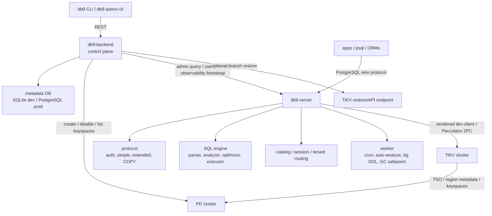

# Snapshot-Isolation Consistency + Fault-Injection Test Program — Detailed Design

> **Status**: Draft
> **Detailed design (English).** Source of truth tracked in issue [#2739](https://github.com/db9-ai/db9-server/issues/2739); this file mirrors its latest revision.
> Plain-language Chinese overview: [`si_fault_injection_test_program.zh-CN.md`](./si_fault_injection_test_program.zh-CN.md).

---

**Phase-1 (M1) workstream — child of #2640, refines #2641 (WS10).** This issue is the **execution design** for db9's Snapshot-Isolation consistency + fault-injection test program: the concrete harness, the injection mechanics for db9/TiKV/PD, the test APIs/infra we must add, and how we run it **in the dev environment**. It is grounded in a code audit of `db9-server`, the vendored `tikv-client`, `tikv-one`, `db9-backend`, `sys9-platform` and `sys9-operator` (file:line anchors throughout). Where it disagrees with #2641, the audit evidence is given.

The design rule encoded here: **build a clean, reusable harness *spine* first; cases are then added as data.** A new scenario should be one declarative file, not a harness change.

---

## Architecture reference (coverage anchor)

Before choosing fault sites, keep the full db9 architecture in view. The SI program is centered on db9-server/TiKV/PD correctness, but the executable coverage model must include the control plane because tenant/keyspace lifecycle, connect-token issuance, branching, and reconciler behavior decide whether the data-plane test is pointed at the right isolated storage.



**Fault-surface / coverage layers:**

| Layer | Component | Coverage purpose | Representative interference |
|---|---|---|---|
| L0 | CLI / API clients | User-visible command/API contract | duplicate submit, timeout, stale/expired connect token, bad error mapping |
| L1 | db9-backend control plane | Tenant lifecycle, metadata convergence, branching, reconciler idempotency | PD keyspace create succeeds but metadata write fails; stuck CREATING/CLONING/DISABLING; branch restore interruption; concurrent create/delete |
| L2 | db9-server protocol + SQL + worker | PG-wire behavior, auth/session/tenant routing, retry contract, GC/worker correctness | connection loss, simple vs extended protocol divergence, retry-attempt accounting, worker crash/claim conflict, GC safepoint over-advance |
| L3 | vendored tikv-client / 2PC | Transaction commit, lock resolution, TSO acquisition | prewrite/commit fault, crash after primary commit before detached secondary commit, TSO stall/regress |
| L4 | TiKV | MVCC/KV/Raft storage behavior | region error, lock wait/conflict, raft apply delay, GCTooEarly, unsafe destroy range |
| L5 | PD | TSO, keyspace, region scheduling | TSO unavailable/regressed, PD leader failover, keyspace API failure |
| L6 | Kubernetes / topology | Process and network reality around the above layers | pod kill, network partition, disk/IO pressure, time-skew negative control |

**Coverage implication:** SI data-anomaly faults still belong primarily at L2-L5: db9 retry/GC, tikv-client 2PC, TiKV MVCC/Raft, and PD TSO. L0-L1 are not substitutes for SI fault injection; they add control-plane correctness coverage so a green data-plane run cannot hide a broken tenant/keyspace lifecycle, wrong routing target, stale connect token, or unreconciled branch/disable state.


## Design update: invariant-first harness model

The efficient design center is **not a catalog of places where we can inject faults**. It is a catalog of db9 invariants, with fault sites chosen only because they can falsify one of those invariants. This keeps the suite small, explains why each case exists, and prevents coverage from becoming a Cartesian product of components × protocols × faults.

**Primary invariants:**
- **Control-plane convergence:** tenant/database create, disable, clone, and branch operations eventually reconcile backend metadata, PD keyspace state, db9-server bootstrap state, and returned connection material.
- **Tenant/keyspace isolation:** a request for tenant A must route to tenant A's TiKV keyspace and must never write tenant B's prefix, even under retries, reconnects, worker activity, or branch/delete races.
- **Transaction correctness:** a SQL transaction under Snapshot Isolation must either commit correctly, fail with the right SQLSTATE/phase, or remain explicitly indeterminate; it must not return a wrong value.
- **Pessimistic-lock correctness:** db9's default user-DML path must not lose updates across pessimistic lock retry/re-acquire, and `for_update_ts` must be refreshed/ordered correctly under retry and TSO faults.
- **Async idempotence:** retry loops, backend reconciler, branch restore supervisor, worker claims, cron/background jobs, and GC safepoint advancement must be safe under duplicate execution and crash/restart.
- **Observable non-vacuity:** a run is green only if the intended fault fired, the required contention/state transition happened, and every oracle had the observables it declared.

**CaseSpec is therefore architecture-aware:**

```yaml
resources:
  tenants: [t_a, t_b]
  keyspaces: [ks_a, ks_b]
  db9_nodes: 2
  tikv: 3
  pd: 3
entrypoints: [rest_api, pgwire]
invariants:
  - tenant_lifecycle_converges
  - tenant_keyspace_mapping_stable
  - no_cross_keyspace_writes
  - snapshot_isolation
  - retry_contract
  - pessimistic_lock_correctness
faults: []       # chosen because they threaten the invariants above
workload: {}     # API + SQL operations with shared run/op identity
oracles: []      # offline checks over recorded artifacts
```

**Suite split:** the same runner/artifact/verdict spine supports two focused suites:
- **Control-plane suite:** db9-backend APIs, metadata DB, PD keyspace API, connect-token/session issuance, branching/restore, and reconciler idempotency.
- **Data-plane suite:** db9-server pgwire/SQL/worker behavior, retry/GC, tikv-client 2PC, TiKV MVCC/Raft, and PD TSO.

**Boundary-first faulting:** prefer failures at architectural boundaries because those are where split-brain state is created: CLI/API→backend, backend→metadata DB, backend→PD keyspace API, backend→db9-server admin/query path, db9-server→tikv-client, tikv-client→PD/TiKV, worker→TiKV queue/claim, and GC→PD/TiKV safepoint.

**Artifact rule:** every recorded operation carries the same identity chain: `run_id`, `case_id`, `tenant_id`, `keyspace`, `session_id`, `protocol`, `op_id`, `txn_id/start_ts/commit_ts` when available, plus backend request IDs, worktree/image SHAs, enabled feature set, and fault timeline entries. Offline oracles must be able to re-judge the run without the cluster.

## KISS execution strategy

The architecture map is the coverage horizon, not the first implementation slice. Each slice adds **one new dimension** only after the previous slice is green and recheckable. Do not let backend hooks, multi-tenant cases, predicate workloads, Kubernetes topology, or safety hardening block the first data-plane red/green loop unless that slice explicitly needs them.

| Slice | Goal | In scope | Out of scope | Exit |
|---|---|---|---|---|
| **M1a-core** | Prove the harness/checker can go red and re-judge offline without cluster dependencies | minimal runner, minimal CaseSpec, pinned deterministic Elle fixture, EDN/JSONL artifacts, recheck | db9 fault injection, Cluster backend implementation, db9-backend hooks, multi-tenant canary, predicate workloads, Chaos Mesh, statistical gates | the planted anomaly is flagged; the same artifacts recheck to the same verdict |
| **M1a-observability** | Make checker inputs precise without requiring a cluster | commit_ts/retry/`:info` artifact schema, offline reconciliation fixture, per-run retry/lock-wait delta schema | protocol-visible per-statement retry delivery, raw-TiKV durability probes, new fault families, backend lifecycle faults | offline retry-contract and `:info` fixtures recheck deterministically |
| **M1b-storage** | Add high-value storage/transaction faults | TSO timeout/regress, crash-on-commit-point, pessimistic lock retry, GC safepoint hook | control-plane failure injection, branch/reconciler | hard storage cells green/non-vacuous |
| **M2-tenant** | Add tenant/keyspace identity | two-tenant identity oracle, post-resolution keyspace-id canary, raw-prefix scan, create/connect smoke | backend metadata/PD failure injection unless hook is already ready | no cross-prefix writes; identity chain reconciles |
| **M3-control/topology** | Add platform lifecycle and topology chaos | backend/reconciler/branch hooks, NetworkPolicy/sentinel, Chaos Mesh, PD gofail, pod/network/disk faults | blocking M1a/M1b | nightly suite proves recovery/convergence |


## 0. Ground truth from the code (this shapes everything)

Three audited facts dictate the framework's shape:

1. **db9-server has no SI fault surface of its own.** It is a *stateless* PG-wire frontend with **no own 2PC coordinator** — it delegates the entire Percolator 2PC to the vendored `tikv-client` (`Transaction::commit()`); `commit_secondary` runs *detached* in a fire-and-forget `tokio::spawn` (`vendor/tikv-client/.../transaction.rs:1457`, not awaited). **Killing a db9 pod tests only connection-loss / in-flight-abort, never an SI data anomaly.** All SI-anomaly faults must be injected at the **TiKV / PD / 2PC** layer and db9's **retry + GC** machinery.

2. **db9 ships zero first-party fault infra.** No `fail` crate, no `failpoints` feature, no `fail_point!`, no `/fail` endpoint (`Cargo.toml` features = `default/parquet/mock-storage` only). The only failpoints that exist are **4 in the vendored client** (`after-prewrite`, `before-commit-secondary`, `before-cleanup-locks`, `region-error`), and they compile to **no-ops in every db9 build** (path-dep enables no features). TiKV has 328 `fail_point!` + a `/fail` HTTP API, but only in a `make fail_release` build (the deployed image is plain `pingcap/tikv`, failpoints OFF). PD (Go) supports gofail.

   Implementation detail for M1a: the vendored `tikv-client` has a `fail` dependency, but no top-level `failpoints` feature to forward. Lighting those client failpoints means enabling `fail/failpoints` directly (or adding a tiny vendor feature wrapper such as `failpoints = ["fail/failpoints"]`), not forwarding a nonexistent `tikv-client/failpoints` feature.

3. **Timestamps are 100% PD/TSO** (start_ts, commit_ts, for_update_ts) — no HLC, no per-node wall clock for MVCC. Clock-skew on db9/TiKV nodes therefore **cannot** reorder MVCC; it is a *soft/diagnostic* signal. The real timestamp lever is **PD TSO availability / partition / regression**.

## 1. Corrections to #2641 (verified against code)

| #2641 claim | Reality (file:line) |
|---|---|
| autocommit retried "≤10×" | Cap is **64** via GUC `db9.retry_max_attempts` (`settings/defs.rs`), no upper bound, per-session `SET`-able. The "10"s in code are ANALYZE-only / a single-key RMW, not user DML. |
| "explicit txn conflict → 40001, not retried" | **Path-dependent.** Extended/prepared protocol (pgx default) gives explicit txns `max_attempts=1` (no retry); simple-query retries the *first* stmt; 2nd+ stmt surfaces raw; COMMIT never retries. |
| conflict → `40001` | WriteConflict→`40001` but **Deadlock→`40P01`**, lock-timeout→`55P03`, retry-timeout→`57014`, Undetermined/region-error→`XX000`. |
| SERIALIZABLE "silently downgraded" | **Not silent** — emits a client `WARNING` ("…SERIALIZABLE has been downgraded to REPEATABLE READ"). This is PG-compat coverage for #2642, not an SI-gate oracle. |
| "Design refs in-repo" (7 docs) | **None exist.** #2641's SI/fault infra is wholly greenfield. (#2642's PG-compat corpus does exist and is orthogonal.) |

**Implication:** `SET db9.retry_max_attempts=1` is db9's native equivalent of the TiDB-Jepsen "disable auto-retry ⇒ anomalies vanish" experiment, and the retry oracle must be calibrated to the real path-dependent contract.

---

## 2. Where we run: the **dev** environment

Per #2641 and confirmed against `sys9-platform`/`sys9-operator`: we run on **dedicated, disposable db9 clusters in the dev environment — never local `tiup`/compose for the gate, and never the shared dev cell engineers develop against** (chaos would break shared usage).

**Dev topology (audited):**
- Deployment target `sys9-nonprod-global-sandbox`, **AWS account `932453198250`**, region `us-west-2`, `non-prod` guardrail (`deployment-map.yaml`). Existing cells: `aws-us-west-2-dev-000` (shared worker cell, `DB9_WORKER_ENABLED=true`) and `aws-us-west-2-dev-001` (apiV3 validation cell) — **both in use**.
- **db9-server**: ns `db9`, selector `app.kubernetes.io/name=db9-server`, Service `db9-server.db9.svc` (pgwire); cell-000 `replicas=1`.
- **TiKV** (default 3, one per AZ) + **PD** (3): ns `data-system`, rendered by `sys9-operator` as WorkloadUnit CRs. Operator-asserted selectors/names used by the harness must be discovered and provision-time validated rather than trusted from prose (examples seen in design context: TiKV `app.kubernetes.io/component=tikv`,`instance=sys9-tikv-store`; PD `component=pd`,`instance=sys9-pd-api`, `sys9.ai/store-id`, `sys9.ai/member-id`). TiKV `status-addr` **:20180** (the `/fail` surface) is expected to be published only on **ClusterIP/headless** Services — reachable in-cluster only — and PROVISION validates the actual Service/Endpoint shape before arming.
- **No Chaos Mesh** anywhere; **no NetworkPolicies** in dev (intra-cluster is unsegmented).

**The home for these tests = a dedicated disposable chaos cell** (a new stack `aws-us-west-2-dev-002` in the same sandbox account), separate from dev-000/dev-001. Within it, "disposable per run" = fresh per-run keyspaces (+ optional full-cell reprovision), not a fresh EKS cluster every run.

**Blast-radius / safety (important — TiKV `/fail` is unauthenticated):** dev account `932453198250` is fully isolated from prod `365705517460` — separate VPCs, **no** peering/TGW/RAM/cross-account trust/shared buckets. TiKV `/fail` :20180 is ClusterIP-only (no LB/NodePort). So the failpoints image + `/fail` are fenced at the account+VPC boundary. We additionally fence by: confining the failpoints images to the chaos cell only (never the image-promotion chain to staging/prod), asserting the deployed image digest at provision, and refusing to run against any non-`dev-002` context.

**Getting failpoints images into the cell (audited path):** TiKV image repo is catalog-fixed `sys9/tikv` (tag configurable per-cell via `tikv.imageTag`); db9 repo is `sys9/db9` (per-cell `db9Server.imageTag`). So failpoints builds ship as **distinct tags in the same repos** (a different repo can't be smuggled via the tag — `resolveConfiguredImageTag` strips prefixes). Chain: build `--features failpoints` (db9) / `make fail_release` (TiKV) → push to nonprod ECR `274703560910` → bump tags (`update-image-tags.yml`) → `config:render` → merge to `main` → `dev-deploy.yml` runs `pulumi up` (`scripts/deploy-stacks.sh aws sys9-nonprod-global-sandbox --mode up`). No ImagePromotionRequest needed for dev. CI is **self-hosted ARC** (scale-to-zero off-peak → runs queue).

**Disposable keyspaces per run (control-plane path for M2/M3):** use the current `db9-backend` HTTP API as the single supported provider until a second real consumer exists. Record backend version/commit, API route, tenant id, keyspace name/id, and connection material. Current `db9-backend` master exposes `/tenants` (`POST /tenants` → reserve metadata → create PD keyspace `db9_tenant_<id>` → bootstrap db9 → activate; `DELETE /tenants/:id` → DISABLING/DISABLED + purge scheduling). Legacy/sys9 admin paths are out of scope for the gate unless explicitly reintroduced. PROVISION verifies backend metadata, PD keyspace state/name/id, db9 connection material, and raw storage prefix before a case can count. There is **no synchronous hard-delete** assumption in the gate — fresh random IDs plus pre-workload raw-scan emptiness prove cleanliness.

---

## 3. The harness: a six-stage spine + a three-state verdict

One declarative `CaseSpec` drives six stages. **CHECK is offline/pure over recorded artifacts**, so failures can be re-judged (`recheck`) without re-running a cluster. M1a uses no Cluster backend. The first cluster-backed slice (M1b) uses the narrow `Cluster` seam; Ask #6 decides whether that first implementation is dev-002 or a 3-TiKV/3-PD local/Compose backend. The dev chaos cell remains the authoritative release target, but Compose is not forbidden as the first implementation if infra lead time blocks progress.

```
VALIDATE → PROVISION → ARM → WORKLOAD → RECORD → CHECK → TEARDOWN
```

**CaseSpec contract:** every case declares **resources**, **entrypoints**, and **invariants** before faults/workloads/oracles. VALIDATE rejects cases that cannot threaten or observe their declared invariant; CHECK judges artifacts against those invariants offline.

- **VALIDATE** (`pkg/spec`) — rejects illegal cases *before* touching a cluster: a db9-node-fault case that declares an SI-anomaly oracle (stateless asymmetry); `async_commit:true`/1PC (db9 always pessimistic/optimistic); clock-skew expecting an SI anomaly (100% PD TSO); SERIALIZABLE expecting an SI anomaly; an oracle whose required observable the build does not expose (closes the "empty channel ⇒ false clean" hole). Predicate workloads are exploratory/nightly until a separate oracle is promoted; they are not a core SI-gate precondition.
- **PROVISION** (`Cluster`) — keep only a narrow interface seam in M1a-core. Build either dev-cell provisioning or a 3-TiKV/3-PD local/Compose backend based on the open lead-time decision; do not build both by default. Provision records worktree/image SHAs and enabled feature surfaces, asserts image digests where applicable, resolves every declared fault site to a live symbol/endpoint (missing or drifted site = STRUCTURAL_INVALID), ensures fresh keyspaces, and proves raw-scan target prefixes are empty before WORKLOAD (`wipeKeyspaces()` / fresh-keyspaces are load-bearing because PVC=Retain and purge is async).
- **ARM** (`FaultDriver` per layer) — programs every surface; writes an **immutable fault timeline** `{t, layer, target, site, action}`; RAII disarm on teardown.
- **WORKLOAD** — Go `pgx v5` (matches go-elle, reuses the wire-tested error→SQLSTATE map). **`list-append` is the primary SI generator** because order recovery is intrinsic. `rw-register` is allowed only when every write value is unique per `(key, txn)` and `commit_ts` is available as the external version order. `predicate-range-insert` is nightly/human-adjudicated until its bespoke oracle is ratified. Ops tagged `{run_id, case_id, tenant_id, keyspace, session, protocol, op_id}`.
- **RECORD** — EDN history (`:invoke/:ok/:fail/:info`; indeterminate is **always** `:info`, never dropped) + sidecar JSONL with db9/backend observables. `commit_ts` is `Option` (None for read-only/empty txns), stamped only on the final successful attempt. Every `:info` write carries enough primary-lock/txn identity for post-hoc durability reconciliation.
- **CHECK** — **Stage-0 non-vacuity (blocking)** → indeterminate durability reconciliation (`:info` → committed/aborted/unresolved) → Tier-1 go-elle `:snapshot-isolation` with pinned config/version/order source → Tier-2 db9-native/control-plane oracles → Tier-3 liveness. A run whose fault-window outcomes are only unresolved `:info` is INVALID, not PASS.
- **TEARDOWN** — disarm, snapshot diagnostics (incl. `GET /fail` state), wipe.

**INVALID taxonomy:**
- **STRUCTURAL_INVALID** is terminal and fails the suite: fault site absent, image/feature mismatch, required observable missing, provider hook unavailable, stale symbol anchor, cluster/keyspace not fresh, or oracle cannot run against its declared inputs.
- **TRANSIENT_INVALID** is retryable within the case budget: the declared site is live, but a timing window did not fire or the required conflict/state transition did not occur. A case declares `retry_budget`/`non_vacuity_budget`; exhaustion becomes STRUCTURAL_INVALID for gating purposes.

**Verdict = PASS / FAIL / INVALID.** INVALID is first-class, with STRUCTURAL_INVALID terminal and TRANSIENT_INVALID retryable within budget — **we never let a vacuous run masquerade as green** (db9's failpoints are no-ops by default; this is the trap).

---

## 4. Injection model: architecture layers, SI-focused fault surfaces

> The harness models L0-L6 from the architecture reference. **SI-anomaly faults inject only at L2-L5**: db9 retry/GC, tikv-client 2PC, TiKV MVCC/Raft, and PD TSO. L0-L1 faults are control-plane correctness coverage; db9-node/process faults test connection-loss, in-flight abort, worker/GC/reconciler recovery, and routing correctness rather than proving an SI anomaly. VALIDATE enforces this distinction.

**Control surfaces:**
- L0/L1 use API clients, HTTP fault wrappers, metadata-DB/PD/db9-server boundary hooks, and backend/reconciler test hooks.
- L2 grafts a route `(PUT|DELETE|GET, ["admin","fail",<name>])` onto db9's **existing** secret-authed break-glass HTTP server (`src/admin/http.rs:256 route()`, `:236 constant_time_eq`), gated by a new `failpoints` cargo feature. The `/fail` route is the primary arming surface. Ambient startup `FAILPOINTS` must be disabled, or accepted only through a harness-owned env var that is ingested into the immutable timeline before pgwire accepts traffic. The server is 127.0.0.1-bound, so the harness reaches it via container netns / exec.
- L3-L5 use vendored-client failpoints, TiKV `/fail`, and PD/gofail/topology drivers as below.

| Layer | Mechanism (dev) | Representative sites |
|---|---|---|
| **L0 CLI/API** | CLI/API driver plus retry/timeout/duplicate-submit wrapper; records backend request IDs and connect material | duplicate `POST /tenants`, dropped response after success, stale/expired connect token, wrong error mapping |
| **L1 db9-backend** | backend/reconciler test hooks plus metadata DB / PD / db9-server boundary fault wrappers | after-PD-keyspace-before-metadata, after-metadata-before-bootstrap, stuck CREATING/CLONING/DISABLING, branch restore interruption, concurrent create/delete |
| **L2 db9-server** (new) | `failpoints` feature adds db9-owned `fail` sites and enables vendored-client failpoints via `fail/failpoints` (directly or through a small vendor wrapper feature); `integration-tests` is orthogonal and not the failpoint switch. | autocommit-retry loop; `session.commit` boundary; worker fences (storage-scan/cron/claim/**gc before-update-safepoint**); tenant routing at `protocol/handler/dynamic/startup.rs` (`pool.acquire(Some(effective_keyspace))`) and store binding at `storage/tikv_store/mod.rs` (`Config::with_keyspace`) are observed, but the cross-keyspace red baseline must arm **post keyspace-id resolution / key encoding**, not merely corrupt the request-time string. |
| **L3 vendored client** (vendor-fork; rebase cost) | the 4 dormant failpoints go live; new sites added | **crash-on-commit-point** between `commit_primary` ok (`transaction.rs:1530`) and the detached `commit_secondary` spawn (`:1457`); **tso-stall / tso-regress** in `pd/timestamp.rs` |
| **L4 TiKV** | `make fail_release` image in the chaos cell; `/fail/<name>` over status-addr :20180 (in-cluster) | `commit.rs:21`, `prewrite.rs:49`, `after_calculate_min_commit_ts:548`, `raft_before/after_save`, `on_handle_apply`, `unsafe_destroy_range` |
| **L5 PD + L6 Chaos Mesh** (M3, nightly) | Chaos Mesh in the chaos cell's cluster-addons; PD gofail; PodChaos/NetworkChaos/TimeChaos by resolved leader pods | pod-kill leader, partition, time-skew (**negative control**), disk IO |

Cross-cutting: the injector **refuses to arm** async_commit/1PC for SI cases (asserts the txn mode), and refuses to let L0/L1-only faults claim an SI anomaly oracle — turning prose exclusions into machine invariants.

**Implementation note:** L0-L6 is an expository coverage map, not a required driver framework. M1a/M1b should implement concrete structs for the few fault surfaces they actually use; no seven-layer typed registry or glob-discovery framework is required until repeated cases justify it.

---

## 5. Test APIs / infra to build (KISS slices; exists vs build)

**P0a / M1a-core — smallest trustworthy red/green loop:**
- Minimal six-stage runner + `recheck` over artifacts. *BUILD, M.*
- Minimal CaseSpec schema: `id`, `resources`, `entrypoints`, `invariants`, `workload`, `oracles`, `expect`, plus optional `retry_budget`. Keep fault declarations simple data, not a typed registry. *BUILD, S.*
- **Pinned deterministic Elle fixture** as the first red baseline: a hand-crafted SI anomaly history that must be flagged, then rechecked offline to the same verdict. *BUILD, S.*
- One primary real workload shape documented for later cluster runs: **list-append** with unique op ids, EDN history, and sidecar JSONL. *BUILD, M.*
- No Cluster backend implementation, db9 fault injection, multi-tenant, predicate, or backend lifecycle faults in this slice. Keep only the narrow Cluster interface seam so dev-cell or Compose can plug in later. *BUILD, S.*

**P0b / M1a-observability — make offline verdict inputs precise:**
- **Commit/retry/`:info` artifact schema**: define `{start_ts, commit_ts:Option, outcome, phase}`, retry/lock-wait delta fields, and primary-lock identity fields in the sidecar format. Implement db9-server emission in M1b when the first cluster-backed cell needs it. *BUILD schema + fixtures, S; server plumbing later, M.*
- **Offline retry/non-vacuity fixture**: fixture histories include retry/lock-wait deltas and prove the checker distinguishes real evidence from empty channels. Protocol-visible per-statement delivery (NoticeResponse simple / `_DB9_SYS` extended) remains deferred. *BUILD, S.*
- **Offline indeterminate reconciliation fixture**: fixture histories include committed/aborted/unresolved `:info` examples and prove unresolved-only fault windows become INVALID. Raw-TiKV / `check_txn_status` probing is implemented in M1b with the first real cluster cell. *BUILD, S.*
- **Pinned Elle config + checker fixture**: record Elle version, anomaly set, cycle search options, generator, and version-order source; run a deterministic hand-crafted anomaly fixture that must be flagged. *BUILD, S.*

**P0c / before first cluster-backed run — guardrails, not core harness:**
- This is a prerequisite for **M1b-storage**, not M1a. Provision records worktree/image SHAs, enabled feature surfaces, and resolves declared fault sites to live symbols/endpoints. *BUILD, S.*
- Image digest assertion, fresh-keyspace + wipe, raw-scan emptiness, and netns access to :20180 where applicable. *BUILD, S.*
- `STRUCTURAL_INVALID` / `TRANSIENT_INVALID` retry budget enforcement for cluster-backed cases. *BUILD, S.*

**P1 / M1b-storage depth:** first cluster-backed run · choose/build the Cluster backend per Ask #6 · `failpoints` cargo feature + `/fail` route · commit_ts emission · raw-TiKV / `check_txn_status` durability reconciliation · bounded begin-path TSO timeout (GUC `db9.tso_acquire_timeout` -> existing timed primitive; thin vendor wrapper + db9 wiring) · crash-on-commit-point (`:1457`) failpoint · client-side TSO monotonicity guard · tso-stall/tso-regress sites · `for_update_ts` stall/regress + pessimistic lock retry interruption sites · db9-owned failpoint sites · GC-safepoint test hook · liveness watchdog · SQLSTATE map as internal error classifier. SERIALIZABLE-downgrade WARNING belongs to #2642, not this SI gate.

**P2 / M2-tenant:** control-plane/data-plane identity oracle · post-resolution keyspace-id canary + raw-prefix cross-keyspace assertion · keyspace_id recycle + destroy-while-busy probe · create/connect identity smoke.

**P3 / M3-control/topology:** backend/reconciler fault hooks · branch/restore interruption · optional predicate-range-insert exploratory workload (nightly/human-adjudicated only; no deliberately-buggy-build rig until promotion is proposed) · Chaos Mesh in cluster-addons + PD gofail + k8s topology faults (nightly).

---

## 6. db9-native correctness extensions (highest value — no upstream asset finds these)

1. **TSO monotonicity guard + oracle (genuine gap):** db9 checks only the TSO *count* (`pd/timestamp.rs:234`), never that ts strictly advances; a regressed/duplicate PD ts (split-brain) silently breaks SI. Wrap `get_timestamp` to record `(ts, role, txn_id)` and refuse/flag non-advancing ts. Both a fix and a Tier-2 oracle.
2. **Bounded begin-path TSO timeout (likely real bug):** the foreground begin uses unbounded `get_timestamp` (`pd/client.rs:273`) while a timed variant exists everywhere — a TSO stall hangs SQL connections forever.
3. **GC-safepoint over-advance oracle:** the leaderless worker *owns* the safepoint (`worker/gc.rs`); over-advancing ⇒ TiKV GC deletes a version a live snapshot needs ⇒ SI break (`GCTooEarly`). Assert `safepoint ≤ min(live min_start_ts)`; includes the **cross-tenant GC-coupling** case (one process-global min_start_ts across all tenants).
4. **Cross-keyspace write canary + raw-prefix assertion:** after a 2-tenant run with a **post-resolution keyspace-id / key-encoding** corruption failpoint, scan raw TiKV and assert **zero** B-prefixed keys written by a session authorized as tenant A. The oracle is defined by session-authorized tenant, not by which store object was resolved. A deliberately buggy red baseline must prove the oracle can catch a real leak. Maps to the real leaked-superblock incident.
5. **keyspace_id (u32) recycling data-bleed probe:** destroy→recreate; assert no tombstoned keys surface under a recycled prefix; plus destroy-while-worker-busy.
6. **commit_ts surfacing + silent-retry accounting:** reconcile client-OK vs commit_ts vs per-run retry/lock-wait deltas; protocol-visible per-statement attempt delivery is deferred until a later retry-contract suite needs it. `SET db9.retry_max_attempts=1` is the per-session disable-retry lever.
6b. **Pessimistic lock retry oracle:** assert no lost update across lock retry/re-acquire, and assert `for_update_ts` strictly refreshes/orders under retry and TSO faults. This covers db9's default user-DML path rather than only the optimistic anomaly taxonomy.
7. **Detached commit_secondary resolution oracle:** pod death *loses* the fire-and-forget spawn (`:1457`); a surviving reader must resolve orphan locks via TTL(3s/20s)+`check_txn_status`. (Needs ≥2 db9 replicas in the chaos cell — dev default is 1.)
8. **SQLSTATE-map classifier:** keep the wire-tested error mapping as internal classifier/plumbing for SI faults. The SERIALIZABLE-downgrade WARNING is orthogonal PG-compat behavior and belongs to #2642, not the SI merge gate.

---

## 6a. Control-plane correctness extensions

These are not substitutes for SI checks; they make sure the data-plane checks are aimed at the intended isolated storage and that customer-visible lifecycle operations converge under failure.

The control-plane provider for this program is `db9-backend` HTTP API. The harness records backend version/commit and exact keyspace material per run. Legacy admin CLI or operator-direct paths are explicitly out of scope until a second provider is required.

1. **Tenant lifecycle convergence oracle:** for create/disable/delete, assert backend metadata state, PD keyspace state, db9 bootstrap/admin-user state, and returned connection material agree after bounded reconciliation.
2. **Control/data identity oracle:** assert `tenant_id → keyspace → username/token → db9 session keyspace → raw TiKV prefix` is one stable chain for every recorded operation.
3. **Reconciler idempotency oracle:** duplicate or crash-restarted reconciler passes must not create duplicate keyspaces, resurrect disabled tenants, lose audit history, or regress terminal states.
4. **Branch/clone recovery oracle:** interrupted logical clone or TiKV restore jobs must converge to ACTIVE with the right source snapshot or CREATE_FAILED/DISABLED with no writable orphan keyspace.
5. **Connect-token/session oracle:** expired, stale, wrong-audience, or wrong-tenant tokens must fail closed; valid temporary DSNs must route to the intended tenant only.
6. **API retry/duplicate-submit oracle:** client timeout after a successful backend side effect must be safe to retry and must return or converge to the same tenant/branch identity, not create hidden duplicates.


## 7. Adding a case (the incremental mechanism)

A case = one declarative YAML in `cases/`, loaded by the runner and VALIDATE-checked. **Recombining existing primitives = one file, zero harness change.** M1a/M1b should use simple concrete structs and explicit case lists; add typed registries or glob discovery only after enough cases exist to amortize that framework. Runner / six stages / artifact format are stable.

**Schedule grammar:** `schedule.at: phase:<name>` is not an arbitrary fail-rs trigger. It names a harness rendezvous that must be explicitly registered by the workload/oracle pair. For example, `phase:snapshot-held` means the driver has opened the target snapshot transaction, confirmed the active transaction is published/read back through the relevant registry/gauge, and only then arms the fault. Arbitrary per-`txn_id` failpoint gating is out of scope unless a case implements a typed rendezvous token.

```yaml
id: gc-safepoint-over-advance-single
hypothesis: "While a snapshot is held, GC must not delete versions it needs"
requires: { tier: dev-cell, async_commit: false, observables: [gc_safepoint_gauge, commit_ts] }
claim_scope: item                      # CI claims stay item-level; predicate findings are nightly/human-adjudicated
topology: { db9_nodes: 1, tikv: 3, pd: 3, keyspaces: [t_a] }
session:  { protocol: simple, retry_max_attempts: 64, isolation: SI }
workload: { generator: rw-register, concurrency: 8, keys: 200, duration: 60s }
faults:
  - { layer: db9,  site: gc-before-update-safepoint, action: advance_past_min_start_ts, schedule: { at: phase:snapshot-held } }
  - { layer: tikv, site: unsafe_destroy_range,        action: return, schedule: { count: 1 } }
oracles: [ non-vacuity, elle-si, gc-safepoint, commit-ts-order, liveness ]
expect:  { verdict: clean, terminates_within_ms: 90000 }   # GCTooEarly OK; a wrong value = FAIL
```

**Expected-fail "red baselines" are first-class:** they gate by reproducing a *named* anomaly cycle or identity leak, continuously validating the oracle. Keep v1 binary: the named anomaly must reproduce at least once within budget. A missed timing window is TRANSIENT_INVALID and retried within budget; a live run that satisfies non-vacuity but no longer reproduces the named anomaly is a FAIL unless the spec flips. Add `>=k of N` statistics only after a baseline proves genuinely flaky.

---

## 8. Coverage grid + hard cells + acceptance gate

**Dimensions:** ANOMALY (CI-gated: item-level, cycle-decidable G0/G1a/G1b/G1c/P4/read-skew over determinate + reconciled-indeterminate histories; nightly/human-adjudicated: predicate write-skew/broad-phantom boundary) × LAYER×SITE × RETRY(`{1,64}`×`{simple,extended}`×`{autocommit, first-stmt, 2nd+, COMMIT}`) × PESSIMISTIC_LOCK(`for_update_ts`, lock wait, lock retry/re-acquire) × KEYSPACE(single/two-tenant/destroy-recreate) × WORKLOAD(list-append primary, register with commit_ts order, predicate nightly).

**Hard acceptance cells by slice:** M1b merge-gating storage cells: ① crash-on-commit-point + pod-death variant ② GC-safepoint over-advance (`GCTooEarly` OK, wrong value FAIL) + cross-tenant coupling ③ tso-regress (red until guard ships) ⑥ `retry_max_attempts` 1-vs-64 ⑦ tso-stall terminates within `tso_acquire_timeout`. M2 merge-gating tenant cells: ④ post-resolution keyspace-id/key-encoding corrupt → zero cross-prefix writes ⑤ keyspace_id recycle ⑪ connect-token/keyspace identity end-to-end. M3 nightly/control cells: ⑧ predicate write-skew (nightly/human-adjudicated; CI claims remain bounded to item anomalies until the predicate oracle is trusted) ⑨ time-skew negative control ⑩ tenant create/disable convergence under backend↔PD/backend↔metadata failure ⑫ branch/restore interruption + reconciler idempotency.

**Per-case gate:** PASS iff (a) terminated in time (hang = FAIL), (b) for cluster-backed cases, non-vacuity met after any TRANSIENT_INVALID retries (fault fired **and** contention/state-transition observed, via per-run deltas); offline checker fixtures satisfy this by construction through planted histories, (c) every declared oracle returned its expected verdict (clean = zero violations; red-baseline = exactly the named anomaly; an *allowed* item-level anomaly flagged = oracle-misconfig FAIL; predicate-boundary findings are nightly/human-adjudicated), (d) no oracle ran against an absent observable, (e) for cluster-backed cases, cluster/keyspaces provably fresh, and (f) for control-plane cases, backend metadata, PD keyspace state, db9 routing identity, and observed storage prefix reconcile. STRUCTURAL_INVALID is terminal and fails the suite.
**Suite gate (CI):** the curated hard-cell set — green, zero terminal STRUCTURAL_INVALID, zero flaky after bounded TRANSIENT_INVALID retries, every named red baseline reproduces at least once within budget — proves **item-level Snapshot Isolation over verified-live fault sites, with determinate plus durability-reconciled indeterminate histories**. Predicate write-skew/broad-phantom adjudication is nightly/human-reviewed, not an automatic merge verdict. Full grid + Chaos-Mesh topology faults run nightly.

---

## 9. Milestones (KISS, dev-anchored)

- **M1a-core — smallest red/green loop:** runner + minimal CaseSpec + pinned deterministic Elle fixture + EDN/JSONL artifacts + Elle SI + `recheck`. *Exit:* planted anomaly is flagged; the same artifacts recheck to the same verdict; no Cluster backend, no `/fail`, no backend hooks, no multi-tenant canary, no predicate, no Chaos Mesh.
- **M1a-observability — precise offline verdicts:** commit/retry/`:info` artifact schema + pinned Elle config/fixture + offline indeterminate reconciliation fixture + retry/lock-wait delta fixture. *Exit:* offline retry-contract fixture and one `:info` fixture recheck deterministically; no real Percolator or Cluster backend required. Protocol-visible per-statement retry delivery is deferred.
- **M1b-storage — first real Percolator/db9/TiKV/PD faults:** choose/build the Cluster backend per Ask #6; `/fail` arming + commit_ts emission + raw-TiKV/`check_txn_status` durability reconciliation; bounded TSO timeout **first** + watchdog; TSO monotonicity guard + stall/regress; pessimistic `for_update_ts`/lock-retry cells; crash-on-commit-point(`:1457`); GC-safepoint hook; SQLSTATE classifier. *Exit:* storage hard cells 1,2,3,6,7 plus pessimistic lost-update cell green & non-vacuous; tso-stall terminates; tso-regress red->green with the guard; GC-clamp yields `GCTooEarly` not a wrong value.
- **M2-tenant — isolation and identity:** two-tenant identity oracle, post-resolution keyspace-id/key-encoding canary, raw-prefix scan, keyspace_id recycle, create/connect identity smoke. *Exit:* no cross-prefix writes; backend metadata <-> PD keyspace <-> db9 routing <-> observed storage prefix reconcile where provider hooks exist.
- **M3-control/topology — platform lifecycle and chaos:** backend/reconciler boundary hooks, branch/restore interruption, NetworkPolicy/sentinel/secrets guardrails, Chaos Mesh, PD gofail, pod/network/disk faults, predicate nightly. *Exit:* nightly suite proves convergence/recovery; predicate findings remain human-adjudicated until the oracle is ratified.

## 10. Risks

- **Unauthenticated TiKV `/fail` :20180** — fenced by the dev-vs-prod account/VPC boundary + ClusterIP-only + chaos-cell-only images + digest assertion + refuse-non-dev-002. (No NetworkPolicies exist in dev — flagged; `/fail` is already cluster-reachable, the failpoints image doesn't widen *external* exposure.)
- **Silently-disabled or silently-armed failpoints** (the as-shipped default no-ops, or startup env arming without timeline) → STRUCTURAL_INVALID + "every armed fault confirmed-fired" in the immutable timeline + `GET /fail` snapshot at teardown; ambient `FAILPOINTS` is disabled or timeline-ingested before pgwire accepts traffic.
- **Non-vacuity on process-global counters is unsound** (monotonic, cross-tenant, survives PVC=Retain) → per-run deltas + per-keyspace/session attribution.
- **Control-plane/data-plane drift** (backend metadata says one tenant/keyspace, db9 routes another, PD/TiKV state differs) → mandatory identity-chain artifact and control/data oracle before any data-plane PASS can count.
- **False-green checker inference** (register histories without version order; unresolved `:info`; stale anchors) → list-append primary, register requires unique values + commit_ts order, durability reconciliation before Elle, pinned checker fixture, provision-time fault-site symbol resolution, and recorded worktree/image SHAs.
- **TSO-stall can hang the driver** even after the server begin-path timeout (stall may land on for_update_ts/commit_ts) → separate harness watchdog recording *which* deadline fired.
- **Vendor-fork cost** (TSO guard, bounded timeout, new client failpoints are edits to vendored `tikv-client`) → budget rebase/maintenance.
- **Dev realities:** db9 `replicas=1` (bump to ≥2 in the chaos cell for the pod-death reader cell); async keyspace purge (use fresh IDs per run); ARC scale-to-zero off-peak (nightly k8s runs queue).
- **In-cell blast radius** (ClusterIP `/fail`, gofail, cluster-global GC safepoint, unsafe destroy-range) → default-deny NetworkPolicy allowing fault APIs only from the harness runner SA, cluster-attested dev-002 sentinel, teardown `GET /fail` empty-except-timeline check, and explicit secrets/kube-exec ownership.
- **Vendor-fork carry** → name owner, pinned upstream SHAs, per-bump rebase checklist, and upstreaming plan for TSO timeout/guard hunks.
- **Elle false-confidence** (wrong SI config / commit_ts None handling) → red baselines act as a continuous meta-test of the oracle.

## 11. Asks / open decisions

1. **Approve a dedicated disposable chaos cell** `aws-us-west-2-dev-002` in `sys9-nonprod-global-sandbox` (db9 `replicas≥2`), separate from dev-000/dev-001.
2. **Failpoints image builds** for `sys9/db9` (`--features failpoints`) and `sys9/tikv` (`make fail_release`) published as distinct tags to nonprod ECR `274703560910`, deployed *only* to the chaos cell.
3. **Chaos Mesh** added to the chaos cell's cluster-addons (M3).
4. **Architect sign-off on adjudication:** allowed-under-SI (write-skew/broad-phantom) vs bug is not an automated decision.
5. **Backend/reconciler fault hooks:** approve minimal test-only hooks or wrappers for backend→metadata DB, backend→PD keyspace API, backend→db9 bootstrap/query, and branch restore supervisor boundaries.
6. **Open decision — Compose vs seam only:** if dev-002 + failpoints-image lead time blocks first green, approve/build a 3+3 local/Compose data-plane backend; otherwise keep only the `Cluster` interface seam and build dev-cell first.
7. **Safety/fork ownership:** approve NetworkPolicy/sentinel/secrets requirements for in-cell fault APIs and name an owner for vendored `tikv-client` fork-carry/upstreaming.

*Parent: #2640. Refines: #2641 (WS10). Related: #2642 (PG-compat correctness — the orthogonal "answers correct?" axis). Single consistency contract: Snapshot Isolation; Elle configured `:snapshot-isolation`, never `:serializable` (regression-guarded).*


