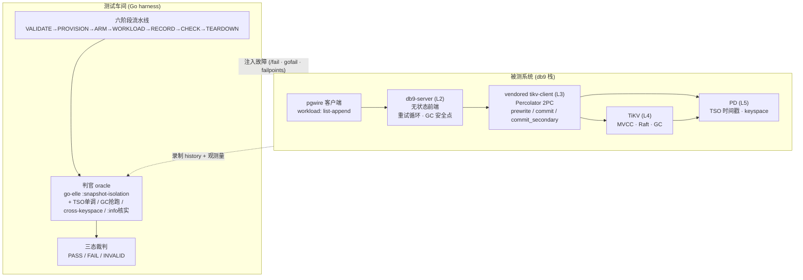

# db9 快照隔离(SI)故障注入测试 — 易懂版设计

> 通俗易懂版(中文)。详细英文版见 [`si_fault_injection_test_program.md`](./si_fault_injection_test_program.md)。
> 参考 issue: [db9-ai/db9-server#2739](https://github.com/db9-ai/db9-server/issues/2739)

## 一、目标

db9 对外保证**快照隔离(SI)**:并发事务不会算错账、不会把租户 A 的数据写进租户 B。
本设计是一个**碰撞测试车间**:在封闭环境里故意制造故障,再离线回放检查 db9 有没有真的算错或串租户。

**核心反陷阱**:db9 默认不开故障开关,naive 测试很容易"什么都没撞却全绿"。
所以只有 **"故障真的触发 + 真的产生冲突"** 才算一次有效测试,否则判 `INVALID`(不作数)——绝不给假绿灯。

## 二、整体架构

**三个要点:**

1. **故障注在哪** — SI 异常只能在 **L3–L5(2PC / TiKV / PD)+ 两个 db9 的 L2 点(重试循环、GC 安全点)** 产生。
   - 不撞 db9 前端:它无状态、不做自己的 2PC(全交给 tikv-client),杀 pod 只测到"断连/中途中止"。
   - 不靠改时钟:时间戳 100% 来自 PD 的 TSO(无 HLC),改机器时钟无法重排 MVCC。真杠杆是 **PD TSO 不可用/倒退**。
2. **六阶段流水线** — `VALIDATE→PROVISION→ARM→WORKLOAD→RECORD→CHECK→TEARDOWN`。**CHECK 纯离线**,录像可脱离集群重判(`recheck`)。
3. **三态裁判** — `PASS` / `FAIL` / `INVALID`;`INVALID` 再分 `STRUCTURAL`(部位/环境不对 → 判死)和 `TRANSIENT`(没撞上 → 预算内重试)。

**判官(oracle)**:`go-elle :snapshot-isolation`(环路检测)+ db9 专属(上游工具找不到的):TSO 单调守卫、GC 安全点抢跑、cross-keyspace 写漏、`:info`(不确定事务)事后核实。

## 三、分阶段实现(KISS 五片)

每片"上一片绿了、能离线复判"才进下一片。**M1a 整段不碰真集群,真集群从 M1b 起。**

| 阶段 | 干什么 | 真集群 | 退出标准 |
|---|---|:--:|---|
| **M1a-core** | 最小红绿闭环的种子:runner + 最小 CaseSpec + **手工植入的 Elle fixture** + 录像/recheck | ❌ | 植入异常被标红;同一录像 recheck 出同样结论 |
| **M1a-observability** | 精确判定的可观测性机器:`commit_ts` 透出、`:info` 核实逻辑、per-run 重试/锁等待 delta、钉死 Elle 配置 | ❌ | 用一个 `:info` fixture 确定性复现 |
| **M1b-storage** | **第一次起真集群 + 真故障**:`failpoints`+`/fail`、begin-TSO 超时(先做)、TSO 单调守卫、crash-on-commit、悲观锁重试、GC 安全点 | ✅ | 存储硬用例 ①②③⑥⑦ + 悲观 lost-update 绿且非空洞;tso-stall 能终止;GC 夹紧出 `GCTooEarly` 而非错值 |
| **M2-tenant** | 多租户隔离与身份:双租户身份链、post-resolution keyspace canary、raw-prefix 扫描、keyspace_id 回收、建/连租户冒烟 | ✅ | 零跨前缀写;身份链(后端元数据↔PD keyspace↔db9 路由↔存储前缀)对得上 |
| **M3-control/topology** | 控制面 + 平台混沌(最后):backend/reconciler 钩子、分支恢复、NetworkPolicy/哨兵、Chaos Mesh、PD gofail、pod/网络/磁盘故障、predicate 夜间 | ✅ | 夜间套件证明收敛/恢复;predicate 仍人工裁决 |

> M1a 全离线 = 先用合成的已知异常证明"流水线和判官本身靠谱";"找 db9 真 bug"从 M1b 真故障起。
> 好处:第一个里程碑不依赖 vendor fork / TiKV 特制镜像 / 集群审批,当天可达。

## 四、每个组件要做什么

| 组件 | 改码 | 做什么 | 起用阶段 |
|---|:--:|---|---|
| **db9-server** | ✅ 最多 | 故障点 + 可观测性 + 超时 + 守卫(见下) | M1a→M1b |
| **vendored tikv-client(fork)** | ✅ + 长期维护 | 点亮/新增 failpoint + 超时薄包装(见下) | M1b |
| **TiKV** | ❌ | 只出 `make fail_release` 特制镜像 | M1b (L4) |
| **PD** | ❌ | 开 gofail | M3 (L5) |
| **基础设施 / db9-backend** | 配合 | 专用混沌集群 + 镜像投放 + 测试钩子 + 安全围栏 | M1b→M3 |

### ★ TiKV(只出镜像,不改代码)

- **构建**:`make fail_release` 出一个**故障开关打开**的镜像(线上是普通 `pingcap/tikv`,开关关)。自带 **328 个 `fail_point!` + `/fail` HTTP 接口**(status 端口 `:20180`,**仅集群内可达**)。
- **用到的故障点(已存在,只需点亮)**:

  | 故障点 | 撞出什么 |
  |---|---|
  | `prewrite` / `commit` | 2PC 预写/提交中途失败 → 锁残留、提交不确定 |
  | `after_calculate_min_commit_ts` | 提交时间戳计算后注入 → 时间戳排序异常 |
  | `raft_before/after_save`、`on_handle_apply` | Raft 落盘/应用延迟 → 复制滞后下的可见性 |
  | `unsafe_destroy_range` | 销毁区间 → GC 过早删版本(`GCTooEarly`)、跨 keyspace 数据漏 |

- **投放**:作为 `sys9/tikv` 仓库下的**一个独立 tag**,**只投到混沌集群 dev-002**。
- **安全**:`/fail` 无鉴权 → ① 账号/VPC 隔离 ② ClusterIP-only ③ 镜像只在 dev-002 ④ **default-deny NetworkPolicy,只许 harness runner 访问 :20180**。

### ★ PD(开 gofail,不改代码)

- PD 是 Go,**原生支持 gofail**,混沌集群启用即可(**M3/夜间**)。
- **撞出什么**:TSO 不可用 / **TSO 倒退**(脑裂)、PD leader 切换、keyspace 接口失败。
- **为什么是关键**:db9 所有 MVCC 时间戳都来自 PD 的 TSO,而 db9 **只校验 TSO 的"个数",不校验"是否单调递增"** → 倒退/重复的 ts 会**静默破坏 SI**。对应:
  - **故障**:PD gofail(或 client 侧 failpoint)制造倒退/卡住的 ts;
  - **修复 + 判官**:db9/tikv-client 侧加**客户端 TSO 单调守卫**(记录并拦截非递增 ts)——db9 专属、上游工具发现不了。

### db9-server(本体改动,最多)

1. `failpoints` 编译开关(平时不开;**启用 `fail/failpoints`——tikv-client 没有叫 `failpoints` 的 feature**)。
2. 复用已有的 127.0.0.1 密钥鉴权管理服务,加 `/fail` 接口装/拆故障(M1b)。
3. 埋故障点:**重试循环、GC 安全点推进前、租户路由(必须埋在 keyspace_id 解析后/key 编码处)**。
4. **begin 路径加超时**(GUC `db9.tso_acquire_timeout`,接已有的带超时取时间戳;**先做**,否则 TSO 一卡套件挂死)。
5. **透出 commit_ts**(现在提交成功后被丢掉,判官排序要用)。
6. **TSO 单调守卫** + **GC 安全点测试钩子**(断言 `安全点 ≤ min(存活快照 start_ts)`)。
7. 给 `:info` 写打上 primary-lock 身份,供事后 `check_txn_status`/`resolve_locks` 核实。

### vendored tikv-client(fork,长期 rebase 成本)

- 点亮已有 4 个休眠故障点;**新增**:crash-on-commit(主库已提交、从库提交未发出的瞬间)、tso-stall/tso-regress、`for_update_ts` 卡住/倒退、悲观锁重试打断。
- 一个"从带超时时间戳开始事务"的薄包装(配合 begin 超时)。
- ⚠️ 唯一长期要背的包:钉死上游 SHA、指定负责人、能上游的(超时/单调守卫)推回上游。

### 基础设施 / db9-backend

- 专用、用完即弃的混沌集群 dev-002(db9 ≥2 副本);两个特制镜像只准进它。
- db9-backend 提供少量测试钩子(租户生命周期、reconciler、分支恢复)——**M3 才用**。
- 安全围栏:NetworkPolicy + 集群身份哨兵(防误连)+ 密钥管理。
- **开放决策**:本地 Compose backend 建不建,取决于 dev-002 出镜像审批周期——快则只留接口缝,慢则建来解锁第一个绿灯。

## 五、一句话总结

- **架构** = 被测栈(db9→tikv-client→TiKV/PD)+ 测试车间(六阶段 + 三态裁判 + Elle/db9 专属判官);SI 故障只注 L3–L5 + 2 个 db9 L2 点。
- **分阶段** = 离线种子(M1a)→ 精确判定(M1a-obs)→ 真集群真故障(M1b)→ 多租户(M2)→ 控制面/混沌(M3)。
- **TiKV** = 不改码,出 `make fail_release` 镜像,提供 `:20180` 的 `/fail` + 328 故障点。
- **PD** = 不改码,开 gofail 造 TSO 倒退/卡住/切主;它是唯一时间戳源,故 TSO 单调守卫是 db9 侧高价值修复。
