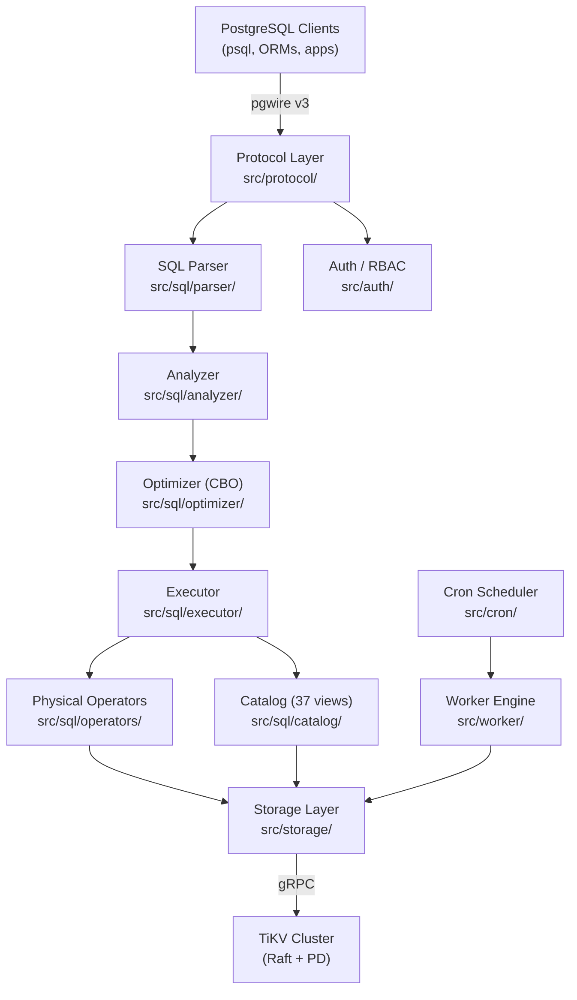
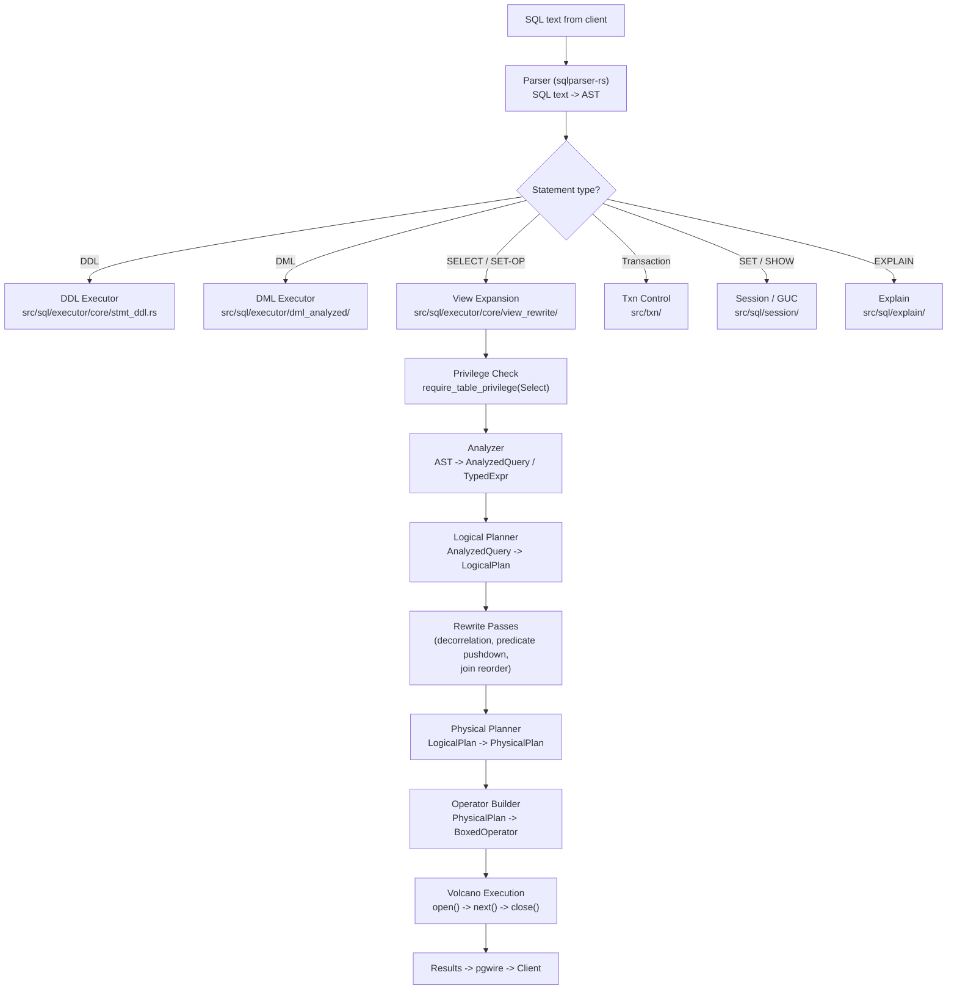
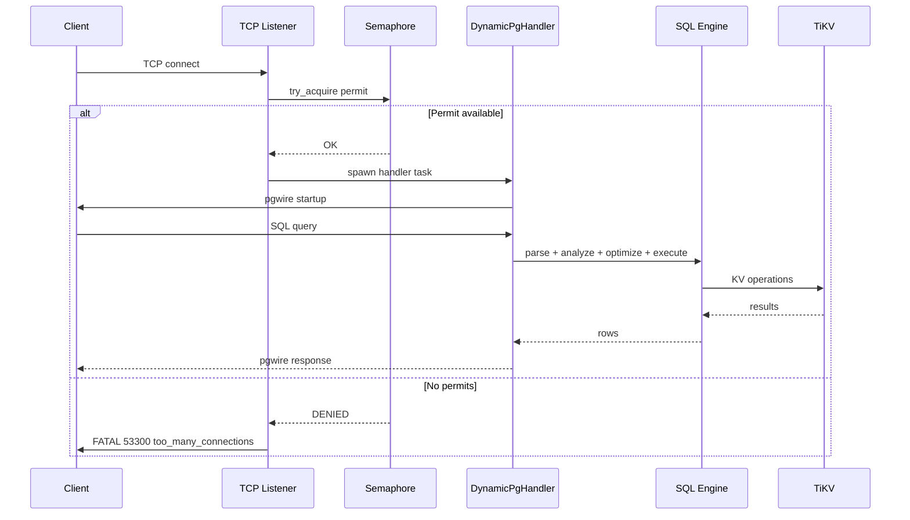

# Architecture Overview

> **Source paths:** `src/main.rs`, `src/sql/`, `src/protocol/`, `src/storage/`, `src/worker/`, `src/cron/`, `src/auth/`, `src/model/`, `src/txn/`
>
> **Approximate size:** ~118K lines in the SQL layer; ~323 files under `src/sql/` alone.

db9-server is a PostgreSQL-compatible distributed SQL database that sits between PostgreSQL clients and a TiKV cluster. It implements the PostgreSQL wire protocol (pgwire), translates SQL into key-value operations, and executes queries using a Volcano-model operator tree. The system enforces a single deterministic execution path for all queries with no hidden fallbacks.

---

## High-Level System Architecture

---

## Query Execution Pipeline

Every SQL query follows the same pipeline. There are no alternative code paths, no legacy fallbacks.

### Pipeline Stages in Detail

**1. Parser** (`src/sql/parser/`): Wraps `sqlparser-rs` to produce an AST (`Vec<Statement>`). Custom extensions handle dollar-quoting, operator rewriting, and tokenizer hooks.

**2. Dispatcher** (`src/sql/executor/core/dispatch/`): Routes each AST statement node to the appropriate handler -- DDL, DML, SELECT, transaction control, settings, EXPLAIN, COPY, or CALL.

**3. View Expansion** (`src/sql/executor/core/view_rewrite/`): Before analysis, view references are recursively inlined so that views are transparent to the analyzer.

**4. Privilege Check** (`src/sql/executor/core/statement.rs`): Calls `require_table_privilege(Select)` on every base table referenced in the query.

**5. Analyzer** (`src/sql/analyzer/`): Performs semantic analysis on the AST, producing `AnalyzedQuery` and `TypedExpr` nodes. Responsibilities include name resolution (column references become positional indices), type inference (every node carries a resolved `DataType`), scope checking for correlated subqueries, GROUP BY compliance validation, and function/aggregate resolution.

**6. Optimizer** (`src/sql/optimizer/`): Always-on cost-based optimizer. The pipeline is:
- **Logical Planner** (`logical_planner/`): `AnalyzedQuery` to `LogicalPlan`
- **Rewrite Passes** (`rewrite/`): Subquery decorrelation (EXISTS to SemiJoin, NOT EXISTS to AntiJoin), predicate pushdown, cross-join elimination
- **Join Reorder** (`join_reorder/`): DPccp algorithm for cost-based join ordering
- **Physical Planner** (`physical_planner/`): `LogicalPlan` to `PhysicalPlan` with selectivity estimation and cardinality propagation from `TableStatsCache`
- **Operator Builder** (`build/`): `PhysicalPlan` to `BoxedOperator` tree

**7. Physical Execution** (`src/sql/operators/`): Volcano iterator model. Each operator implements `open()`, `next()`, `close()`. Operators include: `TableScan`, `IndexScan`, `Filter`, `Project`, `Sort`, `HashAggregate`, `HashJoin`, `HashSemiJoin`, `NestedLoopJoin`, `Window`, `Limit`, `Distinct`, `SetOperation`, `CTE`, `TableFunction`.

**8. Storage** (`src/storage/`): Translates operator requests into TiKV key-value operations over gRPC. Uses database-scoped v2 key format (`d_{db_id}_*`) for keyspace isolation.

---

## Module Boundary Descriptions

### Protocol Layer (`src/protocol/`)

Implements the PostgreSQL wire protocol (v3). Handles Simple Query, Extended Query (Parse/Bind/Describe/Execute), COPY, and startup/authentication flows. The handler is decomposed into sub-modules under `src/protocol/handler/dynamic/` (query, copy, startup).

Key files:
- `handler/dynamic/mod.rs` -- `DynamicPgHandler`, main pgwire handler
- `handler/query_parser.rs` -- `Db9QueryParser`, pgwire `QueryParser` trait implementation
- `handler/encode/types.rs` -- PostgreSQL type OID mapping
- `handler/portal.rs` -- Portal state and suspended query management
- `handler/tenant.rs` -- Multi-tenancy username parsing

### SQL Engine (`src/sql/`)

The largest module (~118K lines). Contains the full query processing pipeline from parsing through execution. Subdivided into analyzer, optimizer, operators, executor, expression system, catalog, types, DDL, DML, session management, planner, triggers, sequences, PL/pgSQL, and utilities.

### Storage Layer (`src/storage/`)

Manages all interaction with TiKV. Key encoding is handled in `encoding/` (data keys, metadata keys, value encoding, serialization). The `tikv_store/` module contains operations for tables, indexes, schemas, sequences, cron, worker tasks, statistics, and migrations.

### Auth (`src/auth/`)

Authentication and role-based access control. Bootstraps the auth system on first startup and handles per-connection authentication.

### Worker Engine (`src/worker/`)

Unified async task engine that runs Cron jobs, async triggers, auto-analyze, background DDL, and background SQL. Uses a global task queue in TiKV with pessimistic locking. No leader election -- any node can pick up work.

### Cron Scheduler (`src/cron/`)

pg_cron-compatible scheduler. Parses cron expressions, manages jobs, and integrates with the worker engine. Exposes virtual tables (`cron.job`, `cron.job_run_details`, `cron.running_jobs`) through the catalog.

### Transaction Layer (`src/txn/`)

Transaction state management and savepoint support. Wraps TiKV transactions.

### Model (`src/model/`)

Core data model types: `DataType`, `Value`, `Row`, `TableSchema`. Shared across all layers.

---

## Key Architectural Decisions

### Single Execution Path

Every query follows exactly one code path. The `db9.use_optimizer` GUC is accepted for compatibility but is a no-op -- the optimizer is always on. Setting it to `off` logs a notice and is ignored; `SHOW` always returns `on`. This eliminates an entire class of bugs caused by behavioral divergence between alternative paths.

### Volcano Iterator Model

Physical operators follow the classic Volcano model: `open()` initializes state, `next()` returns one row at a time (streaming), and `close()` releases resources. This enables pipelined execution without materializing intermediate results (except where required, such as sort or hash aggregate).

### Cost-Based Optimizer (Always On)

The optimizer uses table statistics (collected via `ANALYZE`) and selectivity estimation to choose physical operators and join order. The DPccp algorithm handles join reordering. Subquery decorrelation converts correlated EXISTS/NOT EXISTS into SemiJoin/AntiJoin operators.

### PostgreSQL Semantic Parity

All SQL semantics aim for PostgreSQL compatibility. SQLSTATE error codes, type coercion rules, catalog views, and wire protocol responses match PostgreSQL behavior. When in doubt, behavior is validated against PostgreSQL 17.

---

## Multi-Tenancy Invariant

This is a critical architectural invariant that must hold at all times:

1. **All persistent data is isolated per keyspace.** This includes system tables (`_sys_*`), user table rows, indexes, auth data, statistics, and any future persistent state. The key format `d_{db_id}_*` enforces this at the storage layer.

2. **Process-level global state is limited to in-memory caches, configuration, and logging.** No persistent state is shared across keyspaces.

Multi-tenancy is implemented through username parsing in `src/protocol/handler/tenant.rs` and keyspace-scoped TiKV connections managed by `TikvClientPool` in `src/pool.rs`. Each tenant connection gets its own `TikvStore` instance scoped to its keyspace.

---

## Server Startup Flow

The server startup sequence (defined in `src/main.rs`) proceeds as follows:

1. Parse CLI arguments (`src/cli.rs`) -- handles `--help`, `--version`, or extracts runtime flags
2. Build Tokio runtime with configurable stack size (`DB9_TOKIO_STACK_MB`, default 8 MB)
3. Initialize tracing/logging via `tracing-subscriber` with `RUST_LOG` env filter
4. Resolve configuration: CLI flags override environment variables override defaults
5. Configure TLS if cert/key are provided; enforce TLS on non-loopback addresses
6. Create `TikvClientPool` and verify connectivity to the TiKV cluster
7. Bootstrap authentication (fail-fast for the startup keyspace)
8. Start the connection pool reaper (evicts idle tenants)
9. Start the Worker engine and GC (if enabled)
10. Start the fs9 WebSocket server (if configured)
11. Bind the TCP listener and enter the accept loop
12. For each connection: acquire a semaphore permit (max connections enforcement), create a `DynamicHandlerFactory`, and spawn a Tokio task to handle the pgwire session

---

## Connection Lifecycle

---

## File Map (Top-Level Source)

| File | Purpose |
|------|---------|
| `src/main.rs` | Server entry point: CLI dispatch, Tokio runtime, TLS setup, accept loop |
| `src/cli.rs` | CLI argument parser (`--host`, `--port`, `--pd-endpoints`, `--keyspace`, `--tls-cert`, `--tls-key`) |
| `src/config.rs` | `ServerConfig` struct: statement timeout, idle-in-transaction timeout, max connections |
| `src/pool.rs` | `TikvClientPool`: per-tenant TiKV connection management with idle eviction and QPS limiting |
| `src/tls.rs` | TLS acceptor setup for pgwire and WebSocket |
| `src/session_context.rs` | Tokio task-local session context |
| `src/observability.rs` | Logging, tracing, and metrics infrastructure |

---

## See Also

- [Home](Home.md) -- Wiki navigation and quick reference
- [Getting Started](Getting-Started.md) -- Build, configure, and connect
- [Analyzer](SQL-Engine/Analyzer.md), [Optimizer](SQL-Engine/Optimizer.md), [Executor](SQL-Engine/Executor.md), [Operators](SQL-Engine/Operators.md) -- SQL engine deep dives
- `docs/ARCHITECTURE.md` -- Canonical architecture document
- `src/sql/AGENTS.md` -- SQL module navigation with file-level detail
- `docs/sot/invariants.md` -- Full specification of the 11 system-wide invariants

---

*Source files: `src/main.rs`, `src/cli.rs`, `src/config.rs`, `src/pool.rs`, `docs/ARCHITECTURE.md`, `src/sql/AGENTS.md`, `CLAUDE.md`*
