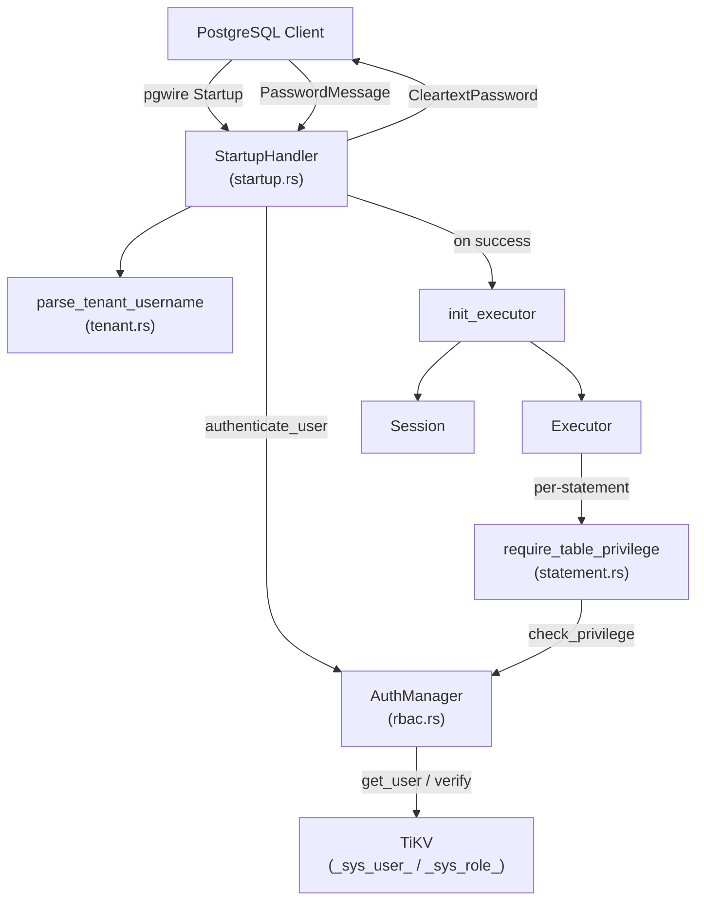
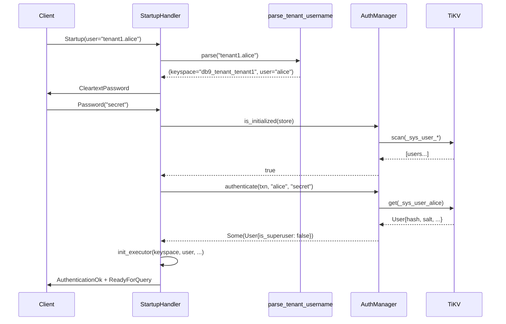

# Auth and RBAC

| Field | Value |
|-------|-------|
| **Source path** | `src/auth/` |
| **Depends on** | `src/storage/` (TikvStore), `src/protocol/handler/dynamic/startup.rs` |
| **Depended on by** | `src/protocol/handler/`, `src/sql/executor/core/statement.rs` |
| **Last verified** | 2026-02-28 |

---

## Overview

db9-server implements password-based authentication and role-based access control (RBAC) modeled after PostgreSQL. The system provides:

- **Password authentication** -- SHA-256 salted password hashing and verification during the pgwire startup handshake.
- **Role management** -- Users and roles stored in TiKV under `_sys_user_` and `_sys_role_` key prefixes, supporting PostgreSQL-compatible `CREATE ROLE`, `ALTER ROLE`, `GRANT`, and `REVOKE` statements.
- **Privilege enforcement** -- Per-statement privilege checks including `require_table_privilege(Select)` on every base table in SELECT queries, enforced at the executor layer.
- **Secure-by-default bootstrap** -- Fail-fast superuser bootstrap at startup requiring `DB9_BOOTSTRAP_ADMIN_PASSWORD` in production (no default credentials unless `DB9_DEV=1`).
- **TLS enforcement** -- Optional `PG_REQUIRE_TLS` mode that rejects non-TLS connections, with cleartext password protection for non-loopback clients.

---

## Architecture Position



---

## Key Concepts

### Authentication Flow

1. Client sends `Startup` message with username (potentially in `tenant_id.user` format).
2. Server extracts keyspace and actual username via `parse_tenant_username()`.
3. Server responds with `CleartextPassword` authentication request.
4. Client sends password. Server calls `AuthManager::authenticate()` which:
   - Looks up the user from TiKV (`_sys_user_{username}` key).
   - Checks `can_login` flag (rejects with SQLSTATE `28000` if false).
   - Verifies password via SHA-256 salted hash comparison.
5. On success, `init_executor()` creates the session with the user's superuser status and connection limit.

### Secure Bootstrap

At server startup and per-connection authentication, the system ensures at least one superuser exists:

- **Production mode**: Requires `DB9_BOOTSTRAP_ADMIN_PASSWORD` environment variable. Optionally `DB9_BOOTSTRAP_ADMIN_USER` (defaults to `admin`).
- **Dev mode** (`DB9_DEV=1`): Creates a legacy `admin/admin` superuser (logged as a warning).
- **Already initialized**: `is_initialized()` performs a read-only optimistic scan. If a superuser exists, the bootstrap write transaction is skipped entirely (optimization from #1171).

### Role Management

- **Users** (`User` struct): Have `password_hash`, `password_salt`, `roles` (set of role names), `privileges` (list of `GrantedPrivilege`), and flags (`is_superuser`, `can_login`, `can_create_db`, `can_create_role`, `connection_limit`, `valid_until`).
- **Roles** (`Role` struct): Have `privileges`, `member_of` (role inheritance), and flags (`is_superuser`, `can_create_db`, `can_create_role`).
- Users can be members of roles. Privilege checks traverse the user's direct privileges and then all assigned role privileges.

### Privilege Checking

The privilege model supports:

- **Privilege types**: `SuperUser`, `CreateDB`, `CreateRole`, `CreateTable`, `DropTable`, `Select`, `Insert`, `Update`, `Delete`, `Truncate`, `References`, `Trigger`, `Connect`, `Temporary`, `Execute`, `Usage`, `All`.
- **Privilege objects**: `Database`, `AllTablesInSchema`, `Table{schema, name}`, `AllSequencesInSchema`, `Sequence{schema, name}`, `Schema`, `Global`.
- **Matching rules**: `All` privilege matches any specific privilege. `AllTablesInSchema` matches any table in that schema. `Global` object matches any object. Superusers bypass all checks.
- **WITH GRANT OPTION**: Tracked per-grant, checked via `has_privilege_with_grant_option()`.

### SELECT Privilege Enforcement

As documented in `docs/ARCHITECTURE.md`, the execution pipeline includes a privilege check step after view expansion and before the Analyzer:

```
View Expansion -> Privilege Check -> Analyzer -> Optimizer -> Execution
```

`require_table_privilege(Select)` is called on every base table using `CatalogSnapshot::base_table_full_names()`.

---

## File Map

| File | Purpose | Lines |
|------|---------|-------|
| `src/auth/mod.rs` | Module root; re-exports `rbac::*` | ~5 |
| `src/auth/rbac.rs` | `AuthManager`, `User`, `Role`, `Privilege`, `PrivilegeObject`, `GrantedPrivilege` | ~940 |
| `src/auth/password.rs` | SHA-256 password hashing, salt generation, verification | ~55 |
| `src/protocol/handler/dynamic/startup.rs` | `StartupHandler` impl, `authenticate_user()`, `init_executor()` | ~685 |
| `src/sql/executor/core/statement.rs` | `require_privilege()`, `require_table_privilege()` | ~180+ |

---

## Public Interfaces

### AuthManager (src/auth/rbac.rs)

```rust
pub struct AuthManager;

impl AuthManager {
    pub fn new() -> Self;

    // Bootstrap
    pub async fn bootstrap(&self, txn: &mut Transaction) -> Result<()>;
    pub async fn is_initialized(&self, store: &TikvStore) -> Result<bool>;

    // User CRUD
    pub async fn create_user(&self, txn: &mut Transaction, user: User) -> Result<()>;
    pub async fn get_user(&self, txn: &mut Transaction, username: &str) -> Result<Option<User>>;
    pub async fn update_user(&self, txn: &mut Transaction, user: User) -> Result<()>;
    pub async fn drop_user(&self, txn: &mut Transaction, username: &str) -> Result<bool>;
    pub async fn list_users(&self, txn: &mut Transaction) -> Result<Vec<User>>;

    // Authentication
    pub async fn authenticate(
        &self, txn: &mut Transaction, username: &str, password: &str,
    ) -> Result<Option<User>>;

    // Role CRUD
    pub async fn create_role(&self, txn: &mut Transaction, role: Role) -> Result<()>;
    pub async fn get_role(&self, txn: &mut Transaction, rolename: &str) -> Result<Option<Role>>;
    pub async fn update_role(&self, txn: &mut Transaction, role: Role) -> Result<()>;
    pub async fn drop_role(&self, txn: &mut Transaction, rolename: &str) -> Result<bool>;

    // Role membership
    pub async fn grant_role_to_user(
        &self, txn: &mut Transaction, username: &str, rolename: &str,
    ) -> Result<()>;
    pub async fn revoke_role_from_user(
        &self, txn: &mut Transaction, username: &str, rolename: &str,
    ) -> Result<()>;

    // Privilege checking
    pub async fn check_privilege(
        &self, txn: &mut Transaction, username: &str,
        privilege: &Privilege, object: &PrivilegeObject,
    ) -> Result<bool>;
    pub async fn check_privilege_with_grant_option(
        &self, txn: &mut Transaction, username: &str,
        privilege: &Privilege, object: &PrivilegeObject,
    ) -> Result<bool>;
}
```

### User (src/auth/rbac.rs)

```rust
pub struct User {
    pub name: String,
    pub password_hash: String,
    pub password_salt: String,
    pub roles: HashSet<String>,
    pub privileges: Vec<GrantedPrivilege>,
    pub is_superuser: bool,
    pub can_login: bool,
    pub can_create_db: bool,
    pub can_create_role: bool,
    pub connection_limit: i32,
    pub valid_until: Option<i64>,
}

impl User {
    pub fn new(name: &str, password: &str) -> Self;
    pub fn new_superuser(name: &str, password: &str) -> Self;
    pub fn verify_password(&self, password: &str) -> bool;
    pub fn set_password(&mut self, password: &str);
    pub fn grant_privilege(&mut self, privilege: Privilege, object: PrivilegeObject, with_grant_option: bool);
    pub fn revoke_privilege(&mut self, privilege: &Privilege, object: &PrivilegeObject);
    pub fn has_privilege(&self, privilege: &Privilege, object: &PrivilegeObject) -> bool;
    pub fn has_privilege_with_grant_option(&self, privilege: &Privilege, object: &PrivilegeObject) -> bool;
}
```

### Password Functions (src/auth/password.rs)

```rust
pub fn hash_password(password: &str, salt: &str) -> String;
pub fn verify_password(password: &str, salt: &str, hash: &str) -> bool;
pub fn generate_salt() -> String;
```

### Executor Privilege Checks (src/sql/executor/core/statement.rs)

```rust
impl Executor {
    pub(crate) async fn require_privilege(
        &self, txn: &mut Transaction, current_role: Option<&str>,
        privilege: Privilege, object: PrivilegeObject,
        object_type: &str, object_name: String,
    ) -> Result<()>;

    pub(crate) async fn require_table_privilege(
        &self, txn: &mut Transaction, current_role: Option<&str>,
        privilege: Privilege, table_full_name: &str,
    ) -> Result<()>;
}
```

---

## Internal Design

### Auth Storage Layout

Users and roles are stored as bincode-serialized blobs in TiKV under keyspace-scoped key prefixes:

```
_sys_user_{username}  ->  bincode(User)
_sys_role_{rolename}  ->  bincode(Role)
```

All auth data lives within the tenant's keyspace, ensuring multi-tenancy isolation. Each keyspace has its own independent set of users and roles.

### Privilege Resolution Order

`check_privilege_internal()` resolves privileges in this order:

1. **Superuser check**: If the user is a superuser, return `true` immediately.
2. **Special flags**: Check `can_create_db` for `CreateDB`, `can_create_role` for `CreateRole`.
3. **Direct user privileges**: Scan the user's `privileges` list for a matching grant.
4. **Role privileges**: For each role the user is a member of:
   - Check role's `is_superuser` flag.
   - Check role's special flags (`can_create_db`, `can_create_role`).
   - Scan the role's `privileges` list for a matching grant.

### TLS and Cleartext Protection

The `StartupHandler` enforces these security rules:

- **`PG_REQUIRE_TLS=1`**: All connections must be TLS-secured. Non-TLS connections get SQLSTATE `28000`.
- **Non-loopback without TLS**: Cleartext password auth is blocked unless `DB9_DEV=1` or `DB9_INSECURE=1`.
- **Loopback connections**: Always allowed cleartext (standard PostgreSQL behavior).

### Connection Limit Enforcement

`User.connection_limit` (PostgreSQL `rolconnlimit`) is enforced at the pool layer via `TenantEntry::try_acquire_user_slot()`. When `connection_limit >= 0` and the count equals the limit, new connections are rejected with SQLSTATE `53300`.

---

## Data Flow



---

## Contracts

1. **Secure-by-default bootstrap**: In production (no `DB9_DEV`), server startup fails if no superuser exists and `DB9_BOOTSTRAP_ADMIN_PASSWORD` is not set. This is a hard invariant -- the server will not start in an unauthenticated state.

2. **Every SELECT checks privileges**: `require_table_privilege(Select)` is called on every base table in the query. Superusers bypass all privilege checks. Internal execution paths (no user context) also bypass checks.

3. **Auth data is keyspace-isolated**: Each tenant/keyspace has its own independent `_sys_user_` and `_sys_role_` key space. There is no cross-keyspace privilege inheritance.

4. **Password hashing**: Passwords are stored as SHA-256(password + salt) with a 16-byte random salt. Plaintext passwords never persist.

5. **Connection limit**: `rolconnlimit` is enforced per-user per-tenant via the pool's `user_connections` map. The RAII `TenantHandle` releases the slot on drop.

6. **Bootstrap skip optimization**: Per-connection auth skips the bootstrap write transaction when `is_initialized()` returns true (read-only optimistic check). This avoids write contention on the auth keyspace at connection time.

---

## Error Handling

| Condition | SQLSTATE | Message Pattern |
|-----------|----------|-----------------|
| User does not exist or wrong password | `28P01` | `Password authentication failed for user "{}"` |
| Role not permitted to log in | `28000` | `role "{}" is not permitted to log in` |
| TLS required but not connected | `28000` | `TLS is required (PG_REQUIRE_TLS=1)...` |
| Cleartext without TLS on non-loopback | `28000` | `Cleartext password authentication without TLS is disabled...` |
| Permission denied on table | `42501` | `permission denied for table {schema}.{name}` |
| Too many connections for role | `53300` | `too many connections for role "{}"` |
| No bootstrap password set | `28000` | `No superuser exists yet. Set DB9_BOOTSTRAP_ADMIN_PASSWORD...` |
| User already exists | -- | `User '{}' already exists` |
| Role already exists | -- | `Role '{}' already exists` |

---

## Testing

### Unit Tests

All three auth source files have inline `#[cfg(test)]` modules:

- `src/auth/rbac.rs` -- 25+ tests covering password verification, privilege grants/revokes, superuser bypass, global/schema-level matching, role membership, and privilege expansion.
- `src/auth/password.rs` -- Tests for hash-and-verify, different salts producing different hashes, salt uniqueness and length.
- `src/protocol/handler/dynamic/startup.rs` -- Tests for `AuthResult` construction, idle-in-transaction watchdog timeout and connection close behavior.

### Integration Tests

Authentication is exercised by all SQL integration tests that connect through the pgwire protocol. Tests in `tests/` use the standard `psql`-style connection flow which triggers the full authentication pipeline.

### How to Run

```bash
# Unit tests
cargo test --lib auth

# Startup handler tests
cargo test --lib startup

# Full integration
python3 scripts/integration_test.py
```

---

## Common Task Index

| Task | Where to Look |
|------|---------------|
| Add a new privilege type | `src/auth/rbac.rs` -- add variant to `Privilege` enum and `from_str()` match |
| Add a new privilege object type | `src/auth/rbac.rs` -- add variant to `PrivilegeObject` enum and update `object_matches()` |
| Change password hashing algorithm | `src/auth/password.rs` -- replace SHA-256 with new algorithm |
| Add MD5 or SCRAM-SHA-256 auth | `src/protocol/handler/dynamic/startup.rs` -- modify `on_startup` to send different `Authentication` message |
| Enforce a new privilege check on a SQL statement | `src/sql/executor/core/statement.rs` -- call `require_privilege()` or `require_table_privilege()` in the relevant dispatch arm |
| Change bootstrap behavior | `src/auth/rbac.rs` -- modify `AuthManager::bootstrap()` |
| Add per-connection auth hooks | `src/protocol/handler/dynamic/startup.rs` -- modify `authenticate_user()` |

---

## See Also

- [Architecture-Overview.md](./Architecture-Overview.md) -- System-wide architecture context
- [Multi-Tenancy.md](./Multi-Tenancy.md) -- How auth data is keyspace-isolated
- [Configuration-and-Operations.md](./Configuration-and-Operations.md) -- Auth-related environment variables (`DB9_BOOTSTRAP_ADMIN_PASSWORD`, `PG_REQUIRE_TLS`, etc.)
