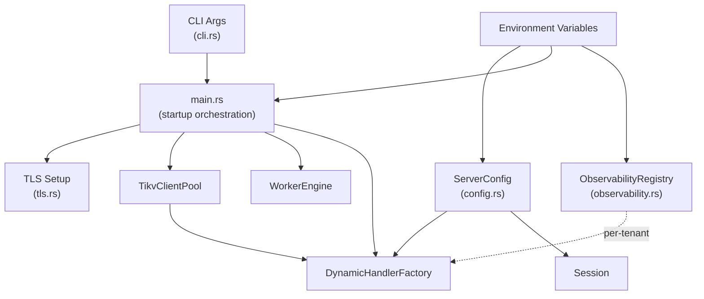
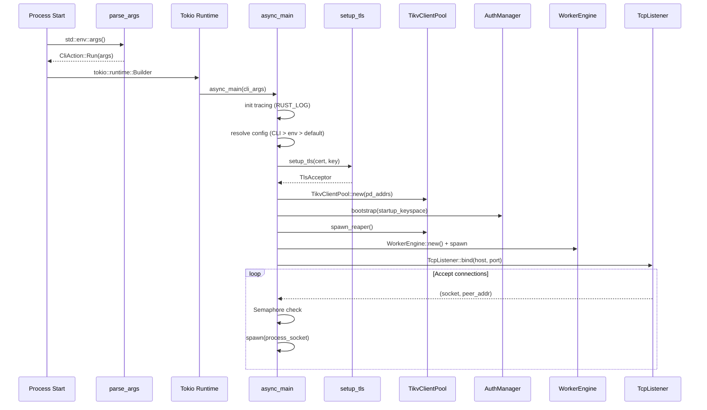

# Configuration and Operations

| Field | Value |
|-------|-------|
| **Source paths** | `src/config.rs`, `src/cli.rs`, `src/main.rs`, `src/observability.rs`, `src/tls.rs` |
| **Depends on** | `src/pool.rs`, `src/auth/`, `src/worker/`, `src/storage/` |
| **Depended on by** | All runtime modules |
| **Last verified** | 2026-02-28 |

---

## Overview

db9-server configuration spans four concerns:

- **CLI arguments** (`src/cli.rs`) -- Pure argument parsing for host, port, PD endpoints, keyspace, and TLS paths.
- **Environment variables** -- Primary configuration mechanism for all runtime settings (timeouts, TLS, dev mode, observability, worker engine, tenant governance).
- **Server configuration** (`src/config.rs`) -- `ServerConfig` struct with statement timeout, idle-in-transaction timeout, and max connections, loaded from environment and shared via `Arc<RwLock<>>`.
- **Observability** (`src/observability.rs`) -- Per-tenant metrics collection with rolling windows, latency histograms, query sampling, and SQL redaction.
- **TLS** (`src/tls.rs`) -- rustls-based TLS setup supporting PKCS#8 and RSA private key formats.

CLI flags take precedence over environment variables. Environment variables take precedence over compiled defaults.

---

## Architecture Position



---

## Key Concepts

### CLI Arguments

The `CliArgs` struct parsed by `parse_args()` supports:

| Flag | Short | Default | Env Override | Description |
|------|-------|---------|-------------|-------------|
| `--host` | -- | `127.0.0.1` | `PG_LISTEN_ADDR` | Listen address |
| `--port` | -- | `5433` | `PG_PORT` | Listen port |
| `--pd-endpoints` | -- | `127.0.0.1:2379` | `PD_ENDPOINTS` | PD endpoints (comma-separated) |
| `--keyspace` | -- | `default` | `PG_KEYSPACE` | Default TiKV keyspace |
| `--tls-cert` | -- | -- | `PG_TLS_CERT` | TLS certificate file path |
| `--tls-key` | -- | -- | `PG_TLS_KEY` | TLS private key file path |
| `--help` | `-h` | -- | -- | Print help and exit |
| `--version` | `-V` | -- | -- | Print version and exit |

Parsing rules: `--flag value` and `--flag=value` syntax supported. `--` stops parsing. Unknown flags and positional arguments are errors. Repeated flags: last value wins.

### Environment Variables

#### Core Server

| Variable | Default | Description |
|----------|---------|-------------|
| `PG_LISTEN_ADDR` | `127.0.0.1` | Listen address (overridden by `--host`) |
| `PG_PORT` | `5433` | Listen port (overridden by `--port`) |
| `PD_ENDPOINTS` | `127.0.0.1:2379` | TiKV PD endpoints (overridden by `--pd-endpoints`) |
| `PG_KEYSPACE` | `default` | Default keyspace (overridden by `--keyspace`) |
| `DB9_TOKIO_STACK_MB` | `8` | Tokio worker thread stack size in MB |

#### Timeouts and Limits

| Variable | Default | Description |
|----------|---------|-------------|
| `DB9_STATEMENT_TIMEOUT_MS` | `60000` | Default statement timeout (ms). 0 = no timeout. |
| `DB9_IDLE_IN_TRANSACTION_SESSION_TIMEOUT_MS` | `60000` | Idle-in-transaction timeout (ms). 0 = no timeout. |
| `DB9_MAX_CONNECTIONS` | `1000` | Global max concurrent connections. 0 = falls back to default. |

#### Security and Authentication

| Variable | Default | Description |
|----------|---------|-------------|
| `PG_TLS_CERT` | -- | TLS certificate path (overridden by `--tls-cert`) |
| `PG_TLS_KEY` | -- | TLS private key path (overridden by `--tls-key`) |
| `PG_REQUIRE_TLS` | `false` | Require TLS for all connections |
| `DB9_DEV` | `false` | Dev mode: allows insecure defaults, legacy admin bootstrap |
| `DB9_INSECURE` | `false` | Explicitly allow insecure pgwire posture |
| `DB9_BOOTSTRAP_ADMIN_USER` | `admin` | Bootstrap superuser name (production only) |
| `DB9_BOOTSTRAP_ADMIN_PASSWORD` | -- | Bootstrap superuser password (required in production if no superuser exists) |

#### Tenant Resource Governance

| Variable | Default | Description |
|----------|---------|-------------|
| `DB9_TENANT_QPS_LIMIT` | `0` (disabled) | Per-tenant QPS rate limit |
| `DB9_TENANT_MEMORY_QUOTA_BYTES` | `1073741824` (1 GiB; `0` disables — **no pod-OOM protection**, see #2555) | Per-tenant aggregate memory quota |

#### Observability

| Variable | Default | Description |
|----------|---------|-------------|
| `DB9_OBS_ENABLED` | `true` | Enable per-tenant observability metrics |
| `DB9_OBS_SAMPLE_EVERY` | `1000` | Sample 1 in N successful queries (0.1%) |
| `DB9_OBS_SLOW_MS` | `200` | Slow query threshold (ms) -- always sampled |
| `DB9_OBS_MAX_SAMPLE_EVENTS` | `20000` | Max sample events in rolling window |
| `DB9_OBS_MAX_SAMPLE_GROUPS` | `50` | Max query groups in sample snapshot |
| `DB9_OBS_MAX_SQL_LEN` | `512` | Max SQL length in samples (truncated) |

#### Logging

| Variable | Default | Description |
|----------|---------|-------------|
| `RUST_LOG` | `info` | tracing-subscriber EnvFilter (e.g., `debug`, `info`, `warn`, `tikv_client=warn`) |

#### fs9 WebSocket

| Variable | Default | Description |
|----------|---------|-------------|
| `FS9_WS_PORT` | (from code default) | fs9 WebSocket server port (0 = disabled) |
| `FS9_WS_LISTEN_ADDR` | (from code default) | fs9 WebSocket listen address |

### TLS Configuration

TLS uses rustls with:

- **Certificate format**: PEM-encoded X.509 certificates.
- **Key formats**: PKCS#8 (tried first) or RSA private keys.
- **ALPN**: `postgresql` for pgwire connections; no ALPN for WebSocket connections.
- **Client auth**: Not required (`.with_no_client_auth()`).

Security enforcement:
- Non-loopback listen address without TLS requires `DB9_INSECURE=1` or `DB9_DEV=1` (server refuses to start otherwise).
- `PG_REQUIRE_TLS=1` without TLS configured is a startup error.
- Both `PG_TLS_CERT` and `PG_TLS_KEY` must be set together; having only one produces a warning and TLS is disabled.

### Observability Stack

The observability system is lock-free and per-tenant:

- **Rolling window**: 60 one-minute buckets covering a 1-hour window. Each bucket tracks statement count, transaction commits, error count, and a log-linear latency histogram (264 bins).
- **Latency histogram**: Exponential bucketing with 8 sub-bins per power of 2 (0 to 2^32 microseconds). Supports p99 estimation via `quantile_us_hist()`.
- **Query sampling**: Errors and slow queries (above `DB9_OBS_SLOW_MS`) are always sampled. Normal queries are sampled at 1/`DB9_OBS_SAMPLE_EVERY` rate.
- **SQL normalization and redaction**: Whitespace collapsed, trailing semicolons stripped, passwords redacted (`PASSWORD '***'`), and SQL truncated to `DB9_OBS_MAX_SQL_LEN`.
- **FNV-1a fingerprinting**: Queries are grouped by FNV-1a 64-bit hash for aggregation.

---

## File Map

| File | Purpose | Key Types |
|------|---------|-----------|
| `src/cli.rs` | CLI argument parsing (pure, no side effects) | `CliArgs`, `CliAction`, `parse_args()`, `print_help()`, `print_version()` |
| `src/config.rs` | Server configuration from environment | `ServerConfig`, `SharedServerConfig`, `env_bool()`, `env_string()` |
| `src/main.rs` | Server entry point, startup orchestration | `main()`, `async_main()`, `reject_over_limit()` |
| `src/tls.rs` | TLS setup (pgwire + WebSocket) | `setup_tls()`, `setup_ws_tls()` |
| `src/observability.rs` | Per-tenant metrics, latency histograms, query sampling | `ObservabilityRegistry`, `ObservabilityConfig`, `TenantObservability`, `ConnectionGuard`, `SummarySnapshot`, `QuerySampleGroup` |
| `src/session_context.rs` | Tokio task-local session state (timezone, sort bytes, search_path) | `current_timezone()`, `with_timezone()`, `current_search_path_first_schema()` |

---

## Public Interfaces

### CliArgs and Parsing (src/cli.rs)

```rust
#[derive(Debug, Clone, PartialEq)]
pub struct CliArgs {
    pub host: Option<String>,
    pub port: Option<u16>,
    pub pd_endpoints: Option<String>,
    pub keyspace: Option<String>,
    pub tls_cert: Option<String>,
    pub tls_key: Option<String>,
}

pub enum CliAction {
    ShowHelp,
    ShowVersion,
    Run(CliArgs),
}

pub fn parse_args(args: &[String]) -> Result<CliAction, String>;
pub fn print_help();
pub fn print_version();
```

### ServerConfig (src/config.rs)

```rust
#[derive(Debug, Clone)]
pub struct ServerConfig {
    pub statement_timeout_ms: u64,
    pub idle_in_transaction_session_timeout_ms: u64,
    pub max_connections: u32,
}

impl ServerConfig {
    pub fn from_env() -> Self;
    pub fn shared(self) -> SharedServerConfig;  // Arc<RwLock<ServerConfig>>
}

pub type SharedServerConfig = Arc<RwLock<ServerConfig>>;

// Utility functions
pub(crate) fn env_bool(key: &str) -> bool;
pub(crate) fn env_string(key: &str) -> Option<String>;
```

### TLS (src/tls.rs)

```rust
pub fn setup_tls(cert_path: &str, key_path: &str) -> Result<TlsAcceptor>;
pub fn setup_ws_tls(cert_path: &str, key_path: &str) -> Result<TlsAcceptor>;
```

### Observability (src/observability.rs)

```rust
pub fn registry() -> &'static ObservabilityRegistry;

pub struct ObservabilityConfig {
    pub enabled: bool,
    pub sample_every: u64,
    pub slow_query_threshold_us: u64,
    pub max_sample_events: usize,
    pub max_sample_groups: usize,
    pub max_sql_len: usize,
}

pub struct SummarySnapshot {
    pub window_seconds: u64,
    pub statement_count: u64,
    pub txn_commit_count: u64,
    pub error_count: u64,
    pub rate_limited_count: u64,
    pub qps: f64,
    pub tps: f64,
    pub latency_avg_ms: f64,
    pub latency_p99_ms: f64,
    pub active_connections: u64,
}

pub struct QuerySampleGroup {
    pub query: String,
    pub sample_count: u64,
    pub error_count: u64,
    pub latency_avg_ms: f64,
    pub latency_p99_ms: f64,
    pub latency_max_ms: f64,
    pub last_seen_ms_ago: u64,
}
```

### Session Context (src/session_context.rs)

```rust
pub fn current_timezone() -> Arc<str>;
pub fn current_max_sort_bytes() -> usize;
pub fn current_search_path_first_schema() -> String;

pub async fn with_timezone<R, Fut>(timezone: Arc<str>, fut: Fut) -> R;
pub async fn with_max_sort_bytes<R, Fut>(max_sort_bytes: usize, fut: Fut) -> R;
pub async fn with_search_path<R, Fut>(search_path: Arc<Vec<String>>, fut: Fut) -> R;
```

---

## Internal Design

### Server Startup Sequence

The `main()` function orchestrates startup in this order:

1. **Parse CLI arguments** -- `parse_args()` runs before Tokio runtime. `--help` and `--version` exit immediately.
2. **Build Tokio runtime** -- Multi-threaded with configurable stack size (`DB9_TOKIO_STACK_MB`, default 8 MB).
3. **Initialize tracing** -- `tracing_subscriber` with `EnvFilter` from `RUST_LOG` (default `info`).
4. **Resolve configuration** -- CLI args override environment variables override defaults.
5. **Security validation** -- Non-loopback without TLS requires explicit insecure opt-in. `PG_REQUIRE_TLS=1` without TLS is a hard error.
6. **Create TLS acceptor** -- `setup_tls()` if both cert and key paths provided.
7. **Create TikvClientPool** -- Shared across all connections.
8. **Bootstrap auth** -- `AuthManager::bootstrap()` on the startup keyspace.
9. **Start reaper** -- `pool.spawn_reaper()` for idle tenant eviction.
10. **Start worker engine** -- `WorkerEngine` + `WorkerGc` if `DB9_WORKER_ENABLED` (from `WorkerConfig::from_env()`).
11. **Start fs9 WebSocket server** -- If `FS9_WS_PORT > 0` and security requirements met.
12. **Bind TCP listener** -- On configured host:port.
13. **Accept loop** -- Semaphore-based admission control (`max_connections`). Over-limit connections receive pgwire FATAL `53300` and are closed.

### Connection Accept Loop

```rust
loop {
    let (socket, peer_addr) = listener.accept().await?;
    let permit = match conn_semaphore.try_acquire_owned() {
        Ok(permit) => permit,
        Err(NoPermits) => { reject_over_limit(socket).await; continue; }
        Err(Closed) => { break; }
    };
    tokio::spawn(async move {
        let _permit = permit;  // held for connection lifetime
        process_socket(socket, tls_acceptor, factory, cancel_token).await;
    });
}
```

Each connection gets its own `DynamicHandlerFactory` with a reference to the shared `TikvClientPool`, `default_keyspace`, and `SharedServerConfig`.

### Configuration Precedence

```
CLI flag > Environment variable > Compiled default
```

For example, port resolution:
1. `--port 9999` (if provided)
2. `PG_PORT=9999` (if set)
3. `5433` (compiled default)

### Session Context Task-Locals

`src/session_context.rs` defines three `tokio::task_local!` variables:

- `TIMEZONE` -- Per-session timezone (default `UTC`).
- `MAX_SORT_BYTES` -- Per-session max sort memory.
- `CURRENT_SEARCH_PATH` -- Per-session `search_path` (skips `$user`, defaults to `public`).

These are scoped via `with_timezone()`, `with_max_sort_bytes()`, and `with_search_path()` async wrappers.

---

## Data Flow



---

## Contracts

1. **CLI purity**: `parse_args()` is a pure function with no side effects. It does not read environment variables or call `process::exit()`. All side effects (printing help, exiting) are in `main()`.

2. **Configuration immutability during runtime**: `SharedServerConfig` is `Arc<RwLock<>>` but is effectively read-only after startup in normal operation. Sessions read the config at connection init time.

3. **TLS security posture**: The server MUST NOT listen on a non-loopback address without TLS unless `DB9_INSECURE=1` or `DB9_DEV=1`. `PG_REQUIRE_TLS=1` without configured TLS is a startup failure.

4. **Connection admission**: When `max_connections` is reached, new connections receive a well-formed pgwire FATAL ErrorResponse (SQLSTATE `53300`, message `"sorry, too many clients already"`) and are closed. This matches PostgreSQL's rejection behavior.

5. **Observability isolation**: Per-tenant metrics are fully isolated. The global `ObservabilityRegistry` is the only shared state, and it creates independent `TenantObservability` instances keyed by keyspace.

6. **Password redaction**: SQL samples in observability ALWAYS redact `PASSWORD '...'` patterns to `PASSWORD '***'` before storage.

---

## Error Handling

### Startup Errors

| Condition | Behavior |
|-----------|----------|
| Unknown CLI flag | Print error + usage hint, exit(1) |
| Missing flag value | Print error, exit(1) |
| Invalid port number | Print error, exit(1) |
| Non-loopback without TLS (no insecure flag) | `anyhow::Error`, server exits |
| `PG_REQUIRE_TLS=1` without TLS configured | `anyhow::Error`, server exits |
| TiKV connection failure at startup | `anyhow::Error`, server exits |
| Auth bootstrap failure | `anyhow::Error`, server exits |
| TLS cert/key loading failure | Warning logged, TLS disabled (server continues if allowed) |

### Runtime Errors

| Condition | Behavior |
|-----------|----------|
| Connection limit exceeded | pgwire FATAL `53300`, connection closed |
| TLS cert file missing | `anyhow::Error` with context |
| No valid private key in file | `anyhow::Error` with message listing supported formats |
| Invalid env var value (e.g., non-numeric port) | Falls back to default, no error |

---

## Testing

### Unit Tests

Each source file includes inline `#[cfg(test)]` modules:

- **`src/cli.rs`** (18 tests): No args, help/version flags, port/host parsing, PD endpoints, keyspace, TLS flags, combined flags, unknown flags, missing values, invalid port, last-wins, double-dash, positional args.
- **`src/config.rs`** (8 tests): Default values, env overrides for each field, zero timeout allowed, invalid values fallback, max_connections zero fallback, shared config read/write.
- **`src/main.rs`** (2 tests): Semaphore admission control (permits, blocking, release), accept loop rejection (pgwire FATAL `53300`).
- **`src/tls.rs`** (1 test): Missing cert file error.
- **`src/observability.rs`** (5 tests): Bucket minute monotonicity, latency bin monotonicity, quantile calculation, SQL normalization, password redaction (CREATE ROLE, ALTER ROLE, case insensitive).

### How to Run

```bash
# All unit tests for config/ops modules
cargo test --lib cli
cargo test --lib config
cargo test --lib tls
cargo test --lib observability

# Main module tests (require tokio)
cargo test --lib tests::test_semaphore
cargo test --lib tests::test_accept_loop
```

---

## Common Task Index

| Task | Where to Look |
|------|---------------|
| Add a new CLI flag | `src/cli.rs` -- add to `CliArgs` struct, update `parse_args()` match arms, update `print_help()` |
| Add a new environment variable | `src/config.rs` or consuming module -- read via `env::var()` or `env_bool()`/`env_string()` |
| Add a new ServerConfig field | `src/config.rs` -- add field to `ServerConfig`, update `Default`, update `from_env()` |
| Change default listen port | `src/main.rs` -- modify `DEFAULT_PG_PORT` constant |
| Change default PD endpoints | `src/main.rs` -- modify `DEFAULT_PD_ENDPOINTS` constant |
| Add a new TLS mode (e.g., mTLS) | `src/tls.rs` -- modify `setup_tls()` to use `.with_client_cert_verifier()` |
| Add a new observability metric | `src/observability.rs` -- add field/method to `TenantObservability` |
| Change slow query threshold | Set `DB9_OBS_SLOW_MS` env var, or modify default in `src/observability.rs` |
| Add a new session context variable | `src/session_context.rs` -- add `tokio::task_local!`, accessor function, and `with_*` scope function |
| Change startup sequence | `src/main.rs` -- modify `async_main()` |
| Understand version info format | `src/cli.rs` -- `print_version()` uses `CARGO_PKG_VERSION`, `BUILD_GIT_HASH`, `BUILD_DATE` |

---

## See Also

- [Architecture-Overview.md](./Architecture-Overview.md) -- System-wide architecture and design principles
- [Auth-and-RBAC.md](./Auth-and-RBAC.md) -- Authentication environment variables and bootstrap
- [Multi-Tenancy.md](./Multi-Tenancy.md) -- Tenant resource governance configuration
- [Getting-Started.md](./Getting-Started.md) -- Quickstart guide for running the server
