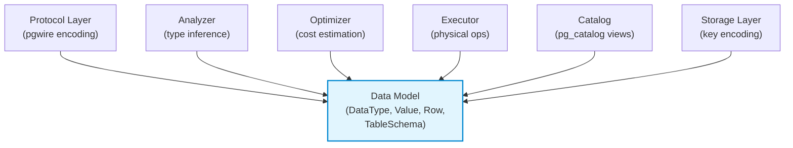
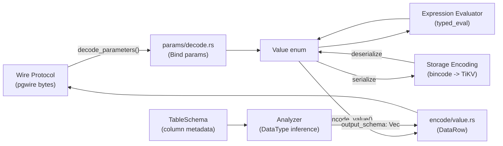

# Data Model

| Metadata | |
|---|---|
| **Source path** | `src/model/` |
| **Lines (approx.)** | ~780 across 3 files |
| **Depends on** | `rust_decimal`, `chrono`, `chrono_tz`, `uuid`, `serde`, `serde_json` |
| **Dependents** | Every layer: SQL Engine, Protocol, Storage, Catalog, Worker |

---

## Overview

The Data Model module (`src/model/`) defines the foundational types that every other layer in db9-server depends on. It provides:

- **`DataType`** -- The enum of all supported column types (22 variants), used in schema definitions, type inference, and wire protocol encoding.
- **`Value`** -- The enum of all runtime values (19 variants), used throughout query execution, storage encoding, and wire protocol transmission.
- **`Row`** -- A vector of `Value` objects representing a single row of data.
- **`TableSchema`** -- The complete schema definition for a table, including columns, indexes, primary keys, foreign keys, and check constraints.
- **Schema objects** -- `ColumnDef`, `IndexDef`, `DatabaseDef`, `SequenceDef`, `FunctionDef`, `TriggerDef`, `ViewDef`, `MatViewDef`, `UserTypeDef`, and supporting types.

All types implement `Serialize`/`Deserialize` for persistence in TiKV via bincode encoding.

---

## Architecture Position



The Data Model sits at the bottom of the dependency hierarchy. It is a pure data definition module with no dependencies on other db9-server modules (except `src/worker/types.rs` for `IndexState`). Every layer imports types from `src/model/`.

---

## Key Concepts

### DataType Enum

The `DataType` enum represents all supported column types. Variants are append-only to preserve bincode compatibility with persisted schemas.

```rust
pub enum DataType {
    Boolean,                              // PostgreSQL: BOOLEAN
    Int32,                                // PostgreSQL: INTEGER / INT4
    Int64,                                // PostgreSQL: BIGINT / INT8
    Float64,                              // PostgreSQL: DOUBLE PRECISION / FLOAT8
    Text,                                 // PostgreSQL: TEXT
    Bytes,                                // PostgreSQL: BYTEA
    Timestamp,                            // PostgreSQL: TIMESTAMP (ms since Unix epoch)
    Interval,                             // PostgreSQL: INTERVAL
    Uuid,                                 // PostgreSQL: UUID (16-byte array)
    Array(Box<DataType>),                 // PostgreSQL: type[] (parameterized element type)
    Vector(u32),                          // pgvector: vector(N) (dimension count)
    Json,                                 // PostgreSQL: JSON (original text preserved)
    Jsonb,                                // PostgreSQL: JSONB (canonical form)
    Time,                                 // PostgreSQL: TIME (microseconds since midnight)
    UserDefined(String),                  // Enum types, composite types, special catalog types
    Date,                                 // PostgreSQL: DATE (days since 1970-01-01)
    Numeric { precision: Option<u32>,     // PostgreSQL: NUMERIC(p,s)
              scale: Option<u32> },
    TimestampTz,                          // PostgreSQL: TIMESTAMPTZ
    Tsvector,                             // PostgreSQL: TSVECTOR (full-text search)
    Tsquery,                              // PostgreSQL: TSQUERY (full-text search)
    Name,                                 // PostgreSQL: NAME (63-byte identifier)
    Varchar(u64),                         // PostgreSQL: VARCHAR(n) (length-limited text)
}
```

**Important design constraints:**
- Variant ordering must never change (append-only) to preserve bincode serialization compatibility with existing TiKV data.
- `Numeric` stores optional precision and scale as typmod metadata. Runtime arithmetic uses `rust_decimal` with effective scale <= 28.
- `Array` is parameterized by element type. Empty arrays default element type to `Text` (PostgreSQL-compatible).
- `Vector` stores the dimension count; values are `Vec<f64>`.

### Value Enum

The `Value` enum represents runtime values. Each variant corresponds to a `DataType`.

```rust
pub enum Value {
    Null,                                 // SQL NULL (no type)
    Boolean(bool),                        // true/false
    Int32(i32),                           // 4-byte signed integer
    Int64(i64),                           // 8-byte signed integer
    Float64(f64),                         // 8-byte IEEE 754 double
    Text(String),                         // UTF-8 text
    Bytes(Vec<u8>),                       // Raw byte array (BYTEA)
    Timestamp(i64),                       // Milliseconds since Unix epoch
    Interval(IntervalValue),              // Months + milliseconds
    Uuid([u8; 16]),                       // 16-byte UUID
    Array(Vec<Value>),                    // Heterogeneous array of values
    Vector(Vec<f64>),                     // Dense float vector
    Json(String),                         // JSON text (original format preserved)
    Jsonb(String),                        // JSONB text (canonical form on output)
    Time(i64),                            // Microseconds since midnight
    Date(i32),                            // Days since 1970-01-01 (Unix epoch)
    Numeric(Decimal),                     // rust_decimal::Decimal
    Tsvector(String),                     // Full-text search vector
    Tsquery(String),                      // Full-text search query
}
```

`Value` provides:
- `data_type() -> Option<DataType>` -- Returns the corresponding `DataType` (None for `Null`).
- `type_display_name() -> String` -- Human-readable type name.
- `as_bytea() -> Result<&[u8]>` -- Zero-copy accessor for BYTEA.
- `as_uuid() -> Result<uuid::Uuid>` -- Cheap conversion for UUID.
- `Display` impl -- PostgreSQL-compatible text representation for all types.

### IntervalValue

PostgreSQL-compatible interval representation with separate month and sub-month components:

```rust
pub struct IntervalValue {
    pub months: i32,    // Calendar-aware month arithmetic
    pub millis: i64,    // Sub-month precision (days, hours, minutes, seconds)
}
```

This matches PostgreSQL's internal representation where months are kept separate from time-based components for calendar-aware arithmetic (e.g., adding 1 month to January 31 gives February 28/29, not March 3).

### Row

```rust
pub struct Row {
    pub values: Vec<Value>,
}
```

A row is simply a vector of `Value` objects. Column ordering is positional and matches `TableSchema.columns`.

### TableSchema

The complete schema definition for a table:

```rust
pub struct TableSchema {
    pub name: String,                               // Fully-qualified table name
    pub table_id: u64,                              // Unique table identifier
    pub columns: Vec<ColumnDef>,                    // Column definitions
    pub version: u64,                               // Schema version (incremented on ALTER)
    pub pk_constraint_name: Option<String>,         // Primary key constraint name
    pub pk_indices: Vec<usize>,                     // Column indices forming the primary key
    pub indexes: Vec<IndexDef>,                     // Secondary index definitions
    pub check_constraints: Vec<CheckConstraint>,    // CHECK constraints
    pub foreign_keys: Vec<ForeignKeyConstraint>,    // Foreign key constraints
    pub owner: String,                              // Owner role name
    pub from_alias: Option<String>,                 // Runtime-only FROM alias (not serialized)
}
```

Key methods:
- `column_index(name) -> Option<usize>` -- Look up column position by name.
- `get_pk_values(row) -> Vec<Value>` -- Extract primary key values from a row. Auto-generates UUID v4 if no PK is defined.
- `get_index_values(index, row) -> Vec<Value>` -- Extract index column values from a row.

### ColumnDef

```rust
pub struct ColumnDef {
    pub name: String,
    pub data_type: DataType,
    pub nullable: bool,
    pub primary_key: bool,
    pub unique: bool,
    pub is_serial: bool,
    pub default_expr: Option<String>,
    pub collation: Option<String>,
}
```

### IndexDef

```rust
pub struct IndexDef {
    pub name: String,
    pub id: u64,
    pub columns: Vec<String>,
    pub unique: bool,
    pub is_constraint: bool,        // Whether this is a UNIQUE constraint (vs plain unique index)
    pub method: Option<String>,     // Index method (btree, gin, etc.)
    pub predicate: Option<String>,  // Partial index predicate (WHERE clause)
    pub expressions: Vec<String>,   // Expression index definitions
    pub state: IndexState,          // READY, BUILDING, etc. (from worker module)
}
```

---

## File Map

| File | Purpose |
|------|---------|
| `src/model/mod.rs` | All core type definitions: `DataType`, `Value`, `IntervalValue`, `Row`, `TableSchema`, `ColumnDef`, `IndexDef`, `CheckConstraint`, `ForeignKeyConstraint`, `ForeignKeyAction`, `DatabaseDef`, `MigrationRecord`, `SequenceDef`, `SequenceBacking`, `SequenceState`, `FunctionDef`, `TriggerDef`, `ViewDef`, `MatViewDef`, `UserTypeDef`, `UserTypeKind`, `format_vector_pg_text()`, `infer_column_types_from_rows()` |
| `src/model/date.rs` | Date utilities: `parse_date_days()`, `format_date_days()`, `naive_date_to_days()`, `date_days_to_naive_date()`, `timestamp_millis_to_date_days()`, `date_days_to_timestamp_millis()` |
| `src/model/timestamp.rs` | Timestamp utilities: `truncate_timestamp_millis()`, `format_timestamp_millis()`, `TimeZoneSpec` (named + fixed offset timezone handling) |

---

## Public Interfaces

### DataType

```rust
// src/model/mod.rs

#[derive(Debug, Clone, PartialEq, Serialize, Deserialize)]
pub enum DataType { /* 22 variants -- see Key Concepts above */ }

impl fmt::Display for DataType {
    // Returns PostgreSQL-compatible type names: BOOLEAN, INTEGER, BIGINT,
    // DOUBLE, TEXT, BYTEA, TIMESTAMP, INTERVAL, UUID, type[], vector(N),
    // JSON, JSONB, TIME, DATE, NUMERIC(p,s), TIMESTAMPTZ, TSVECTOR,
    // TSQUERY, NAME, VARCHAR(n)
}
```

### Value

```rust
// src/model/mod.rs

#[derive(Debug, Clone, PartialEq, Serialize, Deserialize)]
pub enum Value { /* 19 variants -- see Key Concepts above */ }

impl Value {
    pub fn data_type(&self) -> Option<DataType>;
    pub fn type_display_name(&self) -> String;
    pub fn as_bytea(&self) -> Result<&[u8]>;
    pub fn as_uuid(&self) -> Result<uuid::Uuid>;
}

impl fmt::Display for Value {
    // PostgreSQL-compatible text output for all types
}
```

### IntervalValue

```rust
// src/model/mod.rs

#[derive(Debug, Clone, Copy, PartialEq, Serialize, Deserialize, Default)]
pub struct IntervalValue {
    pub months: i32,
    pub millis: i64,
}

impl IntervalValue {
    pub fn new(months: i32, millis: i64) -> Self;
    pub fn from_millis(millis: i64) -> Self;
    pub fn to_millis_approx(self) -> i64;  // 30-day month approximation
}

impl std::ops::Add for IntervalValue { /* component-wise addition */ }
impl std::ops::Sub for IntervalValue { /* component-wise subtraction */ }
impl fmt::Display for IntervalValue {
    // PostgreSQL interval format: "N years M mons D days HH:MM:SS"
}
```

### Row and Type Inference

```rust
// src/model/mod.rs

#[derive(Debug, Clone, Serialize, Deserialize, PartialEq)]
pub struct Row {
    pub values: Vec<Value>,
}

impl Row {
    pub fn new(values: Vec<Value>) -> Self;
}

/// Infer column types by scanning rows; first non-NULL type per column wins.
/// Falls back to Text for all-NULL columns (PostgreSQL-compatible).
pub fn infer_column_types_from_rows(rows: &[Row], col_count: usize) -> Vec<DataType>;
```

### TableSchema

```rust
// src/model/mod.rs

#[derive(Debug, Clone, Default, Serialize, Deserialize)]
pub struct TableSchema {
    pub name: String,
    pub table_id: u64,
    pub columns: Vec<ColumnDef>,
    pub version: u64,
    pub pk_constraint_name: Option<String>,
    pub pk_indices: Vec<usize>,
    pub indexes: Vec<IndexDef>,
    pub check_constraints: Vec<CheckConstraint>,
    pub foreign_keys: Vec<ForeignKeyConstraint>,
    pub owner: String,
    #[serde(skip)]
    pub from_alias: Option<String>,
}

impl TableSchema {
    pub fn new(name: String, table_id: u64, columns: Vec<ColumnDef>, pk_indices: Vec<usize>) -> Self;
    pub fn column_index(&self, name: &str) -> Option<usize>;
    pub fn get_pk_values(&self, row: &Row) -> Vec<Value>;
    pub fn get_index_values(&self, index: &IndexDef, row: &Row) -> Vec<Value>;
}
```

### Date Utilities

```rust
// src/model/date.rs

pub fn parse_date_days(s: &str) -> Result<i32>;           // "YYYY-MM-DD" -> days since epoch
pub fn format_date_days(days: i32) -> Result<String>;      // days since epoch -> "YYYY-MM-DD"
pub fn naive_date_to_days(date: NaiveDate) -> Result<i32>;
pub fn date_days_to_naive_date(days: i32) -> Result<NaiveDate>;
pub fn timestamp_millis_to_date_days(ts_millis: i64) -> Result<i32>;
pub fn date_days_to_timestamp_millis(days: i32) -> Result<i64>;
```

### Timestamp Utilities

```rust
// src/model/timestamp.rs

/// Truncate to precision (0=seconds, 3=ms, clamped to 0..=6)
pub fn truncate_timestamp_millis(ts_millis: i64, precision: u32) -> i64;

/// Format as PostgreSQL text timestamp (with optional timezone suffix)
pub fn format_timestamp_millis(ts_millis: i64, is_timestamptz: bool) -> Result<String>;

pub enum TimeZoneSpec {
    Fixed(FixedOffset),
    Named(chrono_tz::Tz),
}

impl TimeZoneSpec {
    pub fn try_parse(setting: &str) -> Result<Self>;
    pub fn parse(setting: &str) -> Self;  // Falls back to UTC on error
    pub fn format_timestamptz(self, dt_utc: DateTime<Utc>, micros: u32) -> String;
    pub fn timestamp_millis_from_local_datetime(self, naive: NaiveDateTime) -> Result<i64>;
}
```

---

## Internal Design

### Type Representation

| DataType | Value Variant | Internal Representation | PostgreSQL Equivalent |
|----------|---------------|------------------------|----------------------|
| `Boolean` | `Boolean(bool)` | Rust `bool` | `BOOLEAN` |
| `Int32` | `Int32(i32)` | 4-byte signed int | `INTEGER` |
| `Int64` | `Int64(i64)` | 8-byte signed int | `BIGINT` |
| `Float64` | `Float64(f64)` | IEEE 754 double | `DOUBLE PRECISION` |
| `Text` | `Text(String)` | UTF-8 `String` | `TEXT` |
| `Bytes` | `Bytes(Vec<u8>)` | Byte vector | `BYTEA` |
| `Timestamp` | `Timestamp(i64)` | Milliseconds since Unix epoch | `TIMESTAMP` |
| `TimestampTz` | `Timestamp(i64)` | Milliseconds since Unix epoch | `TIMESTAMPTZ` |
| `Date` | `Date(i32)` | Days since 1970-01-01 | `DATE` |
| `Time` | `Time(i64)` | Microseconds since midnight | `TIME` |
| `Interval` | `Interval(IntervalValue)` | months (i32) + millis (i64) | `INTERVAL` |
| `Uuid` | `Uuid([u8; 16])` | 16-byte array | `UUID` |
| `Json` | `Json(String)` | Original JSON text | `JSON` |
| `Jsonb` | `Jsonb(String)` | JSON text (canonicalized on output) | `JSONB` |
| `Numeric` | `Numeric(Decimal)` | `rust_decimal::Decimal` | `NUMERIC` |
| `Array(T)` | `Array(Vec<Value>)` | Heterogeneous `Vec<Value>` | `type[]` |
| `Vector(N)` | `Vector(Vec<f64>)` | Dense `Vec<f64>` | `vector(N)` |
| `Tsvector` | `Tsvector(String)` | Text representation | `TSVECTOR` |
| `Tsquery` | `Tsquery(String)` | Text representation | `TSQUERY` |
| `Name` | `Text(String)` | UTF-8 `String` | `NAME` |
| `Varchar(n)` | `Text(String)` | UTF-8 `String` | `VARCHAR(n)` |

### Serialization

All model types use serde `Serialize`/`Deserialize` for persistence in TiKV:

- **Schema objects** (`TableSchema`, `IndexDef`, etc.) are serialized to bincode for storage in TiKV metadata keys.
- **`Value`** is serialized via bincode for row data in TiKV.
- **`Decimal`** uses a custom serde module (`decimal_serde`) that serializes the raw parts (`lo`, `mid`, `hi`, `negative`, `scale`) instead of the default representation, ensuring stable binary format.
- **`DataType` variant ordering** is append-only to prevent bincode deserialization failures on existing data.

### Comparison Semantics

`Value` derives `PartialEq` but not `Eq` (because `Float64` contains `f64` which is not `Eq` due to `NaN`). Ordering and comparison for query execution are handled by the SQL expression evaluator (`src/sql/expr/`), not by the model types directly.

### Timestamp Precision

Timestamps are stored as milliseconds since the Unix epoch (`i64`). This provides:
- Range: approximately +/- 292 million years
- Precision: 1 millisecond (PostgreSQL supports microseconds)
- The `truncate_timestamp_millis` function supports precision parameters 0-6, but precisions finer than 3 (milliseconds) cannot be represented and are treated as millisecond precision.

The Protocol Layer handles dual-epoch detection when encoding timestamps for the wire: values larger than `MAX_REASONABLE_UNIX_MS` (10 trillion) are interpreted as PostgreSQL-epoch microseconds (since 2000-01-01) and converted accordingly.

### Date Representation

Dates are stored as `i32` days since the Unix epoch (1970-01-01). This differs from PostgreSQL's internal representation (days since 2000-01-01). Conversion between the two is handled in the Protocol Layer's binary decode/encode (`DAYS_FROM_1970_TO_2000 = 10_957`).

---

## Data Flow



1. **Input**: Client sends parameter values as wire bytes. `decode_parameters()` in `params/decode.rs` converts them to `Value` objects based on the declared pgwire `Type`.

2. **Processing**: The SQL Engine (Analyzer, Optimizer, Executor) operates on `Value` objects. The Analyzer infers `DataType` for every expression node. Operators produce `Row` objects containing `Value` vectors.

3. **Output**: `encode_value()` in `encode/value.rs` converts `Value` objects back to pgwire wire format (text or binary), using `datatype_to_pgtype()` for OID mapping.

4. **Persistence**: `Value` objects are serialized to bincode for storage in TiKV and deserialized on read. `TableSchema` is similarly persisted as bincode.

---

## Contracts

### Type Invariants

1. **Variant ordering is append-only** -- Never reorder `DataType` or `Value` variants. New variants must be appended at the end to preserve bincode compatibility with persisted data.

2. **Null is typeless** -- `Value::Null` returns `None` from `data_type()`. All-NULL columns default to `DataType::Text` (PostgreSQL-compatible).

3. **Array element type inference** -- Empty arrays default element type to `DataType::Text`. Non-empty arrays infer element type from the first non-NULL element.

4. **Timestamp representation** -- All timestamps are stored as milliseconds since Unix epoch. The `TimestampTz` and `Timestamp` DataType variants share the same `Value::Timestamp(i64)` representation; timezone handling is deferred to the display/encoding layer.

5. **IntervalValue components** -- Months and sub-month components are stored separately. `to_millis_approx()` uses a 30-day month approximation and should only be used for compatibility, not for calendar-correct arithmetic.

6. **Decimal precision** -- `rust_decimal::Decimal` provides up to 28-29 significant digits. The `decimal_serde` module caps scale at `Decimal::MAX_SCALE` on deserialization to prevent invalid state.

### Schema Invariants

1. **`from_alias` is not serialized** -- The `from_alias` field on `TableSchema` is runtime-only (marked `#[serde(skip)]`). It is set during query evaluation for qualified column resolution and whole-row references.

2. **`pk_constraint_name` derivation** -- When constructing a new `TableSchema` with primary key indices, the constraint name defaults to `{short_table_name}_pkey`.

3. **`is_constraint` default** -- For backward compatibility with schemas created before the field existed, `is_constraint` defaults to `true` on deserialization.

4. **Database encoding** -- `DatabaseDef.encoding` is always `"UTF8"`. The system does not support other encodings.

---

## Error Handling

The model module itself uses `anyhow::Result` for fallible operations:

- **Date parsing** (`parse_date_days`) returns `SqlError::InvalidInputSyntax` for malformed date strings.
- **Date range** (`naive_date_to_days`, `date_days_to_naive_date`) returns errors for dates outside `i32` range.
- **Timestamp formatting** (`format_timestamp_millis`) falls back to raw integer string for out-of-range timestamps.
- **Timezone parsing** (`TimeZoneSpec::try_parse`) returns an error for unrecognized timezone names; `parse()` falls back to UTC silently.
- **Value accessors** (`as_bytea`, `as_uuid`) return `anyhow::Error` for type mismatches.

---

## Testing

Tests are located in each source file:

- **`mod.rs`** tests:
  - `Value::as_bytea` and `Value::as_uuid` accessor correctness and error cases
  - `format_vector_pg_text` output format (integer elision, mixed, empty)
  - `DatabaseDef::default_postgres` field defaults

- **`date.rs`** tests:
  - Epoch date (1970-01-01) maps to day 0
  - Round-trip: format then parse returns original day count
  - Timestamp-to-date truncation preserves UTC date boundary

- **`timestamp.rs`** tests:
  - Truncation at different precisions (0, 1, 2, 3, 6)
  - Negative timestamp floor semantics (consistent with PostgreSQL)
  - Formatting with and without fractional seconds
  - Timezone formatting (named zones, fixed offsets)
  - Unrecognized timezone fallback to UTC

---

## Common Task Index

| Task | Where to look |
|------|---------------|
| Add a new data type | Add variant to `DataType` enum (append only!) and corresponding `Value` variant in `src/model/mod.rs`. Update `Display` impls for both. Then update `src/protocol/handler/encode/types.rs` for wire mapping. |
| Add type-specific formatting | `src/model/mod.rs` -- `Value::Display` impl for text output; `src/protocol/handler/encode/value.rs` for wire encoding |
| Add a new schema object | Define struct in `src/model/mod.rs` with `Serialize`/`Deserialize` derives. Add storage methods in `src/storage/tikv_store/`. |
| Fix date parsing | `src/model/date.rs` -- `parse_date_days()` |
| Fix timestamp formatting | `src/model/timestamp.rs` -- `format_timestamp_millis()` or `TimeZoneSpec::format_timestamptz()` |
| Fix timezone handling | `src/model/timestamp.rs` -- `TimeZoneSpec::try_parse()` for parsing, `format_timestamptz_in_zone()` for offset formatting |
| Fix interval display | `src/model/mod.rs` -- `IntervalValue::Display` impl |
| Fix Decimal serialization | `src/model/mod.rs` -- `decimal_serde` module |
| Add a column attribute | `src/model/mod.rs` -- add field to `ColumnDef` with `#[serde(default)]` for backward compat |
| Add a new constraint type | `src/model/mod.rs` -- add struct (like `CheckConstraint`), add field to `TableSchema` with `#[serde(default)]` |
| Fix vector formatting | `src/model/mod.rs` -- `format_vector_pg_text()` |

---

## See Also

- [Architecture Overview](./Architecture-Overview.md) -- System-wide architecture context
- [docs/ARCHITECTURE.md](../ARCHITECTURE.md) -- Canonical architecture document (source of truth)
- [Protocol Layer](./Protocol-Layer.md) -- Wire protocol encoding/decoding of model types
- [docs/architecture/storage.md](../architecture/storage.md) -- How model types are persisted in TiKV
- [docs/sot/storage-format.md](../sot/storage-format.md) -- Storage format contracts (bincode, key encoding)
