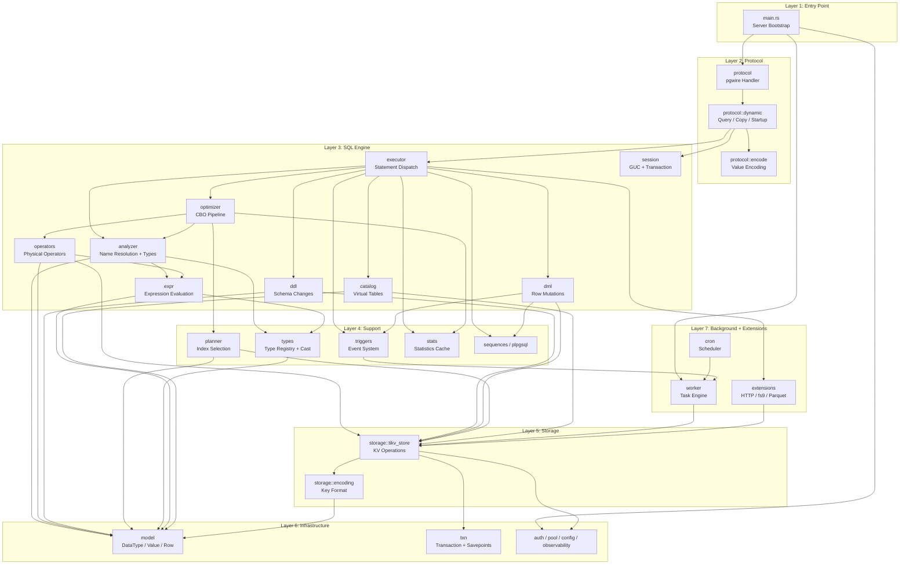
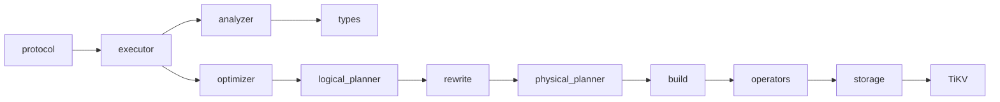
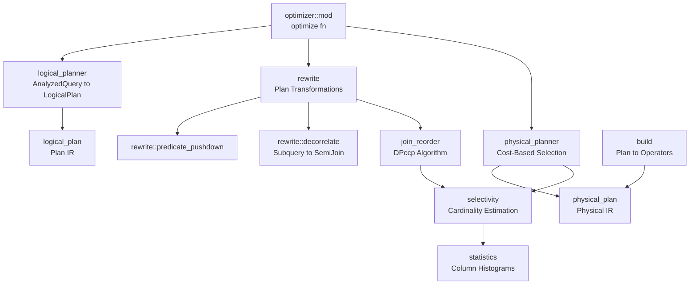
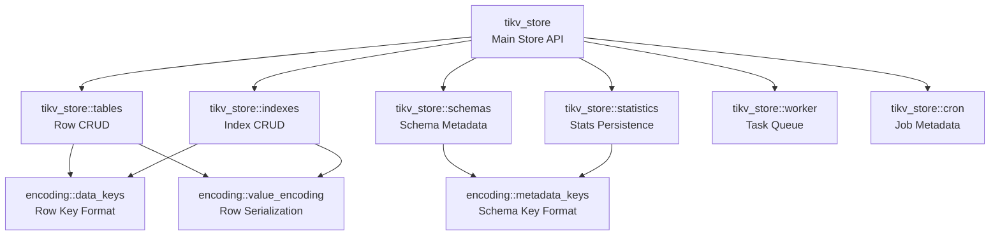

# Module Dependencies

This page documents the dependency relationships between db9-server's major modules. Understanding these dependencies is critical for maintaining clean module boundaries and avoiding circular references.

For the full system overview, see the [System Architecture](./system-architecture.md) and [Architecture Overview](../Architecture-Overview.md).

## Layered Architecture

The system follows a strict layered architecture where higher layers depend on lower layers, but not the reverse.

## Key Dependency Chains

### Query Execution Chain
The critical path for SELECT queries flows through these modules in order:

### Optimizer Internal Dependencies

### Storage Layer Dependencies

## Dependency Rules and Invariants

### Rule 1: No Upward Dependencies
Lower layers never depend on higher layers. Storage never imports from SQL. SQL never imports from Protocol. This ensures that each layer can be tested and reasoned about independently.

### Rule 2: Model is the Foundation
The `model` module (`src/model/`) defines the fundamental types (`DataType`, `Value`, `Row`, `TableSchema`, `ColumnDef`) that all other modules depend on. It has no dependencies on any other application module.

### Rule 3: Storage Isolation
The storage layer (`src/storage/`) is the only module that interacts with TiKV directly. All other modules access persistent data through the `TikvStore` API. This enforces keyspace isolation and ensures consistent key encoding.

### Rule 4: Analyzer is Sync, Executor is Async
The Analyzer uses a pre-fetched `CatalogSnapshot` and performs no I/O. All async operations (TiKV reads/writes) happen in the Executor and Operator layers. This separation keeps the type inference logic deterministic and testable.

### Rule 5: Single Optimizer Path
The optimizer module (`src/sql/optimizer/`) is the sole path for SELECT query planning. The `db9.use_optimizer` GUC is a compatibility no-op -- the optimizer is always active. There is no fallback to a legacy planner.

### Rule 6: Worker Independence
The worker engine (`src/worker/`) operates on a separate system keyspace (`_sys_worker`) with its own `TikvStore` instance. It does not share transactions with the main query execution path. Communication between the SQL layer and the worker happens through the TiKV task queue, not through direct function calls.

### Rule 7: Extension Isolation
Extensions (`src/extensions/`) are compiled in but their install state is per-tenant. Extension functions are registered in the `extensions` schema and do not pollute the `public` schema. Extensions access storage through the standard `TikvStore` API.
