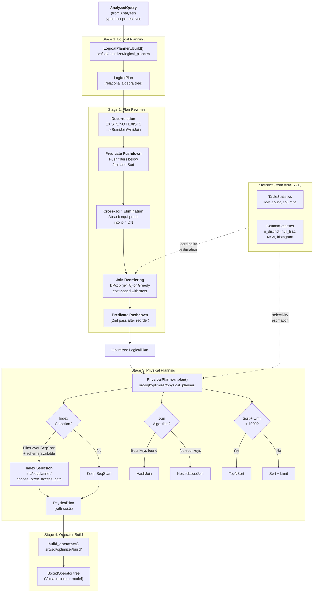
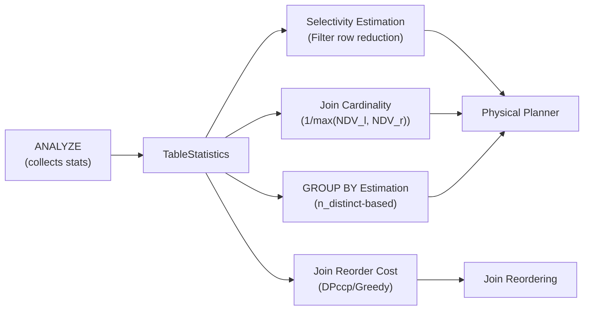

# Optimizer Pipeline

This diagram shows the complete Cost-Based Optimizer (CBO) pipeline in db9-server, from the Analyzer's `AnalyzedQuery` output through to executable `BoxedOperator` trees.

---

## Full Pipeline Flowchart



---

## Stage Details

### Stage 1: Logical Planning

**Input**: `AnalyzedQuery` (typed IR from the Analyzer)
**Output**: `LogicalPlan` (immutable tree of `LogicalNode`)

Pure structural translation. Each SQL clause maps to one logical node in a fixed order:

- **Non-aggregate path**: FROM --> WHERE --> [WINDOW] --> ORDER BY --> SELECT --> DISTINCT
- **Aggregate path**: FROM --> WHERE --> GROUP BY --> HAVING --> [WINDOW] --> ORDER BY --> SELECT --> DISTINCT

No optimization decisions are made. The logical plan preserves the SQL semantics exactly.

**Key files**: `logical_planner/mod.rs`, `logical_planner/nodes.rs`

### Stage 2: Plan Rewrites

**Input**: `LogicalPlan`
**Output**: Optimized `LogicalPlan` (semantically equivalent)

Five rewrite passes applied in sequence:

| Pass | Rule | Effect |
|------|------|--------|
| 0 | Subquery Decorrelation | `EXISTS (SELECT ... WHERE outer.col = inner.col)` becomes `SemiJoin`. `NOT EXISTS` becomes `AntiJoin`. Only pure equi-correlation; simple subquery shape. |
| 1 | Predicate Pushdown | Filter conjuncts pushed below Join (respecting join type nullability) and Sort nodes. Reduces intermediate row counts. |
| 2 | Cross-Join Elimination | Cross-table equality predicates in Filter absorbed into Join ON conditions. `Cross` --> `Inner`, enabling HashJoin. |
| 3 | Join Reordering | Flattens inner/cross join trees. Uses DPccp (up to 8 relations) or greedy (9+) with table statistics for cost-based ordering. |
| 4 | Predicate Pushdown (2nd) | Re-pushes filters that became pushable after join tree restructuring. |

**Key files**: `rewrite/mod.rs`, `rewrite/decorrelate.rs`, `join_reorder/mod.rs`, `join_reorder/algorithms.rs`

### Stage 3: Physical Planning

**Input**: Optimized `LogicalPlan` + `PlanningContext` (stats + schemas)
**Output**: `PhysicalPlan` (with `PhysicalCost` at every node)

Decisions made during physical planning:

| Decision | Logic |
|----------|-------|
| **Scan method** | SeqScan by default; IndexScan when Filter sits above SeqScan and a cheaper B-tree path exists |
| **Join algorithm** | HashJoin when ON has cross-boundary equi keys; NestedLoopJoin otherwise. Build side = smaller input. |
| **Sort optimization** | TopNSort when Sort + Limit with `limit + offset < 1000` |
| **Aggregate method** | HashAggregate always (StreamAggregate reserved for future use) |
| **Row estimation** | Stats-based selectivity when ANALYZE data exists; legacy heuristics (rows/3, rows/10) otherwise |

**Key files**: `physical_planner/mod.rs`, `src/sql/planner/index_selection.rs`

### Stage 4: Operator Construction

**Input**: `PhysicalPlan` + `BuildContext` (pre-resolved schemas and row data)
**Output**: `BoxedOperator` tree (Volcano iterator model)

Synchronous recursive tree walk. Each `PhysicalNode` maps to a concrete operator:

| PhysicalNode | Operator |
|-------------|----------|
| SeqScan | `TableScanOperator` |
| IndexScan | `TableScanOperator` (with index-filtered rows) |
| Filter | `FilterOperator` |
| Project | `ProjectOperator` |
| HashAggregate | `AggregateOperator` |
| Sort / TopNSort | `SortOperator` (+ `LimitOperator` for TopN) |
| HashJoin | `HashJoinOperator` |
| NestedLoopJoin | `NestedLoopJoinOperator` |
| HashSemiJoin | `HashSemiJoinOperator` |
| SetOperation | `SetOperationOperator` |
| Window | `WindowOperator` |
| Limit | `LimitOperator` |
| Distinct | `DistinctOperator` |
| DistinctOn | `DistinctOnOperator` |

**Key files**: `build/mod.rs`, `build/scan.rs`, `build/join.rs`, `build/aggregate.rs`

---

## Execution vs EXPLAIN

Both the executor and EXPLAIN call the same `optimize()` function:

```rust
pub fn optimize(
    analyzed: &AnalyzedQuery,
    planning_ctx: &PlanningContext,
) -> anyhow::Result<PhysicalPlan>
```

- **Execution path**: `optimize()` --> `build_operators()` --> run operator tree
- **EXPLAIN path**: `optimize()` --> `physical_plan_to_plan_node()` --> `format_plan_text()`

This single-entrypoint design ensures zero drift between planned and executed queries.

---

## Statistics Influence

When `ANALYZE` has been run on a table, the optimizer uses statistics at multiple stages:



Without statistics, all estimations fall back to deterministic heuristics:
- Filter selectivity: `rows / 3`
- Aggregate output: `rows / 10`
- Base table rows: `DEFAULT_ESTIMATED_ROWS = 1000`
- Join selectivity: `DEFAULT_JOIN_SEL = 0.1`

---

## Source File Reference

| Stage | Primary source files |
|-------|---------------------|
| Entrypoint | `src/sql/optimizer/mod.rs` |
| Logical Planning | `src/sql/optimizer/logical_planner/mod.rs`, `nodes.rs` |
| Decorrelation | `src/sql/optimizer/rewrite/decorrelate.rs` |
| Predicate Pushdown | `src/sql/optimizer/rewrite/mod.rs` |
| Cross-Join Elimination | `src/sql/optimizer/rewrite/mod.rs` |
| Join Reordering | `src/sql/optimizer/join_reorder/mod.rs`, `algorithms.rs`, `cost.rs`, `predicates.rs` |
| Physical Planning | `src/sql/optimizer/physical_planner/mod.rs` |
| Index Selection | `src/sql/planner/index_selection.rs`, `predicate.rs`, `cost_model.rs` |
| Selectivity | `src/sql/optimizer/selectivity/mod.rs` |
| Operator Build | `src/sql/optimizer/build/mod.rs`, `scan.rs`, `join.rs`, `aggregate.rs` |
| EXPLAIN | `src/sql/explain/transform.rs`, `format.rs` |
