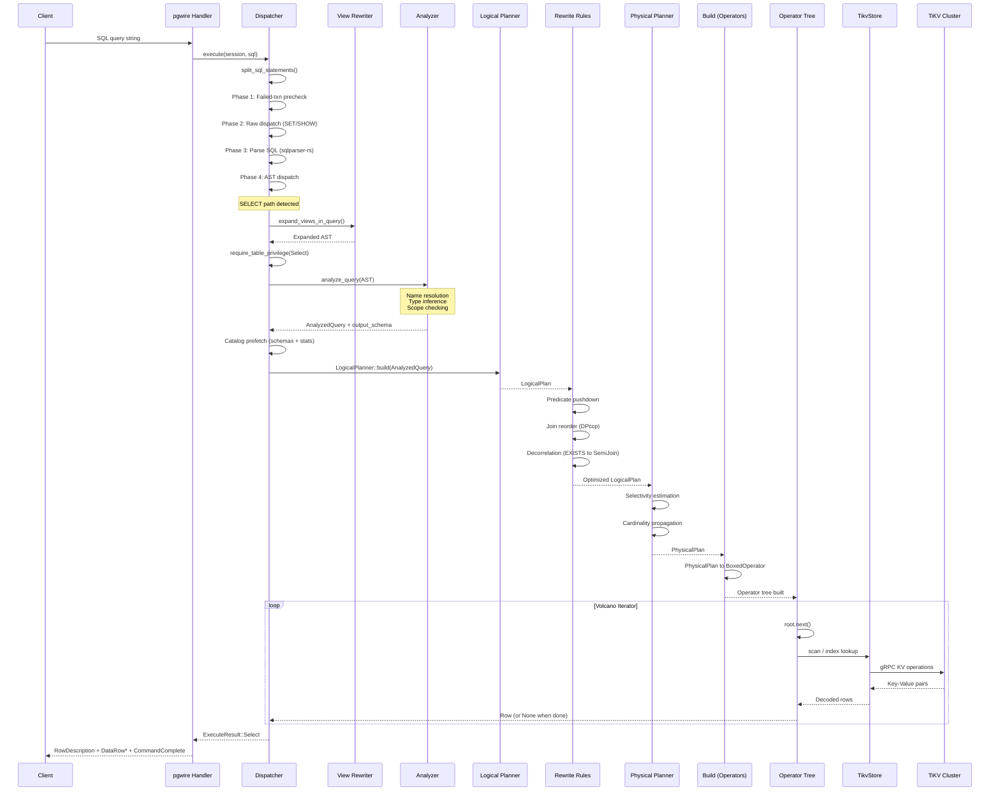
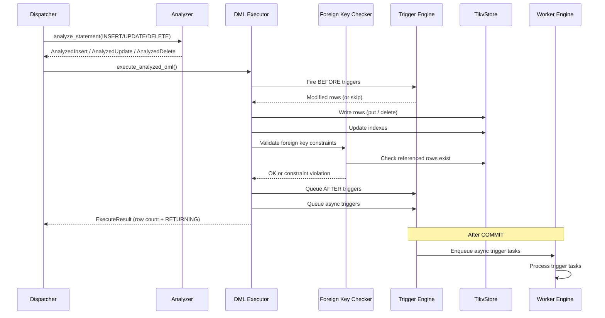

# Query Execution Flow

This page shows the lifecycle of SQL queries through the db9-server system, covering both the Simple Query Protocol and the Extended Query Protocol (prepared statements).

For the full architectural context, see the [System Architecture](./system-architecture.md) and [Architecture Overview](../Architecture-Overview.md).

## SELECT Query Lifecycle (Simple Query Protocol)

The following sequence diagram shows the complete path of a SELECT query from client to response.



### Step-by-Step Breakdown

1. **Protocol Receipt**: The pgwire handler receives the SQL string from the client via the PostgreSQL wire protocol.
2. **Statement Splitting**: Multiple semicolon-separated statements are split and executed sequentially.
3. **Dispatch Phases**: The dispatcher runs four phases in order -- failed-transaction precheck, raw dispatch (for SET/SHOW/RESET), raw passthrough (ALTER SYSTEM), and AST dispatch for parsed statements.
4. **View Expansion**: Before analysis, all view references are recursively inlined so the Analyzer sees base tables only.
5. **Privilege Check**: SELECT privilege is verified on every base table in the query.
6. **Analysis**: The Analyzer performs single-pass name resolution and type inference, producing an `AnalyzedQuery` with `TypedExpr` nodes that carry resolved `DataType` on every node.
7. **Catalog Prefetch**: Table schemas and statistics are batch-loaded from TiKV before optimization.
8. **Optimization Pipeline**: `AnalyzedQuery` flows through `LogicalPlanner` (to `LogicalPlan`), then rewrite rules (predicate pushdown, join reordering via DPccp, subquery decorrelation), then `PhysicalPlanner` (to `PhysicalPlan` with cost estimates), and finally `build` (to a `BoxedOperator` tree).
9. **Volcano Execution**: The operator tree is executed using the Volcano iterator model -- `open()` initializes, `next()` streams rows one at a time, `close()` releases resources.
10. **Response**: Results are encoded as pgwire `DataRow` messages and sent back to the client.

## Extended Query Protocol (Prepared Statements)

The Extended Query Protocol separates parsing from execution, enabling prepared statement reuse with different parameter bindings.

```mermaid
sequenceDiagram
    participant C as Client
    participant PW as pgwire Handler
    participant QP as Db9QueryParser
    participant AN as Analyzer
    participant OPT as Optimizer
    participant EX as Executor
    participant ST as TikvStore

    Note over C,ST: Phase 1: Parse
    C->>PW: Parse(name, sql, param_oids)
    PW->>QP: on_parse(sql, param_types)
    QP->>QP: Parse SQL to AST
    QP->>AN: Analyzer::new_with_params()
    AN->>AN: analyze_statement(AST)
    AN-->>QP: AnalyzedStatement + param_types
    QP-->>PW: PreparedStatement stored
    PW-->>C: ParseComplete

    Note over C,ST: Phase 2: Describe
    C->>PW: Describe(Statement, name)
    PW->>PW: Lookup PreparedStatement
    PW-->>C: ParameterDescription + RowDescription

    Note over C,ST: Phase 3: Bind
    C->>PW: Bind(portal, stmt, params, formats)
    PW->>PW: Decode parameters with types
    PW->>PW: Create Portal (stmt + bound params)
    PW-->>C: BindComplete

    Note over C,ST: Phase 4: Execute
    C->>PW: Execute(portal, max_rows)
    PW->>EX: Execute with bound parameters
    EX->>OPT: optimize(AnalyzedQuery)
    OPT-->>EX: PhysicalPlan to Operators
    EX->>ST: Operator execution
    ST-->>EX: Result rows
    EX-->>PW: ExecuteResult
    PW-->>C: DataRow* + CommandComplete

    Note over C,ST: Phase 5: Sync
    C->>PW: Sync
    PW-->>C: ReadyForQuery
```

### Extended Query Protocol Notes

- **Parse**: SQL is parsed and analyzed once. The Analyzer resolves parameter types from client-provided OIDs and context inference. The prepared statement (including `AnalyzedStatement` and resolved parameter types) is cached by name.
- **Describe**: Returns the parameter types and result column descriptions without executing the query. This is backed by the Analyzer's type information, not by running the query.
- **Bind**: Parameters are decoded using the types determined during Parse. A portal is created that holds the prepared statement plus bound parameter values.
- **Execute**: The portal's analyzed query is optimized and executed. The optimizer pipeline (`LogicalPlan` to `PhysicalPlan` to `BoxedOperator`) runs at execute time, not at parse time.
- **Sync**: Signals the end of an extended query cycle. The server commits any implicit transaction and sends `ReadyForQuery`.

## DML Execution Flow (INSERT / UPDATE / DELETE)

DML statements follow a similar analysis path but diverge at the executor level.



### DML Notes

- **Analyzer path**: INSERT, UPDATE, and DELETE all go through the Analyzer to produce typed IR (`AnalyzedInsert`, `AnalyzedUpdate`, `AnalyzedDelete`).
- **BEFORE triggers**: Fire synchronously before the row modification. Can modify the row or cancel the operation.
- **Foreign key validation**: Uses `MATCH SIMPLE` semantics (NULL columns skip the check). Self-referential constraints are supported.
- **AFTER/Async triggers**: AFTER triggers fire after the row modification within the same transaction. Async triggers are enqueued to the worker engine and fire after COMMIT.
