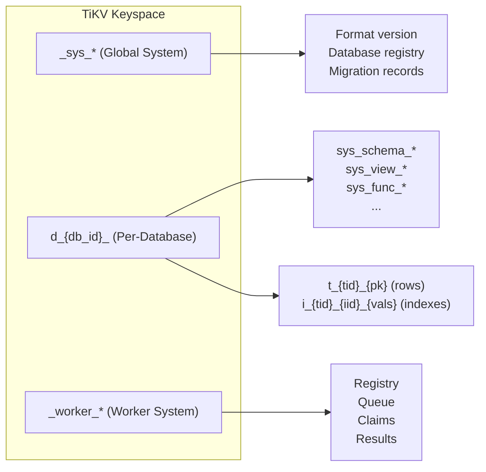

# Storage Key Layout

Visual reference for the TiKV key encoding structure used by db9-server's storage layer.

**Source**: `src/storage/encoding/` (data_keys.rs, metadata_keys.rs, mod.rs)

---

## Key Namespace Overview



---

## Database-Scoped v2 Key Format

All per-database data is prefixed with a fixed 11-byte database prefix:

```
d_  +  {db_id: 8 bytes big-endian}  +  _
^^                                      ^
2 bytes                              1 byte separator
```

Example for `db_id = 1`:

```
d_ 00 00 00 00 00 00 00 01 _
```

---

## Data Key Structure

```mermaid
graph TD
    subgraph DataKey["Row Data Key"]
        D1["d_"]
        D2["{db_id: 8B}"]
        D3["_"]
        D4["t_"]
        D5["{table_id: 8B}"]
        D6["_"]
        D7["{pk: memcomparable}"]
    end
    D1 --> D2 --> D3 --> D4 --> D5 --> D6 --> D7

    subgraph IndexKey["B-tree Index Key (unique, non-NULL)"]
        I1["d_"]
        I2["{db_id: 8B}"]
        I3["_"]
        I4["i_"]
        I5["{table_id: 8B}"]
        I6["_"]
        I7["{index_id: 8B}"]
        I8["_"]
        I9["{vals: memcomparable}"]
    end
    I1 --> I2 --> I3 --> I4 --> I5 --> I6 --> I7 --> I8 --> I9

    subgraph NonUniqueKey["B-tree Index Key (non-unique)"]
        N1["d_{db}_i_{tid}_{iid}_"]
        N2["{vals: memcomparable}"]
        N3["0x01"]
        N4["{pk: memcomparable}"]
    end
    N1 --> N2 --> N3 --> N4

    subgraph GinKey["GIN Index Key"]
        G1["d_{db}_i_{tid}_{iid}_"]
        G2["gin_"]
        G3["{token_hash: 8B}"]
        G4["0x00"]
        G5["{pk_key}"]
    end
    G1 --> G2 --> G3 --> G4 --> G5
```



---

## Key Prefix Reference

### Global System Keys (`_sys_*`)

| Key Pattern | Value | Purpose |
|---|---|---|
| `_sys_format_version` | `u32` (big-endian) | Storage format version (currently 2) |
| `_sys_next_database_id` | `u64` (big-endian) | Next database ID allocator |
| `_sys_next_table_id` | `u64` (big-endian) | Legacy table ID allocator |
| `_sys_dbname_{name}` | `u64` (big-endian, db_id) | Database name to ID mapping |
| `_sys_dbid_{id:8B}` | `DatabaseDef` (bincode) | Database ID to definition mapping |
| `_sys_migration_{name}` | `MigrationRecord` (bincode) | Migration tracking records |

### Per-Database Data Keys (`d_{db_id}_`)

| Key Pattern | Value | Purpose |
|---|---|---|
| `d_{db}_t_{tid:8B}_{pk}` | `Row` (bincode) | Table row data |
| `d_{db}_i_{tid:8B}_{iid:8B}_{vals}` | `{pk}` (memcomparable) | Unique index entry (non-NULL) |
| `d_{db}_i_{tid:8B}_{iid:8B}_{vals}_0x01_{pk}` | (empty) | Non-unique / NULL-containing index entry |
| `d_{db}_i_{tid:8B}_{iid:8B}_gin_{hash:8B}_0x00_{pk}` | (empty) | GIN inverted index entry |

### Per-Database Metadata Keys (`d_{db_id}_sys_*`)

| Key Pattern | Value | Purpose |
|---|---|---|
| `d_{db}_sys_next_table_id` | `u64` | Per-database table ID allocator |
| `d_{db}_sys_next_type_oid` | `u32` | Type OID allocator |
| `d_{db}_sys_next_schema_oid` | `u32` | Schema OID allocator |
| `d_{db}_sys_next_sequence_oid` | `u32` | Sequence OID allocator |
| `d_{db}_sys_next_function_oid` | `u32` | Function OID allocator |
| `d_{db}_sys_next_trigger_oid` | `u32` | Trigger OID allocator |
| `d_{db}_sys_next_view_oid` | `u32` | View OID allocator |
| `d_{db}_sys_schema_{table_name}` | `TableSchema` (V1/V2) | Table schema definition |
| `d_{db}_sys_schemadef_{schema_name}` | `u32` (schema OID) | SQL schema (namespace) definition |
| `d_{db}_sys_view_{name}` | `ViewDef` (bincode) | View definition |
| `d_{db}_sys_matview_{name}` | `MatViewDef` (bincode) | Materialized view definition |
| `d_{db}_sys_view_bindings_{name}` | bincode `Vec<String>` | View relation bindings |
| `d_{db}_sys_matview_bindings_{name}` | bincode `Vec<String>` | Matview relation bindings |
| `d_{db}_sys_func_{full_name}` | `FunctionDef` (magic + bincode) | Function definition |
| `d_{db}_sys_proc_{name}` | SQL string (bincode) | Stored procedure definition |
| `d_{db}_sys_trigger_{table}/{trigger}` | `TriggerDef` (bincode) | Trigger definition |
| `d_{db}_sys_type_{full_name}` | `UserTypeDef` (bincode) | User-defined type |
| `d_{db}_sys_seqdef_{full_name}` | `SequenceDef` (bincode) | Sequence definition |
| `d_{db}_sys_seq_{oid:4B}` | `SequenceState` (bincode) | Standalone sequence current state |
| `d_{db}_sys_seq_{table_id:8B}` | `u64` (big-endian) | Per-table serial counter |
| `d_{db}_sys_stats_{table_id:8B}` | `TableStatistics` (bincode) | ANALYZE statistics for optimizer |
| `d_{db}_sys_ext_{name}` | `InstalledExtension` (bincode) | Extension installation record |
| `d_{db}_sys_extcfg_{name}` | Reserved | Extension configuration |
| `d_{db}_sys_collation_{name}` | Collation def (bincode) | Collation definition |
| `d_{db}_sys_relname_{schema.name}` | Single byte tag | Relation name reservation |
| `d_{db}_sys_comment_{kind}\0{payload}` | UTF-8 text | Object comments (e/f/t/c) |
| `d_{db}_sys_cron_job_{job_id:8B}` | `CronJob` (bincode) | Cron job definition |
| `d_{db}_sys_cron_run_{run_id:8B}` | `CronRun` (bincode) | Cron run record |
| `d_{db}_sys_cron_claim_{job_id:8B}_{min:8B}` | Claim data | Cron execution claim |
| `d_{db}_sys_cron_running_guard_{job_id:8B}` | `i64` (run_id) | Overlapping run prevention |
| `d_{db}_sys_next_cron_job_id` | `i64` | Cron job ID sequence |
| `d_{db}_sys_next_cron_run_id` | `i64` | Cron run ID sequence |
| `d_{db}_sys_cron_enabled` | boolean | Cron scheduler enable flag |

### Worker System Keys (`_worker_*`)

| Key Pattern | Value | Purpose |
|---|---|---|
| `_worker_registry_{ks_len:2B}{ks}_{db_id:8B}` | `TaskRegistryEntry` (bincode) | Task type registry per tenant |
| `_worker_queue_{prio:1B}{fire_time:memcmp}{ks_len:2B}{ks}_{db_id:8B}_{task_id:8B}` | `TaskQueueEntry` (bincode) | Priority-ordered task queue |
| `_worker_claim_{ks_len:2B}{ks}_{db_id:8B}_{task_id:8B}_{fire_min:8B}` | `WorkerClaim` (bincode) | Pessimistic lock claim for task execution |
| `_worker_bg_result_{ks_len:2B}{ks}_{db_id:8B}_{task_id:8B}` | UTF-8 text | Background SQL execution result |

---

## Memcomparable Value Encoding

Values in index keys and primary keys use memcomparable encoding that preserves lexicographic sort order:

| Tag | Meaning |
|---|---|
| `0x00` | NULL (sorts before all non-NULL values) |
| `0x01` | NOT NULL (followed by type-specific encoding) |

The `memcomparable` crate handles encoding for primitive types (bool, i32, i64, f64, String, bytes). The NUMERIC type uses a custom 32-byte fixed-width encoding: `[sign:1][exp:2][digits:28][digits_len:1]` with bitwise inversion for negative values to reverse sort order.

---

## Range Scan Patterns

| Operation | Start Key | End Key |
|---|---|---|
| Full table scan | `d_{db}_t_{tid}_` | `d_{db}_t_{tid+1}` |
| All indexes for table | `d_{db}_i_{tid}_` | `d_{db}_i_{tid+1}` |
| All data in database | `d_{db_id}_` | `d_{db_id+1}_` |
| Non-unique index exact match | `...{vals}0x01` | `...{vals}0x02` |
| GIN token scan | `...gin_{hash}0x00` | `...gin_{hash}0x01` |

---

## Encoding Scheme

All numeric IDs (db_id, table_id, index_id) are encoded as **big-endian** bytes. This ensures correct lexicographic ordering in TiKV range scans. Text values in metadata keys (table names, schema names) are stored as raw UTF-8 bytes.

The v2 key format ensures that:

1. All data for a single database is contiguous in the key space (enables efficient DROP DATABASE via `unsafe_destroy_range`).
2. Within a database, table rows and indexes are contiguous per table (enables efficient DROP TABLE / TRUNCATE).
3. Index entries maintain sort order via memcomparable encoding (enables ordered index scans without post-sorting).
