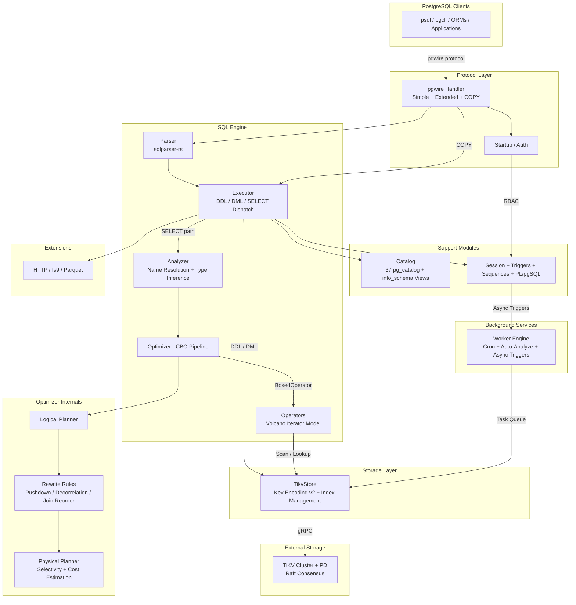

# System Architecture

This page provides a high-level panorama of the db9-server system -- a PostgreSQL-compatible distributed SQL database built on TiKV. The diagram below shows all major components and their relationships.

For a deeper dive into any specific layer, see the [Architecture Overview](../Architecture-Overview.md).

## System Panorama

## Component Groups

### Protocol Layer
The protocol layer (`src/protocol/`) implements the PostgreSQL wire protocol via the `pgwire` crate. It handles connection startup, authentication, simple query dispatch, extended query protocol (Parse/Bind/Describe/Execute), and COPY operations. The `DynamicPgHandler` is the per-connection handler that delegates to the SQL engine.

Key files: `src/protocol/handler/dynamic/` (mod.rs, query.rs, copy.rs, startup.rs), `src/protocol/handler/query_parser.rs`.

### SQL Engine
The SQL engine (`src/sql/`) is the core of the system, containing approximately 118K lines of code. It follows a strict single-path pipeline:

- **Parser**: Uses `sqlparser-rs` to transform SQL text into AST.
- **Analyzer** (`src/sql/analyzer/`): Single-pass name resolution and type checking. Produces `AnalyzedQuery` / `TypedExpr` with resolved data types on every node.
- **Optimizer** (`src/sql/optimizer/`): Cost-based optimizer that transforms `AnalyzedQuery` through `LogicalPlan` to `PhysicalPlan` to `BoxedOperator`. Includes predicate pushdown, join reordering (DPccp), and subquery decorrelation.
- **Executor** (`src/sql/executor/`): Statement dispatch for DDL, DML, and SELECT. Routes parsed statements to the appropriate handler.
- **Operators** (`src/sql/operators/`): Volcano-style physical operators (TableScan, IndexScan, Filter, Project, Sort, HashJoin, HashAggregate, Window, Limit, etc.) implementing `open()` / `next()` / `close()` semantics.

### Storage Layer
The storage layer (`src/storage/`) owns all interaction with TiKV. It uses a v2 key encoding scheme (`d_{db_id}_*`) for database-scoped keyspace isolation. Submodules handle tables, indexes, schemas, sequences, statistics, cron metadata, and worker queue entries.

Key files: `src/storage/tikv_store/` (tables.rs, indexes.rs, schemas.rs, statistics.rs), `src/storage/encoding/` (data_keys.rs, metadata_keys.rs).

### Background Services
The worker engine (`src/worker/`) provides a unified async task queue backed by TiKV with pessimistic locking. It drives cron jobs, async triggers, auto-analyze, background DDL, and background SQL execution. The cron scheduler (`src/cron/`) provides pg_cron-compatible scheduling expressions and job management.

### Extensions
Built-in extensions (`src/extensions/`) are compiled into the binary. Currently supported: HTTP client, embedding API integration, fs9 file system operations, and Parquet read support. Per-tenant install state is persisted in TiKV.

Compatibility governance for extension SQL surfaces follows the project rule:
- PostgreSQL-compatible by default.
- Any intentional divergence must be explicitly documented and tracked (SoT + design record + tests), not hidden in runtime behavior.

For embedding extension visibility semantics and SQLSTATE boundaries, see:
- `docs/design/28_embedding_extension_pg_parity_contract.md`
- `docs/sot/extensions-gin.md`
- Follow-up tracking: `#1421` (visibility semantics), `#1420` (compatibility-marker gate)

### Auth and Session
Authentication (`src/auth/`) handles RBAC and password-based auth. Session state (`src/sql/session/`) manages per-connection GUCs, transaction state, and search paths.
