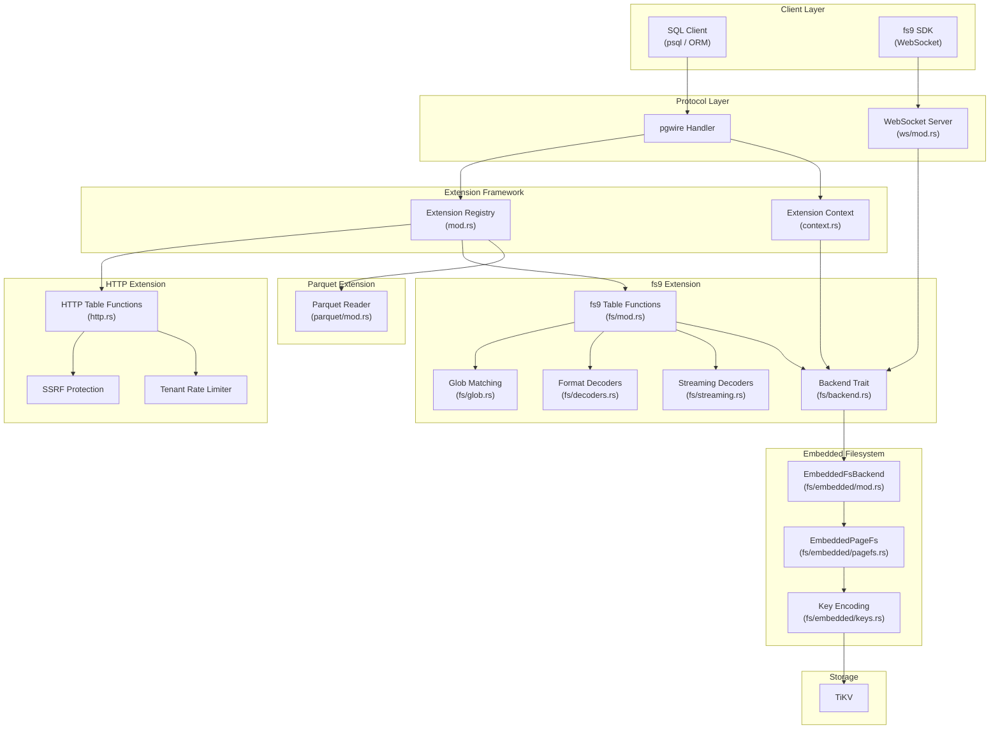
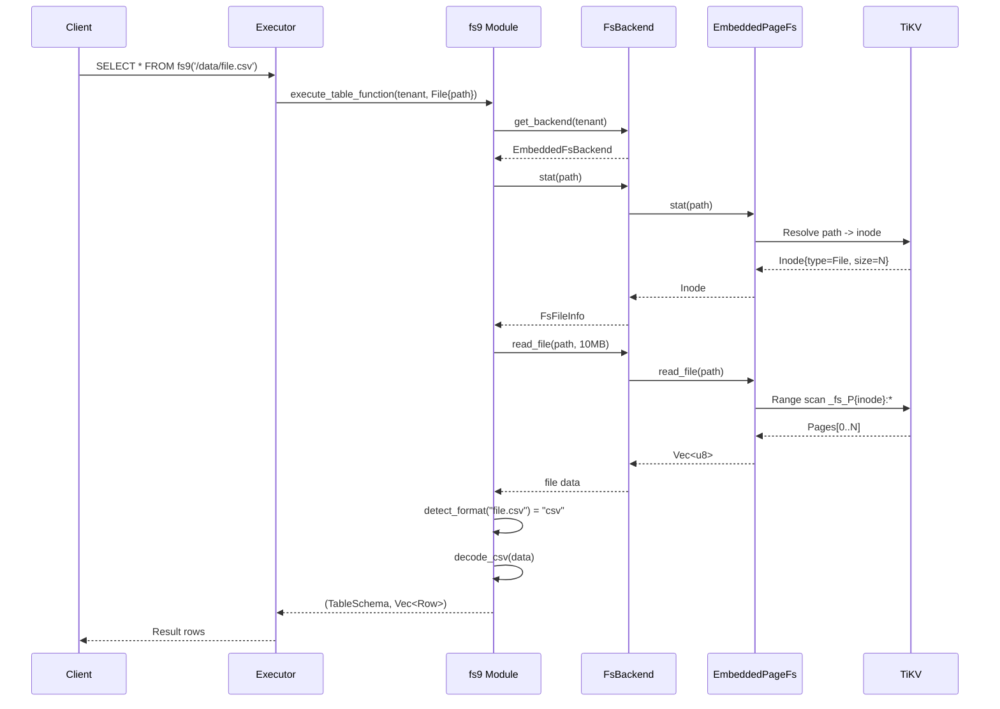
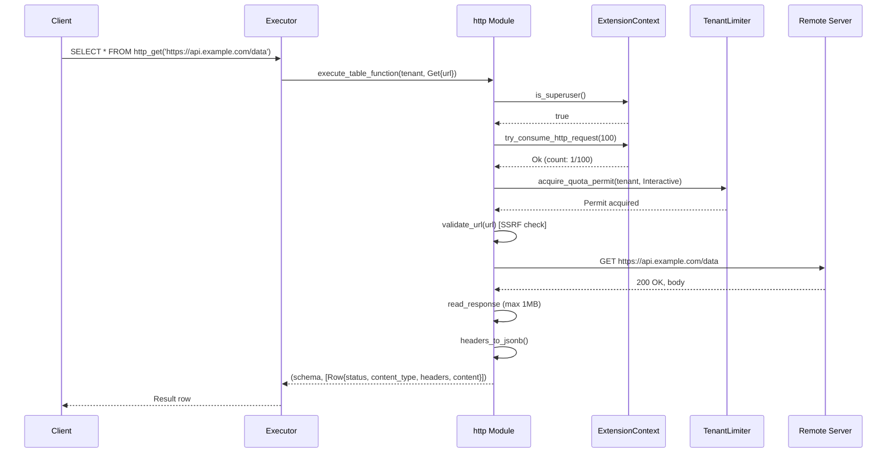

# Extensions

| Field | Value |
|-------|-------|
| **Source** | `src/extensions/` |
| **Owner** | Extensions team |
| **Status** | Active |
| **Last updated** | 2026-02-28 |

---

## 1. Overview

The extensions system provides built-in capabilities compiled directly into the db9-server binary. There is no runtime dynamic loading -- all extensions are statically registered with stable OIDs and per-tenant install state persisted in TiKV.

Six extensions are currently registered:

| Extension | OID | Default Schema | Description |
|-----------|-----|----------------|-------------|
| `http` | 2000 | `extensions` | HTTP client table functions (GET, POST, PUT, DELETE, HEAD, PATCH) with SSRF protection |
| `uuid-ossp` | 2001 | `public` | UUID generation functions (metadata-only; functions are built-in) |
| `hstore` | 2002 | `public` | hstore type (metadata-only for client compatibility) |
| `fs9` | 2003 | `extensions` | Embedded filesystem operations (read, write, stat, mkdir, remove, glob) |
| `pg_cron` | 2004 | `cron` | pg_cron-compatible scheduled job management |
| `parquet` | 2005 | `extensions` | Parquet file import via `read_parquet()` and `COPY FROM ... WITH (FORMAT parquet)` |

The `fs9` extension implements a full POSIX-like filesystem stored in TiKV with page-based storage, accessible via SQL table functions, scalar functions, and a binary WebSocket protocol for SDKs. The `http` extension provides pgsql-http-compatible table functions with tenant rate limiting and SSRF protection. The `parquet` extension (feature-gated) enables reading Parquet files from HTTP URLs or the embedded filesystem.

---

## 2. Architecture Position



---

## 3. Key Concepts

### Extension Descriptor and Install State

Each extension is described by a static `ExtensionDescriptor` with a name, stable OID, version, and default schema. When a tenant runs `CREATE EXTENSION`, an `InstalledExtension` record is persisted in TiKV with the install timestamp and enabled flag. The `descriptor()` function performs case-insensitive lookup across all registered extensions.

### Extension Context (Task-Local)

The `ExtensionContext` is a tokio task-local that carries per-statement execution state:
- `is_superuser` -- whether the current user has superuser privileges
- `tenant_keyspace` -- the TiKV keyspace for the current tenant
- `execution_kind` -- `Interactive` (user session) or `Cron` (background job)
- `http_requests` -- counter for rate-limiting HTTP calls per statement
- `tikv_client` -- optional TiKV client for fs9 backend access

This avoids threading session state through all executor layers.

### FsBackend Trait

The `FsBackend` trait abstracts all filesystem operations behind a single async interface with 14 methods. Currently the only implementation is `EmbeddedFsBackend` backed by TiKV, but the trait enables future backends (e.g., S3, local disk). The `get_backend()` factory creates an `EmbeddedFsBackend` using the TiKV client from the extension context.

### Embedded Filesystem (PageFs)

The embedded filesystem implements a POSIX-like inode-based filesystem stored entirely in TiKV:
- **Superblock** (`_fs_S`): global metadata (next inode ID, page size, capacity)
- **Inodes** (`_fs_I{inode_id}`): file/directory metadata (type, size, mode, timestamps, link count)
- **Directory entries** (`_fs_D{parent_inode}:{name}`): map filenames to child inode IDs
- **Pages** (`_fs_P{inode_id}:{page_num}`): 16KB data pages for file content

All keys use big-endian encoding to preserve lexicographic order for TiKV range scans.

### Format Detection and Decoding

File format is detected from the file extension or an explicit format parameter. Supported formats: `csv`, `tsv`, `jsonl`/`ndjson`, `parquet` (feature-gated), and `text` (fallback). Each format has both a batch decoder (full file in memory) and a streaming decoder (row-at-a-time via `AsyncBufRead`).

### HTTP SSRF Protection

All HTTP requests go through URL validation that blocks:
- Non-HTTP/HTTPS schemes
- Private/loopback/link-local IPs (both direct and DNS-resolved)
- localhost and `.local` domains
- Non-standard ports (unless `DB9_HTTP_ALLOW_INSECURE=true`)
- URLs with embedded userinfo

### Tenant Rate Limiting (HTTP)

HTTP requests are rate-limited per tenant per node using a dual-semaphore system:
- **Shared pool**: 15 permits usable by both interactive and cron executions
- **Interactive pool**: 5 permits reserved exclusively for interactive sessions (cron cannot starve interactive)
- Per-statement limit: 100 HTTP requests maximum

### WebSocket Protocol

The fs9 WebSocket server provides binary streaming for large file read/write operations. The protocol uses JSON text frames for requests/responses and binary frames for data streaming with checksum verification. It supports all `FsBackend` operations plus streaming read/write with chunked transfer.

### Glob Pattern Matching

The glob module provides recursive directory walking with pattern matching. Depth is inferred from the pattern (e.g., `*.csv` scans one level, `**/*.csv` scans recursively up to 20 levels). Dotfiles are excluded by default unless the pattern explicitly references them. Exclude patterns can be specified as comma-separated globs.

---

## 4. File Map

| File | Purpose |
|------|---------|
| `src/extensions/mod.rs` | Extension registry: descriptors, install state, `descriptor()` lookup |
| `src/extensions/context.rs` | Task-local `ExtensionContext`, `ExecutionKind`, context accessors |
| `src/extensions/http.rs` | HTTP table functions, SSRF protection, tenant rate limiter |
| `src/extensions/fs/mod.rs` | fs9 entry point: `Fs9Mode`, table function dispatch, streaming entry points |
| `src/extensions/fs/backend.rs` | `FsBackend` trait (14 async methods), `FsFileInfo`, `get_backend()` factory |
| `src/extensions/fs/decoders.rs` | Batch decoders: `detect_format`, `decode_raw_text`, `decode_directory`, `decode_csv`, `decode_jsonl` |
| `src/extensions/fs/streaming.rs` | Streaming decoders: `StreamingTextDecoder`, `StreamingJsonlDecoder`, `StreamingCsvDecoder` |
| `src/extensions/fs/glob.rs` | Glob matching: `expand_glob`, `find_first_match`, `is_glob_pattern`, exclude patterns |
| `src/extensions/fs/embedded/mod.rs` | `EmbeddedFsBackend` implementing `FsBackend` via `EmbeddedPageFs` |
| `src/extensions/fs/embedded/keys.rs` | Key encoding: `_fs_S`, `_fs_I`, `_fs_D`, `_fs_P` prefixes with big-endian IDs |
| `src/extensions/fs/embedded/types.rs` | `Superblock`, `Inode`, `InodeType`, `EmbeddedFsError` |
| `src/extensions/fs/embedded/pagefs.rs` | `EmbeddedPageFs`: full inode-based filesystem on TiKV |
| `src/extensions/fs/ws/mod.rs` | WebSocket server: `start_ws_server`, connection handling, streaming read/write |
| `src/extensions/fs/ws/protocol.rs` | `WsRequest`, `WsResponse`, `WsErrorCode`, streaming protocol types |
| `src/extensions/fs/ws/auth.rs` | WebSocket authentication and connection tracking |
| `src/extensions/fs/ws/handler.rs` | Request handler dispatching WsRequest to FsBackend |
| `src/extensions/fs/ws/stream.rs` | Binary frame encoding/decoding, checksum, stream ID generation |
| `src/extensions/parquet/mod.rs` | Parquet extension module root |
| `src/extensions/parquet/reader.rs` | Parquet row stream reader |
| `src/extensions/parquet/fs9_reader.rs` | Parquet reader for fs9-hosted files |
| `src/extensions/parquet/http_reader.rs` | Parquet reader for HTTP/HTTPS URLs |
| `src/extensions/parquet/types.rs` | Parquet type mapping to db9 types |
| `src/extensions/parquet/limits.rs` | Parquet resource limits |

---

## 5. Public Interfaces

### Extension Registry

```rust
// src/extensions/mod.rs

pub struct ExtensionDescriptor {
    pub name: &'static str,
    pub oid: i64,
    pub version: &'static str,
    pub default_schema: &'static str,
}

pub struct InstalledExtension {
    pub name: String,
    pub version: String,
    pub schema: String,
    pub installed_at_ms: u64,
    pub enabled: bool,
}

impl InstalledExtension {
    pub fn new(descriptor: &ExtensionDescriptor) -> Self;
}

/// Case-insensitive extension lookup by name.
pub fn descriptor(name: &str) -> Option<&'static ExtensionDescriptor>;
```

### Extension Context

```rust
// src/extensions/context.rs

pub enum ExecutionKind {
    Interactive,
    Cron,
}

pub(crate) struct ExtensionContextOpts {
    pub is_superuser: bool,
    pub tenant_keyspace: String,
    pub execution_kind: ExecutionKind,
    pub tikv_client: Option<Arc<TransactionClient>>,
}

impl ExtensionContextOpts {
    pub fn statement(is_superuser: bool, tenant_keyspace: &str) -> Self;
    pub fn cron(tenant_keyspace: &str) -> Self;
    pub fn with_tikv_client(self, client: Option<Arc<TransactionClient>>) -> Self;
}

pub async fn with_context_opts<R>(opts: ExtensionContextOpts, future: impl Future<Output = R>) -> R;
pub fn is_superuser() -> bool;
pub fn tenant_keyspace() -> Option<String>;
pub fn execution_kind() -> ExecutionKind;
pub fn tikv_client() -> Option<Arc<TransactionClient>>;
pub fn try_consume_http_request(max_per_statement: u32) -> Result<()>;
```

### FsBackend Trait

```rust
// src/extensions/fs/backend.rs

pub struct FsFileInfo {
    pub path: String,
    pub is_dir: bool,
    pub is_symlink: bool,
    pub size: u64,
    pub mode: u32,
    pub mtime: u64,
}

#[async_trait]
pub trait FsBackend: Send + Sync {
    async fn stat(&self, path: &str) -> Result<FsFileInfo>;
    async fn readdir(&self, path: &str) -> Result<Vec<FsFileInfo>>;
    async fn read_file(&self, path: &str, max_bytes: usize) -> Result<Vec<u8>>;
    async fn read_file_stream(&self, path: &str, max_bytes: usize)
        -> Result<Box<dyn AsyncBufRead + Unpin + Send>>;
    async fn remove(&self, path: &str) -> Result<()>;
    async fn remove_recursive(&self, path: &str) -> Result<u64>;
    async fn mkdir(&self, path: &str, recursive: bool) -> Result<()>;
    async fn write_file(&self, path: &str, data: &[u8]) -> Result<usize>;
    async fn read_file_at(&self, path: &str, offset: u64, length: usize) -> Result<Vec<u8>>;
    async fn write_file_at(&self, path: &str, offset: u64, data: &[u8]) -> Result<usize>;
    async fn append_file(&self, path: &str, data: &[u8]) -> Result<usize>;
    async fn truncate(&self, path: &str, size: u64) -> Result<()>;
    async fn rename(&self, old_path: &str, new_path: &str) -> Result<()>;
}

pub fn is_backend_available() -> bool;
pub async fn get_backend(tenant_keyspace: &str) -> Box<dyn FsBackend>;
```

### fs9 Table Function API

```rust
// src/extensions/fs/mod.rs

pub enum Fs9Mode {
    Directory { path: String, recursive: bool, exclude: Option<String> },
    File { path: String, format: Option<String>, delimiter: Option<char>, header: Option<bool> },
    Glob { pattern: String, format: Option<String>, delimiter: Option<char>,
           header: Option<bool>, exclude: Option<String> },
}

pub const MAX_BYTES_PER_FILE: usize = 10 * 1024 * 1024;   // 10 MB
pub const MAX_FILES_PER_GLOB: usize = 10_000;
pub const MAX_TOTAL_BYTES: usize = 100 * 1024 * 1024;      // 100 MB

pub async fn infer_table_function_schema(tenant: &str, mode: &Fs9Mode) -> Result<TableSchema>;
pub async fn execute_table_function(tenant: &str, mode: Fs9Mode) -> Result<(TableSchema, Vec<Row>)>;
pub async fn start_file_stream(tenant: &str, path: &str, format: Option<&str>,
    delimiter: Option<char>, header: Option<bool>) -> Result<Option<(TableSchema, mpsc::Receiver<Row>)>>;
pub async fn start_glob_stream(tenant: &str, pattern: &str, format: Option<&str>,
    delimiter: Option<char>, header: Option<bool>, exclude: Option<&str>)
    -> Result<Option<(TableSchema, mpsc::Receiver<Row>)>>;
```

### HTTP Table Functions

```rust
// src/extensions/http.rs

pub enum HttpTableFunctionCall {
    Universal { method: String, url: String, headers: Option<String>,
                content_type: Option<String>, body: Option<String> },
    Get { url: String, headers: Option<String> },
    Head { url: String, headers: Option<String> },
    Delete { url: String, headers: Option<String> },
    Post { url: String, body: String, content_type: String, headers: Option<String> },
    Put { url: String, body: String, content_type: String, headers: Option<String> },
}

pub fn table_function_schema(func_name: &str) -> Option<TableSchema>;
pub async fn execute_table_function(tenant: &str, call: HttpTableFunctionCall)
    -> Result<(TableSchema, Vec<Row>)>;
```

HTTP response schema returns four columns: `status` (INT), `content_type` (TEXT), `headers` (JSONB), `content` (TEXT).

### WebSocket Protocol

```rust
// src/extensions/fs/ws/protocol.rs

pub enum WsRequest {
    Auth { id: String, username: String, password: String },
    Stat { id: String, path: String },
    Readdir { id: String, path: String },
    Mkdir { id: String, path: String, recursive: bool },
    Unlink { id: String, path: String },
    Rm { id: String, path: String, recursive: bool },
    Read { id: String, path: String, offset: Option<u64>, length: Option<usize>, streaming: bool },
    Write { id: String, path: String, content: Option<String>, encoding: String,
            streaming: bool, size: Option<u64> },
    Pwrite { id: String, path: String, offset: u64, content: String, encoding: String },
    Append { id: String, path: String, content: String, encoding: String },
    Truncate { id: String, path: String, size: u64 },
    Rename { id: String, old_path: String, new_path: String },
}

pub struct WsResponse {
    pub id: String,
    pub ok: bool,
    pub data: Option<Value>,
    pub error: Option<WsErrorDetail>,
}

pub enum WsErrorCode {
    Enoent, Eisdir, Enotdir, Eexist, Enotempty, Eacces,
    Efbig, Eagain, Eauth, Einval, Eproto, Eio,
}
```

### Embedded Filesystem Types

```rust
// src/extensions/fs/embedded/types.rs

pub const PAGE_SIZE: usize = 16 * 1024;  // 16 KB
pub const ROOT_INODE: u64 = 1;

pub struct Superblock {
    pub next_inode: u64,
    pub page_size: usize,
    pub total_pages: u64,
    pub used_pages: u64,
}

pub enum InodeType { File, Directory }

pub struct Inode {
    pub id: u64,
    pub inode_type: InodeType,
    pub mode: u32,
    pub size: u64,
    pub page_count: u64,
    pub atime: i64,
    pub mtime: i64,
    pub ctime: i64,
    pub nlink: u32,
}

pub enum EmbeddedFsError {
    NotFound(String),
    AlreadyExists(String),
    IsDirectory(String),
    NotDirectory(String),
    DirectoryNotEmpty(String),
    PermissionDenied(String),
    Internal(String),
}
```

---

## 6. Internal Design

### Extension Registration Flow

Extensions are compiled into the binary as `const ExtensionDescriptor` values. The `descriptor()` function performs case-insensitive name matching against all six registered descriptors. When a user executes `CREATE EXTENSION <name>`, the executor:
1. Looks up the descriptor via `descriptor(name)`
2. Creates an `InstalledExtension` with the current timestamp
3. Persists the install state to TiKV under the tenant's system keyspace

This metadata drives `pg_extension` catalog visibility and function resolution.

### fs9 Execution Modes

The fs9 table function operates in three modes controlled by `Fs9Mode`:

**Directory mode** -- Lists directory contents (optionally recursive up to 10 levels, max 100,000 entries). Output schema: `path`, `type`, `size`, `mode`, `mtime`. Symlink directories are not followed during recursive traversal to prevent loops.

**File mode** -- Reads a single file and decodes it based on detected format. If the path points to a directory, falls back to directory listing. Output schema depends on format:
- Text: `_line_number`, `line`, `_path`
- CSV/TSV: `_line_number`, header columns (or `col_0`, `col_1`, ...), `_path`
- JSONL: `_line_number`, `line` (JSONB), `_path`
- Parquet: columns from the Parquet schema

**Glob mode** -- Expands a glob pattern into matching files, then decodes each file concatenating all rows. A total bytes budget (`MAX_TOTAL_BYTES = 100 MB`) prevents unbounded memory usage. Schema is inferred from the first matching file.

### Streaming vs Batch Decoding

For large files, streaming decoders (`StreamingTextDecoder`, `StreamingJsonlDecoder`, `StreamingCsvDecoder`) produce rows one at a time via `next_row() -> Result<Option<Row>>`. Each decoder wraps an `AsyncBufRead` reader and tracks cumulative `bytes_read()` for budget enforcement.

The streaming path is activated by `start_file_stream()` and `start_glob_stream()`, which spawn a tokio task that pushes rows into a bounded `mpsc::channel(256)`. Backpressure is applied when the channel fills -- the decoder task blocks on `tx.send()`.

The CSV streaming decoder reads the entire file into memory (via `read_to_end`) and then uses `spawn_blocking` for CSV parsing, because the `csv` crate is synchronous. The parsed rows are sent through the channel.

### HTTP Request Execution

HTTP requests follow a multi-layer protection pipeline:

1. **Per-statement counter** -- `try_consume_http_request()` increments a cell in the task-local context, failing at 100 requests per statement.
2. **Tenant quota** -- `acquire_quota_permit()` acquires a semaphore permit from the dual-pool system. Interactive sessions try the reserved pool first (fast path via `try_acquire_owned`), then fall back to the shared pool. Cron jobs can only use the shared pool.
3. **URL validation** -- `validate_url()` blocks forbidden schemes, IPs, hosts, and ports.
4. **Redirect following** -- Up to 3 redirects are followed. For 301/302/303, the method is changed to GET and the body is dropped. For 307/308, the original method and body are preserved.
5. **Response streaming** -- Response body is read in chunks up to `MAX_RESPONSE_BYTES` (1 MB).

The reqwest client is configured with no proxy, 1-second connect timeout, 5-second total timeout, and no automatic redirect following (handled manually for SSRF re-validation).

### Embedded PageFs Architecture

The `EmbeddedPageFs` implements a full filesystem on TiKV using four key types:

**Path resolution**: Paths are split into components and resolved from the root inode (ID=1) by walking directory entries. Each component lookup reads `_fs_D{parent_inode}:{name}` to get the child inode ID, then reads `_fs_I{child_inode}` for metadata.

**File write**: Content is split into 16KB pages. The write atomically: (1) deletes all existing pages for the inode, (2) writes new pages, (3) updates the inode size/page_count/mtime. All within a single TiKV transaction.

**File read**: Pages are read via a range scan on `_fs_P{inode_id}:` prefix, then concatenated and trimmed to the inode's recorded size.

**Directory operations**: `readdir` does a range scan on `_fs_D{inode_id}:` prefix, resolving each entry's inode for metadata. `mkdir` allocates a new inode and creates a directory entry under the parent. `remove_recursive` recursively collects all descendant inodes, then deletes all pages, directory entries, and inodes in a single transaction.

### WebSocket Connection Lifecycle

```
Client connects -> TLS handshake (optional) -> WS handshake ->
Auth request (JSON text frame, 10s timeout) -> Auth validation ->
Connection tracking (per-tenant limit: 50) ->
Request loop (300s idle timeout):
  Text frame -> Parse WsRequest -> Dispatch to handler -> Send WsResponse
  Binary frame -> Accumulate streaming write data
Close
```

Streaming reads (files >= 1 MB) send a `StreamStartResponse` followed by binary data frames (64KB chunks) and a `StreamEnd` with checksum. Streaming writes receive a `StreamWriteReady`, then accept binary frames until a `StreamEnd` text frame with optional checksum verification.

### Glob Pattern Expansion

The glob module infers walk depth from the pattern to avoid unnecessary recursion:
- `*.csv` -- depth 0 (single directory)
- `src/*/*.rs` -- depth 1 (one level of subdirectories)
- `**/*.rs` -- depth 20 (effectively unlimited)

The `walk_dir` function uses an iterative stack-based approach (not recursive function calls) to prevent stack overflow. Results are capped at `MAX_FILES_PER_GLOB` (10,000) and sorted lexicographically before return.

---

## 7. Data Flow

### fs9 File Read via SQL



### HTTP Request Flow



---

## 8. Contracts

### Extension Registration

- All extension OIDs must be unique and stable (never reused).
- `descriptor()` is case-insensitive and returns `None` for unknown names.
- `InstalledExtension::new()` records the current system time as `installed_at_ms`.

### fs9 Resource Limits

| Limit | Value | Enforced At |
|-------|-------|-------------|
| Max file size | 10 MB (`MAX_BYTES_PER_FILE`) | `read_file`, `write_file`, WebSocket |
| Max files per glob | 10,000 (`MAX_FILES_PER_GLOB`) | `expand_glob` |
| Max total bytes (glob) | 100 MB (`MAX_TOTAL_BYTES`) | `start_glob_stream`, `execute_table_function` |
| Max recursive depth (directory) | 10 levels | `list_directory_entries` |
| Max directory entries | 100,000 | `list_directory_entries` |
| Page size | 16 KB (`PAGE_SIZE`) | `EmbeddedPageFs` |
| Root inode ID | 1 (`ROOT_INODE`) | `EmbeddedPageFs` |

### HTTP Security Contracts

| Rule | Behavior |
|------|----------|
| Scheme restriction | Only `http` and `https`; `http` blocked unless `DB9_HTTP_ALLOW_INSECURE=true` |
| Port restriction | Only default ports (80/443) unless insecure mode |
| SSRF protection | Loopback, private, link-local IPs blocked; localhost/.local domains blocked |
| Userinfo | Not allowed in URLs |
| Request body size | Max 256 KB (`MAX_REQUEST_BYTES`) |
| Response body size | Max 1 MB (`MAX_RESPONSE_BYTES`) |
| Redirects | Max 3; 301/302/303 downgrade to GET; 307/308 preserve method |
| Per-statement limit | 100 requests (`MAX_REQUESTS_PER_STATEMENT`) |
| Per-tenant inflight | 20 total (`MAX_INFLIGHT_REQUESTS_PER_TENANT_PER_NODE`) |
| Interactive reserved | 5 permits (`RESERVED_FOR_INTERACTIVE`) |
| Superuser required | Yes -- non-superuser gets `PermissionDenied` |

### WebSocket Protocol Constants

| Constant | Value |
|----------|-------|
| `STREAMING_THRESHOLD` | 1 MB |
| `DEFAULT_CHUNK_SIZE` | 64 KB |
| `AUTH_TIMEOUT_SECS` | 10 seconds |
| `IDLE_TIMEOUT_SECS` | 300 seconds (5 minutes) |
| `DEFAULT_MAX_CONNECTIONS_PER_TENANT` | 50 |
| `MAX_JSON_FRAME_BYTES` | 2 MB |
| `DEFAULT_WS_PORT` | 5480 |

### FsBackend Contract

- All paths must be absolute (starting with `/`).
- Path traversal (`..`) is not allowed (enforced by WebSocket; the backend itself does not validate).
- `read_file` and `read_file_stream` enforce `max_bytes` -- files exceeding the limit are rejected.
- `write_file` returns the number of bytes written.
- `remove` on a non-empty directory returns an error (use `remove_recursive`).
- `remove_recursive` returns the total number of inodes deleted.
- `mkdir` with `recursive=true` creates intermediate directories.
- All operations are transactional within TiKV (atomicity guaranteed per operation).

---

## 9. Error Handling

### Extension Context Errors

The extension context is task-local and may not be available in all code paths. All accessor functions (`is_superuser`, `tenant_keyspace`, `execution_kind`, `tikv_client`) return safe defaults when the context is missing:
- `is_superuser()` returns `false`
- `tenant_keyspace()` returns `None`
- `execution_kind()` returns `ExecutionKind::Interactive`
- `tikv_client()` returns `None`

`try_consume_http_request()` returns `Err("http: extension context missing")` if no context is set, or `Err("http: max_requests_per_statement exceeded")` when the limit is reached.

### HTTP Errors

HTTP errors are returned as `anyhow::Error` with descriptive messages:
- `"http: only http and https schemes are allowed"` -- invalid scheme
- `"http: insecure http requests are disabled"` -- HTTP blocked in secure mode
- `"http: ip is not allowed"` / `"http: resolved ip is not allowed"` -- SSRF detection
- `"http: request failed: ..."` -- network/connection error
- `"http: response too large"` -- response exceeds 1 MB
- `"http: too many redirects"` -- redirect limit (3) exceeded
- `"http: unsupported method: ..."` -- invalid HTTP method in universal function
- Non-superuser access returns `SqlError::PermissionDenied`

### Embedded Filesystem Errors

`EmbeddedFsError` provides POSIX-style error variants that the WebSocket protocol maps to `WsErrorCode`:

| EmbeddedFsError | WsErrorCode | Description |
|----------------|-------------|-------------|
| `NotFound` | `ENOENT` | File or directory not found |
| `AlreadyExists` | `EEXIST` | Path already exists |
| `IsDirectory` | `EISDIR` | Operation not valid on directory |
| `NotDirectory` | `ENOTDIR` | Expected directory but found file |
| `DirectoryNotEmpty` | `ENOTEMPTY` | Cannot remove non-empty directory |
| `PermissionDenied` | `EACCES` | Insufficient privileges |
| `Internal` | `EIO` | Internal filesystem error |

### WebSocket Protocol Errors

The WebSocket server validates all inputs and returns structured `WsResponse` errors:
- `EPROTO` -- protocol violations (invalid JSON, unexpected binary frame, missing auth)
- `EFBIG` -- JSON frame or file too large
- `EINVAL` -- invalid path (empty, relative, or containing `..`), missing required fields
- `EAUTH` -- authentication failure
- `EAGAIN` -- per-tenant connection limit reached
- `EIO` -- checksum mismatch or I/O error

### fs9 Decoder Errors

- CSV decode errors are propagated with file path context: `"fs9: CSV decode error in {path}: {e}"`
- Invalid JSONL lines are silently skipped (not errors)
- Streaming decode errors are logged via `tracing::warn` and terminate the stream
- Parquet without the feature flag returns `"fs9: parquet format requires the parquet extension"`
- Glob expansion failures are logged and skipped per-directory; individual file read failures are logged and skipped

---

## 10. Testing

### Test Coverage by Module

**Extension registry** (`src/extensions/mod.rs`):
- Descriptor registration verification for all 6 extensions
- Case-insensitive name lookup
- OID and default schema correctness

**Extension context** -- Tested indirectly through HTTP and fs9 tests.

**HTTP extension** (`src/extensions/http.rs`):
- `is_ip_forbidden` -- blocks loopback, private, link-local, IPv4-mapped IPv6
- `validate_url_with_policy` -- HTTPS allowed, HTTP blocked by default, invalid schemes rejected, userinfo blocked, localhost blocked, non-standard ports blocked, insecure mode allows HTTP
- `parse_custom_headers` -- JSON array format, JSON object format, empty inputs, invalid JSON, missing fields
- Tenant quota -- interactive gets reserved pool, cron cannot starve interactive, interactive waits on reserved when shared is saturated, pool constants validation

**fs9 decoders** (`src/extensions/fs/decoders.rs`):
- `detect_format` -- CSV, TSV, JSONL, parquet, text fallback, explicit override
- `decode_raw_text` -- basic, empty, trailing newline, max rows, schema shape
- `decode_csv` -- with/without header, TSV delimiter, empty, header-only, fewer columns, quoted fields, max rows
- `decode_jsonl` -- basic, skip empty lines, skip invalid JSON, empty, max rows, mixed types, schema shape
- `decode_directory` -- file and directory entries, schema shape

**fs9 streaming** (`src/extensions/fs/streaming.rs`):
- `StreamingTextDecoder` -- batch parity, empty file, bytes tracking, cumulative counter
- `StreamingJsonlDecoder` -- batch parity, skips invalid and empty lines
- `StreamingCsvDecoder` -- batch parity, without headers, custom delimiter

**fs9 glob** (`src/extensions/fs/glob.rs`):
- `is_glob_pattern` -- metacharacter detection
- `glob_prefix_dir` -- prefix extraction
- `infer_glob_max_depth` -- depth inference from pattern
- `expand_glob` -- basic, recursive, empty, max files cap, dotfile exclusion, exclude patterns
- `find_first_match` -- returns first CSV, returns None for no matches
- Depth limit enforcement

**fs9 directory listing** (`src/extensions/fs/mod.rs`):
- Recursive listing with symlink loop prevention
- Glob streaming with multiple files
- Glob streaming bytes budget enforcement

**Embedded filesystem keys** (`src/extensions/fs/embedded/keys.rs`):
- Key format correctness for all key types
- `_fs_` namespace prefix isolation
- Big-endian ordering preservation
- Prefix-of-key relationship (dir_prefix is prefix of dir_entry_key)
- Different parents produce different keys

**WebSocket protocol** (`src/extensions/fs/ws/protocol.rs`):
- Request deserialization for all WsRequest variants
- Response serialization (success and error)
- Error code serialization (uppercase)
- Path validation (absolute, traversal prevention)
- `FileInfoResponse` conversion from `FsFileInfo`

### Running Tests

```bash
# All extension tests
cargo test --lib extensions

# Specific subsystem
cargo test --lib extensions::http
cargo test --lib extensions::fs::decoders
cargo test --lib extensions::fs::streaming
cargo test --lib extensions::fs::glob
cargo test --lib extensions::fs::embedded::keys
cargo test --lib extensions::fs::ws::protocol
```

---

## 11. Common Task Index

| Task | Where to Start |
|------|---------------|
| Add a new extension | Add `ExtensionDescriptor` const + match arm in `descriptor()` in `src/extensions/mod.rs` |
| Add a new HTTP table function | Add variant to `HttpTableFunctionCall` and match arm in `execute_table_function()` in `src/extensions/http.rs`; register schema in `table_function_schema()` |
| Add a new fs9 file format | Add format detection in `detect_format()` in `src/extensions/fs/decoders.rs`; add batch decoder function; add streaming decoder struct in `src/extensions/fs/streaming.rs`; wire up in `execute_table_function()` and `start_file_stream()` in `src/extensions/fs/mod.rs` |
| Add a new FsBackend operation | Add method to `FsBackend` trait in `src/extensions/fs/backend.rs`; implement in `EmbeddedFsBackend` in `src/extensions/fs/embedded/mod.rs`; implement in `EmbeddedPageFs` in `src/extensions/fs/embedded/pagefs.rs`; add `WsRequest` variant in `src/extensions/fs/ws/protocol.rs`; handle in `src/extensions/fs/ws/handler.rs` |
| Add a new embedded fs key type | Add encoding function in `src/extensions/fs/embedded/keys.rs` with `_fs_` prefix and big-endian ID encoding |
| Modify SSRF protection rules | Update `is_ip_forbidden()` and `validate_url_with_policy()` in `src/extensions/http.rs` |
| Adjust HTTP rate limits | Change constants `MAX_REQUESTS_PER_STATEMENT`, `MAX_INFLIGHT_REQUESTS_PER_TENANT_PER_NODE`, `RESERVED_FOR_INTERACTIVE` in `src/extensions/http.rs` |
| Add a new WebSocket operation | Add variant to `WsRequest` in `src/extensions/fs/ws/protocol.rs`; handle in `src/extensions/fs/ws/handler.rs` |
| Add fs9 resource limit | Add constant in `src/extensions/fs/mod.rs`; enforce in the appropriate function |
| Debug fs9 file read | Trace: `get_backend()` -> `EmbeddedFsBackend::read_file()` -> `EmbeddedPageFs::read_file()` -> TiKV range scan on `_fs_P{inode}:` |
| Debug HTTP request failure | Check: `try_consume_http_request` (per-statement limit) -> `acquire_quota_permit` (tenant semaphore) -> `validate_url` (SSRF) -> `reqwest::send` (network) -> `read_response` (size limit) |

---

## 12. See Also

- [Worker and Cron](./Worker-and-Cron.md) -- Background task engine that executes cron jobs and other async tasks
- [Storage Layer](./Storage-Layer.md) -- TiKV key encoding and storage operations used by the embedded filesystem
- [Architecture Overview](./Architecture-Overview.md) -- System-level architecture and module map
- [Protocol Layer](./Protocol-Layer.md) -- pgwire handler that dispatches extension function calls
- [Auth and RBAC](./Auth-and-RBAC.md) -- Authentication used by WebSocket connections and superuser checks
- `src/extensions/parquet/` -- Parquet file import (feature-gated, uses fs9 backend for filesystem-hosted files)
- `docs/ARCHITECTURE.md` -- Canonical architecture document
