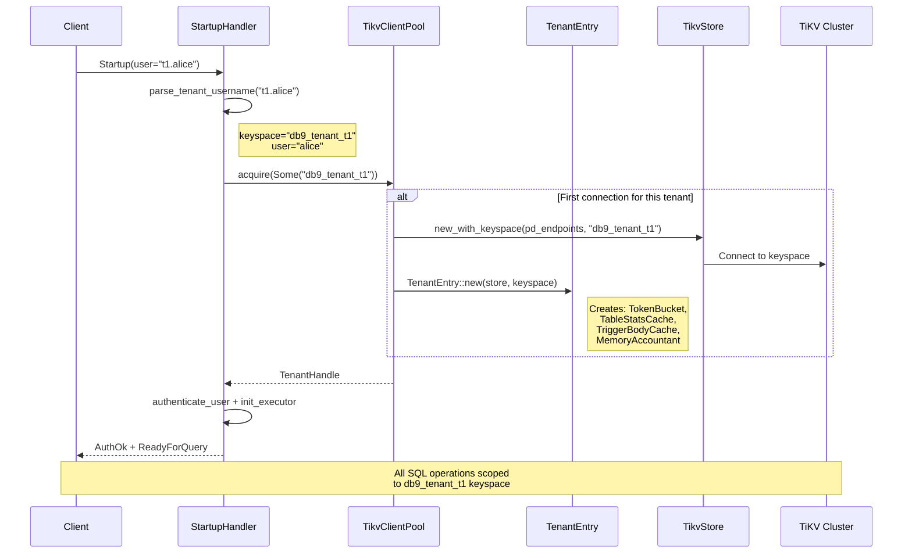

# Multi-Tenancy

| Field | Value |
|-------|-------|
| **Source paths** | `src/pool.rs`, `src/protocol/handler/tenant.rs` |
| **Depends on** | `src/storage/` (TikvStore, keyspace isolation), `src/sql/stats.rs` (TableStatsCache) |
| **Depended on by** | `src/protocol/handler/dynamic/startup.rs`, `src/sql/executor/`, `src/worker/`, `src/observability.rs` |
| **Last verified** | 2026-02-28 |

---

## Overview

db9-server is a multi-tenant database where each tenant is identified by a TiKV keyspace. Multi-tenancy provides:

- **Username-based tenant routing** -- Clients connect with `tenant_id.user` or `tenant_id:user` format; the server parses the tenant ID, maps it to a TiKV keyspace (`db9_tenant_{tenant_id}`), and routes all operations to that keyspace.
- **Keyspace isolation** -- All persistent data (table rows, indexes, schemas, auth entries, statistics, sequences, cron jobs) is isolated per keyspace. This is a non-negotiable design invariant (see `docs/ARCHITECTURE.md` section 1.6).
- **Per-tenant resource governance** -- QPS rate limiting, aggregate memory quotas, and per-user connection limits, all enforced at the pool layer.
- **Lazy tenant provisioning with idle eviction** -- Tenant TiKV clients are created on first connection and evicted after a configurable idle timeout (default 300s).
- **Per-tenant caches** -- Each tenant has its own `TableStatsCache`, `TriggerBodyCache`, and `ObservabilityRegistry` instance.

---

## Architecture Position

```mermaid
flowchart TD
    Client["PostgreSQL Client\n(user='t1.alice')"]
    TenantParse["parse_tenant_username\n(tenant.rs)"]
    Pool["TikvClientPool\n(pool.rs)"]
    TE["TenantEntry\n(per-keyspace)"]
    TH["TenantHandle\n(RAII, per-connection)"]
    Store["TikvStore\n(keyspace-scoped)"]
    TiKV["TiKV Cluster"]
    Stats["TableStatsCache"]
    Triggers["TriggerBodyCache"]
    RateLim["TokenBucket\n(QPS limiter)"]
    MemAcct["TenantMemoryAccountant"]
    Obs["TenantObservability"]

    Client --> TenantParse
    TenantParse -->|keyspace + user| Pool
    Pool -->|acquire()| TE
    TE --> Store
    TE --> Stats
    TE --> Triggers
    TE --> RateLim
    TE --> MemAcct
    TE -->|TenantHandle| TH
    TH -->|per-connection| Store
    Store --> TiKV
    Pool -->|ObservabilityRegistry| Obs
```

---

## Key Concepts

### Tenant Username Format

Clients connect using a compound username that encodes the tenant ID:

```
tenant_id.user     (dot separator)
tenant_id:user     (colon separator)
user               (no separator -- uses default keyspace)
```

The function `parse_tenant_username()` in `src/protocol/handler/tenant.rs` extracts the keyspace and actual username. The keyspace is formed by prepending `db9_tenant_` to the tenant ID:

```
Input: "abc123.admin"
Output: (Some("db9_tenant_abc123"), "admin")

Input: "admin"
Output: (None, "admin")
```

When no tenant separator is found, the server falls back to the `--keyspace` CLI flag, the `PG_KEYSPACE` environment variable, or the hardcoded `"default"` keyspace.

### Keyspace Isolation Invariant

From `docs/ARCHITECTURE.md` section 1.6:

> All persistent data must be isolated per keyspace. Process-level global state is limited to in-memory caches, configuration, and logging.

This means:
- Each keyspace has independent `_sys_user_*` and `_sys_role_*` auth entries.
- Table schemas, row data, and indexes use database-scoped v2 key format (`d_{db_id}_*`) within the keyspace.
- Statistics, sequences, cron jobs, and worker tasks are all keyspace-scoped.
- The `TikvStore` is constructed with a keyspace parameter that scopes all TiKV operations.

### TikvClientPool

The `TikvClientPool` manages per-tenant `TenantEntry` instances:

- **Lazy creation**: TiKV clients are created on first access via `acquire()` or `get_client()`. A per-keyspace mutex prevents duplicate creation.
- **Double-checked locking**: The pool uses a read-lock fast path and per-keyspace creation lock slow path to avoid holding the global write lock during TiKV connection setup.
- **Idle eviction**: A background reaper task (spawned via `spawn_reaper()`) scans every 30 seconds and evicts tenants idle for more than 300 seconds. When a tenant is evicted, its `TenantEntry` (including caches) is dropped.

### Per-Tenant Caches

Each `TenantEntry` owns:

| Cache | Type | Purpose |
|-------|------|---------|
| `stats_cache` | `Arc<TableStatsCache>` | Row count estimates and column statistics from ANALYZE, used by the CBO optimizer |
| `trigger_cache` | `Arc<TriggerBodyCache>` | Parsed trigger bodies, avoiding re-parsing on every trigger invocation |

These caches have the same lifetime as the `TenantEntry`. When the reaper evicts a tenant, caches are dropped automatically.

### Per-Tenant Resource Governance

| Resource | Control Mechanism | Configuration |
|----------|-------------------|---------------|
| QPS | `TokenBucket` rate limiter per `TenantEntry` | `DB9_TENANT_QPS_LIMIT` env var (0 = disabled) |
| Memory | `TenantMemoryAccountant` with CAS-based accounting | `DB9_TENANT_MEMORY_QUOTA_BYTES` env var (0 = unlimited) |
| Per-user connections | `user_connections` map in `TenantEntry` | `User.connection_limit` (rolconnlimit, -1 = unlimited) |
| Global connections | `Semaphore` in `main.rs` accept loop | `DB9_MAX_CONNECTIONS` env var (default 1000) |

### Per-Tenant Observability

The `ObservabilityRegistry` (in `src/observability.rs`) maintains a per-tenant `TenantObservability` instance keyed by keyspace name. Each instance tracks:

- Active connection count (via `ConnectionGuard` RAII).
- Statement count, commit count, error count (rolling 1-hour window).
- Latency histogram (log-linear bins, p99 estimation).
- Query samples with SQL fingerprinting and redaction.

---

## File Map

| File | Purpose | Key Types |
|------|---------|-----------|
| `src/pool.rs` | Multi-tenant connection pool, RAII handles, rate limiting, memory accounting | `TikvClientPool`, `TenantEntry`, `TenantHandle`, `TokenBucket`, `TenantMemoryAccountant`, `TenantMemoryReservation` |
| `src/protocol/handler/tenant.rs` | Tenant username parsing | `parse_tenant_username()` |
| `src/sql/stats.rs` | Per-tenant table statistics cache | `TableStatsCache` |
| `src/observability.rs` | Per-tenant observability metrics | `ObservabilityRegistry`, `TenantObservability`, `ConnectionGuard` |
| `src/protocol/handler/dynamic/startup.rs` | Tenant routing during connection setup | `init_executor()`, `authenticate_user()` |

---

## Public Interfaces

### parse_tenant_username (src/protocol/handler/tenant.rs)

```rust
pub(crate) fn parse_tenant_username(username: &str) -> (Option<String>, String);
```

Returns `(Some(keyspace), actual_user)` if a separator is found, or `(None, username)` otherwise. The keyspace is `"db9_tenant_{tenant_id}"`.

### TikvClientPool (src/pool.rs)

```rust
pub struct TikvClientPool {
    // ...
}

impl TikvClientPool {
    pub fn new(pd_endpoints: Vec<String>) -> Self;

    /// Acquire a connection-scoped RAII handle to a tenant's TikvStore.
    pub async fn acquire(&self, keyspace: Option<String>) -> Result<TenantHandle>;

    /// Get a TikvStore without connection-scoped tracking (for background tasks).
    pub async fn get_client(&self, keyspace: Option<String>) -> Result<Arc<TikvStore>>;

    /// Spawn background reaper for idle tenant eviction.
    pub fn spawn_reaper(self: &Arc<Self>);
}
```

### TenantHandle (src/pool.rs)

```rust
pub struct TenantHandle { /* ... */ }

impl TenantHandle {
    pub fn store(&self) -> &Arc<TikvStore>;
    pub fn trigger_cache(&self) -> &Arc<TriggerBodyCache>;
    pub fn stats_cache(&self) -> &Arc<TableStatsCache>;
    pub fn rate_limiter(&self) -> Option<&TokenBucket>;
    pub fn keyspace(&self) -> &str;
    pub fn memory_accountant(&self) -> TenantMemoryAccountant;

    /// Bind to a user and enforce rolconnlimit.
    pub fn try_bind_user(&mut self, username: String, connection_limit: i32)
        -> Result<(), String>;
}

impl Clone for TenantHandle;  // Increments active_connections; clones do NOT inherit user_slot
impl Drop for TenantHandle;   // Decrements active_connections; releases user_slot if owned
```

### TenantMemoryAccountant (src/pool.rs)

```rust
pub struct TenantMemoryAccountant { /* ... */ }

impl TenantMemoryAccountant {
    pub fn unlimited(keyspace: String) -> Self;
    pub fn reservation(&self) -> TenantMemoryReservation;
}

pub struct TenantMemoryReservation { /* ... */ }

impl TenantMemoryReservation {
    pub fn grow(&mut self, component: &str, delta: usize) -> Result<(), SqlError>;
    pub fn split(&mut self, bytes: usize) -> Option<TenantMemoryReservation>;
}

impl Drop for TenantMemoryReservation; // Auto-releases charged bytes

// Task-local statement memory scope
pub async fn run_with_statement_memory_scope<Fut>(
    accountant: Option<TenantMemoryAccountant>, fut: Fut,
) -> Fut::Output;
pub fn try_grow_statement_memory_scope(component: &str, bytes: usize) -> Result<(), SqlError>;
pub fn try_shrink_statement_memory_scope(bytes: usize);
pub fn split_statement_memory_scope(bytes: usize) -> Option<TenantMemoryReservation>;
```

### TokenBucket (src/pool.rs)

```rust
pub(crate) struct TokenBucket { /* ... */ }

impl TokenBucket {
    pub(crate) fn try_acquire(&self) -> bool;
    pub(crate) fn rate(&self) -> u64;
}
```

### ObservabilityRegistry (src/observability.rs)

```rust
pub fn registry() -> &'static ObservabilityRegistry;

impl ObservabilityRegistry {
    pub fn tenant(&self, keyspace: &str) -> Arc<TenantObservability>;
}

impl TenantObservability {
    pub fn connection_open(self: &Arc<Self>) -> ConnectionGuard;
    pub fn record_statement<F>(&self, latency: Duration, ok: bool, sql_supplier: F);
    pub fn record_commit(&self);
    pub fn record_rate_limited(&self);
    pub fn snapshot_summary(&self) -> SummarySnapshot;
    pub fn snapshot_query_samples(&self) -> Vec<QuerySampleGroup>;
}
```

---

## Internal Design

### Tenant Lifecycle

```
1. Client connects with "tenant_id.user"
2. parse_tenant_username() -> (keyspace, user)
3. Pool::acquire(keyspace) called
   a. Fast path: TenantEntry exists -> increment active_connections, return TenantHandle
   b. Slow path: Per-keyspace creation lock -> double-check -> TikvStore::new_with_keyspace() -> TenantEntry::new()
4. TenantHandle held for connection lifetime
5. On connection close: TenantHandle::drop() -> decrement active_connections
   a. If active_connections reaches 0: store last_idle_at timestamp
6. Reaper runs every 30s: evict entries where now - last_idle_at > 300s and active_connections == 0
```

### Memory Quota Enforcement

Memory accounting uses a three-level design:

1. **TenantMemoryAccountant** (per-tenant, shared across all sessions): Atomic CAS-based `used_bytes` counter with a `quota_bytes` cap.
2. **TenantMemoryReservation** (RAII, per-scope): Wraps the accountant and tracks charged bytes. Auto-releases on drop.
3. **Statement memory scope** (tokio task-local): Per-statement scope using `STATEMENT_MEMORY_SCOPE` task-local. Operators call `try_grow_statement_memory_scope()` for memory-intensive operations (sort, hash join, materialization).

When a grow request would exceed the quota, `SqlError::TenantMemoryQuotaExceeded` is returned with component name, requested bytes, used bytes, and quota bytes.

### QPS Rate Limiting

The `TokenBucket` implements a standard token bucket algorithm:
- Capacity equals the configured rate (tokens per second).
- Tokens refill continuously based on elapsed time.
- `try_acquire()` returns `false` when the bucket is empty.
- When rate limiting triggers, the statement is rejected and the event is recorded in `TenantObservability::record_rate_limited()`.

### Default Keyspace Resolution

The default keyspace is resolved through this priority chain:

1. Tenant ID from username (`parse_tenant_username()`)
2. `--keyspace` CLI argument
3. `PG_KEYSPACE` environment variable
4. `"default"` (mapped to TiKV keyspace `"DEFAULT"`)

---

## Data Flow



---

## Contracts

1. **Multi-tenancy isolation invariant**: All persistent data MUST be isolated per keyspace (`_sys_*`, table rows, indexes, auth, statistics, sequences, cron jobs). Process-level global state is limited to in-memory caches, configuration, and logging. Violating this invariant is a critical security bug.

2. **RAII connection tracking**: Every `TenantHandle` increments `active_connections` on creation and decrements on drop. The reaper MUST NOT evict entries with `active_connections > 0`.

3. **Per-keyspace creation atomicity**: Only one TiKV client creation runs per keyspace at a time (enforced by per-keyspace mutex in `creation_locks`). Other keyspaces are not blocked.

4. **User slot lifecycle**: A `TenantHandle` that calls `try_bind_user()` owns the user slot exclusively. Clones do NOT inherit the slot. The slot is released on drop of the original handle.

5. **Memory reservation auto-release**: `TenantMemoryReservation` MUST release all charged bytes on drop. The `split()` operation transfers ownership -- the original reservation's charged bytes decrease by the split amount.

6. **Default keyspace mapping**: The `"default"` pool key maps to TiKV keyspace `"DEFAULT"` (uppercase) in `create_store()`.

---

## Error Handling

| Condition | Error Type | Message Pattern |
|-----------|-----------|-----------------|
| Tenant keyspace does not exist in TiKV | `anyhow::Error` | `Tenant '{}' does not exist` |
| QPS rate limit exceeded | (request rejected at handler layer) | Rate-limited counter incremented in observability |
| Memory quota exceeded | `SqlError::TenantMemoryQuotaExceeded` | Includes component, requested, used, and quota bytes |
| Per-user connection limit exceeded | `PgWireError` (SQLSTATE `53300`) | `too many connections for role "{}"` |
| Global connection limit exceeded | `PgWireError` (SQLSTATE `53300`) | `sorry, too many clients already` |
| TiKV connection failure | `anyhow::Error` | `Failed to connect to TiKV for tenant '{}'` |

---

## Testing

### Unit Tests

`src/pool.rs` includes comprehensive tests for:

- Pool creation and tenant count.
- `TenantHandle` reference counting (increment on create/clone, decrement on drop).
- Idle eviction timing (respects timeout, preserves active tenants).
- `TokenBucket` rate limiter (acquire, drain, rate query).
- `TenantMemoryAccountant` (charge, release, quota enforcement, CAS contention).
- `TenantMemoryReservation` (grow, shrink, split, drop auto-release).
- Per-user connection slots (`try_acquire_user_slot`, `release_user_slot`).

`src/protocol/handler/tenant.rs` includes tests for:

- Dot separator parsing (`"abc123.admin"` -> keyspace + user).
- Colon separator parsing (`"abc123:admin"` -> keyspace + user).
- No separator (returns None keyspace).

### How to Run

```bash
# Pool tests
cargo test --lib pool

# Tenant parsing tests
cargo test --lib tenant

# Observability tests
cargo test --lib observability
```

---

## Common Task Index

| Task | Where to Look |
|------|---------------|
| Change tenant username format | `src/protocol/handler/tenant.rs` -- modify `parse_tenant_username()` |
| Add a new per-tenant cache | `src/pool.rs` -- add field to `TenantEntry`, expose via `TenantHandle` |
| Change idle eviction timeout | `src/pool.rs` -- modify `DEFAULT_IDLE_TIMEOUT` constant |
| Add per-tenant resource limit | `src/pool.rs` -- add field to `TenantEntry`, read from env in `TenantEntry::new()` |
| Understand keyspace scoping | `src/storage/tikv_store/` -- `TikvStore::new_with_keyspace()` |
| Change memory quota enforcement | `src/pool.rs` -- modify `TenantMemoryAccountant::try_charge()` |
| Add per-tenant metrics | `src/observability.rs` -- add fields to `TenantObservability` |
| Understand tenant creation flow | `src/pool.rs` -- `TikvClientPool::acquire()` and `create_store()` |

---

## See Also

- [Architecture-Overview.md](./Architecture-Overview.md) -- System-wide architecture and design principles
- [Auth-and-RBAC.md](./Auth-and-RBAC.md) -- How auth data is keyspace-isolated per tenant
- [Configuration-and-Operations.md](./Configuration-and-Operations.md) -- Tenant-related environment variables (`DB9_TENANT_QPS_LIMIT`, `DB9_TENANT_MEMORY_QUOTA_BYTES`, `PG_KEYSPACE`)
