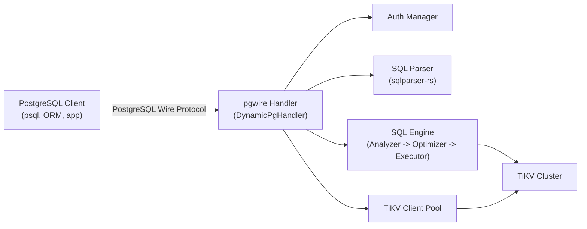
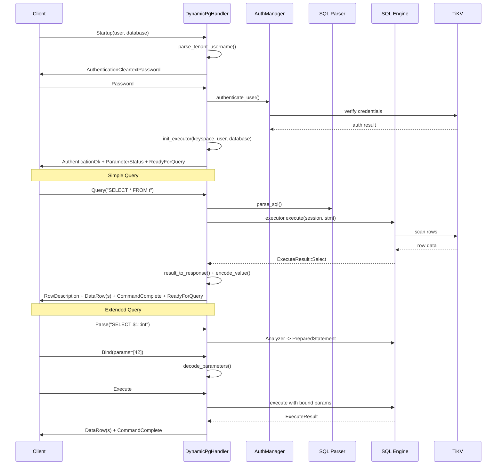

# Protocol Layer

| Metadata | |
|---|---|
| **Source path** | `src/protocol/` |
| **Lines (approx.)** | ~12,000 across 28 files |
| **Depends on** | `pgwire` crate, `src/sql/` (Executor, Session, Analyzer), `src/model/` (DataType, Value), `src/auth/`, `src/pool.rs`, `src/storage/` |
| **Dependents** | PostgreSQL clients (psql, pgcli, ORMs, applications, agents) |

---

## Overview

The Protocol Layer implements the PostgreSQL wire protocol (pgwire v3) for db9-server. It is the sole entry point for all client communication -- every SQL statement, authentication handshake, COPY operation, and prepared statement lifecycle flows through this layer.

The implementation is built on top of the `pgwire` Rust crate and supports three protocol modes:

- **Simple Query Protocol** -- single `Query` message containing one or more SQL statements, executed immediately.
- **Extended Query Protocol** -- the Parse/Bind/Describe/Execute message flow used by ORMs (Prisma, TypeORM, Sequelize) and connection poolers (PgBouncer).
- **COPY Protocol** -- bulk data import (`COPY FROM STDIN`) and export (`COPY TO STDOUT`) in Text, CSV, and Parquet formats.

Each client connection gets a dedicated `DynamicPgHandler` instance with its own Executor, Session, and TiKV store handle. Multi-tenancy is supported through username-based keyspace routing (`tenant.user` or `tenant:user`).

---

## Architecture Position



The Protocol Layer sits between the PostgreSQL client and the SQL Engine. It:
1. Accepts TCP connections and handles TLS negotiation.
2. Authenticates users and resolves tenant keyspaces.
3. Translates pgwire protocol messages into SQL Engine calls.
4. Encodes SQL Engine results back into pgwire wire format.

This aligns with the architecture described in `docs/ARCHITECTURE.md` Section 2 (System Overview), where the Protocol Layer is the outermost server layer above the SQL Layer.

---

## Key Concepts

### DynamicPgHandler

The per-connection handler that implements all four pgwire handler traits:
- `StartupHandler` -- authentication and executor initialization (`dynamic/startup.rs`)
- `SimpleQueryHandler` -- simple query protocol (`dynamic/query.rs`)
- `ExtendedQueryHandler` -- extended query protocol (`dynamic/query.rs`)
- `CopyHandler` -- COPY protocol (`dynamic/copy/mod.rs`)

Each handler holds post-authentication state (`AuthenticatedState`) containing an `Arc<Executor>` and `Arc<Mutex<Session>>`, initialized once during authentication and immutable thereafter.

### DynamicHandlerFactory

The factory that `pgwire` uses to create handler instances. Implements `PgWireServerHandlers` and returns the same `Arc<DynamicPgHandler>` for all handler types (startup, simple query, extended query, copy).

### Simple Query vs Extended Query Protocol

**Simple Query:** A single `Query` message triggers `do_query()` which parses, executes, and returns results in one round-trip. Multiple semicolon-separated statements in a single query string are supported.

**Extended Query (Parse/Bind/Describe/Execute):**
1. **Parse** (`on_parse`) -- SQL text is parsed. For data statements (SELECT/INSERT/UPDATE/DELETE), the Analyzer runs to produce typed IR with `output_schema`. For utility statements (DDL/SET/SHOW), the statement is stored as `RawSqlUtility`.
2. **Bind** (`on_bind`) -- Parameters from the client are decoded from wire bytes into `Value` objects using `decode_parameters()`.
3. **Describe** (`on_describe`) -- Returns column metadata. For analyzed statements, reads `output_schema` directly. For utility statements, uses `utility_describe_fields()`.
4. **Execute** (`on_execute`) -- Executes the bound portal with optional row limiting for cursor support.

### COPY Protocol

COPY operations use a streaming protocol:
- **COPY FROM STDIN**: Client sends `CopyData` messages, each containing one or more rows. `CopyContext` buffers partial lines and parses complete rows into `Value` objects for insertion. A `CopyDone` message finalizes the operation.
- **COPY TO STDOUT**: The server streams result rows back as `CopyData` messages using the configured format (Text, CSV, or Parquet).

Format parsing is handled by `CopyOptions` in `copy_format.rs`, which supports FORMAT, DELIMITER, NULL, HEADER, QUOTE, and ESCAPE options with PostgreSQL-compatible defaults.

### Portal and Prepared Statement Lifecycle

Portals represent bound prepared statements ready for execution. The `SuspendedPortalState` in `portal.rs` manages cursor-style partial result delivery:
- When `Execute(max_rows=N)` is specified, only N rows are sent, and remaining rows are buffered in `SuspendedPortalState`.
- Subsequent `Execute` calls drain from the buffer.
- Configurable limits: `DB9_MAX_SUSPENDED_PORTALS` (default 32), `DB9_MAX_SUSPENDED_PORTAL_BUFFER_ROWS` (default 10,000), `DB9_MAX_SUSPENDED_PORTAL_BUFFER_BYTES` (default 16 MB).

Prepared statements are represented by `PreparedStatement` (re-exported from `src/sql/executor/core/prepared_stmt.rs`), with two execution modes:
- `PreparedExec::RawSqlUtility` -- utility statements executed as raw SQL.
- Analyzed prepared statements with typed `output_schema` and `param_data_types`.

### Multi-Tenant Username Parsing

`tenant.rs` implements username format parsing for multi-tenancy:
- Format: `tenant_id.username` or `tenant_id:username`
- The tenant_id is mapped to a TiKV keyspace by prepending `db9_tenant_` (e.g., `abc123.admin` -> keyspace `db9_tenant_abc123`, user `admin`).
- If no separator is found, the entire string is treated as the username with no keyspace override.

---

## File Map

| File | Purpose |
|------|---------|
| `src/protocol/mod.rs` | Module root; re-exports `DynamicHandlerFactory`, `Db9QueryParser`, `PgServerParameterProvider`, `parse_tenant_username` |
| `src/protocol/copy_format.rs` | COPY format parsing (`CopyFormat`, `CopyOptions`, `encode_row_with_options`); Text/CSV/Parquet encoding |
| `src/protocol/handler/mod.rs` | Handler module root; `CONNECTION_ID_COUNTER`, `CopyContext` type alias, utility functions (`resolve_copy_columns`, `parse_startup_options`, `client_allows_message`) |
| `src/protocol/handler/dynamic/mod.rs` | `DynamicPgHandler` struct, `DynamicHandlerFactory`, `AuthenticatedState`; `PgWireServerHandlers` impl |
| `src/protocol/handler/dynamic/startup.rs` | `StartupHandler` impl; `init_executor()`, `authenticate_user()`, idle-in-transaction watchdog |
| `src/protocol/handler/dynamic/query.rs` | `SimpleQueryHandler` and `ExtendedQueryHandler` impls; `is_data_statement()`, `reject_unanalyzed_if_needed()`, `utility_describe_fields()`, `merge_parameter_types()` |
| `src/protocol/handler/dynamic/copy/mod.rs` | `CopyHandler` impl; `on_copy_data()`, `on_copy_done()`, `on_copy_fail()` |
| `src/protocol/handler/dynamic/copy/parse.rs` | COPY FROM STDIN command parsing |
| `src/protocol/handler/dynamic/copy/helpers.rs` | Shared error/parse helpers for COPY |
| `src/protocol/handler/dynamic/copy/response.rs` | COPY TO STDOUT response building |
| `src/protocol/handler/dynamic/copy/fs9.rs` | fs9 remote COPY support (feature-gated behind `parquet`) |
| `src/protocol/handler/encode/mod.rs` | Re-exports for encoding sub-modules |
| `src/protocol/handler/encode/types.rs` | `datatype_to_pgtype()` and `pgtype_to_datatype()` -- bidirectional mapping between internal `DataType` and pgwire `Type` (PostgreSQL OIDs) |
| `src/protocol/handler/encode/value.rs` | `encode_value()` -- encodes `Value` into pgwire `DataRowEncoder` in both text and binary formats |
| `src/protocol/handler/encode/result.rs` | `result_to_response()` -- converts `ExecuteResult` into pgwire `Response` (query results, command tags, transaction state) |
| `src/protocol/handler/params/mod.rs` | Re-exports for parameter sub-modules |
| `src/protocol/handler/params/scan.rs` | `count_sql_parameters()` -- counts `$N` placeholders in SQL text |
| `src/protocol/handler/params/decode.rs` | `decode_parameters()` -- decodes wire bytes from Bind messages into `Value` objects; supports text and binary formats for all types |
| `src/protocol/handler/copy/mod.rs` | `CopyContext` struct -- manages COPY FROM STDIN state (line buffering, column metadata, row counting) |
| `src/protocol/handler/portal.rs` | `SuspendedPortalState`, `on_query_with_tx_status_fix()`, `on_execute_with_tx_status_fix_with_guards()` -- portal state management, suspended query handling, transaction status tracking |
| `src/protocol/handler/query_parser.rs` | `Db9QueryParser` -- implements pgwire `QueryParser` trait; parses SQL and handles comments/raw SQL fallback |
| `src/protocol/handler/server_params.rs` | `PgServerParameterProvider` -- provides `ParameterStatus` messages during startup (server_version, encoding, timezone, etc.) |
| `src/protocol/handler/tenant.rs` | `parse_tenant_username()` -- multi-tenancy username parsing |
| `src/protocol/handler/errors.rs` | SQLSTATE mapping (`sqlstate_for_executor_error`), error helpers (`in_failed_sql_transaction_pgwire_error`, `syntax_error_pgwire_error`, `user_error`, `error_info`) |
| `src/protocol/handler/prepared.rs` | Re-exports `PreparedExec` and `PreparedStatement` from SQL executor layer |
| `src/protocol/handler/tests.rs` | Comprehensive protocol test suite (~2,700 lines) |

---

## Public Interfaces

### DynamicPgHandler

```rust
// src/protocol/handler/dynamic/mod.rs

pub struct DynamicPgHandler {
    client_pool: Option<Arc<TikvClientPool>>,
    pd_endpoints: Vec<String>,
    default_keyspace: Option<String>,
    auth_state: OnceCell<AuthenticatedState>,
    connection_guard: OnceCell<observability::ConnectionGuard>,
    tenant_handle: OnceCell<TenantHandle>,
    copy_context: Mutex<Option<CopyContext>>,
    suspended_portals: Mutex<HashMap<String, SuspendedPortalState>>,
    query_parser: Arc<Db9QueryParser>,
    connection_id: i64,
    server_config: SharedServerConfig,
    cancel_token: CancellationToken,
}

impl DynamicPgHandler {
    pub fn new_with_pool(
        client_pool: Arc<TikvClientPool>,
        default_keyspace: Option<String>,
        server_config: SharedServerConfig,
        cancel_token: CancellationToken,
    ) -> Self;
}
```

### DynamicHandlerFactory

```rust
// src/protocol/handler/dynamic/mod.rs

pub struct DynamicHandlerFactory {
    handler: Arc<DynamicPgHandler>,
    cancel_token: CancellationToken,
}

impl PgWireServerHandlers for DynamicHandlerFactory {
    type StartupHandler = DynamicPgHandler;
    type SimpleQueryHandler = DynamicPgHandler;
    type ExtendedQueryHandler = DynamicPgHandler;
    type CopyHandler = DynamicPgHandler;
    type ErrorHandler = NoopErrorHandler;

    fn simple_query_handler(&self) -> Arc<Self::SimpleQueryHandler>;
    fn extended_query_handler(&self) -> Arc<Self::ExtendedQueryHandler>;
    fn startup_handler(&self) -> Arc<Self::StartupHandler>;
    fn copy_handler(&self) -> Arc<Self::CopyHandler>;
    fn error_handler(&self) -> Arc<Self::ErrorHandler>;
}
```

### Type Mapping

```rust
// src/protocol/handler/encode/types.rs

/// Internal DataType -> PostgreSQL wire Type (OID)
pub fn datatype_to_pgtype(dt: Option<&DataType>) -> Type;

/// PostgreSQL wire Type -> Internal DataType
/// Returns None for Type::UNKNOWN (OID 0)
pub fn pgtype_to_datatype(pg: &Type) -> Option<DataType>;
```

### COPY Format

```rust
// src/protocol/copy_format.rs

pub enum CopyFormat { Text, Csv, Parquet }

pub struct CopyOptions {
    pub format: CopyFormat,
    pub delimiter: u8,
    pub null_string: String,
    pub header: bool,
    pub quote: u8,
    pub escape: u8,
}

impl CopyOptions {
    pub fn from_copy_options(options: &[sqlparser::ast::CopyOption]) -> Result<Self, String>;
}

pub fn encode_row_with_options(
    values: &[Value],
    buf: &mut Vec<u8>,
    opts: &CopyOptions,
) -> anyhow::Result<()>;
```

### Parameter Handling

```rust
// src/protocol/handler/params/decode.rs
pub fn decode_parameters(portal: &Portal<PreparedStatement>) -> PgWireResult<Vec<Option<Value>>>;

// src/protocol/handler/params/scan.rs
pub fn count_sql_parameters(sql: &str) -> usize;
```

### Server Parameters

```rust
// src/protocol/handler/server_params.rs

pub struct PgServerParameterProvider;

impl ServerParameterProvider for PgServerParameterProvider {
    fn server_parameters<C: ClientInfo>(&self, client: &C) -> Option<HashMap<String, String>>;
}
```

### Multi-Tenancy

```rust
// src/protocol/handler/tenant.rs

/// Parse "tenant_id.user" or "tenant_id:user" into (keyspace, actual_user).
/// Keyspace is prefixed with "db9_tenant_".
pub fn parse_tenant_username(username: &str) -> (Option<String>, String);
```

---

## Internal Design

### Connection Lifecycle

1. **TCP Accept** -- The `pgwire` server accepts a connection and creates a `DynamicPgHandler` via `DynamicHandlerFactory`. Each connection gets a unique monotonically increasing `connection_id` from `CONNECTION_ID_COUNTER`.

2. **Startup/Auth** -- The `on_startup` handler receives the `Startup` message:
   - Extracts username from metadata; parses tenant/user via `parse_tenant_username()`.
   - Enforces TLS requirements based on `PG_REQUIRE_TLS`, `DB9_DEV`, `DB9_INSECURE` env vars.
   - Sends `CleartextPassword` authentication request.
   - On password receipt, calls `authenticate_user()` which uses `AuthManager` against TiKV-persisted credentials.
   - On success, calls `init_executor()` to set up `Executor`, `Session`, and `AuthenticatedState`.
   - Sends `ParameterStatus` messages via `PgServerParameterProvider` and `ReadyForQuery`.
   - Spawns an idle-in-transaction watchdog task.

3. **Query Processing** -- All query methods require `AuthenticatedState` (enforced by `auth()` which panics if called before authentication).

4. **Connection Teardown** -- On `Drop`, the handler cancels the watchdog token and releases all advisory locks for the connection.

### Query Processing Flow

**Simple Query:**
```
on_query() -> parse SQL -> executor.execute() -> result_to_response() -> pgwire Response
```

**Extended Query:**
```
on_parse()    -> parse SQL -> (data stmt?) -> Analyzer -> PreparedStatement with output_schema
on_bind()     -> decode_parameters() -> create Portal
on_describe() -> read output_schema -> DescribeStatementResponse / DescribePortalResponse
on_execute()  -> executor.execute() -> result_to_response() -> stream rows (with optional max_rows)
```

### Value Encoding and Type Mapping

The `encode/` sub-module handles the bidirectional mapping between internal types and PostgreSQL wire format:

- **`types.rs`**: Maps every `DataType` variant to a PostgreSQL `Type` OID. Notable mappings:
  - `Int32` -> `INT4` (OID 23), `Int64` -> `INT8` (OID 20)
  - `Vector(_)` -> `TEXT` (OID 25) -- pgvector currently maps to TEXT
  - `UserDefined("int2vector")` -> `INT2_VECTOR`
  - All array types map to their PostgreSQL array counterparts

- **`value.rs`**: Encodes `Value` into `DataRowEncoder` with both text and binary format support. Handles special cases like:
  - Timestamps: dual-epoch detection (Unix ms vs PostgreSQL epoch microseconds)
  - JSONB: canonical key ordering via `format_jsonb_pg_str()`
  - Arrays: text representation for binary mode (avoiding complex binary array encoding)
  - Record/composite types: PostgreSQL tuple format `(field1,field2,...)`

- **`result.rs`**: Converts `ExecuteResult` variants to pgwire `Response`. Maps command tags (e.g., `INSERT 0 N`, `DELETE N`, `CREATE TABLE`). Supports binary result format with per-type fallback to text for unsupported types.

### SQLSTATE Error Mapping

`errors.rs` maps internal errors to PostgreSQL SQLSTATE codes:
- `SqlError` with embedded SQLSTATE -> direct passthrough
- TiKV lock conflicts -> `55P03` (lock_not_available)
- Default -> `XX000` (internal_error)

Additional error constructors:
- `in_failed_sql_transaction_pgwire_error()` -> `25P02`
- `syntax_error_pgwire_error()` -> `42601`
- `ambiguous_column_error_with_position()` -> extracts error position for client cursor display

---

## Data Flow Diagram



---

## Contracts

### Wire Protocol Guarantees

1. **PostgreSQL v3 protocol compliance** -- All message formats, authentication flows, and error responses align with PostgreSQL wire protocol v3.

2. **SQLSTATE codes** -- Every error sent to the client includes a valid 5-character SQLSTATE code. The mapping is centralized in `errors.rs`.

3. **Transaction status tracking** -- The `ReadyForQuery` message always carries the correct transaction status byte (`I` = idle, `T` = in transaction, `E` = failed transaction). Portal operations correctly transition states (e.g., `ROLLBACK TO SAVEPOINT` transitions from `E` to `T`).

4. **ParameterStatus consistency** -- Server parameters sent during startup (`server_version`, `client_encoding`, `TimeZone`, etc.) are derived from `SessionSettings` and remain consistent with `SHOW` / `current_setting()` readbacks.

### Prepared Statement Semantics

1. **Analyzer-backed Describe** -- Data statements (SELECT/INSERT/UPDATE/DELETE) are analyzed during `on_parse`, producing typed IR. Describe reads `output_schema` directly from the analysis result, ensuring OIDs match the actual execution output.

2. **Utility passthrough** -- Non-data statements (DDL, SET, SHOW) use `PreparedExec::RawSqlUtility` with empty `output_schema`. `utility_describe_fields()` provides static column metadata for known utility statements.

3. **Parameter type propagation** -- Parameter types from the client's Parse message are merged with Analyzer-inferred types via `merge_parameter_types()`. Wire OIDs are preserved in `StoredStatement.parameter_types` for correct binary decode width during Bind.

### COPY Semantics

1. **Transactional** -- COPY FROM STDIN runs within a transaction. If auto-commit mode, the handler begins a transaction and commits on `CopyDone`. On error or `CopyFail`, the transaction is rolled back.
2. **Row-level error reporting** -- COPY errors include the `CONTEXT: COPY tablename, line N` suffix matching PostgreSQL behavior.
3. **End marker** -- The `\.` (backslash-dot) text-mode end marker is recognized and terminates further row processing.

---

## Error Handling

Errors are handled at multiple levels:

1. **Protocol-level errors** (`PgWireError`) -- Returned directly to the pgwire framework, which formats them as `ErrorResponse` messages.

2. **SQLSTATE mapping** (`errors.rs`) -- The `sqlstate_for_executor_error()` function inspects `anyhow::Error` chains:
   - Extracts SQLSTATE from `SqlError` if present.
   - Detects TiKV lock conflicts (pessimistic lock errors, key conflicts, deadlocks) and maps to `55P03`.
   - Falls back to `XX000` for unclassified errors.

3. **Error constructors** -- Convenience functions ensure consistent error formatting:
   - `user_error(sqlstate, message)` -> `PgWireError::UserError`
   - `error_info(sqlstate, message)` -> `ErrorInfo`
   - `in_failed_sql_transaction_pgwire_error()` -> `25P02` with standard message

4. **Idle-in-transaction timeout** -- A per-connection watchdog task (`idle_in_transaction_watchdog`) monitors session idle time. On timeout, the session is rolled back and the connection cancelled with FATAL `25P03`.

5. **Connection limits** -- `authenticate_user()` returns `connection_limit` (PostgreSQL `rolconnlimit`), enforced during `init_executor()` via `try_bind_user()`.

---

## Testing

Protocol tests are located in `src/protocol/handler/tests.rs` (~2,700 lines). The test suite covers:

- Simple and extended query protocol flows
- Parameter encoding/decoding (text and binary formats for all types)
- COPY format encoding (Text, CSV, Parquet rejection)
- Type mapping (DataType <-> pgwire Type round-trips)
- Portal suspension and cursor behavior
- Multi-tenancy username parsing
- Server parameter provider
- Error SQLSTATE mapping
- Startup option parsing

Additional unit tests exist in individual modules:
- `tenant.rs` -- dot/colon separator parsing
- `copy_format.rs` -- format validation, CSV quoting, delimiter escaping
- `server_params.rs` -- parameter key completeness
- `encode/types.rs` -- OID vector type mapping
- `params/decode.rs` -- binary array decoding, NUMERIC decoding
- `dynamic/startup.rs` -- auth result construction, watchdog behavior

---

## Common Task Index

| Task | Where to look |
|------|---------------|
| Add a new PostgreSQL type mapping | `src/protocol/handler/encode/types.rs` -- add to both `datatype_to_pgtype()` and `pgtype_to_datatype()` |
| Support binary encoding for a new type | `src/protocol/handler/encode/value.rs` -- add case to `encode_value_binary()`, update `supports_binary_result_type()` in `result.rs` |
| Support binary decoding for a new parameter type | `src/protocol/handler/params/decode.rs` -- add case to `decode_binary()` and/or `decode_text()` |
| Fix wrong OIDs in query results | Check Analyzer `output_schema` in `src/sql/analyzer/`, then `column_types` in executor result |
| Add a new COPY format option | `src/protocol/copy_format.rs` -- extend `CopyOptions::from_copy_options()` |
| Change COPY row encoding | `src/protocol/copy_format.rs` -- modify `encode_row_with_options()` or `encode_value()` |
| Fix Describe for a utility statement | `src/protocol/handler/dynamic/query.rs` -- update `utility_describe_fields()` |
| Fix multi-tenancy username parsing | `src/protocol/handler/tenant.rs` -- modify `parse_tenant_username()` |
| Add a new server parameter to startup | `src/protocol/handler/server_params.rs` -- add to `PgServerParameterProvider::server_parameters()` |
| Fix SQLSTATE for a specific error | `src/protocol/handler/errors.rs` -- modify `sqlstate_for_executor_error()` or add a new helper |
| Fix portal suspension / cursor issues | `src/protocol/handler/portal.rs` -- check `SuspendedPortalState` and `on_execute_with_tx_status_fix_with_guards()` |
| Debug connection lifecycle issues | `src/protocol/handler/dynamic/startup.rs` -- trace `on_startup()` and `init_executor()` |

---

## See Also

- [Architecture Overview](./Architecture-Overview.md) -- System-wide architecture and execution pipeline
- [docs/ARCHITECTURE.md](../ARCHITECTURE.md) -- Canonical architecture document (source of truth)
- [docs/architecture/protocol.md](../architecture/protocol.md) -- Protocol deep-dive
- [docs/sot/protocol-pgwire.md](../sot/protocol-pgwire.md) -- Protocol contracts (normative)
- [docs/prepared-statement-contract.md](../prepared-statement-contract.md) -- Prepared statement semantics
- [src/protocol/AGENTS.md](../../src/protocol/AGENTS.md) -- Protocol navigation guide
