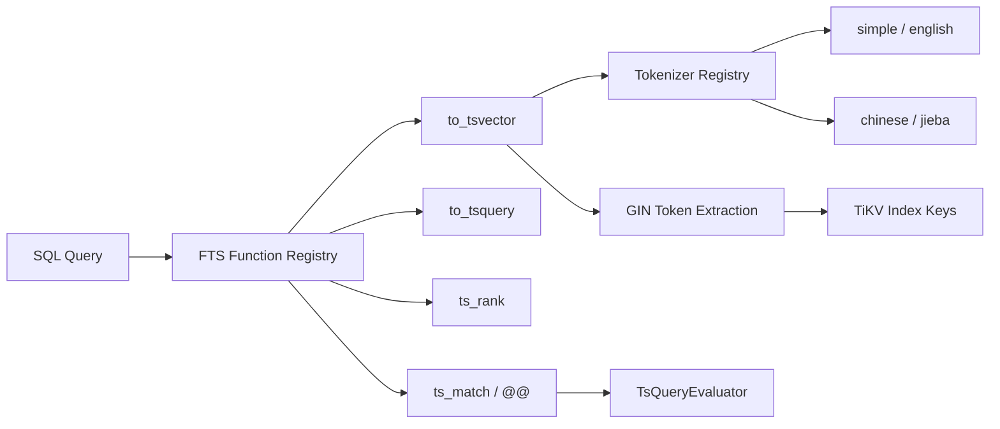
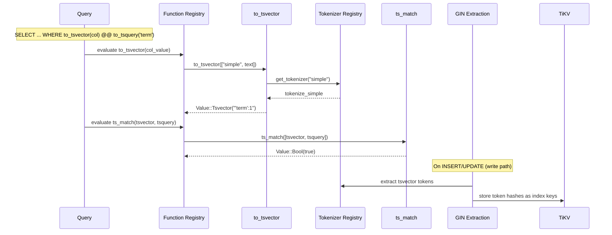

# Full-Text Search

> **Module path:** `src/sql/fts.rs`, `src/sql/fts_tokenizers.rs`, `src/sql/gin.rs`, `src/sql/expr/functions/fts.rs`
> **Stability:** Stable for tsvector/tsquery operations. GIN index scan operator is not yet implemented (planner produces GIN plans visible in EXPLAIN, but runtime falls back to table scan with recheck).

---

## 1. Overview

The Full-Text Search (FTS) subsystem implements PostgreSQL-compatible text search with tsvector/tsquery data types, ranking functions, and GIN inverted index support for accelerated queries. It provides:

- **Core functions**: `to_tsvector()`, `plainto_tsquery()`, `to_tsquery()` with full boolean expression parsing (AND `&`, OR `|`, NOT `!`, parentheses).
- **Ranking**: `ts_rank()` and `ts_rank_cd()` for relevance scoring.
- **Matching**: `ts_match()` implementing the `@@` operator for tsvector-tsquery matching.
- **Pluggable tokenizers**: Registry-based system supporting `simple`/`english` (alphanumeric split) and `chinese`/`jieba` (jieba-rs word segmentation).
- **GIN index integration**: Token extraction for JSONB, ARRAY, and TSVECTOR types with FNV-1a hashing for compact index keys.
- **Vector concatenation**: `concat_tsvector()` with position renumbering.

---

## 2. Architecture Position



FTS functions are registered in the expression function registry (`src/sql/expr/functions/fts.rs`) and invoked during expression evaluation. The tokenizer registry provides pluggable language support. GIN token extraction runs on the write path (INSERT/UPDATE) to maintain inverted index entries in TiKV.

---

## 3. Key Concepts

| Concept | Description |
|---------|-------------|
| **tsvector** | Sorted, deduplicated list of lexemes with positional information. Stored as `Value::Tsvector(String)`. Format: `'word':pos1,pos2`. |
| **tsquery** | Boolean expression over lexemes. Supports `&` (AND), `\|` (OR), `!` (NOT), parentheses. |
| **TokenizerFn** | `fn(&str) -> Vec<String>` -- pluggable tokenizer function type. |
| **Tokenizer registry** | `OnceLock<HashMap<String, TokenizerFn>>` -- global registry initialized on first access. |
| **GinTokens** | Extracted token hashes split into `key_values` (more selective) and `key_exists` (less selective). |
| **GinColumnType** | Enum: `Jsonb`, `Array`, `Tsvector` -- determines extraction strategy. |
| **FNV-1a hashing** | Used for compact, collision-tolerant token hashing in GIN index keys. |
| **TsQueryEvaluator** | Recursive descent parser/evaluator for tsquery boolean expressions. |

---

## 4. File Map

| File | Purpose |
|------|---------|
| `src/sql/fts.rs` | Core FTS functions: `to_tsvector`, `plainto_tsquery`, `to_tsquery`, `ts_rank`, `ts_match`, `concat_tsvector`, `validate_tsquery_syntax`. |
| `src/sql/fts_tokenizers.rs` | Pluggable tokenizer registry: `TokenizerFn` type, `get_tokenizer`, `default_text_search_config`, `tokenize_simple`, `tokenize_jieba`. |
| `src/sql/gin.rs` | GIN inverted index token extraction: `GinTokens`, `GinColumnType`, `GinIndexSource`, `extract_gin_tokens`, `extract_tsvector_gin_tokens`, `extract_array_gin_tokens`. |
| `src/sql/expr/functions/fts.rs` | SQL function registration: maps TO_TSVECTOR, PLAINTO_TSQUERY, TO_TSQUERY, TS_RANK, TS_RANK_CD, SETWEIGHT to implementations. |

---

## 5. Public Interfaces

### Core FTS Functions (fts.rs)

```rust
pub fn to_tsvector(args: Vec<Value>) -> Result<Value>;
pub fn plainto_tsquery(args: Vec<Value>) -> Result<Value>;
pub fn to_tsquery(args: Vec<Value>) -> Result<Value>;
pub fn ts_rank(args: Vec<Value>) -> Result<Value>;
pub fn ts_match(args: Vec<Value>) -> Result<Value>;
pub fn concat_tsvector(args: Vec<Value>) -> Result<Value>;
pub fn validate_tsquery_syntax(query: &str) -> Result<()>;
```

### Tokenizer Registry (fts_tokenizers.rs)

```rust
pub type TokenizerFn = fn(&str) -> Vec<String>;

pub fn get_tokenizer(config: &str) -> Option<TokenizerFn>;
pub fn default_text_search_config() -> &'static str;
```

### GIN Token Extraction (gin.rs)

```rust
pub(crate) struct GinTokens {
    pub(crate) key_values: Vec<u64>,
    pub(crate) key_exists: Vec<u64>,
}

pub(crate) enum GinColumnType { Jsonb, Array, Tsvector }
pub(crate) enum GinIndexSource { Column(usize), Expression }

pub(crate) fn extract_gin_tokens(json: &JsonValue) -> GinTokens;
pub(crate) fn extract_tsvector_gin_tokens(tsvector_str: &str) -> Vec<u64>;
pub(crate) fn extract_array_gin_tokens(array: &[Value]) -> Vec<u64>;
pub(crate) fn supported_gin_index_column(
    idx: &IndexDef,
    schema: &TableSchema,
) -> Option<(GinColumnType, GinIndexSource)>;
pub(crate) fn extract_gin_token_hashes_from_row(
    row: &Row,
    schema: &TableSchema,
    idx: &IndexDef,
    col_type: GinColumnType,
    source: &GinIndexSource,
) -> Result<Vec<u64>>;
```

---

## 6. Internal Design

### tsvector Generation

`to_tsvector(config, text)`:
1. Resolves the tokenizer from the registry by config name.
2. Tokenizes the input text.
3. For English-like configs: removes simple stopwords (`a`, `an`, `is`, `the`), tracks original positions (PostgreSQL-style position numbering where stopword positions are consumed but not output).
4. For other configs (e.g., Chinese): retains all tokens with positions, appends weight marker `A`.
5. Returns `Value::Tsvector(formatted_string)` with format `'lexeme':pos1,pos2 ...`.

### tsquery Parsing

`to_tsquery(config, query_text)`:
1. Tokenizes each term using the config's tokenizer.
2. Parses boolean operators: `&` (AND), `|` (OR), `!` (NOT), parentheses.
3. Normalizes terms through the tokenizer (lowercasing, stemming if applicable).
4. Returns `Value::Tsquery(formatted_string)`.

### ts_match Evaluation

`ts_match(tsvector, tsquery)`:
1. Parses the tsvector into a `HashSet<String>` of lexemes.
2. Uses `TsQueryEvaluator` -- a recursive descent evaluator -- to evaluate the tsquery against the lexeme set.
3. Handles AND (both operands must match), OR (either operand), NOT (negation), and parenthesized subexpressions.
4. Returns `Value::Bool(result)`.

### GIN Token Extraction

For write-path index maintenance, `extract_gin_token_hashes_from_row` dispatches by column type:
- **JSONB**: Recursively walks the JSON tree, producing key-exists tokens (path hashes) and key-value tokens (path + value hashes) using FNV-1a. Max depth: 32.
- **ARRAY**: Hashes each array element value.
- **TSVECTOR**: Extracts lexemes from the tsvector string and hashes each.

Token hashes are stored as `u64` values in TiKV index keys. False positives are acceptable (recheck via `jsonb::contains()` or `ts_match()`); false negatives are never allowed.

### Chinese Tokenization

The `tokenize_jieba` function uses `jieba-rs` for Chinese word segmentation. The `Jieba` instance is lazily initialized via `OnceLock` and cached for the process lifetime. Mixed Chinese-English text is supported: English portions are lowercased, Chinese portions are segmented.

---

## 7. Data Flow



---

## 8. Contracts

| Contract | Detail |
|----------|--------|
| **NULL propagation** | `to_tsvector(NULL)` returns `NULL`. All FTS functions propagate NULL inputs. |
| **Tokenizer immutability** | The global tokenizer registry is initialized once (`OnceLock`). Tokenizers cannot be added at runtime. |
| **Position semantics** | English-like configs preserve original word positions (stopword positions are consumed but not output), matching PostgreSQL behavior. |
| **GIN: no false negatives** | Token extraction must produce a superset of match-relevant hashes. False positives are acceptable with recheck. |
| **Default config** | Defaults to `"simple"` unless overridden by `DB9_DEFAULT_TEXT_SEARCH_CONFIG` environment variable. |
| **GIN scan fallback** | The optimizer can produce GIN scan plans (visible in EXPLAIN), but the runtime operator falls back to table scan with recheck. |

---

## 9. Error Handling

| Error | Condition |
|-------|-----------|
| `unknown text search configuration` | `get_tokenizer` returns `None` for unrecognized config name. |
| `invalid tsquery syntax` | Malformed boolean expression in `to_tsquery` (unbalanced parentheses, adjacent operators). |
| Argument count mismatch | Wrong number of arguments to `to_tsvector` (expects 1 or 2), `ts_rank` (expects 2-4), etc. |
| Type mismatch | Non-text argument where text is expected (e.g., integer passed as config name). |

---

## 10. Testing

- **Unit tests** in `src/sql/fts_tokenizers.rs`: English tokenizer, Chinese tokenizer (jieba), mixed text, registry lookup, default config.
- **Unit tests** in `src/sql/gin.rs`: JSONB token extraction, array token extraction, tsvector token extraction, depth limits.
- **SQL integration tests** in `tests/`: `to_tsvector`, `plainto_tsquery`, `to_tsquery`, `ts_rank`, `@@` operator, GIN index creation, Chinese FTS queries.

---

## 11. Common Task Index

| Task | Where to look |
|------|---------------|
| Add a new tokenizer | `init_tokenizers()` in `fts_tokenizers.rs` -- add entry to the HashMap. |
| Add a new FTS function | `register()` in `src/sql/expr/functions/fts.rs` + implementation in `fts.rs`. |
| Fix tsvector format | `to_tsvector` in `fts.rs` -- adjust position numbering or lexeme formatting. |
| Fix tsquery evaluation | `TsQueryEvaluator` in `fts.rs` -- recursive descent evaluator. |
| Add GIN support for new type | `GinColumnType` enum in `gin.rs` + extraction function + `supported_gin_index_column` update. |
| Change default text search config | `default_text_search_config()` in `fts_tokenizers.rs` or set `DB9_DEFAULT_TEXT_SEARCH_CONFIG` env var. |
| Implement GIN scan operator | `src/sql/optimizer/build/scan.rs` -- currently falls back to table scan. |

---

## 12. See Also

- [Triggers](Triggers.md) -- Trigger body validation rejects unsupported FTS functions
- [docs/ARCHITECTURE.md](../../../ARCHITECTURE.md) -- Overall architecture
- `src/sql/optimizer/build/scan.rs` -- GIN scan plan generation (planner side)
- `src/sql/planner/index_selection.rs` -- Index selection including GIN indexes
- `src/storage/tikv_store/indexes.rs` -- TiKV-level index storage
