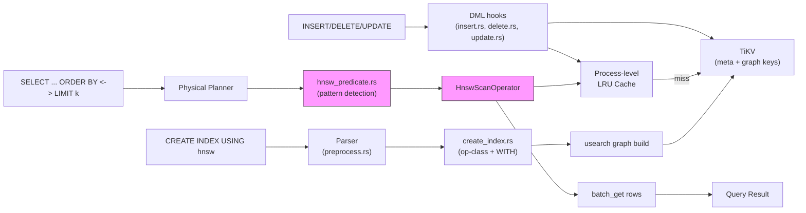
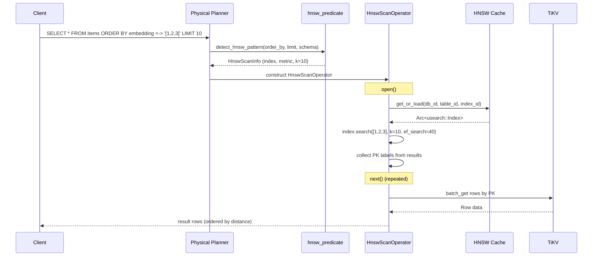
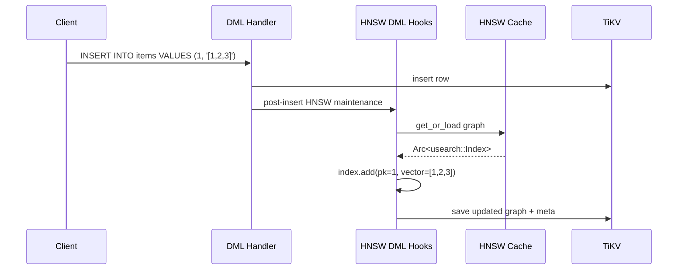

# HNSW Vector Index

> **Module path:** `src/sql/hnsw/`, `src/sql/operators/hnsw_scan.rs`, `src/sql/planner/hnsw_predicate.rs`
> **Stability:** Stable for HNSW index DDL, k-NN queries, DML maintenance, and optional S3 graph offload. Without S3 offload, TiKV-only storage keeps the 8 MB frozen guard; with S3 offload enabled, graph blobs are stored in object storage instead of TiKV.

---

## 1. Overview

The HNSW (Hierarchical Navigable Small World) vector index subsystem implements approximate nearest neighbor (ANN) search with pgvector-compatible syntax. It provides:

- **Index DDL**: `CREATE INDEX ... USING hnsw (col operator_class)` with optional `WITH (m=..., ef_construction=...)` parameters.
- **Operator classes**: `vector_l2_ops` (L2/Euclidean `<->`), `vector_cosine_ops` (cosine `<=>`), `vector_ip_ops` (inner product `<#>`).
- **k-NN query**: Automatic HNSW scan selection for `ORDER BY <distance_op> LIMIT k` patterns.
- **Runtime tuning**: `hnsw.ef_search` GUC (default 40, range 1-1000) controls recall/latency tradeoff.
- **Storage offload**: Optional HNSW S3 offload removes the TiKV single-value size limit for serialized graph blobs.
- **DML maintenance**: INSERT adds vectors to the graph in real-time; DELETE uses lazy invalidation with query-time filtering.
- **EXPLAIN**: Displays `HNSW Scan using <index_name> on <table>` with distance metric and k.

---

## 2. Architecture Position



The HNSW subsystem spans several layers:
- **Parser** (`preprocess.rs`): Rewrites `CREATE INDEX ... USING hnsw` syntax for operator class and WITH clause extraction.
- **DDL** (`create_index.rs`): Validates operator classes, builds the initial usearch graph from existing rows, persists to TiKV.
- **Planner** (`hnsw_predicate.rs`): Detects the `ORDER BY <distance_op> LIMIT k` pattern during physical planning.
- **Physical Planner** (`physical_planner/mod.rs`): Selects HNSW scan as an access path when pattern matches.
- **Operator** (`hnsw_scan.rs`): Executes ANN search via the usearch library, batch-fetches matching rows from TiKV.
- **DML hooks** (`insert.rs`, `delete.rs`, `update.rs`): Maintain the HNSW graph on data changes.
- **Session** (`settings.rs`): `hnsw.ef_search` GUC for runtime tuning.

---

## 3. Key Concepts

| Concept | Description |
|---------|-------------|
| **HNSW** | Hierarchical Navigable Small World — a graph-based ANN algorithm with logarithmic query time and high recall. |
| **Operator class** | Maps a distance operator to an index: `vector_l2_ops` (`<->`), `vector_cosine_ops` (`<=>`), `vector_ip_ops` (`<#>`). |
| **usearch** | C++ HNSW library accessed via Rust FFI (`usearch` crate 0.21). Supports incremental insert and file-based serialization. |
| **HnswMeta** | Stored metadata per index: dimension, distance metric, `m` (max connections per node), `ef_construction` (build-time search width), vector count. |
| **Graph cache** | Process-level `LruCache<(db_id, table_id, index_id), Arc<Index>>` protected by `RwLock`. Avoids re-loading the graph from TiKV on every query. |
| **k-NN pattern** | The query pattern `ORDER BY embedding <-> '[...]' LIMIT k` that triggers HNSW scan selection. Detected by `hnsw_predicate.rs`. |
| **ef_search** | Runtime search width parameter. Higher values increase recall at the cost of latency. Default: 40, range: 1-1000. |
| **Temp-file bridge** | usearch only supports file-based save/load. Serialization goes through: usearch graph -> temp file -> bytes -> TiKV. |

---

## 4. File Map

| File | Purpose |
|------|---------|
| `src/sql/hnsw/mod.rs` | Module root: HNSW constants (default `m=16`, `ef_construction=64`), process-level LRU cache, `get_or_load_hnsw_index()`. |
| `src/sql/hnsw/storage.rs` | TiKV persistence: `HnswMeta` struct, `save_hnsw_graph()`, `load_hnsw_graph()`, temp-file serialization bridge. |
| `src/sql/operators/hnsw_scan.rs` | `HnswScanOperator` — `PhysicalOperator` implementation for ANN search. Executes usearch query, batch-fetches rows by PK. |
| `src/sql/planner/hnsw_predicate.rs` | `detect_hnsw_pattern()` — identifies `ORDER BY <distance_op> LIMIT k` in the physical plan and returns HNSW scan metadata. |
| `src/sql/ddl/create_index.rs` | HNSW DDL: operator class parsing, WITH clause parameter extraction (`m`, `ef_construction`), graph backfill from existing rows. |
| `src/sql/parser/preprocess.rs` | SQL rewriting for `CREATE INDEX ... USING hnsw` syntax compatibility. |
| `src/sql/session/settings.rs` | `hnsw.ef_search` GUC registration, validation (range 1-1000), default value. |
| `src/sql/optimizer/physical_planner/mod.rs` | HNSW scan cost-based selection during physical planning. |
| `src/sql/optimizer/build/scan.rs` | `HnswScanOperator` construction from `PhysicalPlan::HnswScan`. |
| `src/sql/dml/insert.rs` | Post-INSERT hook: adds new vectors to the HNSW graph. |
| `src/sql/dml/delete.rs` | Post-DELETE hook: invalidates cached graph entries. |
| `src/sql/dml/update.rs` | Post-UPDATE hook: removes old vector, inserts new vector. |
| `src/sql/explain/format.rs` | HNSW Scan node formatting in EXPLAIN output. |
| `src/sql/explain/transform.rs` | HNSW Scan plan node transformation for EXPLAIN tree. |
| `src/storage/encoding/serialization.rs` | `HnswMeta` serialization/deserialization. |
| `src/storage/tikv_store/tables.rs` | HNSW graph and meta key operations in TiKV. |
| `src/model/mod.rs` | `IndexDef` extended with `hnsw_m`, `hnsw_ef_construction`, `hnsw_distance_metric` fields. |

---

## 5. Public Interfaces

### HNSW Cache (hnsw/mod.rs)

```rust
/// Load an HNSW index from cache or TiKV. Returns the usearch Index wrapped in Arc.
pub(crate) async fn get_or_load_hnsw_index(
    store: &TikvStore,
    txn: &mut Transaction,
    db_id: u64,
    table_id: u64,
    index_id: u64,
    meta: &HnswMeta,
) -> Result<Arc<usearch::Index>>;

/// Evict an HNSW index from the process-level cache.
pub(crate) fn evict_hnsw_cache(db_id: u64, table_id: u64, index_id: u64);
```

### HNSW Storage (hnsw/storage.rs)

```rust
pub(crate) struct HnswMeta {
    pub dimension: usize,
    pub metric: HnswDistanceMetric,
    pub m: usize,
    pub ef_construction: usize,
    pub count: u64,
}

pub(crate) enum HnswDistanceMetric {
    L2,
    Cosine,
    InnerProduct,
}

pub(crate) async fn save_hnsw_graph(
    store: &TikvStore,
    txn: &mut Transaction,
    db_id: u64,
    table_id: u64,
    index_id: u64,
    index: &usearch::Index,
    meta: &HnswMeta,
) -> Result<()>;

pub(crate) async fn load_hnsw_graph(
    store: &TikvStore,
    txn: &mut Transaction,
    db_id: u64,
    table_id: u64,
    index_id: u64,
    meta: &HnswMeta,
) -> Result<usearch::Index>;
```

### HNSW Pattern Detection (planner/hnsw_predicate.rs)

```rust
/// Detects ORDER BY <distance_op> LIMIT k pattern in a physical plan.
/// Returns Some(HnswScanInfo) if an HNSW index is available for the pattern.
pub(crate) fn detect_hnsw_pattern(
    order_by: &[OrderByExpr],
    limit: Option<usize>,
    schema: &TableSchema,
    query_vector: &[f64],
) -> Option<HnswScanInfo>;
```

### HnswScanOperator (operators/hnsw_scan.rs)

```rust
pub struct HnswScanOperator {
    // Implements PhysicalOperator trait
    // Fields: schema, index metadata, query vector, k, distance metric
}

impl HnswScanOperator {
    pub fn new(
        schema: TableSchema,
        index_def: IndexDef,
        query_vector: Vec<f64>,
        k: usize,
        distance_metric: HnswDistanceMetric,
    ) -> Self;
}
```

---

## 6. Internal Design

### Index Creation Flow

1. **Parse**: Parser preprocessor rewrites `CREATE INDEX ... USING hnsw (col op_class) WITH (m=N, ef_construction=M)` into a normalized form.
2. **Validate**: DDL handler verifies the column is of `vector` type, the operator class is valid (`vector_l2_ops`, `vector_cosine_ops`, `vector_ip_ops`), and WITH parameters are in range.
3. **Build graph**: Creates a usearch `Index` with the specified metric and parameters. Iterates all existing rows, extracts the vector column, converts `f64 -> f32`, and inserts into the graph with the row's primary key as the label.
4. **Persist**: Serializes the graph to bytes via temp-file bridge. Stores `HnswMeta` and graph bytes in TiKV under dedicated keys.
5. **Schema update**: Appends the `IndexDef` (with `hnsw_m`, `hnsw_ef_construction`, `hnsw_distance_metric` fields) to the table schema and bumps the schema version.

### k-NN Query Flow

1. **Physical planning**: The physical planner detects `Sort(distance_op) -> Limit(k) -> SeqScan(table)` pattern via `detect_hnsw_pattern()`.
2. **Cost comparison**: HNSW scan cost is compared against table scan + sort cost. HNSW is selected when an applicable index exists.
3. **Operator construction**: `build/scan.rs` constructs `HnswScanOperator` with the query vector, k, and distance metric.
4. **Execution** (open):
   a. Load the HNSW graph via `get_or_load_hnsw_index()` (cache hit or TiKV load).
   b. Set `ef_search` from the session GUC.
   c. Execute usearch `search()` with the query vector and k.
   d. Collect the returned primary key labels.
5. **Execution** (next): Batch-fetch rows from TiKV by primary key, filter out deleted/stale rows, yield results.

### DML Maintenance

- **INSERT**: After inserting the row into TiKV, checks for HNSW indexes on the table. For each applicable index, loads the cached graph, inserts the new vector with the row's PK as label, and persists the updated graph.
- **DELETE**: Evicts the cached graph entry, forcing a reload on next query. Deleted vectors are filtered at query time (lazy invalidation).
- **UPDATE**: Combination of DELETE + INSERT behavior for the vector column.

### Optional HNSW S3 Offload

When `HNSW_S3_BUCKET` is set, db9 stores serialized HNSW graph blobs in S3
(or an S3-compatible service such as MinIO) instead of TiKV. This removes the
TiKV single-value size limit for graph blobs. SQL usage does **not** change:
`CREATE INDEX ... USING hnsw` and `SELECT ... ORDER BY <distance_op> LIMIT k`
stay the same.

#### Environment Variables

| Variable | Default | Purpose |
|----------|---------|---------|
| `HNSW_S3_BUCKET` | unset | Enables S3 offload and selects the bucket. Required to turn the feature on. |
| `HNSW_S3_REGION` | unset | S3 region. Falls back to `AWS_REGION` / `AWS_DEFAULT_REGION`. |
| `HNSW_S3_ENDPOINT` | unset | S3-compatible endpoint URL, for example MinIO. |
| `HNSW_S3_PREFIX` | `hnsw` | Key prefix for graph objects. |
| `HNSW_S3_FORCE_PATH_STYLE` | `false` | Enables path-style URLs; usually required for MinIO. |
| `HNSW_CACHE_MAX_ENTRIES` | `64` | Maximum number of cached graph files in the on-disk LRU cache. |
| `HNSW_CACHE_DIR` | system temp dir | Base directory for the on-disk graph cache. db9 creates/uses a `db9_hnsw_cache/` subdirectory under this path. |
| `DB9_WORKER_HNSW_SWEEP_INTERVAL_SEC` | `600` | Sweep / merge / S3 GC cadence. Lower values make migration and cleanup happen sooner; minimum `30`. |

#### Usage Examples

```bash
# AWS S3
export AWS_ACCESS_KEY_ID=...
export AWS_SECRET_ACCESS_KEY=...
export HNSW_S3_BUCKET=my-hnsw-graphs
export HNSW_S3_REGION=us-east-1
./target/release/db9-server
```

```bash
# MinIO / S3-compatible
export AWS_ACCESS_KEY_ID=minioadmin
export AWS_SECRET_ACCESS_KEY=minioadmin
export HNSW_S3_BUCKET=hnsw
export HNSW_S3_ENDPOINT=http://minio:9000
export HNSW_S3_FORCE_PATH_STYLE=true
./target/release/db9-server
```

#### Operational Notes

- When `HNSW_S3_BUCKET` is **unset**, behavior stays TiKV-only with the existing
  8 MB frozen guard.
- When S3 is enabled, db9 fails fast on startup if the S3 client cannot be
  initialized; it does not silently fall back to TiKV-only storage.
- If a keyspace already contains live S3-backed HNSW indexes, nodes serving that
  keyspace must also set `HNSW_S3_BUCKET`.
- Existing HNSW indexes migrate to S3 on a later merge/sweep cycle; recreation is
  not required.

### Cache Architecture

```
Process Memory
┌─────────────────────────────────┐
│  HNSW_CACHE: RwLock<LruCache>   │
│  Key: (db_id, table_id, idx_id) │
│  Value: Arc<usearch::Index>     │
│                                 │
│  Operations:                    │
│  - get_or_load: read lock first │
│  - insert: write lock           │
│  - evict: write lock            │
└─────────────────────────────────┘
         |  cache miss
         v
┌─────────────────────────────────┐
│  TiKV                           │
│  hnsw_meta_{db}_{tbl}_{idx}     │
│  hnsw_graph_{db}_{tbl}_{idx}    │
└─────────────────────────────────┘
```

---

## 7. Data Flow





---

## 8. Contracts

| Contract | Detail |
|----------|--------|
| **Operator class required** | `CREATE INDEX USING hnsw` must specify one of `vector_l2_ops`, `vector_cosine_ops`, `vector_ip_ops`. Missing or invalid operator class raises an error. |
| **Vector column type** | The indexed column must be of type `vector`. Non-vector columns are rejected at DDL time. |
| **f64 to f32 precision** | All distance computations are performed in f32 precision. This is acceptable for ANN but means exact distances may differ slightly from the f64 distance operators on raw data. |
| **k-NN pattern matching** | HNSW scan is only selected when the query has `ORDER BY <distance_op> LIMIT k` with a constant query vector. Complex expressions or missing LIMIT fall back to table scan. |
| **DML consistency** | INSERT immediately adds vectors to the live graph. DELETE uses lazy invalidation (query-time filtering). This means deleted vectors may appear in intermediate results but are filtered before returning to the client. |
| **Cache coherence** | The process-level cache is not distributed. In a multi-process deployment, each process maintains its own cache. Cache eviction on DELETE/DROP is process-local. |
| **WITH parameter ranges** | `m`: positive integer (default 16). `ef_construction`: positive integer (default 64). Invalid values raise DDL errors. |
| **ef_search GUC** | Range 1-1000, default 40. Out-of-range values are clamped with a notice. |

---

## 9. Error Handling

| Error | Condition |
|-------|-----------|
| `unsupported operator class` | Invalid operator class name in `CREATE INDEX USING hnsw`. |
| `HNSW indexes require a vector column` | Indexed column is not of type `vector`. |
| `invalid value for parameter` | `hnsw.ef_search` SET with value outside 1-1000. |
| `HNSW index build failed` | usearch graph construction failure (e.g., dimension mismatch, FFI error). |
| `HNSW graph not found` | Graph key missing in TiKV (corruption or concurrent DROP). |

---

## 10. Testing

- **SQL integration tests** (6 files in `tests/`):
  - `260_hnsw_basic.sql` — CREATE INDEX, k-NN search, EXPLAIN, DROP
  - `261_hnsw_distance_metrics.sql` — L2, cosine, inner product with separate indexes
  - `262_hnsw_dml.sql` — INSERT/DELETE after index creation, NULL vectors
  - `263_hnsw_params.sql` — WITH clause (m, ef_construction), ef_search GUC
  - `264_hnsw_edge_cases.sql` — Empty table, k > n, error conditions
  - `265_vector_txn_basic.sql` — Transaction RYOW integration
- **Unit tests**: `cargo test` — 2755 passed with zero regressions.

---

## 11. Common Task Index

| Task | Where to look |
|------|---------------|
| Change HNSW default parameters | `src/sql/hnsw/mod.rs` — constants `DEFAULT_M`, `DEFAULT_EF_CONSTRUCTION` |
| Change ef_search range/default | `src/sql/session/settings.rs` — `hnsw.ef_search` GUC entry and validation |
| Add a new distance metric | `src/sql/hnsw/storage.rs` (`HnswDistanceMetric`), `src/sql/ddl/create_index.rs` (op-class parsing), `src/sql/planner/hnsw_predicate.rs` (pattern detection) |
| Fix HNSW graph persistence | `src/sql/hnsw/storage.rs` — temp-file bridge, save/load functions |
| Fix HNSW cache behavior | `src/sql/hnsw/mod.rs` — LRU cache operations |
| Fix k-NN pattern detection | `src/sql/planner/hnsw_predicate.rs` — `detect_hnsw_pattern()` |
| Fix DML maintenance | `src/sql/dml/insert.rs`, `delete.rs`, `update.rs` — HNSW maintenance hooks |
| Implement IVFFlat (V2) | Follow the HNSW pattern: new module under `src/sql/`, new operator, new planner predicate |
| Scale beyond 1M vectors | Replace single-KV storage with per-node KV decomposition in `src/sql/hnsw/storage.rs` |

---

## 12. See Also

- [Configuration](../../../configuration.md) — deployment examples for `HNSW_S3_*`
- [Operations config SoT](../../../sot/ops-config.md) — authoritative defaults for `HNSW_S3_*`, cache, and worker sweep settings
- [Full-Text Search](Full-Text-Search.md) — GIN index, another specialized index type
- [Planner and Index Selection](../Planner-and-Index-Selection.md) — B-tree index selection (HNSW uses a separate detection path)
- [Operators](../Operators.md) — Physical operator framework (`HnswScanOperator` implements `PhysicalOperator`)
- [Session and GUC](../Session-and-GUC.md) — `hnsw.ef_search` GUC parameter
- [DDL](../DDL.md) — `CREATE INDEX` infrastructure
- [Design doc](../../../design/27_hnsw_vector_index.md) — Design decisions and architecture rationale
- [pgvector HNSW reference](https://github.com/pgvector/pgvector#hnsw) — Syntax compatibility target
