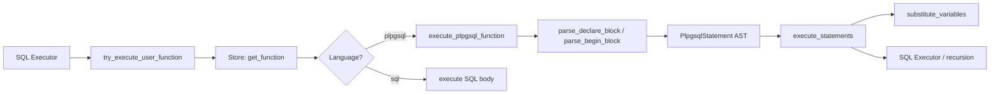
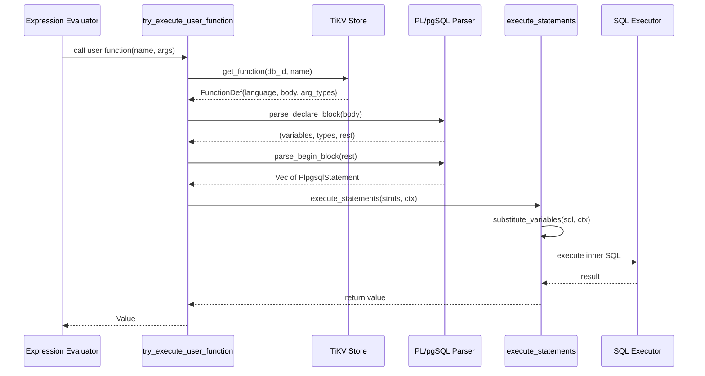

# PL/pgSQL

> **Module path:** `src/sql/plpgsql/`
> **Stability:** Stable -- covers stored functions, triggers, and default expressions.

---

## 1. Overview

The PL/pgSQL subsystem implements a PostgreSQL-compatible procedural language for user-defined functions and trigger bodies. It parses `DECLARE ... BEGIN ... END` blocks into a structured AST (`PlpgsqlStatement`), then executes them with variable substitution, control flow (IF/ELSIF/ELSE, FOR loops, EXIT), and embedded SQL dispatch.

The implementation supports:
- Named and positional parameters (`$1`, `$2`, ...)
- Variable declarations with optional defaults and type annotations
- Control flow: IF/ELSIF/ELSE, FOR (query and range variants), EXIT, RETURN
- RAISE NOTICE/EXCEPTION for diagnostics
- SELECT INTO for capturing query results into variables
- PERFORM for executing queries without capturing results
- Recursive function calls and SQL/PL/pgSQL language dispatch

---

## 2. Architecture Position



PL/pgSQL sits at the boundary between the expression evaluation layer and the SQL executor. Function calls detected during expression evaluation (sequence replacement, default evaluation) are dispatched to `try_execute_user_function`, which looks up the function definition in TiKV and routes to the appropriate language executor.

---

## 3. Key Concepts

| Concept | Description |
|---------|-------------|
| **PlpgsqlContext** | Execution context holding variable bindings (`HashMap<String, Value>`), types, and accumulated notices. |
| **PlpgsqlStatement** | AST node enum representing one parsed statement (Return, Assignment, If, ForQuery, etc.). |
| **Variable substitution** | Word-boundary-aware replacement of variable names in SQL strings, respecting string literals. |
| **Exit signal** | Task-local boolean flag used to implement `EXIT` from FOR loops without unwinding. |
| **Language dispatch** | `try_execute_user_function` handles both `plpgsql` and `sql` language functions transparently. |

---

## 4. File Map

| File | Purpose |
|------|---------|
| `src/sql/plpgsql/mod.rs` | Module root, re-exports `execute_plpgsql_function`, `try_execute_user_function`, `replace_identifier`, `validate_plpgsql_body`. |
| `src/sql/plpgsql/parser.rs` | PL/pgSQL body parser: `PlpgsqlStatement` enum, `parse_declare_block`, `parse_begin_block`, `parse_statements`. |
| `src/sql/plpgsql/executor.rs` | Execution engine: statement dispatch, expression evaluation, SQL execution within PL/pgSQL. |
| `src/sql/plpgsql/utils.rs` | Utilities: `parse_plpgsql_type`, `parse_literal_value`, `format_raise_message`, `substitute_variables`, `replace_identifier`, exit signal management. |

---

## 5. Public Interfaces

### PlpgsqlContext (mod.rs)

```rust
pub struct PlpgsqlContext {
    pub variables: HashMap<String, Value>,
    pub variable_types: HashMap<String, DataType>,
    pub notices: Vec<String>,
}
```

### PlpgsqlStatement (parser.rs)

```rust
enum PlpgsqlStatement {
    Return(String),                    // RETURN <expr>
    Assignment { var: String, expr: String },
    If {
        condition: String,
        then_body: Vec<PlpgsqlStatement>,
        elsif_clauses: Vec<(String, Vec<PlpgsqlStatement>)>,
        else_body: Option<Vec<PlpgsqlStatement>>,
    },
    RaiseNotice(String),
    RaiseException(String),
    Sql(String),
    Perform(String),                   // PERFORM <query>
    SelectInto {
        target_vars: Vec<String>,
        query: String,
    },
    ForQuery {
        var: String,
        query: String,
        body: Vec<PlpgsqlStatement>,
    },
    ForRange {
        var: String,
        reverse: bool,
        lower: String,
        upper: String,
        step: Option<String>,
        body: Vec<PlpgsqlStatement>,
    },
    Exit,
    Null,
}
```

### Executor Functions (executor.rs)

```rust
pub fn execute_plpgsql_function<'a>(
    store: &'a Arc<TikvStore>,
    txn: &'a mut Transaction,
    db_id: u64,
    sequence_values: &'a mut HashMap<String, i64>,
    search_path: &'a [String],
    func_def: &'a FunctionDef,
    args: Vec<Value>,
    executor: Option<&'a Executor>,
) -> Pin<Box<dyn Future<Output = Result<Value>> + Send + 'a>>;

pub async fn try_execute_user_function(
    store: &Arc<TikvStore>,
    txn: &mut Transaction,
    db_id: u64,
    sequence_values: &mut HashMap<String, i64>,
    search_path: &[String],
    func_name: &str,
    args: Vec<Value>,
    executor: Option<&Executor>,
) -> Result<Option<Value>>;
```

### Utilities (utils.rs)

```rust
pub fn replace_identifier(body: &str, old_name: &str, new_name: &str) -> String;
pub(super) fn substitute_variables(sql: &str, ctx: &PlpgsqlContext) -> String;
pub(super) fn parse_plpgsql_type(type_str: &str) -> DataType;
pub(super) fn format_raise_message(template: &str, args: &[Value]) -> String;
```

---

## 6. Internal Design

### Parsing Strategy

The parser operates on the raw function body string using line-by-line scanning with keyword detection. It handles:

1. **DECLARE block**: Extracts variable names, types, and optional default expressions. Supports `%TYPE` references and aliased parameter names.
2. **BEGIN..END block**: Recursively parses statements between BEGIN and END, handling nested blocks (IF..END IF, FOR..END LOOP).
3. **Statement classification**: Each line or multi-line construct is classified into a `PlpgsqlStatement` variant by matching leading keywords (RETURN, IF, FOR, RAISE, PERFORM, SELECT INTO, EXIT, NULL).

### Execution Model

`execute_statements` iterates over the parsed `PlpgsqlStatement` vector and dispatches each:

- **Assignment**: Evaluates the RHS expression (may involve SQL queries or function calls), stores the result in `PlpgsqlContext.variables`.
- **IF**: Evaluates condition as a SQL expression, branches to `then_body`, `elsif_clauses`, or `else_body`.
- **FOR (query)**: Executes the query, iterates rows, binds each to the loop variable, executes the body. Checks exit signal between iterations.
- **FOR (range)**: Generates integer range, supports REVERSE and STEP.
- **SQL/Perform**: Substitutes variables, then dispatches to the SQL executor.
- **Return**: Evaluates the expression and returns the value, terminating execution.

### Variable Substitution

`substitute_variables` performs word-boundary-aware replacement: for each variable in the context, it replaces occurrences in the SQL string only when the variable name appears at a word boundary and is not inside a string literal. This prevents false matches within column names or string constants.

---

## 7. Data Flow



---

## 8. Contracts

| Contract | Detail |
|----------|--------|
| **Parameter binding** | Named parameters bind by position from `func_def.arg_types`. Positional `$1..$N` are always available. |
| **RETURN terminates execution** | A RETURN statement immediately halts `execute_statements` and propagates the value. |
| **EXIT is loop-scoped** | EXIT sets a task-local flag consumed by the enclosing FOR loop. It does not affect outer loops. |
| **SQL execution uses caller's transaction** | All embedded SQL runs within the same `Transaction` as the calling context. |
| **NULL handling** | Missing arguments default to `Value::Null`. Variable lookup returns `Value::Null` for undeclared variables. |

---

## 9. Error Handling

| Error | Condition |
|-------|-----------|
| `RAISE EXCEPTION` | User-raised error with formatted message. Propagated as `anyhow::Error`. |
| `SqlError::Unsupported` | Unsupported PL/pgSQL construct (e.g., CURSOR, EXCEPTION block). |
| Parse failure | Malformed DECLARE/BEGIN block. Returns descriptive parse error. |
| Type mismatch | Expression evaluation produces incompatible type for assignment target. |
| Function not found | `try_execute_user_function` returns `Ok(None)` when no function with the given name exists. |

---

## 10. Testing

PL/pgSQL is tested through:

- **SQL integration tests** in `tests/` directory covering CREATE FUNCTION, SELECT with function calls, trigger functions.
- **Tokenizer unit tests** in `utils.rs` for `replace_identifier` and variable substitution.
- **End-to-end tests** validating: FOR loops with EXIT, SELECT INTO, RAISE NOTICE, nested IF/ELSIF, recursive function calls, parameter binding.

---

## 11. Common Task Index

| Task | Where to look |
|------|---------------|
| Add a new PL/pgSQL statement type | Add variant to `PlpgsqlStatement` in `parser.rs`, add parsing logic in `parse_single_statement()`, add execution logic in `execute_statements()` in `executor.rs`. |
| Fix variable substitution | `substitute_variables()` in `utils.rs` -- handles word boundaries and string literal escaping. |
| Support new expression in RETURN | `evaluate_expression()` in `executor.rs` -- dispatches to SQL evaluation. |
| Debug function dispatch | `try_execute_user_function()` in `executor.rs` -- check function lookup and language routing. |
| Add type support in DECLARE | `parse_plpgsql_type()` in `utils.rs`. |

---

## 12. See Also

- [Triggers](Triggers.md) -- Trigger functions use PL/pgSQL for their body
- [Sequences](Sequences.md) -- Sequence function replacement dispatches to user functions
- [docs/ARCHITECTURE.md](../../../ARCHITECTURE.md) -- Overall architecture
- `src/sql/expr/functions/` -- Built-in function registry
- `src/sql/executor/procedure/` -- Stored procedures and materialized views
