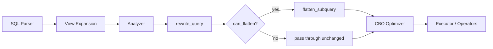
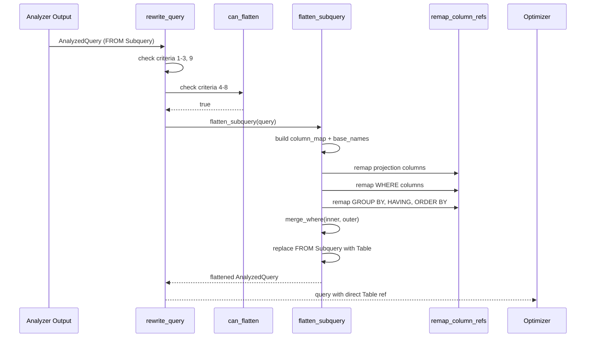

# Rewriter

> **Module path:** `src/sql/rewriter/`
> **Stability:** Stable -- conservative flattening with 9 safety criteria.

---

## 1. Overview

The Rewriter is a post-analysis, pre-optimizer pass that flattens simple view subqueries back to direct table references. This is necessary because view expansion (`expand_views_in_query`) replaces `FROM my_view` with `FROM (SELECT ... FROM base_table WHERE ...) AS my_view` at the AST level. After analysis, this produces `AnalyzedTableRefKind::Subquery`, which the optimizer cannot apply index-aware scan strategies to.

The rewriter applies **9 conservative criteria** to determine if a view subquery can be safely flattened. When all criteria are met, it:
1. Replaces the Subquery FROM source with the inner query's direct Table reference.
2. Builds a column map from outer column indices to inner base column indices.
3. Remaps all column references in outer clauses (projection, WHERE, GROUP BY, HAVING, DISTINCT ON, ORDER BY).
4. Merges the inner and outer WHERE clauses with IS TRUE wrapping.

---

## 2. Architecture Position



The Rewriter sits between the Analyzer and the Optimizer in the execution pipeline: `Parser -> View Expansion -> Analyzer -> [Rewriter] -> Optimizer/Executor`. It operates on the `AnalyzedQuery` typed IR, not on the raw AST.

---

## 3. Key Concepts

| Concept | Description |
|---------|-------------|
| **View subquery** | After view expansion and analysis, a view becomes `AnalyzedTableRefKind::Subquery(inner_query)` in the FROM clause. |
| **Flattening** | Replacing the Subquery FROM source with the inner Table reference, remapping all column indices. |
| **Column map** | `Vec<usize>` where `column_map[outer_col_i] = inner_base_col_index`. Built from inner projection ColumnRef indices. |
| **Base names** | `Vec<String>` of inner base table column names, used to update column names after remapping. |
| **IS TRUE wrapping** | Inner WHERE clauses are wrapped with `IS TRUE` before merging to prevent NULL-related evaluation changes. |
| **Safety criteria** | 9 conditions that must all be met for flattening to proceed (conservative approach: correctness over coverage). |

---

## 4. File Map

| File | Purpose |
|------|---------|
| `src/sql/rewriter/mod.rs` | Entry point: `rewrite_query`, `can_flatten`, `outer_has_subquery_exprs`. |
| `src/sql/rewriter/flatten.rs` | `flatten_subquery` -- column map construction, FROM replacement, WHERE merge, clause remapping. |
| `src/sql/rewriter/remap.rs` | `remap_column_refs` -- recursive TypedExpr column reference remapping. `remap_is_safe` -- bounds checking. |
| `src/sql/rewriter/tests.rs` | Unit and integration tests for flattening correctness. |

---

## 5. Public Interfaces

### Entry Point (mod.rs)

```rust
/// Flattens a single simple view subquery in FROM position back to a direct
/// table reference. Returns the query unchanged if criteria are not met.
pub fn rewrite_query(query: AnalyzedQuery) -> AnalyzedQuery;
```

### Flattening (flatten.rs)

```rust
pub(super) fn flatten_subquery(query: AnalyzedQuery) -> AnalyzedQuery;
```

### Column Remapping (remap.rs)

```rust
pub(super) fn remap_column_refs(
    expr: TypedExpr,
    column_map: &[usize],
    base_names: &[String],
) -> TypedExpr;

pub(super) fn remap_is_safe(
    exprs: &[&TypedExpr],
    column_map: &[usize],
    base_names: &[String],
) -> bool;

pub(super) fn distinct_remap_is_safe(
    distinct: &AnalyzedDistinct,
    column_map: &[usize],
    base_names: &[String],
) -> bool;
```

---

## 6. Internal Design

### The 9 Safety Criteria

`rewrite_query` and `can_flatten` enforce these criteria. If any fails, the query is returned unchanged:

| # | Criterion | Checked in |
|---|-----------|------------|
| 1 | Outer query has no CTEs | `rewrite_query` |
| 2 | Outer body is Select with exactly 1 FROM source | `rewrite_query` |
| 3 | That FROM source is a Subquery | `rewrite_query` |
| 4 | Inner query has no CTEs, no LIMIT, no OFFSET, no ORDER BY | `can_flatten` |
| 5 | Inner body is Select with no GROUP BY, no HAVING, DISTINCT = All | `can_flatten` |
| 6 | Inner FROM has exactly 1 source, which is Table | `can_flatten` |
| 7 | All inner projection items are plain `ColumnRef { scope_depth: 0 }` | `can_flatten` |
| 8 | Inner WHERE has no correlated refs (`scope_depth > 0`) | `can_flatten` |
| 9 | Outer clauses have no subquery expressions (ScalarSubquery, Exists, InSubquery, AnyAll, ArraySubquery, TupleInSubquery) | `rewrite_query` |

Criterion 9 is critical: subquery bodies may contain correlated refs (`scope_depth > 0`) that reference the outer row by `column_index`. Since `remap_column_refs` does not descend into subquery bodies, a non-identity column remap would cause those correlated refs to read the wrong outer column.

### Column Map Construction

In `flatten_subquery`, the column map is built by iterating over the inner query's projection. Each projection item must be a `ColumnRef { scope_depth: 0, column_index, column_name }` (guaranteed by criterion 7). The map records:
- `column_map[i] = column_index` (the base table column index for outer column `i`)
- `base_names[i] = column_name` (the base table column name)

### Recursive Column Remapping

`remap_column_refs` recursively walks the `TypedExpr` tree and for every `ColumnRef { scope_depth: 0, column_index }`:
- Replaces `column_index` with `column_map[column_index]`
- Replaces `column_name` with `base_names[column_index]`

It handles all `TypedExprKind` variants (35+), including:
- Binary/unary operators, casts, IS tests
- BETWEEN, IN list, LIKE, SIMILAR TO
- CASE, COALESCE, NULLIF, GREATEST/LEAST
- Function calls, aggregate calls, window calls (with frame bounds)
- Array literals, JSON access, Row, Collate

It does **not** descend into subquery boundaries (ScalarSubquery, ArraySubquery, Exists, InSubquery subquery, AnyAll subquery) because those have independent scopes where `scope_depth: 0` means something different. For InSubquery/AnyAll, only the `expr` (left-hand side) is remapped, not the subquery itself.

### WHERE Clause Merging

`merge_where` in `flatten.rs` combines the inner and outer WHERE clauses:
- If only one exists, it becomes the merged WHERE.
- If both exist, the inner WHERE is wrapped with `IS TRUE` (to handle NULL safely) and combined with AND.
- The IS TRUE wrapping prevents cases where an inner NULL predicate would evaluate differently when ANDed with an outer predicate versus being evaluated independently.

---

## 7. Data Flow



---

## 8. Contracts

| Contract | Detail |
|----------|--------|
| **Conservative correctness** | The rewriter only flattens when all 9 criteria are met. It never produces incorrect results -- if in doubt, it returns the query unchanged. |
| **Idempotent** | Running `rewrite_query` on an already-flattened query is a no-op (criterion 3 fails: FROM is Table, not Subquery). |
| **Column semantics preserved** | After remapping, column indices and names in the outer query point directly to the base table schema, enabling index selection in the optimizer. |
| **IS TRUE safety** | Inner WHERE is wrapped with IS TRUE to prevent NULL evaluation changes when merged with outer WHERE. |
| **No subquery body mutation** | Subquery expression bodies (ScalarSubquery, Exists, etc.) are never modified, preserving their independent scope semantics. |
| **Single FROM source only** | The rewriter handles exactly one FROM source. Multi-table views or JOINs in the outer query are not flattened. |

---

## 9. Error Handling

The rewriter does not produce errors. All checks are boolean predicates: if any criterion fails, the query is returned unchanged. The `remap_is_safe` function performs bounds checking before remapping to prevent panics from out-of-bounds column indices.

| Scenario | Behavior |
|----------|----------|
| Column index out of bounds | `remap_is_safe` returns false, flattening is skipped. |
| Unsupported query shape | Criteria check fails, query returned unchanged. |
| Subquery expression in outer clause | Criterion 9 fails, query returned unchanged. |

---

## 10. Testing

Tests are in `src/sql/rewriter/tests.rs` and cover:

- Simple view flattening (single column, multiple columns)
- WHERE clause merging (inner only, outer only, both)
- Column remapping correctness (reordered columns, subset columns)
- Rejection cases: CTEs, LIMIT/OFFSET, ORDER BY, GROUP BY, HAVING, DISTINCT ON in inner query
- Rejection cases: non-ColumnRef projections, correlated refs, subquery expressions in outer clauses
- IS TRUE wrapping for NULL-safe WHERE merge

---

## 11. Common Task Index

| Task | Where to look |
|------|---------------|
| Add a new flattening criterion | `can_flatten` in `mod.rs` or `rewrite_query` for outer-query checks. |
| Support multi-table view flattening | Would require relaxing criterion 2 (single FROM) and 6 (single inner FROM). Significant complexity increase. |
| Add a new TypedExprKind variant | `remap_column_refs` in `remap.rs` -- add a new match arm for the variant. |
| Debug incorrect flattening | Check which of the 9 criteria should have blocked flattening. Add the missing check to `can_flatten` or `rewrite_query`. |
| Fix NULL evaluation after merge | `merge_where` in `flatten.rs` -- verify IS TRUE wrapping logic. |

---

## 12. See Also

- [Session-and-GUC](../Session-and-GUC.md) -- Session state affects view expansion
- [docs/ARCHITECTURE.md](../../../ARCHITECTURE.md) -- Overall architecture and execution pipeline
- `src/sql/analyzer/` -- Analyzer that produces the AnalyzedQuery input
- `src/sql/optimizer/` -- Optimizer that consumes the rewritten AnalyzedQuery
- `src/sql/executor/core/view_rewrite/` -- View expansion (AST-level, pre-analysis)
