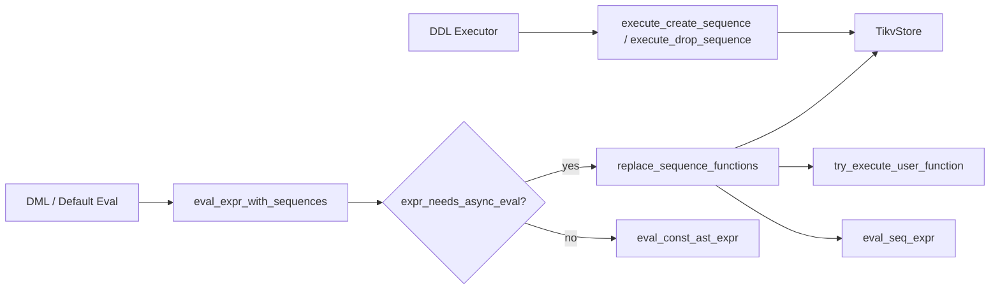
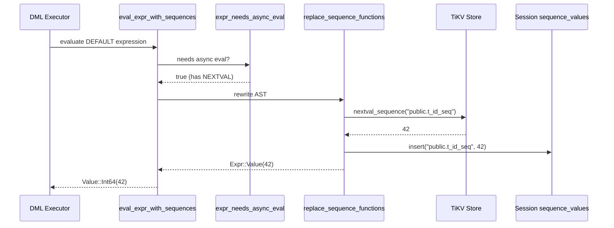

# Sequences

> **Module path:** `src/sql/sequences/`
> **Stability:** Stable -- covers DDL, expression evaluation, and AST rewriting for SERIAL/BIGSERIAL columns.

---

## 1. Overview

The Sequences subsystem implements PostgreSQL-compatible sequence objects for auto-incrementing columns. It provides:

- **DDL**: CREATE SEQUENCE / DROP SEQUENCE with full option support (START, INCREMENT, MINVALUE, MAXVALUE, CYCLE, CACHE, OWNED BY).
- **Runtime functions**: `nextval()`, `currval()`, `setval()` with session-scoped last-value tracking.
- **AST rewriting**: Recursive replacement of sequence function calls in SQL expressions with their evaluated values before execution.
- **Implicit sequences**: Automatic creation and management of sequences for SERIAL/BIGSERIAL columns.
- **Catalog integration**: `pg_get_indexdef()` OID-based lookup via `index_helpers`.

The sequence values are stored durably in TiKV. Each `nextval()` call performs an atomic read-modify-write on the sequence state, while `currval()` reads from the per-session cache of last-returned values.

---

## 2. Architecture Position



Sequences sit between the DDL executor (for schema operations) and the DML/expression evaluation layer (for runtime value generation). The `replace_sequence_functions` rewriter runs as a pre-evaluation pass on AST expressions, replacing function calls with their concrete values.

---

## 3. Key Concepts

| Concept | Description |
|---------|-------------|
| **SequenceDef** | Persistent definition: name, schema, start/increment/min/max/cycle/cache, ownership, backing state. |
| **SequenceBacking** | `Standalone(SequenceState)` for explicit sequences; TiKV atomically manages `last_value` and `is_called`. |
| **Implicit sequences** | Auto-created for SERIAL/BIGSERIAL columns, named `{table}_{column}_seq`, owned by the column. |
| **Session sequence cache** | `last_sequence_values: HashMap<String, i64>` in `Session` tracks the last value returned per sequence for `currval()`. |
| **AST rewriting** | `replace_sequence_functions` recursively walks the sqlparser AST, replacing NEXTVAL/CURRVAL/SETVAL calls with `Expr::Value` nodes. |
| **Async eval predicate** | `expr_needs_async_eval()` checks if an expression contains sequence functions, `current_schema()`, or potential user-defined functions. |

---

## 4. File Map

| File | Purpose |
|------|---------|
| `src/sql/sequences/mod.rs` | Module root: re-exports, predicates (`expr_uses_sequence_functions`, `expr_needs_async_eval`), naming utilities, `SequenceDef` builders. |
| `src/sql/sequences/ddl.rs` | `execute_create_sequence`, `execute_drop_sequence` -- DDL handlers. |
| `src/sql/sequences/eval.rs` | `eval_expr_with_sequences` -- entry point for evaluating expressions with sequence/user functions. |
| `src/sql/sequences/replace.rs` | `replace_sequence_functions` -- recursive AST rewriter for NEXTVAL, CURRVAL, SETVAL, CURRENT_SCHEMA, PG_GET_INDEXDEF, and user-defined function dispatch. |
| `src/sql/sequences/index_helpers.rs` | `format_indexdef`, `lookup_indexdef_by_oid` -- index DDL formatting for `pg_get_indexdef()`. |

---

## 5. Public Interfaces

### Module Re-exports (mod.rs)

```rust
pub(crate) use ddl::{execute_create_sequence, execute_drop_sequence};
pub(crate) use eval::eval_expr_with_sequences;
pub(crate) use replace::replace_sequence_functions;
```

### Predicate Functions (mod.rs)

```rust
pub(crate) fn expr_uses_sequence_functions(expr: &Expr) -> bool;
pub(crate) fn expr_needs_async_eval(expr: &Expr) -> bool;
pub(crate) fn normalize_sequence_name(
    name: &ObjectName,
    search_path: &[String],
) -> Result<(String, String, String)>;  // (schema, seq_name, full_name)
pub(crate) fn implicit_sequence_name(table_name: &str, column_name: &str) -> String;
pub(crate) fn build_implicit_sequence_def(
    table_full_name: &str,
    column_name: &str,
    data_type: &DataType,
) -> SequenceDef;
```

### DDL Handlers (ddl.rs)

```rust
pub(crate) async fn execute_create_sequence(
    store: &Arc<TikvStore>,
    txn: &mut Transaction,
    db_id: u64,
    search_path: &[String],
    stmt: &CreateSequence,
) -> Result<ExecuteResult>;

pub(crate) async fn execute_drop_sequence(
    store: &Arc<TikvStore>,
    txn: &mut Transaction,
    db_id: u64,
    search_path: &[String],
    names: &[ObjectName],
    if_exists: bool,
) -> Result<ExecuteResult>;
```

### Expression Evaluation (eval.rs)

```rust
pub(crate) async fn eval_expr_with_sequences(
    store: &Arc<TikvStore>,
    txn: &mut Transaction,
    db_id: u64,
    sequence_values: &mut HashMap<String, i64>,
    search_path: &[String],
    expr: &Expr,
    row: Option<&Row>,
    schema: Option<&TableSchema>,
    executor: Option<&Executor>,
) -> Result<Value>;
```

### Index Helpers (index_helpers.rs)

```rust
pub(crate) fn format_indexdef(table_schema: &str, table_name: &str, idx: &IndexDef) -> String;
pub(crate) fn format_index_columns(idx: &IndexDef) -> String;
pub(crate) async fn lookup_indexdef_by_oid(
    store: &Arc<TikvStore>,
    txn: &mut Transaction,
    db_id: u64,
    oid: i64,
) -> Result<Option<String>>;
```

---

## 6. Internal Design

### AST Rewriting Pipeline

`replace_sequence_functions` performs a depth-first, recursive walk over the sqlparser `Expr` AST. For each node, it pattern-matches on the expression variant and:

1. **Function calls** (`Expr::Function`): Matches by uppercase name:
   - `NEXTVAL(seq_name)`: Resolves full sequence name, calls `store.nextval_sequence()`, caches in `sequence_values`, returns `Expr::Value(Number)`.
   - `CURRVAL(seq_name)`: Looks up in `sequence_values` session cache, errors if not yet called.
   - `SETVAL(seq_name, value [, is_called])`: Calls `store.setval_sequence()`, caches result.
   - `CURRENT_SCHEMA`: Returns first schema from search path as string literal.
   - `PG_GET_INDEXDEF(oid)`: Delegates to `lookup_indexdef_by_oid`.
   - Unknown functions: Dispatches to `try_execute_user_function` for user-defined function execution.

2. **Compound expressions** (BinaryOp, UnaryOp, Case, InList, etc.): Recursively descends into child expressions.

3. **Leaf nodes** (Value, Identifier, etc.): Returned unchanged.

The rewriter covers 15+ AST expression variants to ensure complete coverage.

### Implicit Sequence Management

When a table is created with a SERIAL or BIGSERIAL column, the DDL layer calls `build_implicit_sequence_def()` to create a `SequenceDef` with:
- Name: `{table_name}_{column_name}_seq`
- Start: 1, Increment: 1, Min: 1
- Max: `i32::MAX` for SERIAL, `i64::MAX` for BIGSERIAL
- Owned by the column (enables CASCADE DROP)

### Sequence Name Resolution

`normalize_sequence_name` handles both unqualified (`my_seq`) and qualified (`public.my_seq`) names. Unqualified names are resolved using the first schema in `search_path`. `resolve_sequence_full_name_from_value` additionally performs a TiKV lookup across all search path schemas to find an existing sequence.

---

## 7. Data Flow



---

## 8. Contracts

| Contract | Detail |
|----------|--------|
| **nextval is atomic** | Each call performs a single TiKV read-modify-write. Concurrent callers get distinct values. |
| **currval requires prior nextval** | `currval()` errors if the sequence has not been used in the current session. |
| **Session-scoped cache** | `last_sequence_values` is per-connection, not per-transaction. Values persist across transaction boundaries. |
| **Implicit sequences follow OWNED BY** | Dropping the owning column or table drops the implicit sequence via CASCADE. |
| **AST rewriting is idempotent** | Running `replace_sequence_functions` on an already-rewritten expression is safe (no function calls remain). |
| **CYCLE wraps around** | When `is_cycled` is true, nextval wraps from max_value back to min_value (or vice versa for negative increment). |

---

## 9. Error Handling

| Error | Condition |
|-------|-----------|
| `SqlError::Unsupported` | Unsupported sequence option or function argument form. |
| `Sequence not found` | `nextval`/`setval` on a non-existent sequence name. |
| `currval not yet defined` | `currval()` called before any `nextval()` in the session for that sequence. |
| `Sequence exhausted` | `nextval()` exceeds `max_value` when `is_cycled` is false. |
| `Invalid sequence name` | Empty or malformed sequence name in `normalize_sequence_name`. |
| `Multiple sequences owned by column` | Ambiguous implicit sequence ownership. |

---

## 10. Testing

- **Unit tests** in `src/sql/sequences/tests.rs` and `src/sql/sequences/index_helpers.rs` (mod tests) covering: index formatting, column formatting, default method (btree), predicate inclusion.
- **SQL integration tests** in `tests/` covering: CREATE/DROP SEQUENCE, nextval/currval/setval, SERIAL/BIGSERIAL columns, IF EXISTS, sequence options.

---

## 11. Common Task Index

| Task | Where to look |
|------|---------------|
| Add a new sequence option | `execute_create_sequence` in `ddl.rs` -- parse and validate the option. |
| Support a new function in AST rewriting | `replace_sequence_functions` in `replace.rs` -- add a new function name match arm. |
| Fix sequence name resolution | `normalize_sequence_name` and `resolve_sequence_full_name_from_value` in `mod.rs`. |
| Change implicit sequence naming | `implicit_sequence_name` in `mod.rs`. |
| Add index format support | `format_indexdef` in `index_helpers.rs`. |

---

## 12. See Also

- [PL-pgSQL](PL-pgSQL.md) -- User-defined functions called during sequence replacement
- [Triggers](Triggers.md) -- Trigger bodies may contain sequence function calls
- [docs/ARCHITECTURE.md](../../../ARCHITECTURE.md) -- Overall architecture
- `src/storage/tikv_store/sequences.rs` -- TiKV-level sequence storage operations
- `src/sql/ddl/create_table.rs` -- Implicit sequence creation for SERIAL columns
