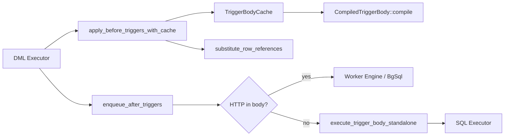
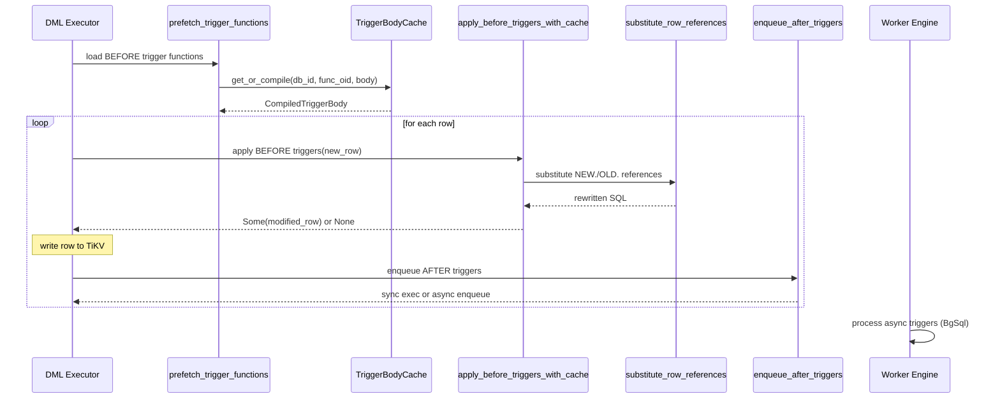

# Triggers

> **Module path:** `src/sql/triggers/`
> **Stability:** Stable -- covers BEFORE/AFTER row-level triggers with sync and async execution.

---

## 1. Overview

The Triggers subsystem implements PostgreSQL-compatible row-level triggers for INSERT, UPDATE, and DELETE operations. It provides:

- **BEFORE triggers**: Execute synchronously in the DML transaction, can modify the NEW row, skip the operation (RETURN NULL), or return the OLD row.
- **AFTER triggers**: Execute after the row operation completes. Sync triggers run inline; async triggers (containing HTTP calls) are enqueued to the worker engine for background execution.
- **Trigger body cache**: Per-tenant `DashMap`-based cache that compiles PL/pgSQL trigger bodies into a compact `TriggerStatement` AST on first use.
- **Row reference rewriting**: `NEW.column` and `OLD.column` references in trigger bodies are substituted with actual row values before execution.

The trigger subsystem integrates tightly with the DML executor (for BEFORE/AFTER hooks), the PL/pgSQL executor (for trigger body execution), and the worker engine (for async trigger dispatch).

---

## 2. Architecture Position



Triggers are invoked by the DML executor at two points in the row lifecycle: BEFORE (pre-write) and AFTER (post-write). The trigger body cache sits between the function store and the execution path, avoiding repeated parsing of trigger functions.

---

## 3. Key Concepts

| Concept | Description |
|---------|-------------|
| **TriggerBodyCache** | Per-tenant cache (`DashMap<(u64, u32), CompiledTriggerBody>`) keyed by `(db_id, func_oid)`. |
| **CompiledTriggerBody** | Parsed trigger body: a `Vec<TriggerStatement>` compiled from the PL/pgSQL `BEGIN..END` block. |
| **TriggerStatement** | Compact AST: `ReturnNew`, `ReturnNull`, `ReturnOld`, `Assignment{column, expr_str}`, `Skip`. |
| **TriggerOp** | Enum: `Insert`, `Update`, `Delete` -- classifies the triggering DML event. |
| **Row reference substitution** | Replaces `NEW.col` / `OLD.col` tokens in SQL strings with actual values, respecting string literals and identifier boundaries. |
| **Async triggers** | Trigger bodies containing HTTP function calls (`http_get`, `http_post`, etc.) are flattened to SQL and dispatched to the worker engine. |
| **Prefetch** | `prefetch_trigger_functions` loads and pre-compiles all BEFORE trigger functions for a table before row processing begins. |

---

## 4. File Map

| File | Purpose |
|------|---------|
| `src/sql/triggers/mod.rs` | Module root: re-exports `apply_before_triggers_with_cache`, `prefetch_trigger_functions`, `TriggerBodyCache`. |
| `src/sql/triggers/cache.rs` | `TriggerBodyCache`, `CompiledTriggerBody`, `TriggerStatement` enum, compilation logic, cache invalidation. |
| `src/sql/triggers/before.rs` | `prefetch_trigger_functions`, `apply_before_triggers_with_cache` -- BEFORE trigger execution. |
| `src/sql/triggers/enqueue.rs` | `enqueue_after_triggers` -- AFTER trigger routing (sync vs async), SQL flattening for worker dispatch. |
| `src/sql/triggers/execute.rs` | `execute_trigger_body_standalone` -- standalone PL/pgSQL-subset execution for AFTER triggers. `plpgsql_outer_block_range` -- BEGIN..END block finder. |
| `src/sql/triggers/rewrite.rs` | `substitute_row_references` -- NEW./OLD. token replacement. `value_to_sql_literal` -- Value to SQL literal conversion. |
| `src/sql/triggers/queue.rs` | `TriggerOp` enum: Insert, Update, Delete. |
| `src/sql/triggers/worker.rs` | Worker-side trigger execution (async trigger processing). |

---

## 5. Public Interfaces

### TriggerBodyCache (cache.rs)

```rust
pub(crate) struct TriggerBodyCache {
    inner: DashMap<(u64, u32), CompiledTriggerBody>,  // (db_id, func_oid)
}

impl TriggerBodyCache {
    pub(crate) fn new() -> Self;
    pub(crate) fn invalidate_db(&self, db_id: u64);
}
```

### BEFORE Trigger Execution (before.rs)

```rust
pub async fn prefetch_trigger_functions(
    trigger_cache: &TriggerBodyCache,
    store: &Arc<TikvStore>,
    txn: &mut Transaction,
    db_id: u64,
    triggers: &[TriggerDef],
    event: &str,
) -> Result<HashMap<String, FunctionDef>>;

pub async fn apply_before_triggers_with_cache(
    trigger_cache: &TriggerBodyCache,
    store: &Arc<TikvStore>,
    txn: &mut Transaction,
    db_id: u64,
    sequence_values: &mut HashMap<String, i64>,
    search_path: &[String],
    triggers: &[TriggerDef],
    func_cache: &HashMap<String, FunctionDef>,
    schema: &TableSchema,
    event: &str,
    new_row: Row,
    old_row: Option<&Row>,
) -> Result<Option<Row>>;
```

### AFTER Trigger Enqueue (enqueue.rs)

```rust
pub(crate) async fn enqueue_after_triggers(
    txn: &mut Transaction,
    db_id: u64,
    keyspace: &str,
    table_full_name: &str,
    op: TriggerOp,
    old_row: Option<&Row>,
    new_row: Option<&Row>,
    triggers: &[TriggerDef],
    store: &Arc<TikvStore>,
    executor: &Executor,
    sequence_values: &mut HashMap<String, i64>,
    search_path: &[String],
) -> Result<()>;
```

### Row Reference Rewriting (rewrite.rs)

```rust
pub(super) fn substitute_row_references(
    sql: &str,
    schema: &TableSchema,
    new_row: Option<&Row>,
    old_row: Option<&Row>,
) -> String;

pub(super) fn value_to_sql_literal(value: &Value) -> String;
```

---

## 6. Internal Design

### Trigger Body Compilation

`CompiledTriggerBody::compile(body: &str)` parses a PL/pgSQL trigger body into a vector of `TriggerStatement` nodes. The compilation:

1. Extracts the `BEGIN..END` block from the function body.
2. Splits on semicolons (respecting string literals and nested blocks).
3. Classifies each statement:
   - `RETURN NEW` -> `TriggerStatement::ReturnNew`
   - `RETURN NULL` -> `TriggerStatement::ReturnNull`
   - `RETURN OLD` -> `TriggerStatement::ReturnOld`
   - `NEW.col := expr` -> `TriggerStatement::Assignment { column, expr_str }`
   - Unsupported FTS functions -> validation error
   - Other statements -> `TriggerStatement::Skip` (passed through to standalone execution)

### BEFORE Trigger Execution Flow

1. `prefetch_trigger_functions` loads all BEFORE trigger function definitions for the table and pre-compiles them into the cache.
2. For each row, `apply_before_triggers_with_cache` iterates BEFORE triggers (filtered by event: INSERT/UPDATE) in definition order.
3. For each trigger, the compiled body is retrieved from cache. Each `TriggerStatement` is applied:
   - `Assignment`: Evaluates the expression (with NEW/OLD substitution), updates the column in the row.
   - `ReturnNew`: Returns the (possibly modified) row.
   - `ReturnNull`: Returns `None`, signaling the DML executor to skip the row.
   - `ReturnOld`: Returns the original row (for UPDATE triggers).
4. The return value (Some(row) or None) controls whether the DML proceeds.

### Async Trigger Detection

`trigger_body_needs_async` scans the function body for HTTP-related keywords (`http_get`, `http_post`, `http_put`, `http_delete`, `http_request`, `extensions.http`). If found, the trigger body is flattened to a SQL string (with NEW/OLD substituted) and enqueued as a `PendingAsyncTrigger` for the worker engine. Otherwise, the trigger executes synchronously via `execute_trigger_body_standalone`.

### Row Reference Substitution

`substitute_row_references` performs case-insensitive replacement of `NEW.column_name` and `OLD.column_name` patterns in SQL strings. It:
- Respects string literal boundaries (single-quoted strings).
- Checks identifier boundaries (the character before `NEW`/`OLD` must not be alphanumeric or underscore).
- Uses `value_to_sql_literal` to convert `Value` instances to properly quoted SQL literals for all types (text, numeric, boolean, arrays, JSON, timestamps, etc.).

---

## 7. Data Flow



---

## 8. Contracts

| Contract | Detail |
|----------|--------|
| **BEFORE triggers run in order** | Triggers fire in definition order (as stored in `TriggerDef` list). |
| **RETURN NULL skips the row** | A BEFORE trigger returning NULL causes the DML executor to skip the INSERT/UPDATE for that row. |
| **BEFORE modifies are visible** | Column modifications from one BEFORE trigger are visible to subsequent BEFORE triggers on the same row. |
| **AFTER triggers see committed data** | Sync AFTER triggers execute after the row write. Async triggers execute in a separate transaction. |
| **Cache invalidation on DDL** | `invalidate_db(db_id)` clears all cached trigger bodies for a database when functions are created/dropped. |
| **Async triggers are best-effort** | HTTP-containing triggers enqueued to the worker may fail independently of the original transaction. |

---

## 9. Error Handling

| Error | Condition |
|-------|-----------|
| `Unsupported FTS function` | Trigger body uses `tsvector_update_trigger`, `websearch_to_tsquery`, or `phraseto_tsquery`. |
| Compilation failure | Malformed PL/pgSQL trigger body (no BEGIN..END, invalid syntax). |
| Function not found | Trigger references a function that does not exist in the catalog. |
| Expression evaluation error | Assignment expression fails to evaluate (type mismatch, missing column, etc.). |

---

## 10. Testing

- **SQL integration tests** in `tests/` covering: CREATE TRIGGER, BEFORE INSERT/UPDATE, AFTER INSERT, RETURN NULL (row skip), column modification, multiple triggers per table.
- **Unit tests** in `cache.rs` for compilation and unsupported function detection.
- **Rewrite tests** for `substitute_row_references` covering edge cases (string literals, identifier boundaries, NULL values, array types).

---

## 11. Common Task Index

| Task | Where to look |
|------|---------------|
| Add a new TriggerStatement type | `TriggerStatement` enum in `cache.rs`, `CompiledTriggerBody::compile` for parsing, `apply_before_triggers_with_cache` in `before.rs` for execution. |
| Fix row reference substitution | `substitute_row_references` in `rewrite.rs`. |
| Add async trigger keyword | `ASYNC_TRIGGER_KEYWORDS` in `enqueue.rs`. |
| Debug cache invalidation | `invalidate_db` in `cache.rs` -- called from DDL executor on CREATE/DROP FUNCTION. |
| Support statement-level triggers | Currently only row-level triggers are supported. Would require changes to `before.rs`, `enqueue.rs`, and the DML executor. |

---

## 12. See Also

- [PL-pgSQL](PL-pgSQL.md) -- Trigger bodies are PL/pgSQL functions
- [Sequences](Sequences.md) -- Sequence functions may appear in trigger bodies
- [docs/ARCHITECTURE.md](../../../ARCHITECTURE.md) -- Overall architecture
- `src/sql/executor/triggers.rs` -- Trigger DDL (CREATE/DROP TRIGGER)
- `src/worker/` -- Worker engine for async trigger processing
- `src/sql/dml/` -- DML layer that invokes BEFORE/AFTER hooks
