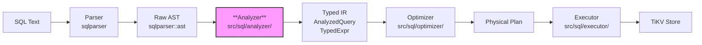
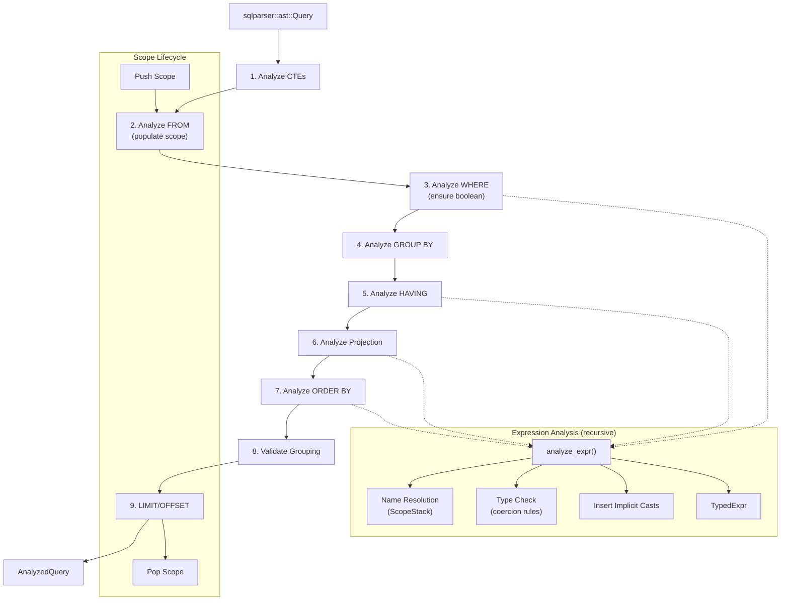

# Analyzer -- Semantic Analysis Layer

| Attribute | Value |
|-----------|-------|
| **Source path** | `src/sql/analyzer/` |
| **Files** | 20 (`.rs`) |
| **Approx. lines** | ~5,800 (excluding generated/test code from total ~19,800) |
| **Depends on** | `src/sql/types/`, `src/model/`, `sqlparser::ast` |
| **Dependents** | `src/sql/optimizer/`, `src/sql/executor/`, `src/protocol/handler/` |

---

## 1. Overview

The Analyzer is the **semantic analysis layer** of the SQL engine. It transforms raw `sqlparser::ast` nodes into db9's own **Typed Intermediate Representation** (`TypedExpr`, `AnalyzedQuery`). After analysis, every expression node carries:

- Its resolved `DataType` (no runtime type inference needed)
- Column references as positional indices (not string names)
- All syntax sugar normalized to canonical forms (e.g., `SUBSTRING` becomes `FunctionCall`)
- Implicit casts inserted where needed

The Analyzer follows PostgreSQL's `transformExpr` model: **single-pass** name resolution and type checking happen simultaneously during one recursive walk. It is fully **synchronous** -- all catalog data is pre-fetched into a `CatalogSnapshot` before analysis begins.

---

## 2. Architecture Position



The Analyzer sits between the SQL parser and the optimizer. It is the single point where:
- Names are resolved to positional references
- Types are inferred and checked
- Function overloads are resolved
- Syntax sugar is desugared

---

## 3. Key Concepts

### 3.1 TypedExpr

The core IR node. Every `TypedExpr` carries a `kind` (what it computes) and a `data_type` (what type the result is). Defined in `src/sql/analyzer/types/mod.rs`.

```rust
pub struct TypedExpr {
    pub kind: TypedExprKind,
    pub data_type: DataType,
}
```

`TypedExprKind` has **31 variants** organized into categories:

| Category | Variants |
|----------|----------|
| **Leaf** | `Constant`, `ColumnRef`, `Parameter`, `Default` |
| **Operators** | `BinaryOp`, `UnaryOp`, `Cast`, `Collate` |
| **Comparison/Logic** | `IsTest`, `IsDistinctFrom`, `Between`, `InList`, `ScalarArrayCmp`, `Like`, `SimilarTo` |
| **Conditional** | `Case`, `Coalesce`, `NullIf`, `MinMax` |
| **Functions** | `FunctionCall`, `AggregateCall`, `WindowCall` |
| **Subqueries** | `ScalarSubquery`, `Exists`, `InSubquery`, `TupleInSubquery`, `AnyAll`, `ArraySubquery` |
| **Composite** | `ArrayLiteral`, `ArrayIndex`, `JsonAccess`, `Row` |

### 3.2 AnalyzedQuery

A fully analyzed SQL query, mirroring PostgreSQL's `Query` node. Wraps the query body with CTEs, ORDER BY, LIMIT, OFFSET, and a resolved output schema.

```rust
pub struct AnalyzedQuery {
    pub ctes: Vec<AnalyzedCte>,
    pub body: AnalyzedQueryBody,          // Select | Values | SetOperation
    pub order_by: Vec<TypedOrderByExpr>,
    pub limit: Option<TypedExpr>,
    pub offset: Option<TypedExpr>,
    pub output_schema: Vec<(String, DataType, Option<ResolvedCollation>)>,
}
```

### 3.3 Scope

The Analyzer maintains a **scope stack** (`ScopeStack`) for column resolution across nested queries. Each scope frame (`Scope`) holds:

- All visible columns in flattened-row order
- Hash indexes for O(1) qualified and unqualified lookup
- CTE schemas visible from this scope
- Flags for `allow_aggregates` and `allow_windows`

Column resolution walks from the innermost scope outward. The depth difference becomes `scope_depth` on the `ColumnRef` node, enabling correlated subquery evaluation without a separate substitution pass.

```rust
pub struct ResolvedColumnRef {
    pub scope_depth: u32,       // 0 = current scope, 1+ = outer
    pub column_index: usize,    // absolute position in flattened row
    pub column_name: String,    // for display only
    pub data_type: DataType,
    pub merged_using: Option<UsingMergedColumn>,
    pub collation: Option<String>,
}
```

### 3.4 Catalog Interface

The Analyzer accesses table schemas, functions, and collations through the synchronous `Catalog` trait. The primary implementation is `CatalogSnapshot` -- an in-memory snapshot pre-fetched from TiKV before analysis begins.

```rust
pub trait Catalog: Send + Sync {
    fn resolve_table(&self, name: &str, schema: Option<&str>)
        -> Result<Option<(String, TableSchema)>, CatalogError>;
    fn resolve_function(&self, name: &str, schema: Option<&str>, arg_types: &[DataType])
        -> Result<Option<FunctionDef>, CatalogError>;
    fn resolve_table_function(&self, key: &str) -> Option<&TableSchema>;
    fn get_collation(&self, name: &str) -> Option<CollationDef>;
    // ... other methods
}
```

---

## 4. File Map

| File | Purpose |
|------|---------|
| `mod.rs` | Module root; `Analyzer` struct and `analyze_statement()` entry point |
| `scope.rs` | `Scope`, `ScopeStack`, `ScopeColumn`, `ResolvedColumnRef`; column resolution logic |
| `error.rs` | `AnalyzerError` enum (24 variants) with PostgreSQL-style error messages |
| `catalog.rs` | `Catalog` trait, `CatalogSnapshot`, `NullCatalog`, `MockCatalog` |
| `types/mod.rs` | Core Typed IR definitions: `TypedExpr`, `TypedExprKind`, `AnalyzedQuery`, `AnalyzedSelect`, DML IR types |
| `types/display.rs` | `Display` trait implementations for TypedExpr, BinaryOp, UnaryOp, IsTestKind |
| `expr/mod.rs` | `analyze_expr()` -- the heart of expression analysis (~1,600 lines) |
| `expr/operators.rs` | `analyze_binary_op`, `analyze_unary_op`, `analyze_is_test`, `analyze_like` |
| `expr/functions.rs` | `analyze_function`, `analyze_case`, `analyze_coalesce`, `analyze_nullif`, window spec |
| `expr/literals.rs` | `analyze_identifier`, `analyze_compound_identifier`, `analyze_value`, placeholder parsing |
| `expr/coercion.rs` | `coerce_if_needed`, `unify_expr_types`, `resolve_param_type`, ORDER BY analysis |
| `literal.rs` | `parse_typed_literal` -- DATE, TIMESTAMP, INTERVAL, TIME literal parsing at analysis time |
| `query/mod.rs` | `analyze_query`, `analyze_select_complete`, CTE analysis, DISTINCT, VALUES |
| `query/from_clause.rs` | `analyze_from`, `analyze_table_factor`, JOIN constraint analysis, USING/NATURAL |
| `query/projection.rs` | `analyze_projection`, wildcard expansion (`SELECT *`), qualified wildcard |
| `query/group_by.rs` | `analyze_group_by`, `validate_grouping_semantics`, ungrouped column detection |
| `query/set_expr.rs` | `analyze_set_expr`, `unify_set_operation_schemas`, coercion wrapping for UNION/INTERSECT/EXCEPT |
| `query/grouping_rewrite.rs` | GROUPING SETS / ROLLUP / CUBE rewriting into UNION ALL |
| `dml.rs` | `analyze_insert`, `analyze_update`, `analyze_delete`, ON CONFLICT, RETURNING |
| `tests.rs` | Unit tests using `MockCatalog` and `sqlparser` |

---

## 5. Public Interfaces

### 5.1 Analyzer Struct

```rust
// src/sql/analyzer/mod.rs
pub struct Analyzer<'a> {
    pub(crate) catalog: &'a dyn Catalog,
    pub(crate) scopes: ScopeStack,
    pub(crate) param_types: Vec<Option<DataType>>,
    pub(crate) inferred_params: Vec<Option<DataType>>,
}

impl<'a> Analyzer<'a> {
    pub fn new(catalog: &'a dyn Catalog) -> Self;
    pub fn new_with_params(catalog: &'a dyn Catalog, param_count: usize, client_oids: &[Option<DataType>]) -> Self;
    pub fn analyze_statement(&mut self, stmt: &Statement) -> Result<AnalyzedStatement, AnalyzerError>;
    pub fn analyze_query(&mut self, query: &Query) -> Result<AnalyzedQuery, AnalyzerError>;
    pub fn analyze_expr_with_scope(catalog: &'a dyn Catalog, scope: Scope, expr: &Expr) -> Result<TypedExpr, AnalyzerError>;
    pub fn finalize_param_types(&self) -> Result<Vec<DataType>, AnalyzerError>;
}
```

### 5.2 Key Types (re-exported from `analyzer::types`)

| Type | Description |
|------|-------------|
| `TypedExpr` | Core IR node with kind + data_type |
| `TypedExprKind` | 31-variant enum covering all expression semantics |
| `AnalyzedQuery` | Full query IR with CTEs, body, ORDER BY, output schema |
| `AnalyzedSelect` | SELECT body: projection, FROM, WHERE, GROUP BY, HAVING, DISTINCT |
| `AnalyzedStatement` | Top-level: Query, Insert, Update, Delete |
| `AnalyzedTableRef` / `AnalyzedTableRefKind` | FROM clause: Table, Subquery, Join, Function |
| `ResolvedFunction` | Resolved function identity with return type |
| `BinaryOp` / `UnaryOp` | db9's own operator enums (independent of sqlparser) |

### 5.3 Scope API

```rust
// src/sql/analyzer/scope.rs
impl Scope {
    pub fn new() -> Self;
    pub fn from_table_schema(alias: &str, schema: &TableSchema) -> Self;
    pub fn add_table(&mut self, alias: &str, columns: &[(String, DataType, bool, Option<String>)]);
    pub fn add_column(&mut self, alias: Option<&str>, name: &str, data_type: DataType, nullable: bool, collation: Option<String>);
    pub fn add_cte(&mut self, name: &str, columns: Vec<(String, DataType, Option<String>)>);
    pub fn resolve_unqualified_with_ident(&self, ident: &Ident) -> Result<Option<ResolvedColumnRef>, AnalyzerError>;
    pub fn resolve_qualified_idents(&self, table: &Ident, column: &Ident) -> Option<&ScopeColumn>;
    pub fn register_using_column(&mut self, name: &str, left_index: usize, right_index: usize, ...);
}

impl ScopeStack {
    pub fn resolve_column_ident(&self, ident: &Ident) -> Result<ResolvedColumnRef, AnalyzerError>;
    pub fn resolve_qualified_column_idents(&self, table: &Ident, column: &Ident) -> Result<ResolvedColumnRef, AnalyzerError>;
    pub fn resolve_cte(&self, name: &str) -> Option<Vec<(String, DataType, Option<String>)>>;
}
```

---

## 6. Internal Design

### 6.1 Expression Analysis Flow

`analyze_expr()` in `expr/mod.rs` is the central recursive dispatcher. For each `sqlparser::ast::Expr` variant, it:

1. Recursively analyzes child expressions
2. Resolves names via the scope stack
3. Determines the result DataType (via type coercion rules or the FunctionRegistry)
4. Inserts implicit casts where operand types differ
5. Returns a `TypedExpr` with the resolved type

Key design decisions:
- **Syntax sugar normalization**: SUBSTRING, TRIM, POSITION, EXTRACT, AT TIME ZONE, OVERLAY, CEIL, FLOOR are all converted to `FunctionCall` nodes.
- **NULL typing**: Untyped NULLs default to `Text` and adopt contextual types through binary operators or `coerce_if_needed`.
- **Parameter inference**: `$N` placeholders start with type `Text` and are progressively refined by context. `finalize_param_types()` catches unresolvable parameters.

### 6.2 Query Analysis Order

Analysis follows a strict clause-dependency order within `analyze_select_complete`:

```
1. CTEs         (register schemas for FROM resolution)
2. FROM         (populate scope with table columns)
3. WHERE        (boolean check, aggregates NOT allowed)
4. GROUP BY     (resolve positional refs and aliases)
5. [enable aggregates and windows in scope]
6. HAVING       (boolean check, aggregates allowed)
7. SELECT list  (aggregates/windows allowed)
8. DISTINCT     (analyze DISTINCT ON expressions)
9. ORDER BY     (can reference output aliases + FROM columns)
10. Grouping validation (check all expressions)
11. LIMIT/OFFSET (resolve params to Int64)
```

### 6.3 JOIN Analysis

`analyze_table_with_joins` processes JOINs left-to-right. For each join:
- Records the column boundary between left and right sides
- Analyzes the right table factor (adds columns to scope)
- Processes the join constraint (ON, USING, NATURAL, CROSS)
- For USING/NATURAL: hides right-side duplicate columns and registers merged column metadata

USING merged columns use `COALESCE(left, right)` for unqualified references, matching PostgreSQL semantics.

### 6.4 Set Operation Analysis

UNION/INTERSECT/EXCEPT goes through `unify_set_operation_schemas`:
1. Validates column count match
2. Unifies corresponding column types via `common_type`
3. Wraps each arm in a coercing projection if types differ

GROUPING SETS/ROLLUP/CUBE are rewritten into UNION ALL over simple GROUP BY arms in `grouping_rewrite.rs`.

### 6.5 DML Analysis

INSERT, UPDATE, DELETE are analyzed by `dml.rs`:
- Column names are resolved to positional indices in the target table schema
- Value expressions are type-checked against column types
- RETURNING clauses produce a projection scope
- ON CONFLICT (upsert) with `excluded` pseudo-table support

---

## 7. Data Flow Diagram



---

## 8. Contracts and Invariants

### Input Requirements

| Requirement | Enforced by |
|------------|-------------|
| All referenced tables must be pre-fetched in `CatalogSnapshot` | Catalog prefetch phase (before Analyzer) |
| SQL is syntactically valid | `sqlparser` (upstream) |
| Parameter count matches placeholder count | `new_with_params` setup |

### Output Guarantees

| Guarantee | Mechanism |
|-----------|-----------|
| Every `TypedExpr` has a resolved `DataType` | Type inference in every `analyze_*` method |
| Column references are positional (no string lookups at runtime) | `ColumnRef { scope_depth, column_index }` |
| Boolean contexts are validated (WHERE, HAVING, JOIN ON) | `ensure_boolean()` called at each site |
| Aggregate/window functions appear only where allowed | `allow_aggregates` / `allow_windows` scope flags |
| Ungrouped columns in aggregate queries are rejected | `validate_grouping_semantics()` |
| Set operation branches have unified types | `unify_set_operation_schemas()` + coercion wrapping |
| Syntax sugar is desugared to canonical forms | Conversion in `analyze_expr()` |
| All parameters have resolved types (or error 42P18) | `finalize_param_types()` |

---

## 9. Error Handling

All errors are represented by `AnalyzerError` (24 variants) in `error.rs`. Key design properties:

- **PostgreSQL-compatible messages**: error text follows PostgreSQL conventions (e.g., `column "x" does not exist`)
- **Edit-distance hints**: `ColumnNotFound` uses Damerau-Levenshtein distance to suggest similar column names
- **SQLSTATE alignment**: errors map to PostgreSQL error codes (42703 for column not found, 42P18 for indeterminate parameter type, 42725 for ambiguous operator)
- **Context propagation**: `TypeMismatch` and `AggregateNotAllowed` carry a context string (e.g., "WHERE clause")

Notable error variants:

| Variant | SQLSTATE | When |
|---------|----------|------|
| `ColumnNotFound` | 42703 | Unresolvable column reference |
| `AmbiguousColumn` | 42702 | Column present in multiple tables |
| `FunctionNotFound` | 42883 | Unknown function or wrong arg types |
| `OperatorTypeMismatch` | 42883 | No operator for given types |
| `AmbiguousOperator` | 42725 | Both operands are UNKNOWN |
| `UngroupedColumn` | 42803 | Non-aggregated column outside GROUP BY |
| `IndeterminateParameterType` | 42P18 | Unresolvable `$N` parameter |

---

## 10. Testing

### Unit Tests

- **`src/sql/analyzer/tests.rs`**: Tests expression analysis, query analysis, type coercion, parameter inference using `MockCatalog` and `sqlparser`.
- **`src/sql/analyzer/scope.rs`** (module tests): Scope resolution, ambiguity detection, USING column hiding, CTE resolution, correlated subquery depth.
- **`src/sql/analyzer/catalog.rs`** (module tests): Catalog snapshot search_path resolution, mock catalog builder.

### Integration Tests

SQL integration tests in `tests/` exercise the Analyzer indirectly through the full execution pipeline. Tests related to type checking, column resolution errors, and GROUP BY validation exercise Analyzer behavior end-to-end.

---

## 11. Common Task Index

| Task | Where to look |
|------|--------------|
| Add a new expression type | Add variant to `TypedExprKind` in `types/mod.rs`, handle in `analyze_expr()` in `expr/mod.rs`, add `Display` in `types/display.rs` |
| Add a new syntax sugar desugaring | Handle in `analyze_expr()` match arm, convert to `FunctionCall` via `make_function_call()` |
| Add a new builtin function | Register in `src/sql/types/registry/` (appropriate category file), Analyzer will resolve it automatically |
| Fix column resolution behavior | `scope.rs` for resolution logic, `expr/literals.rs` for identifier analysis |
| Fix type coercion behavior | `expr/operators.rs` for binary ops, `expr/coercion.rs` for `coerce_if_needed` and `unify_expr_types` |
| Add a new join type | `query/from_clause.rs` in `analyze_join_constraint` |
| Fix GROUP BY semantics | `query/group_by.rs` for `validate_grouping_semantics` and `find_ungrouped_column` |
| Fix set operation type unification | `query/set_expr.rs` in `unify_set_operation_schemas` |
| Add a new DML feature | `dml.rs` for INSERT/UPDATE/DELETE analysis |
| Add a new AnalyzerError variant | `error.rs`, add variant + Display impl |
| Add a test | `tests.rs` using `MockCatalog::builder()` |

---

## 12. See Also

- [Type-System.md](Type-System.md) -- Type inference, coercion rules, FunctionRegistry
- Optimizer documentation -- Consumes `AnalyzedQuery` to produce `LogicalPlan`
- Expression System documentation -- Runtime evaluation of `TypedExpr`
- `src/sql/expr/traverse/` -- `map_children` visitor used by `reindex_typed_expr`
- `src/protocol/handler/` -- Catalog prefetch phase that builds `CatalogSnapshot`
