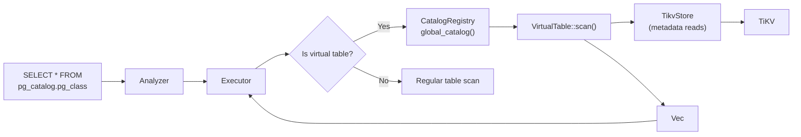
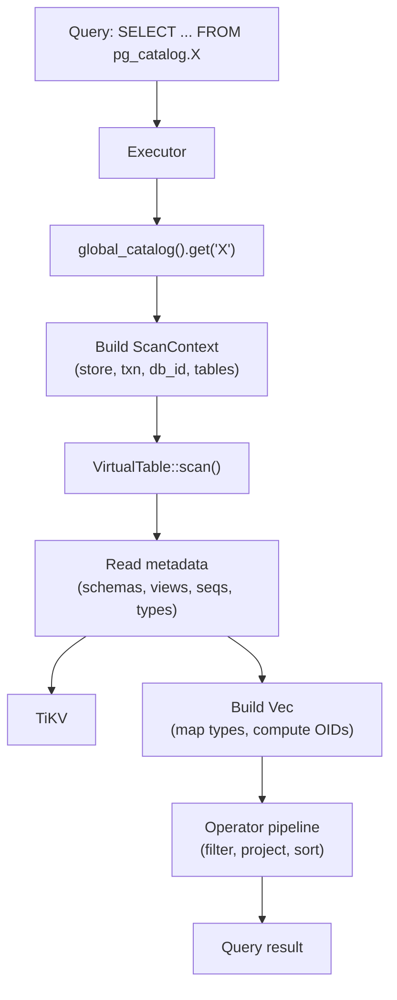

# Catalog Views -- pg_catalog / information_schema / cron

> **Source path:** `src/sql/catalog/`
> **Last updated:** 2026-02-28

---

## 1. Overview

The Catalog module implements **37+ virtual table** definitions for PostgreSQL compatibility. These views populate on-the-fly from metadata stored in TiKV, enabling ORMs, introspection tools, and PostgreSQL-native clients to query the database schema using standard catalog tables.

The views are organized into three schema namespaces:

| Namespace | Count | Purpose |
|-----------|-------|---------|
| **pg_catalog** | 24 | PostgreSQL system catalog compatibility (`pg_class`, `pg_type`, `pg_attribute`, etc.) |
| **information_schema** | 10 | SQL standard introspection views (`columns`, `tables`, `table_constraints`, etc.) |
| **cron** | 3 | pg_cron-compatible job management views (`cron_job`, `cron_job_run_details`, `cron_running_jobs`) |

Additionally, 7 `_DB9_SYS_*` virtual tables provide system-specific observability and management functions.

---

## 2. Architecture Position



Virtual tables are resolved at execution time. The `CatalogRegistry` singleton maps view names to implementations of the `VirtualTable` trait. Each implementation defines its schema (column names and types) and a `scan()` method that builds rows from live metadata.

---

## 3. Key Concepts

### VirtualTable Trait

Every catalog view implements the `VirtualTable` trait:

```rust
#[async_trait]
pub trait VirtualTable: Send + Sync {
    fn name(&self) -> &str;
    fn schema_name(&self) -> &str;
    fn schema(&self) -> TableSchema;
    async fn scan(&self, ctx: &mut ScanContext<'_>) -> Result<Vec<Row>>;
}
```

The `scan()` method receives a `ScanContext` with:
- `store` + `txn`: Access to the TiKV storage layer.
- `db_id`: Current database/keyspace identifier.
- `database_name`: Database name for catalog references.
- `user_tables`: List of all user table names in the database.
- `schemas`: List of schema names.
- `schema_oids`: Mapping from schema names to OIDs.
- `current_user` + `is_superuser`: Authentication context.

### CatalogRegistry

A global singleton (`LazyLock`) that registers all virtual table implementations at startup:

```rust
pub struct CatalogRegistry {
    tables: HashMap<String, Box<dyn VirtualTable>>,
}

pub fn global_catalog() -> &'static CatalogRegistry { ... }
```

Lookup is by bare table name (e.g., `"pg_class"`, `"columns"`).

### OID Generation

Catalog views use deterministic OID generation functions from `src/sql/catalog_oids.rs` to produce stable, unique OIDs for tables, indexes, sequences, views, and other objects based on their internal IDs (`table_id`, `index_id`, etc.).

### _DB9_SYS_* Virtual Tables

System-specific virtual tables defined in `virtual_tables.rs` provide:
- `_DB9_SYS_OBSERVABILITY`: Real-time QPS, TPS, latency metrics.
- `_DB9_SYS_QUERY_SAMPLES`: Query performance samples.
- `_DB9_SYS_EXPORT_DDL`: DDL export for schema migration.
- `_DB9_SYS_MIGRATIONS`: Applied migration history.
- `_DB9_SYS_RECORD_MIGRATION`: Migration recording interface.
- `_DB9_SYS_TRIGGER_QUEUE_STATS`: Async trigger queue statistics.
- `_DB9_SYS_TRIGGER_DLQ`: Dead letter queue for failed triggers.

---

## 4. File Map

### pg_catalog views (24 files)

| File | View | Key columns |
|------|------|-------------|
| `pg_am.rs` | `pg_am` | `oid`, `amname` |
| `pg_attrdef.rs` | `pg_attrdef` | `oid`, `adrelid`, `adnum`, `adbin`, `adsrc` |
| `pg_attribute.rs` | `pg_attribute` | `attrelid`, `attname`, `atttypid`, `attnum`, `attnotnull`, ... (12 cols) |
| `pg_class.rs` | `pg_class` | `oid`, `relname`, `relnamespace`, `relkind`, `relowner`, ... (13 cols) |
| `pg_collation.rs` | `pg_collation` | `oid`, `collname`, ... (12 cols) |
| `pg_constraint.rs` | `pg_constraint` | `oid`, `conname`, `connamespace`, `contype`, `conrelid`, `confrelid`, `conkey`, `confkey`, ... (15 cols) |
| `pg_database.rs` | `pg_database` | `oid`, `datname`, `datdba`, `encoding`, ... (14 cols) |
| `pg_db_role_setting.rs` | `pg_db_role_setting` | `setdatabase`, `setrole`, `setconfig` |
| `pg_depend.rs` | `pg_depend` | `classid`, `objid`, `objsubid`, `refclassid`, `refobjid`, `refobjsubid`, `deptype` |
| `pg_description.rs` | `pg_description` | `objoid`, `classoid`, `objsubid`, `description` |
| `pg_enum.rs` | `pg_enum` | `oid`, `enumtypid`, `enumsortorder`, `enumlabel` |
| `pg_extension.rs` | `pg_extension` | `oid`, `extname`, `extowner`, `extnamespace`, ... (8 cols) |
| `pg_index.rs` | `pg_index` | `indexrelid`, `indrelid`, `indnatts`, `indisunique`, `indisprimary`, `indkey`, `indexprs`, ... (16 cols) |
| `pg_indexes.rs` | `pg_indexes` | `schemaname`, `tablename`, `indexname`, `tablespace`, `indexdef` |
| `pg_namespace.rs` | `pg_namespace` | `oid`, `nspname`, `nspowner`, `nspacl` |
| `pg_opclass.rs` | `pg_opclass` | `oid`, `opcmethod`, `opcname`, `opcnamespace`, `opcfamily`, `opcintype`, `opcdefault`, `opckeytype` |
| `pg_proc.rs` | `pg_proc` | `oid`, `proname`, `pronamespace`, `prorettype`, `proargtypes`, `prosrc` |
| `pg_range.rs` | `pg_range` | `rngtypid`, `rngsubtype`, `rngmultitypid`, `rngcollation`, `rngsubopc`, `rngcanonical` |
| `pg_roles.rs` | `pg_roles` | `rolname`, `rolsuper`, `rolinherit`, `rolcreaterole`, ... (13 cols) |
| `pg_sequence.rs` | `pg_sequence` | `seqrelid`, `seqtypid`, `seqstart`, `seqincrement`, `seqmax`, `seqmin`, `seqcache`, `seqcycle` |
| `pg_tables.rs` | `pg_tables` | `schemaname`, `tablename`, `tableowner`, `tablespace`, ... (8 cols) |
| `pg_trigger.rs` | `pg_trigger` | `oid`, `tgrelid`, `tgname`, `tgfoid`, `tgenabled` |
| `pg_type.rs` | `pg_type` | `oid`, `typname`, `typnamespace`, `typlen`, `typtype`, ... (15 cols) |
| `pg_views.rs` | `pg_views` | `schemaname`, `viewname`, `viewowner`, `definition` |

### information_schema views (10 files)

| File | View | Key columns |
|------|------|-------------|
| `check_constraints.rs` | `check_constraints` | `constraint_catalog`, `constraint_schema`, `constraint_name`, `check_clause` |
| `columns.rs` | `columns` | `table_catalog`, `table_schema`, `table_name`, `column_name`, `ordinal_position`, `data_type`, `udt_name`, ... (44 cols) |
| `constraint_column_usage.rs` | `constraint_column_usage` | `table_catalog`, `table_schema`, `table_name`, `column_name`, `constraint_catalog`, `constraint_schema`, `constraint_name` |
| `key_column_usage.rs` | `key_column_usage` | `constraint_catalog`, `constraint_schema`, `constraint_name`, `table_name`, `column_name`, `ordinal_position`, ... (9 cols) |
| `referential_constraints.rs` | `referential_constraints` | `constraint_catalog`, `constraint_schema`, `constraint_name`, `unique_constraint_name`, `match_option`, `update_rule`, `delete_rule`, ... (9 cols) |
| `routines.rs` | `routines` | `routine_catalog`, `routine_schema`, `routine_name`, `routine_type`, `data_type`, `routine_definition` |
| `schemata.rs` | `schemata` | `catalog_name`, `schema_name`, `schema_owner`, `default_character_set_name` |
| `sequences.rs` | `sequences` | `sequence_catalog`, `sequence_schema`, `sequence_name`, `data_type`, ... (10 cols) |
| `table_constraints.rs` | `table_constraints` | `constraint_catalog`, `constraint_schema`, `constraint_name`, `table_name`, `constraint_type`, ... (10 cols) |
| `table_privileges.rs` | `table_privileges` | `grantor`, `grantee`, `table_catalog`, `table_schema`, `table_name`, `privilege_type`, `is_grantable`, `with_hierarchy` |
| `tables.rs` | `tables` | `table_catalog`, `table_schema`, `table_name`, `table_type`, ... (13 cols) |

### cron views (3 files)

| File | View | Key columns |
|------|------|-------------|
| `cron_job.rs` | `cron_job` | `jobid`, `schedule`, `command`, `nodename`, `nodeport`, `database`, `username`, `active`, `jobname` |
| `cron_job_run_details.rs` | `cron_job_run_details` | `jobid`, `runid`, `job_pid`, `database`, `username`, `command`, `status`, `return_message`, `start_time`, `end_time` |
| `cron_running_jobs.rs` | `cron_running_jobs` | `jobid`, `job_pid`, `database`, `username`, `command`, `status`, `start_time` |

### Infrastructure files

| File | Purpose |
|------|---------|
| `mod.rs` | `VirtualTable` trait, `ScanContext`, `CatalogRegistry`, `global_catalog()` singleton |
| `helpers.rs` | Column definition helpers (`text_col`, `int_col`, `bool_col`), value helpers (`text_val`, `int_val`), OID/type mapping utilities (`data_type_to_pg_type`, `data_type_to_udt_name`, `format_indexdef`, `schema_oid`) |
| `virtual_tables.rs` | `_DB9_SYS_*` virtual table schema definitions |

---

## 5. Public Interfaces

### CatalogRegistry

```rust
pub struct CatalogRegistry { ... }

impl CatalogRegistry {
    pub fn new() -> Self;
    pub fn get(&self, name: &str) -> Option<&dyn VirtualTable>;
}

pub fn global_catalog() -> &'static CatalogRegistry;
```

### VirtualTable Trait

```rust
#[async_trait]
pub trait VirtualTable: Send + Sync {
    fn name(&self) -> &str;
    fn schema_name(&self) -> &str;
    fn schema(&self) -> TableSchema;
    async fn scan(&self, ctx: &mut ScanContext<'_>) -> Result<Vec<Row>>;
}
```

### ScanContext

```rust
pub struct ScanContext<'a> {
    pub store: &'a Arc<TikvStore>,
    pub txn: &'a mut Transaction,
    pub db_id: u64,
    pub database_name: &'a str,
    pub user_tables: &'a [String],
    pub schemas: &'a [String],
    pub schema_oids: &'a HashMap<String, u32>,
    pub current_user: &'a str,
    pub is_superuser: bool,
}
```

### Helper Functions

```rust
// Column type mapping
pub fn data_type_to_pg_type(dt: &DataType) -> &'static str;
pub fn data_type_to_udt_name(dt: &DataType) -> &'static str;

// Index formatting (pg_indexes.indexdef)
pub fn format_indexdef(table_schema: &str, table_name: &str, idx: &IndexDef) -> String;

// OID lookup
pub fn schema_oid(schema_oids: &HashMap<String, u32>, schema: &str) -> i64;
pub fn access_method_oid(method: Option<&str>) -> i64;

// _DB9_SYS_* schema resolution
pub fn virtual_table_schema(name: &str) -> Option<TableSchema>;
```

---

## 6. Internal Design

### View Resolution and Population

When the executor encounters a query against a catalog table (e.g., `SELECT * FROM pg_catalog.pg_class`):

1. The executor checks if the table name matches a registered virtual table via `global_catalog().get(name)`.
2. If matched, it constructs a `ScanContext` with the current session's store, transaction, database info, and user tables.
3. It calls `VirtualTable::scan()` which queries TiKV for metadata and builds `Vec<Row>`.
4. The returned rows are fed into the regular operator pipeline (filter, project, sort, etc.).

### How pg_class Populates

The `pg_class` view (`pg_class.rs`) demonstrates the typical pattern:

1. Iterate over `ctx.user_tables`, fetch each table's `TableSchema`.
2. Emit a row with `relkind = 'r'` (regular table) for each table.
3. Emit a row with `relkind = 'i'` for each index in the schema.
4. Emit a row with `relkind = 'i'` for the PK index (if PK exists).
5. Query `store.list_sequences` and emit rows with `relkind = 'S'`.
6. Query `store.list_views` and emit rows with `relkind = 'v'`.

Each row includes a deterministic OID computed from `catalog_oids::pg_class_table_oid(table_id)`.

### How information_schema.columns Populates

The `columns` view (`columns.rs`):

1. Batch-loads all table schemas via `store.list_table_schemas`.
2. Pre-loads sequence definitions for `SERIAL` column default formatting.
3. For each column of each table, maps the internal `DataType` to PostgreSQL type names via `data_type_to_pg_type` and `data_type_to_udt_name`.
4. Computes `character_maximum_length`, `numeric_precision`, `numeric_scale` based on data type.
5. Generates the `column_default` string (e.g., `nextval('...'::regclass)` for SERIAL columns).
6. Emits a 44-column row matching the PostgreSQL `information_schema.columns` specification.

### Schema OID Assignment

Schema OIDs are computed from a deterministic mapping:
- `public` -> 2200 (matches PostgreSQL)
- `pg_catalog` -> 11 (matches PostgreSQL)
- Other schemas -> computed from a hash or sequential assignment via `schema_oids` map.

### Type Mapping

The `helpers.rs` module provides two mapping functions:

- `data_type_to_pg_type`: Maps internal `DataType` to PostgreSQL's human-readable type name (e.g., `DataType::Int32` -> `"integer"`).
- `data_type_to_udt_name`: Maps to PostgreSQL's UDT (user-defined type) short name (e.g., `DataType::Int32` -> `"int4"`).

---

## 7. Data Flow Diagram



---

## 8. Contracts

- **PostgreSQL column compatibility**: Each virtual table's `schema()` method defines columns that match the PostgreSQL catalog specification in name, type, and order. Where db9 does not implement a feature, columns return NULL or sensible defaults.
- **OID stability**: OIDs are deterministic functions of internal IDs (`table_id`, `index_id`, `seq_oid`, `view_oid`). The same object always produces the same OID within a session.
- **Read-only**: Virtual tables are read-only. DML operations against them are not supported.
- **No caching**: Virtual table rows are computed fresh on every scan from live TiKV metadata. This ensures consistency but means performance scales with the number of objects.
- **Schema namespace**: Views self-report their schema via `schema_name()`. The executor uses this to resolve ambiguous references (e.g., `columns` resolves to `information_schema.columns`).

---

## 9. Error Handling

Catalog view scans propagate errors from the underlying storage layer:
- Schema not found errors are generally suppressed (views skip tables that cannot be loaded).
- OID computation errors (`catalog_oids` overflow) propagate as `anyhow` errors.
- Transaction errors from TiKV propagate directly.

The catalog module does not define its own error types; it relies on `anyhow::Result`.

---

## 10. Testing

- **Unit tests** (`src/sql/catalog/mod.rs`): Verify that all 37+ views are registered in the `CatalogRegistry` with correct names, schema namespaces, and column counts. Tests include:
  - `registry_contains_pg_am`, `registry_contains_pg_namespace`, `registry_contains_schemata`, etc.
  - `registry_returns_none_for_unknown` -- negative case.
- **Unit tests** (`src/sql/catalog/helpers.rs`): `is_unique_constraint_index` filter logic.
- **Unit tests** (`src/sql/catalog/virtual_tables.rs`): All 7 `_DB9_SYS_*` tables resolve, case-insensitive lookup, nullable columns.
- **SQL integration tests** (`tests/`): Catalog queries used in ORM compatibility tests (Prisma, TypeORM, Sequelize) to validate introspection compatibility.

---

## 11. Common Task Index

| Task | Where to look |
|------|--------------|
| Add a new pg_catalog view | 1. Create `src/sql/catalog/pg_<name>.rs` implementing `VirtualTable`. 2. Register in `src/sql/catalog/mod.rs` (`CatalogRegistry::new`). 3. Add a unit test in `mod.rs`. |
| Add a new information_schema view | Same as above, but set `schema_name()` to `"information_schema"`. |
| Add a column to an existing view | Modify `schema()` to add the column, update `scan()` to populate it, update the column count in the unit test. |
| Change type mapping | `src/sql/catalog/helpers.rs` (`data_type_to_pg_type`, `data_type_to_udt_name`). |
| Change OID generation | `src/sql/catalog_oids.rs` (not in this module, but used by all catalog views). |
| Add a new access method | `src/sql/catalog/helpers.rs` (`access_method_oid`, `access_method_name`), `src/sql/catalog/pg_am.rs`. |
| Change index definition formatting | `src/sql/catalog/helpers.rs` (`format_indexdef`, `format_index_columns`). |
| Add cron management views | Create `src/sql/catalog/cron_<name>.rs`, register in `mod.rs`, use `cron` schema namespace. |

---

## 12. See Also

- [DDL.md](DDL.md) -- DDL operations that create the metadata catalog views expose
- [DML.md](DML.md) -- DML operations (catalog views are read-only)
- `src/sql/catalog_oids.rs` -- Deterministic OID generation for catalog objects
- `docs/sot/catalog-introspection.md` -- Normative contract for catalog behavior
- `src/sql/executor/core/` -- Executor that dispatches catalog scans
- `src/cron/` -- Cron scheduler whose state is exposed via cron catalog views
