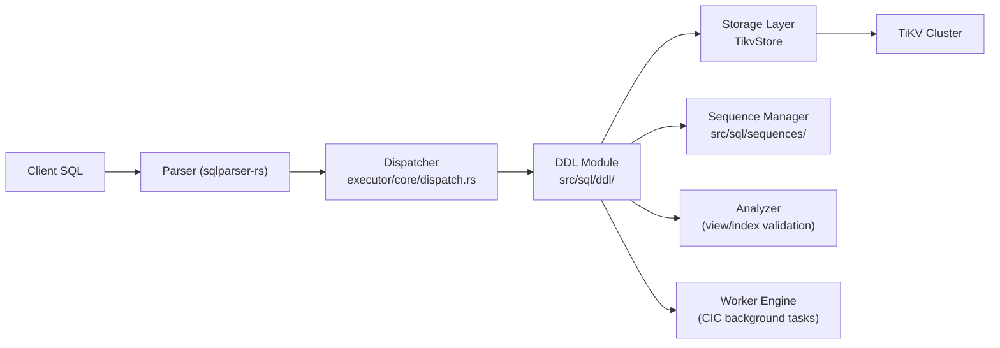
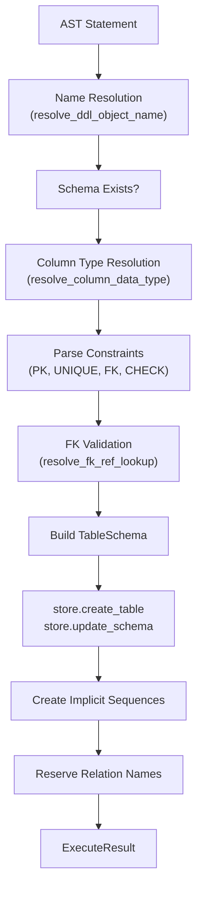

# DDL -- Data Definition Language

> **Source path:** `src/sql/ddl/`
> **Last updated:** 2026-02-28

---

## 1. Overview

The DDL module handles all schema-modifying operations: **CREATE TABLE**, **CREATE INDEX**, **CREATE VIEW**, **CREATE MATERIALIZED VIEW**, **ALTER TABLE**, **DROP TABLE**, **DROP INDEX**, **DROP VIEW**, **TRUNCATE**, and related sub-operations. It translates parsed AST nodes into schema mutations persisted through the `TikvStore` storage layer.

All DDL operations follow PostgreSQL semantics:
- Relation names (tables, views, indexes, sequences) must be unique within a schema.
- Constraint names follow PostgreSQL naming conventions (`{table}_pkey`, `{table}_{col}_key`, `{table}_{col}_fkey`).
- `IF NOT EXISTS` / `IF EXISTS` clauses are supported for idempotent operations.
- `CASCADE` is supported for `DROP TABLE`, `DROP VIEW`, and `DROP MATERIALIZED VIEW`.

---

## 2. Architecture Position



The Dispatcher routes DDL statements (`CREATE`, `ALTER`, `DROP`) to the DDL module. The DDL module directly interacts with the Storage layer to persist schema changes and manages implicit sequences for `SERIAL` columns.

---

## 3. Key Concepts

### Table Creation
- Resolves column types including custom types (`SERIAL`, `BIGSERIAL`, enums, composites) via `resolve_column_data_type`.
- Validates foreign key references, including self-referential constraints.
- Assigns generated constraint names following PostgreSQL conventions.
- Creates implicit sequences for `SERIAL`/`BIGSERIAL` columns.
- Supports `CREATE TABLE AS` (CTAS) with both batch and streaming row insertion.

### Index Creation
- Supports btree (default), GIN, and GIST access methods.
- Expression indexes and partial indexes (with `WHERE` predicates) are supported.
- `CREATE INDEX CONCURRENTLY` (CIC) schedules a background worker task with `IndexState::Building`, followed by asynchronous backfill and reconciliation.
- Operator class validation enforces that GIN/GIST columns have compatible data types.
- Schema-wide namespace uniqueness is enforced via reservation keys in TiKV.

### View Management
- `CREATE VIEW` validates referenced relations and records dependency metadata (`deps`, `relation_bindings`).
- `CREATE OR REPLACE VIEW` enforces PostgreSQL rules: existing columns cannot be dropped or have their name/type changed; only appending new columns is allowed.
- Materialized views are backed by real tables; `REFRESH MATERIALIZED VIEW` truncates and re-inserts.

### Schema Alterations (ALTER TABLE)
- `ADD COLUMN`, `DROP COLUMN`, `RENAME COLUMN`, `RENAME TABLE`, `RENAME CONSTRAINT`.
- `ALTER COLUMN SET/DROP DEFAULT`, `SET/DROP NOT NULL`, `SET DATA TYPE` (with optional `USING` expression).
- `ADD/DROP CONSTRAINT` for PRIMARY KEY, UNIQUE, FOREIGN KEY, and CHECK constraints.
- Column type changes rebuild affected indexes and rewrite row data.

---

## 4. File Map

| File | Purpose |
|------|---------|
| `src/sql/ddl/mod.rs` | Module root: re-exports, shared helpers (`analyze_row_level_expr`, `resolve_column_data_type`, `KvScanBatches`), constraint utilities, CASCADE logic |
| `src/sql/ddl/create_table.rs` | `execute_create_table`, CTAS (`create_table_from_query_result`, `create_table_from_stream`, `create_table_from_select_into`), `check_relation_name_available` |
| `src/sql/ddl/create_index.rs` | `execute_create_index`, index backfill, CIC state management (`update_index_state`, `backfill_index_by_name`, `reconcile_index`) |
| `src/sql/ddl/drop.rs` | `execute_drop_table`, `execute_truncate`, `execute_drop_index` |
| `src/sql/ddl/view.rs` | `execute_create_view`, `execute_drop_view`, `execute_create_materialized_view`, `execute_drop_materialized_view`, `execute_refresh_materialized_view` |
| `src/sql/ddl/alter_table/mod.rs` | `execute_alter_table` dispatch for all ALTER TABLE sub-operations |
| `src/sql/ddl/alter_table/columns.rs` | `alter_table_add_column`, `alter_table_drop_column`, `alter_table_alter_column_set_data_type` |
| `src/sql/ddl/alter_table/constraints.rs` | `alter_table_add_primary_key`, `alter_table_add_unique_constraint`, `alter_table_add_foreign_key`, `alter_table_add_check_constraint`, `alter_table_drop_constraint` |
| `src/sql/ddl/tests.rs` | Unit tests for helpers, legacy name conflict detection, constraint naming, type coercion |

---

## 5. Public Interfaces

### CREATE TABLE

```rust
pub async fn execute_create_table(
    store: &Arc<TikvStore>,
    txn: &mut Transaction,
    db_id: u64,
    search_path: &[String],
    name: &ObjectName,
    columns: &[SqlColumnDef],
    constraints: &[TableConstraint],
    if_not_exists: bool,
) -> Result<ExecuteResult>
```

### CREATE TABLE AS (CTAS)

```rust
pub async fn create_table_from_query_result(
    store: &Arc<TikvStore>,
    txn: &mut Transaction,
    db_id: u64,
    table_name: &str,
    if_not_exists: bool,
    result_cols: Vec<String>,
    result_rows: Vec<Row>,
    explicit_columns: &[SqlColumnDef],
) -> Result<ExecuteResult>
```

### CREATE INDEX

```rust
pub async fn execute_create_index(
    store: &Arc<TikvStore>,
    txn: &mut Transaction,
    db_id: u64,
    idx_name: &str,
    table_name: &str,
    using: Option<&sqlparser::ast::Ident>,
    columns: &[OrderByExpr],
    unique: bool,
    if_not_exists: bool,
    concurrently: bool,
    predicate: Option<&Expr>,
    rows: Vec<Row>,
    keyspace: &str,
    username: &str,
) -> Result<ExecuteResult>
```

### ALTER TABLE

```rust
pub async fn execute_alter_table(
    store: &Arc<TikvStore>,
    txn: &mut Transaction,
    db_id: u64,
    search_path: &[String],
    name: &sqlparser::ast::ObjectName,
    operation: &AlterTableOperation,
) -> Result<(ExecuteResult, Option<u64>)>
```

Returns `(result, invalidate_table_id)` where `invalidate_table_id` is `Some(table_id)` when the operation structurally changed the table in a way that invalidates ANALYZE statistics.

### DROP TABLE

```rust
pub async fn execute_drop_table(
    store: &Arc<TikvStore>,
    txn: &mut Transaction,
    db_id: u64,
    search_path: &[String],
    names: &[ObjectName],
    if_exists: bool,
    cascade: bool,
    stats_cache: &crate::sql::stats::TableStatsCache,
) -> Result<ExecuteResult>
```

### Relation Name Availability

```rust
pub async fn check_relation_name_available(
    store: &Arc<TikvStore>,
    txn: &mut Transaction,
    db_id: u64,
    schema_name: &str,
    name: &str,
    if_not_exists: bool,
    exclude_table: Option<&str>,
) -> Result<bool>
```

---

## 6. Internal Design

### CREATE TABLE Flow

1. Resolve schema-qualified name via `resolve_ddl_object_name`.
2. Verify target schema exists.
3. Parse column definitions: resolve types (`SERIAL` -> `Int32` + `is_serial`), defaults, constraints.
4. Collect table-level constraints (PK, UNIQUE, FOREIGN KEY, CHECK).
5. Validate foreign key references (resolve referenced table schema, verify column count parity, call `resolve_fk_ref_lookup`).
6. Generate constraint names following PostgreSQL conventions via `assign_generated_check_constraint_names`.
7. Build `TableSchema`, assign `table_id` via `store.next_table_id`.
8. Persist via `store.create_table`.
9. Create implicit sequences for SERIAL columns.
10. Reserve PK and unique index names in schema-wide namespace.

### CREATE INDEX Flow

1. Verify table exists and retrieve schema.
2. Check schema-wide name uniqueness via `check_relation_name_available` (writes a reservation key).
3. Parse column/expression list; validate operator classes for GIN/GIST.
4. Assign `index_id` (max existing + 1).
5. For `CONCURRENTLY`: set state to `Building`, update schema, enqueue background task, return immediately.
6. For synchronous: backfill index entries from existing rows (with transaction rotation for large tables via `maybe_rotate_backfill_txn`). On failure after partial commits, cleanup orphaned index entries.
7. Append index to schema, bump version, persist.

### CASCADE DROP

`drop_dependent_views` performs fixed-point transitive resolution:
1. Start with the target name.
2. Scan all views and materialized views for dependency matches (via stored `deps` field).
3. Drop matching dependents, add them to `pending`.
4. Repeat until no new dependents are found.

### Index State Machine (CIC)

```
Building -> (backfill_index_by_name) -> WriteOnly -> (reconcile_index: 2-pass) -> Ready
```

- **Building**: Index is being backfilled. Non-unique writes are skipped; unique writes are enforced.
- **WriteOnly**: Backfill complete, new DML maintains the index, reconciliation removes stale entries.
- **Ready**: Index is fully consistent and available for query planning.
- **Invalid**: Index is marked broken and skipped by DML.

---

## 7. Data Flow Diagram



---

## 8. Contracts

- **Relation name uniqueness**: All relation names (tables, views, materialized views, sequences, indexes, PK constraints) must be unique within a schema. Enforced via `check_relation_name_available` which performs point-read checks and writes a reservation key (`sys_relname_`) in TiKV for concurrency safety.
- **Schema version bumping**: Every DDL mutation increments `schema.version` to enable plan-cache drift detection.
- **Stats invalidation**: Structural changes (column add/drop/rename/retype) set `invalidate_table_id` so the caller can invalidate ANALYZE statistics.
- **CTAS synthetic PK**: `CREATE TABLE AS` and `SELECT INTO` add a hidden `_rowid` column as a serial primary key; the PK constraint name is set to an empty string sentinel to avoid reserving a user-visible name.
- **Transaction rotation**: Large DDL backfills (index creation, column type changes) use `maybe_rotate_backfill_txn` to commit in batches of `DDL_BACKFILL_COMMIT_SIZE` (5000 writes), preventing TiKV transaction size limit errors.
- **Legacy name conflict scan**: A fallback scan of all table schemas for index/PK name conflicts is active until `2026-12-31` for clusters created before `sys_relname_` enforcement (#775).

---

## 9. Error Handling

| Error | SQLSTATE | Condition |
|-------|----------|-----------|
| `SqlError::DuplicateRelation` | 42P07 | Relation name already exists |
| `SqlError::RelationNotFound` | 42P01 | Referenced table/view does not exist |
| `SqlError::Unsupported` | 0A000 | Unsupported ALTER or constraint operation |
| `SqlError::ForeignKeyViolation` | 23503 | FK validation fails during ALTER TABLE ADD CONSTRAINT |
| `anyhow` errors | -- | Schema does not exist, column not found, PK column count mismatch, type conversion failures |

CREATE INDEX failures after partial backfill trigger cleanup: orphaned index entries are deleted and the reservation key is released in a separate transaction.

---

## 10. Testing

- **Unit tests** (`src/sql/ddl/tests.rs`): Test legacy name conflict detection, constraint name generation, check expression column reference detection, type coercion, prefix range computation, referential action mapping.
- **Unit tests** (`src/sql/ddl/create_index.rs`): Test index value type inference and reconciliation search path logic.
- **Unit tests** (`src/sql/ddl/alter_table/constraints.rs`): Test unique constraint index lookup and single-column constraint detection.
- **SQL integration tests** (`tests/`): Comprehensive coverage of DDL operations via `.sql` test files validated against PostgreSQL 17.

---

## 11. Common Task Index

| Task | Where to look |
|------|--------------|
| Add a new DDL statement type | Add a new function in `src/sql/ddl/`, re-export from `mod.rs`, add dispatch case in `src/sql/executor/core/dispatch/` |
| Add a new constraint type | `src/sql/ddl/alter_table/constraints.rs` for ALTER TABLE, `src/sql/ddl/create_table.rs` for inline constraints |
| Add a new index method | Operator class validation in `src/sql/ddl/create_index.rs` (search `needs_opclass_check`), `src/sql/catalog/helpers.rs` for `access_method_oid` |
| Change index backfill behavior | `src/sql/ddl/create_index.rs` (`backfill_index_by_name`, `reconcile_index`) |
| Change view dependency tracking | `src/sql/ddl/view.rs` (`resolve_view_relation_bindings`, `derive_view_deps`) |
| Change CASCADE drop behavior | `src/sql/ddl/mod.rs` (`drop_dependent_views`, `was_cascade_dropped`) |

---

## 12. See Also

- [DML.md](DML.md) -- INSERT/UPDATE/DELETE execution and FK enforcement
- [Catalog-Views.md](Catalog-Views.md) -- pg_catalog / information_schema views that expose DDL metadata
- `src/sql/executor/core/dispatch/` -- Statement routing that invokes DDL functions
- `src/storage/tikv_store/` -- Storage layer persistence (schema, index, sequence operations)
- `src/worker/` -- Background worker engine for CREATE INDEX CONCURRENTLY
