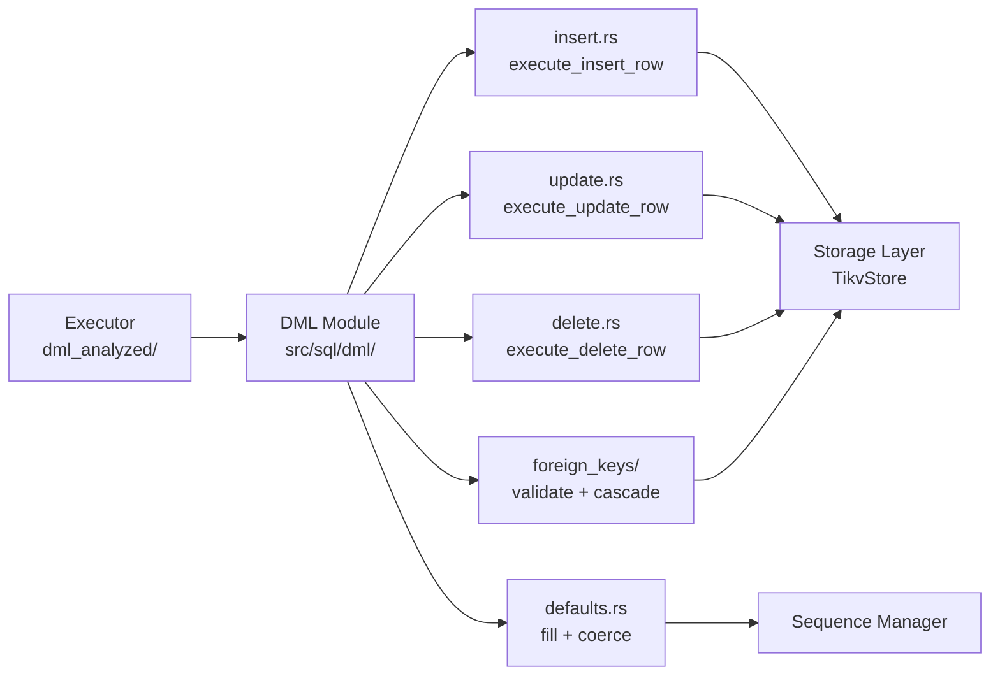
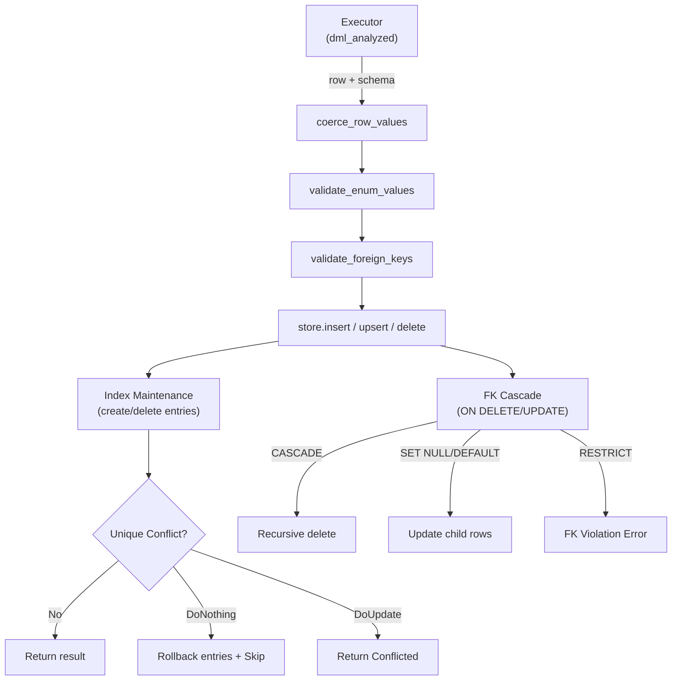

# DML -- Data Manipulation Language

> **Source path:** `src/sql/dml/`
> **Last updated:** 2026-02-28

---

## 1. Overview

The DML module provides row-level execution helpers for **INSERT**, **UPDATE**, and **DELETE** operations. It is responsible for:

- **Value coercion and validation**: Type-casting row values to match column definitions, enforcing NOT NULL constraints, validating enum labels.
- **Default expression evaluation**: Computing default values for missing columns, including `SERIAL` sequence advancement.
- **Foreign key enforcement**: Validating referential integrity on INSERT/UPDATE; executing cascade actions (CASCADE, SET NULL, SET DEFAULT) on UPDATE/DELETE.
- **Index maintenance**: Creating, updating, and deleting B-tree and GIN index entries in sync with row mutations.
- **Conflict resolution**: Supporting `ON CONFLICT DO NOTHING` and `ON CONFLICT DO UPDATE` (upsert) semantics.

The DML module does NOT own query planning or WHERE-clause evaluation. Those responsibilities belong to the Executor (`src/sql/executor/dml_analyzed/`) which calls into these helpers for each affected row.

---

## 2. Architecture Position



The analyzed DML executor identifies target rows via the optimizer pipeline, then delegates per-row mutation, FK enforcement, and index maintenance to this module.

---

## 3. Key Concepts

### Conflict Resolution (ON CONFLICT)

The `ConflictBehavior` enum encodes three modes:

```rust
pub enum ConflictBehavior {
    Error,                                      // Raise on unique violation
    DoNothing,                                  // Skip conflicting rows
    DoUpdate { target: Option<ConflictTarget> }, // Upsert with optional target
}

pub enum ConflictTarget {
    Columns(Vec<String>),    // ON CONFLICT (col1, col2, ...)
    Constraint(String),      // ON CONFLICT ON CONSTRAINT name
}
```

When a unique index conflict is detected during INSERT:
1. **DoNothing**: Rolls back inserted index entries, deletes the row, returns `InsertRowResult::Skipped`.
2. **DoUpdate**: If the conflicting index matches the conflict target, returns `InsertRowResult::Conflicted` with the existing row for the caller to perform the UPDATE. Non-target conflicts are deferred.
3. **Error**: Raises `SqlError::UniqueViolation`.

### Foreign Key Validation (MATCH SIMPLE)

FK validation follows PostgreSQL MATCH SIMPLE semantics:
- If **any** referencing column is NULL, the FK check is skipped entirely.
- Self-referencing FKs are short-circuited when the row's FK values match its own referenced values.
- Parent existence is checked via PK lookup or unique index scan, determined by `resolve_fk_ref_lookup`.

### FK Cascade Operations

| Action | ON DELETE | ON UPDATE |
|--------|-----------|-----------|
| `CASCADE` | Delete child rows recursively | Update child FK columns to new parent values |
| `SET NULL` | Set child FK columns to NULL | Set child FK columns to NULL |
| `SET DEFAULT` | Set child FK columns to their default values | Set child FK columns to their default values |
| `RESTRICT` / `NO ACTION` | Error if children exist | Error if children exist |

Cascade operations use `FkDeleteContext` for cycle detection and snapshot management across recursive cascade chains.

### Default Expression Evaluation

Default values support:
- Static expressions (`DEFAULT 42`, `DEFAULT 'hello'`).
- Function calls (`DEFAULT CURRENT_TIMESTAMP`, `DEFAULT gen_random_uuid()`).
- Sequence-backed defaults (`SERIAL` columns via `nextval`).
- Complex expressions parsed and evaluated via `compile_const_expr` and `eval_static_typed_expr`.

---

## 4. File Map

| File | Purpose |
|------|---------|
| `src/sql/dml/mod.rs` | Module root: type definitions (`ConflictBehavior`, `ConflictTarget`, `InsertRowResult`, `EnumLabelCache`), re-exports |
| `src/sql/dml/insert.rs` | `execute_insert_row`: row insertion with conflict resolution, enum validation, index materialization, `build_enum_label_cache` |
| `src/sql/dml/update.rs` | `execute_update_row`, `execute_update_row_by_pk`: row update with PK change detection, index maintenance, FK cascade propagation |
| `src/sql/dml/delete.rs` | `execute_delete_row`, `delete_row_storage_entries`: row deletion with FK cascade and index cleanup |
| `src/sql/dml/defaults.rs` | `eval_column_default_or_null`, `fill_missing_columns`, `coerce_row_values`, `coerce_row_values_allow_null` |
| `src/sql/dml/foreign_keys/mod.rs` | FK validation (`validate_foreign_keys`), `FkRefLookup` resolution, `FkDeleteContext` state management, shared helpers (`pk_to_hash_key`, `get_ref_values`, `fk_values_for_row`) |
| `src/sql/dml/foreign_keys/cascade_delete.rs` | `handle_foreign_key_on_delete`: recursive CASCADE DELETE with cycle detection |
| `src/sql/dml/foreign_keys/cascade_update.rs` | `handle_foreign_key_on_update`: CASCADE UPDATE with post-update FK re-validation |
| `src/sql/dml/tests.rs` | Unit tests for DML helpers |

---

## 5. Public Interfaces

### INSERT

```rust
pub async fn execute_insert_row(
    store: &Arc<TikvStore>,
    txn: &mut Transaction,
    db_id: u64,
    table_name: &str,
    schema: &TableSchema,
    row: Row,
    on_conflict: ConflictBehavior,
    enum_cache: &EnumLabelCache,
) -> Result<InsertRowResult>
```

Returns one of:
- `InsertRowResult::Inserted(Row)` -- row was successfully inserted.
- `InsertRowResult::Skipped` -- row skipped due to `DO NOTHING`.
- `InsertRowResult::Conflicted { existing_pk, existing_row, excluded_row }` -- conflict detected for `DO UPDATE`; caller must perform the update.

### UPDATE

```rust
pub async fn execute_update_row(
    store: &Arc<TikvStore>,
    txn: &mut Transaction,
    db_id: u64,
    table_name: &str,
    schema: &TableSchema,
    old_row: &Row,
    new_row: Row,
    enum_cache: &EnumLabelCache,
    fk_ctx: Option<&mut FkDeleteContext>,
) -> Result<Row>

pub async fn execute_update_row_by_pk(
    store: &Arc<TikvStore>,
    txn: &mut Transaction,
    db_id: u64,
    table_name: &str,
    schema: &TableSchema,
    pk_values: &[Value],
    old_row: &Row,
    new_row: Row,
    enum_cache: &EnumLabelCache,
) -> Result<Row>
```

### DELETE

```rust
pub async fn execute_delete_row(
    store: &Arc<TikvStore>,
    txn: &mut Transaction,
    db_id: u64,
    table_name: &str,
    schema: &TableSchema,
    row: &Row,
    stmt_deleting_pks: &HashSet<String>,
    fk_ctx: &mut FkDeleteContext,
) -> Result<()>
```

### FK Validation

```rust
pub async fn validate_foreign_keys(
    store: &Arc<TikvStore>,
    txn: &mut Transaction,
    db_id: u64,
    schema: &TableSchema,
    row: &Row,
) -> Result<()>
```

### Default Handling

```rust
pub async fn eval_column_default_or_null(
    store: &Arc<TikvStore>,
    txn: &mut Transaction,
    db_id: u64,
    sequence_values: &mut HashMap<String, i64>,
    search_path: &[String],
    schema: &TableSchema,
    column_idx: usize,
) -> Result<Value>

pub async fn fill_missing_columns(
    store: &Arc<TikvStore>,
    txn: &mut Transaction,
    db_id: u64,
    sequence_values: &mut HashMap<String, i64>,
    search_path: &[String],
    schema: &TableSchema,
    row_vals: &mut [Value],
    indices: &[usize],
) -> Result<()>

pub fn coerce_row_values(schema: &TableSchema, row_vals: &mut [Value]) -> Result<()>
```

### FK Ref Lookup

```rust
pub(crate) fn resolve_fk_ref_lookup(
    ref_columns: &[String],
    ref_schema: &TableSchema,
) -> Result<FkRefLookup>
```

---

## 6. Internal Design

### INSERT Execution Flow

1. **Coerce** row values to match column types via `coerce_row_values`.
2. **Validate** enum column values against the `EnumLabelCache`.
3. **Validate** foreign keys if the table has any.
4. **Insert** the row via `store.insert`.
5. **Create index entries** for each materializable index:
   - Evaluate partial index predicates.
   - Compute index values (including expression indexes).
   - Handle unique conflicts per `ConflictBehavior`.
   - On conflict with `DoNothing`: rollback index entries, delete row, return `Skipped`.
   - On conflict with `DoUpdate`: rollback index entries, delete row, return `Conflicted`.
6. **Create GIN index entries** after B-tree indexes succeed.
7. Return `Inserted(row)`.

### UPDATE Execution Flow

1. **Coerce** new row values, validate enums.
2. **Detect PK change**: if PK columns changed, verify the new PK does not already exist.
3. **Validate** foreign keys on the new row.
4. **Update indexes**: for each index, if values changed:
   - Delete old index entry.
   - If PK changed, delete the old data row.
   - Insert new data row via `store.upsert`.
   - Create new index entries (with unique conflict resolution).
5. **Propagate FK cascade**: call `handle_foreign_key_on_update` to cascade changes to child tables.

### DELETE Execution Flow

1. **FK cascade**: call `handle_foreign_key_on_delete` which recursively processes child tables.
2. **Delete storage entries**: delete the data row and all associated index entries (B-tree and GIN).
3. **Update FK context**: mark the row as deleted in `FkDeleteContext` snapshot.

### FK Cascade Architecture

The `FkDeleteContext` maintains:
- `table_rows`: In-memory snapshot of rows for tables with foreign keys.
- `table_schemas`: Cached schemas for FK-referencing tables.
- `deleted_pks`: Per-table set of deleted PK hash keys for cycle detection.

Cascade operations are recursive (`Box::pin` for async recursion) and use:
- Pre-seeding of the parent PK in `deleted_pks` before recursion to prevent infinite cycles.
- Statement-level deferral: rows being deleted by the same `DELETE` statement are skipped for `NO ACTION`/`RESTRICT` checks.
- Snapshot synchronization: `remove_row_from_snapshot` and `replace_row_in_snapshot` keep the in-memory state consistent with storage writes.

---

## 7. Data Flow Diagram



---

## 8. Contracts

### FK Invariants

- **MATCH SIMPLE semantics**: If any FK column is NULL, the constraint is not checked. This matches PostgreSQL behavior.
- **Self-referential FK short-circuit**: When a row references itself (FK values equal its own referenced values), the check is skipped. PostgreSQL validates at statement end where the row is visible; this optimization gives equivalent behavior.
- **ref_columns validation**: `resolve_fk_ref_lookup` requires that referenced columns either match the parent PK exactly (positional match) or match a ready, non-partial, non-expression btree unique index. Otherwise, it returns an error.
- **Cascade cycle prevention**: `FkDeleteContext.mark_deleted_pk` records PKs before recursion. `is_pk_marked_deleted` prevents re-visiting rows.
- **SET DEFAULT convergence check**: After `ON UPDATE/DELETE SET DEFAULT`, the system verifies that the new FK values do not still point to the old parent key. If they do, it raises a FK violation (matching PostgreSQL behavior).

### Index Maintenance Invariants

- Indexes in `IndexState::Invalid` are always skipped.
- Indexes in `IndexState::Building` skip non-unique write maintenance but enforce unique writes.
- Index entry creation uses `resolve_unique_index_conflict` to handle idempotent/stale conflicts before raising real violations.

### NOT NULL Enforcement

`coerce_row_values` checks nullability after type coercion. Violations produce `SqlError::NotNullViolation` with a `DETAIL` message including the failing row contents, matching PostgreSQL formatting.

---

## 9. Error Handling

| Error | SQLSTATE | Condition |
|-------|----------|-----------|
| `SqlError::UniqueViolation` | 23505 | Duplicate key on PK or unique index |
| `SqlError::ForeignKeyViolation` | 23503 | FK reference not found, or parent row still referenced |
| `SqlError::NotNullViolation` | 23502 | NULL value in non-nullable column |
| `anyhow` errors | -- | Enum validation failure, missing column, type coercion failure |

Error messages follow PostgreSQL conventions with `DETAIL:` lines showing the specific key/value involved.

---

## 10. Testing

- **Unit tests** (`src/sql/dml/insert.rs`): Conflict target matching (columns, constraints), conflict policy selection, enum array validation.
- **Unit tests** (`src/sql/dml/defaults.rs`): Type coercion, NOT NULL violation formatting, null-tolerant coercion.
- **Unit tests** (`src/sql/dml/tests.rs`): Additional DML helper tests.
- **SQL integration tests** (`tests/`): Comprehensive coverage of INSERT, UPDATE, DELETE, ON CONFLICT, FK cascades, RETURNING, and edge cases.

---

## 11. Common Task Index

| Task | Where to look |
|------|--------------|
| Add a new conflict resolution mode | `src/sql/dml/mod.rs` (`ConflictBehavior`), `src/sql/dml/insert.rs` (`unique_conflict_policy`) |
| Change FK validation behavior | `src/sql/dml/foreign_keys/mod.rs` (`validate_foreign_keys`, `resolve_fk_ref_lookup`) |
| Add a new FK cascade action | `src/sql/dml/foreign_keys/cascade_delete.rs`, `src/sql/dml/foreign_keys/cascade_update.rs` |
| Change default expression evaluation | `src/sql/dml/defaults.rs` (`eval_default_expr_maybe_sequence`) |
| Change enum validation | `src/sql/dml/insert.rs` (`validate_enum_values`, `build_enum_label_cache`) |
| Add index maintenance for a new index type | `src/sql/dml/insert.rs` (after GIN section), `src/sql/dml/update.rs` (`update_row_indexes`), `src/sql/dml/delete.rs` (`delete_row_storage_entries`) |
| Change NOT NULL error formatting | `src/sql/dml/defaults.rs` (`coerce_row_values`, `format_value_for_detail`) |

---

## 12. See Also

- [DDL.md](DDL.md) -- Schema creation/modification that defines the tables DML operates on
- [Catalog-Views.md](Catalog-Views.md) -- pg_catalog / information_schema views that expose constraint metadata
- `src/sql/executor/dml_analyzed/` -- Analyzed DML executor that calls into this module
- `src/sql/index_helpers.rs` -- Index value computation and predicate evaluation helpers
- `src/sql/index_consistency.rs` -- Unique conflict resolution logic
- `src/storage/tikv_store/` -- Storage layer row/index operations
