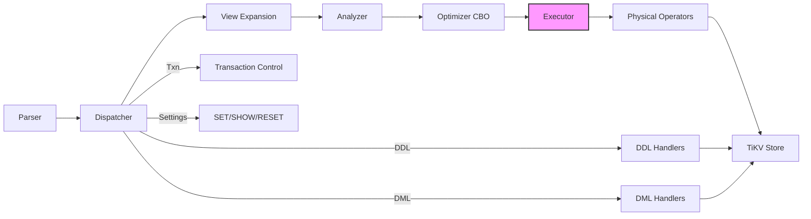
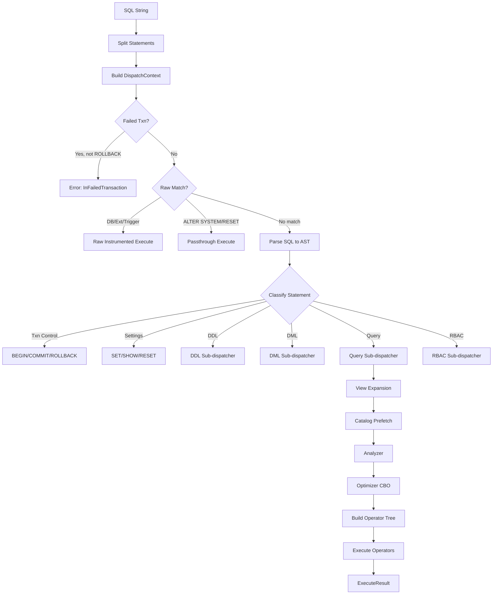

# Executor

| Attribute | Value |
|-----------|-------|
| Source path | `src/sql/executor/` |
| File count | 74 `.rs` files |
| Approx lines | ~32,500 |
| Last verified | 2026-02-28 |

---

## Overview

The Executor is the DDL/DML dispatch and SELECT execution layer of the db9-server SQL engine. It serves as the central routing hub that receives parsed SQL statements and directs them to the appropriate execution subsystem. For SELECT queries, it orchestrates the full pipeline: view expansion, catalog prefetch, analysis, optimization, operator tree construction, and result collection.

Key responsibilities:

- **Statement dispatch** -- classifying and routing SQL statements to DDL, DML, query, RBAC, or special-case handlers
- **View expansion** -- rewriting `FROM view_name` into `FROM (<view_query>) AS view_name` before analysis
- **Catalog prefetch** -- batch-fetching table schemas from TiKV to build a `CatalogSnapshot` for the Analyzer
- **Analyzed SELECT execution** -- the single-path pipeline from `AnalyzedQuery` through the CBO optimizer to the operator tree
- **Transaction management** -- autocommit, explicit transactions, savepoints, failed-transaction gates
- **Background SQL** -- `pg_background_launch()` / `pg_background_result()` via the worker engine
- **Plan caching** -- session-local prepared plan cache with schema-drift invalidation

---

## Architecture Position

The Executor sits between the Optimizer and the Physical Operators in the query pipeline, as defined in `docs/ARCHITECTURE.md`:



The Executor is the outermost orchestration layer. It does not perform any query optimization itself -- that is the Optimizer's responsibility. The Executor's job is to get data to and from the right pipeline stages, and to handle non-query statements (DDL, DML, transaction control, settings).

---

## Key Concepts

### Statement Dispatch (Phased State Machine)

The `execute_single` method implements a four-phase dispatch:

1. **Scaffold** (`DispatchContext`) -- pre-compute trimmed SQL, classification, and observability flags
2. **Failed-transaction precheck (I1)** -- reject disallowed statements in failed transactions (only ROLLBACK/COMMIT/END pass)
3. **Raw dispatch** -- handle statements that bypass `sqlparser` (database ops, extensions, triggers, ANALYZE, etc.)
4. **AST dispatch** -- parse SQL via `sqlparser` and route each AST statement node

Raw dispatch itself has two sub-paths:
- **Instrumented** -- records observability metrics and marks transactions failed on error
- **Passthrough** -- for ALTER SYSTEM SET and RESET, which bypass instrumentation (invariant I2)

### View Rewrite

Before the Analyzer sees any query, `expand_views_in_query()` recursively inlines view definitions:

```sql
-- Before rewrite:
SELECT * FROM my_view
-- After rewrite:
SELECT * FROM (SELECT a, b FROM base_table WHERE x > 0) AS my_view
```

This makes views transparent to the Analyzer and all downstream stages. Maximum expansion depth is 64 to guard against circular view references.

### Catalog Prefetch

The `build_catalog_snapshot()` function walks the raw AST to extract all referenced table names, then batch-fetches their schemas from TiKV. The resulting `CatalogSnapshot` provides the Analyzer with all metadata needed for name resolution and type checking, avoiding per-reference schema lookups during analysis.

### Analyzed SELECT Path

Every SELECT query follows one path: Analyzer produces `AnalyzedQuery` with fully typed `TypedExpr` nodes, the CBO optimizer converts it to a `PhysicalPlan`, and the build layer constructs a `BoxedOperator` tree that is executed via the Volcano iterator model.

### Background SQL (`bg_sql.rs`)

Implements `pg_background_launch()` and `pg_background_result()` functions. These enqueue SQL statements to the unified worker engine for asynchronous execution and allow retrieving results later.

### Plan Cache (`plan_cache.rs`)

Session-local cache for prepared statement plans. After N identical executions, the optimized `PhysicalPlan` is cached. Each entry tracks schema dependencies `(table_id, schema_version)` for automatic invalidation when table schemas change.

---

## File Map

### Top-level (`src/sql/executor/`)

| File | Purpose |
|------|---------|
| `mod.rs` | Module declaration, `Executor` struct definition, `BoxStmtFuture` type, trigger activation management |
| `bg_sql.rs` | Background SQL execution (`pg_background_launch`, `pg_background_result`) |
| `collation.rs` | Collation DDL handlers (CREATE/DROP COLLATION) |
| `cron.rs` | Cron scalar function execution (cron job management) |
| `cte.rs` | CTE decomposition helpers (`cte_is_recursive`, `decompose_recursive_union`) |
| `database.rs` | Database DDL (CREATE/DROP/ALTER DATABASE) |
| `ddl.rs` | DDL statement execution (CREATE TABLE, INDEX, VIEW, etc.) |
| `default_privileges.rs` | ALTER DEFAULT PRIVILEGES handler |
| `extensions.rs` | CREATE/DROP EXTENSION handlers |
| `triggers.rs` | Trigger DDL (CREATE/DROP TRIGGER) |
| `udt.rs` | User-defined type handlers (CREATE TYPE ENUM, ALTER TYPE, DROP TYPE) |
| `user_function.rs` | User-defined function execution |
| `advisory_locks.rs` | Advisory lock functions |

### Core dispatch (`src/sql/executor/core/`)

| File | Purpose |
|------|---------|
| `mod.rs` | Core module re-exports, `Executor` struct methods (stats loading, trigger management) |
| `dispatch/mod.rs` | Entry point: `execute()` and `execute_single()` phased state machine, `dispatch_raw!` macro (test-only) |
| `dispatch/scaffold.rs` | `DispatchContext` -- immutable pre-computed context for dispatch decisions |
| `dispatch/raw.rs` | Raw-SQL dispatch before parsing: instrumented and passthrough paths |
| `dispatch/ast.rs` | Parsed-SQL (AST) dispatch: routes each parsed statement to its handler |
| `dispatch/transaction.rs` | Transaction control helpers and observability permission checks |
| `dispatch/prepared.rs` | Prepared statement dispatch (SQL PREPARE/EXECUTE/DEALLOCATE) |
| `dispatch/guc.rs` | SET/SHOW variable handling |
| `dispatch/roles.rs` | SET ROLE handling |
| `dispatch/utils.rs` | Transaction mode validation, schema drift detection, runtime context helpers |
| `statement.rs` | `execute_statement_on_txn()` -- inner statement dispatch by `StatementDispatchKind` (DDL/DML/Query/RBAC) |
| `stmt_ddl.rs` | DDL statement sub-dispatcher |
| `stmt_dml.rs` | DML statement sub-dispatcher (uses Analyzer for all INSERT/UPDATE/DELETE) |
| `stmt_query.rs` | Query statement sub-dispatcher (SELECT, SHOW TABLES, EXPLAIN) |
| `stmt_rbac.rs` | RBAC statement sub-dispatcher (CREATE ROLE, GRANT, REVOKE) |
| `query_exec.rs` | `execute_query()` -- CTE context building and delegation to analyzed path |
| `plan_cache.rs` | Session-local prepared plan cache with schema-drift invalidation |
| `prepared_stmt.rs` | Prepared statement management |
| `prepared_analysis.rs` | Analyzer integration for prepared statements |
| `scan.rs` | Table scan helpers |
| `copy.rs` | COPY FROM handler |
| `alter.rs` | ALTER INDEX/TABLE helpers |
| `analyze.rs` | ANALYZE command execution |
| `analyze_rewrite.rs` | ANALYZE statement rewriting |
| `retry.rs` | Autocommit retry logic (`autocommit_backoff`, `is_retryable_tikv_error`) |
| `timeout.rs` | Statement timeout enforcement |
| `guc.rs` | GUC (Grand Unified Configuration) helpers |
| `misc.rs` | Utility functions (`starts_with_ignore_ascii_case`, `split_sql_statements`, skip/unsupported detection) |
| `observability.rs` | Observability user detection and system query classification |
| `settings_tableless.rs` | `current_setting()` and `set_config()` tableless SELECT handling |
| `tests.rs` | Unit tests for core dispatch invariants |

### View rewrite (`src/sql/executor/core/view_rewrite/`)

| File | Purpose |
|------|---------|
| `mod.rs` | `expand_views_in_query()` -- top-level view expansion entry point |
| `query.rs` | `expand_views_in_select()` -- SELECT-level view expansion |
| `table.rs` | `expand_views_in_table_factor()` -- FROM-clause table factor expansion, view resolution |
| `expr.rs` | `expand_views_in_expr()` -- expression-level view expansion (subqueries in WHERE, etc.) |

### Catalog prefetch (`src/sql/executor/core/catalog_prefetch/`)

| File | Purpose |
|------|---------|
| `mod.rs` | `build_catalog_snapshot()`, `build_catalog_snapshot_for_statement()` |
| `extraction.rs` | AST visitors that collect referenced table names and function calls |
| `resolution.rs` | Search-path resolution: table/view/function name resolution and schema fetching |
| `tests.rs` | Unit tests for catalog prefetch |

### Analyzed SELECT (`src/sql/executor/select/analyzed/`)

| File | Purpose |
|------|---------|
| `mod.rs` | `try_execute_analyzed()` -- entry point for the analyzed SELECT path |
| `pipeline.rs` | Pre-materialization, statistics loading, `PlanningContext`/`BuildContext` preparation |
| `pre_materialize.rs` | Pre-materialization of non-correlated async expressions |
| `materialize.rs` | Expression materialization helpers |
| `materialize_catalog.rs` | Catalog materialization for virtual tables |
| `expr_runtime.rs` | `ExprRuntime` -- runtime expression evaluation helpers for operators |
| `postprocess.rs` | Result post-processing (column naming, type mapping) |
| `joins.rs` | Join execution helpers |
| `rewrite.rs` | Query rewrite helpers |
| `subquery/mod.rs` | Subquery detection and materialization |
| `subquery/tests.rs` | Subquery tests |

### Analyzed DML (`src/sql/executor/dml_analyzed/`)

| File | Purpose |
|------|---------|
| `mod.rs` | Common DML helpers, `resolve_and_scan_table_ref()` |
| `insert.rs` | `execute_analyzed_insert()` -- analyzed INSERT execution |
| `update.rs` | `execute_analyzed_update()` -- analyzed UPDATE execution |
| `delete.rs` | `execute_analyzed_delete()` -- analyzed DELETE execution |

### Procedures (`src/sql/executor/procedure/`)

| File | Purpose |
|------|---------|
| `mod.rs` | Procedure module |
| `procedures.rs` | Stored procedure (CALL) execution |
| `materialized_views.rs` | REFRESH MATERIALIZED VIEW execution |

### Table utilities (`src/sql/executor/table_utils/`)

| File | Purpose |
|------|---------|
| `mod.rs` | Table utility module |
| `generate_series.rs` | `generate_series()` table function |
| `tests.rs` | Table utility tests |

---

## Public Interfaces

### `Executor` struct

```rust
// src/sql/executor/core/mod.rs
pub struct Executor {
    store: Arc<TikvStore>,
    auth_manager: AuthManager,
    tenant_keyspace: String,
    observability: Arc<TenantObservability>,
    tenant_memory_accountant: TenantMemoryAccountant,
    trigger_cache: Arc<TriggerBodyCache>,
    stats_cache: Arc<TableStatsCache>,
    pending_trigger_activations: Mutex<HashSet<String>>,
    pending_async_triggers: Mutex<Vec<PendingAsyncTrigger>>,
}
```

### Key methods

```rust
// Constructor
pub fn new(
    store: Arc<TikvStore>,
    tenant_keyspace: String,
    observability: Arc<TenantObservability>,
    tenant_memory_accountant: TenantMemoryAccountant,
    trigger_cache: Arc<TriggerBodyCache>,
    stats_cache: Arc<TableStatsCache>,
) -> Self

// Primary entry point: execute SQL string
pub async fn execute(
    &self, session: &mut Session, sql: &str
) -> Result<ExecuteResults>

// Inner statement dispatch on an existing transaction
pub(crate) fn execute_statement_on_txn<'a>(
    &'a self,
    txn: &'a mut Transaction,
    db_id: u64,
    sequence_values: &'a mut HashMap<String, i64>,
    search_path: &'a [String],
    stmt: &'a Statement,
    current_role: Option<&'a str>,
) -> BoxStmtFuture<'a>

// Analyzed SELECT execution
pub(crate) fn try_execute_analyzed<'a>(
    &'a self,
    txn: &'a mut Transaction,
    db_id: u64,
    sequence_values: &'a mut HashMap<String, i64>,
    search_path: &'a [String],
    query: &'a Query,
    ctes: &'a HashMap<String, (TableSchema, Vec<Row>)>,
    current_role: Option<&'a str>,
) -> Pin<Box<dyn Future<Output = Result<ExecuteResult>> + Send + 'a>>

// Statistics loading with in-memory cache + TiKV fallback
pub(crate) async fn get_or_load_stats(
    &self,
    txn: &mut tikv_client::Transaction,
    db_id: u64,
    table_id: u64,
) -> anyhow::Result<Option<Arc<TableStatistics>>>

// Privilege enforcement
pub(crate) async fn require_table_privilege(
    &self,
    txn: &mut Transaction,
    current_role: Option<&str>,
    privilege: Privilege,
    table_full_name: &str,
) -> Result<()>
```

### `DispatchContext`

```rust
// src/sql/executor/core/dispatch/scaffold.rs
pub(super) struct DispatchContext {
    pub sql_trimmed: String,
    pub sql_upper: String,
    pub sql_for_observability: String,
    pub raw_kind: Option<RawSqlKind>,
    pub is_observability_user: bool,
}
```

### `BoxStmtFuture`

```rust
// src/sql/executor/mod.rs
pub(crate) type BoxStmtFuture<'a> =
    std::pin::Pin<Box<dyn std::future::Future<Output = anyhow::Result<ExecuteResult>> + Send + 'a>>;
```

---

## Internal Design

### Dispatch Flow

The `execute()` method splits multi-statement SQL strings and calls `execute_single()` for each. `execute_single()` implements a phased state machine:

```
execute(sql)
  |
  +-- split_sql_statements(sql) --> Vec<&str>
  |
  +-- for each statement:
        execute_single(session, stmt)
          |
          +-- Phase 0: Build DispatchContext (scaffold)
          |     - Strip leading comments
          |     - Classify via RawSqlKind
          |     - Detect observability user
          |
          +-- Phase 1: Failed-transaction precheck (I1)
          |     - If txn is failed, only allow ROLLBACK/COMMIT/END
          |
          +-- Phase 2: Raw instrumented dispatch
          |     - First raw block: database/extension/comment/function/trigger
          |     - Skip-reason gate (unsupported statements)
          |     - Second raw block: alter/sequence/materialized-view/call/type/analyze
          |
          +-- Phase 3: Raw passthrough dispatch (I2)
          |     - ALTER SYSTEM SET / RESET (no observability recording)
          |
          +-- Phase 4: Parse + AST dispatch (I3)
                - parse_sql(sql) --> Vec<Statement>
                - For each AST node, route by statement type:
                    - Transaction control: BEGIN/COMMIT/ROLLBACK/SAVEPOINT
                    - Settings: SET/SHOW/RESET
                    - Prepared statements: PREPARE/EXECUTE/DEALLOCATE
                    - DDL/DML/Query: via execute_ddl_dml_with_autocommit()
```

### DDL/DML/Query Routing

When a parsed statement reaches the inner `execute_statement_on_txn_impl()`:

```rust
fn classify_statement(stmt: &Statement) -> StatementDispatchKind {
    // DDL: CREATE/ALTER/DROP TABLE/INDEX/VIEW/SCHEMA/SEQUENCE/FUNCTION
    // DML: INSERT/UPDATE/DELETE
    // Query: SELECT/SHOW TABLES/EXPLAIN
    // RBAC: CREATE ROLE/ALTER ROLE/GRANT/REVOKE
    // Unsupported: SET/COMMENT/COPY (in this context)
}
```

Each kind delegates to a sub-dispatcher module:
- `stmt_ddl.rs` -- handles CREATE TABLE (with privilege checks), CREATE INDEX, DROP, ALTER TABLE, etc.
- `stmt_dml.rs` -- builds a `CatalogSnapshot`, creates an Analyzer, analyzes the DML statement, then executes the resulting `AnalyzedInsert`/`AnalyzedUpdate`/`AnalyzedDelete`
- `stmt_query.rs` -- routes to `execute_query()`, `execute_show_tables()`, or `execute_explain()`

### Analyzed SELECT Execution Path

The analyzed SELECT path (`try_execute_analyzed`) follows this pipeline:

1. **View expansion** -- `expand_views_in_query()` inlines all view definitions
2. **CTE context building** -- materialize nested WITH clauses introduced by view expansion
3. **Analysis** -- `analyze_then_rewrite_query()` builds a `CatalogSnapshot`, runs the Analyzer, produces `AnalyzedQuery`
4. **Pre-materialization** -- `pre_materialize_query_body()` evaluates non-correlated async expressions (subqueries, sequences) and replaces them with constants
5. **Statistics loading** -- load table statistics into `PlanningContext` for cost-based optimization
6. **Optimization** -- `LogicalPlanner` -> `PhysicalPlanner` -> `PhysicalPlan`
7. **Operator tree construction** -- `build()` converts `PhysicalPlan` into `BoxedOperator`
8. **Execution** -- `execute_operator_tree()` runs open/next/close on the root operator
9. **Post-processing** -- format results as `ExecuteResult::Select`

---

## Data Flow Diagram



---

## Contracts and Invariants

These contracts are aligned with `docs/ARCHITECTURE.md`:

### I1: Failed-Transaction Precheck

When a transaction is in a failed state, only `ROLLBACK`, `COMMIT`, and `END` are allowed. All other statements return `SqlError::InFailedTransaction`. This matches PostgreSQL behavior.

### I2: Passthrough Dispatch

`ALTER SYSTEM SET` and `RESET` bypass instrumented dispatch. They produce no observability record and no automatic `mark_transaction_failed` on error. This is a structural guarantee, not a behavioral accident.

### I3: Parse-Error Remap Ordering

On parse failure:
1. Check `get_unsupported_reason` first -- if hit, return `Unsupported` (skip record, skip mark-failed)
2. Record zero-duration parse failure (non-observability users only)
3. Mark transaction failed if in a transaction
4. Return the parse error

### Single-Path Execution

Per `docs/ARCHITECTURE.md` section 1.2: every query follows exactly one code path. There is no hidden fallback or "try-new-then-old" logic. The `db9.use_optimizer` GUC is a no-op -- the optimizer is always on.

### Privilege Enforcement

`require_table_privilege(Select)` is called on every base table before query execution. Internal execution paths (trigger worker, internal plumbing) bypass RBAC when no user is provided.

### Autocommit Semantics

DDL/DML statements outside an explicit transaction are wrapped in an implicit autocommit transaction. On failure, the implicit transaction is rolled back. Retryable TiKV errors trigger `autocommit_backoff`.

---

## Error Handling

- **`SqlError`** -- structured errors with SQLSTATE codes (defined in `src/sql/error.rs`)
- **`SqlError::InFailedTransaction`** -- returned when attempting operations in a failed transaction
- **`SqlError::Unsupported(reason)`** -- returned for unsupported SQL constructs
- **`SqlError::PermissionDenied`** -- returned when RBAC checks fail
- **`StatementTimeoutError`** -- returned when a statement exceeds its configured timeout
- Transaction failure propagation: any error in a transaction marks it as failed (`mark_transaction_failed()`)
- Trigger activations are cleared on rollback and flushed on commit

---

## Testing

### Unit tests

- `src/sql/executor/core/dispatch/mod.rs` -- `dispatch_raw!` macro tests, failed-txn precheck invariants (T1-T7)
- `src/sql/executor/core/dispatch/raw.rs` -- ALTER SYSTEM SET, RESET, passthrough dispatch tests
- `src/sql/executor/core/dispatch/ast.rs` -- AST dispatch tests (SET, SHOW, transaction modes, prepared statements)
- `src/sql/executor/core/statement.rs` -- `classify_statement()` routing tests
- `src/sql/executor/core/tests.rs` -- core executor integration tests
- `src/sql/executor/core/catalog_prefetch/tests.rs` -- catalog prefetch tests
- `src/sql/executor/select/analyzed/subquery/tests.rs` -- subquery materialization tests
- `src/sql/executor/table_utils/tests.rs` -- table utility tests

### Integration tests

SQL integration tests are located in `tests/` (557 test files). Tests exercising executor behavior include DDL, DML, SELECT, transaction, and EXPLAIN tests.

---

## Common Task Index

| Task | Where to look |
|------|---------------|
| Add a new DDL statement | Add handler in `src/sql/executor/ddl.rs` or `src/sql/executor/core/stmt_ddl.rs`; if it needs raw dispatch, add a `RawSqlKind` variant and handler in `dispatch/raw.rs` |
| Add a new DML variant | Extend `AnalyzedStatement` in the Analyzer, add handler in `src/sql/executor/dml_analyzed/` |
| Add a new raw-SQL command | Add `RawSqlKind` variant, classification in `src/sql/raw_sql.rs`, handler in `dispatch/raw.rs` |
| Add a new session setting (GUC) | Add in `src/sql/session/settings.rs`, add SET/SHOW handling in `dispatch/guc.rs` |
| Debug dispatch routing | Start at `dispatch/mod.rs::execute_single()`, trace through phases |
| Debug SELECT execution | Start at `select/analyzed/mod.rs::try_execute_analyzed()` |
| Add a new EXPLAIN format | See `src/sql/explain/` |
| Add view rewrite for new AST node | Extend `view_rewrite/expr.rs` or `view_rewrite/table.rs` |
| Extend catalog prefetch for new statement type | Add extraction logic in `catalog_prefetch/extraction.rs` |
| Add plan cache support for new plan type | Extend `core/plan_cache.rs` |

---

## See Also

- [Operators](./Operators.md) -- Physical operator implementations (Volcano iterator model)
- `src/sql/optimizer/` -- CBO optimizer: LogicalPlan to PhysicalPlan to BoxedOperator
- `src/sql/ddl/` -- DDL implementation details (CREATE TABLE, CREATE INDEX, etc.)
- `src/sql/dml/` -- DML helpers (foreign keys, defaults, insert/update/delete)
- `src/sql/analyzer/` -- Semantic analysis: name resolution, type inference, scope checking
- `docs/ARCHITECTURE.md` -- System-wide architecture and execution pipeline
- `docs/architecture/sql-engine.md` -- SQL engine deep-dive
- `src/sql/AGENTS.md` -- SQL layer navigation guide
