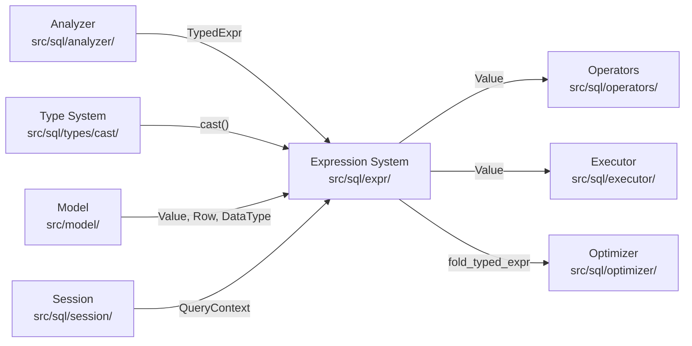
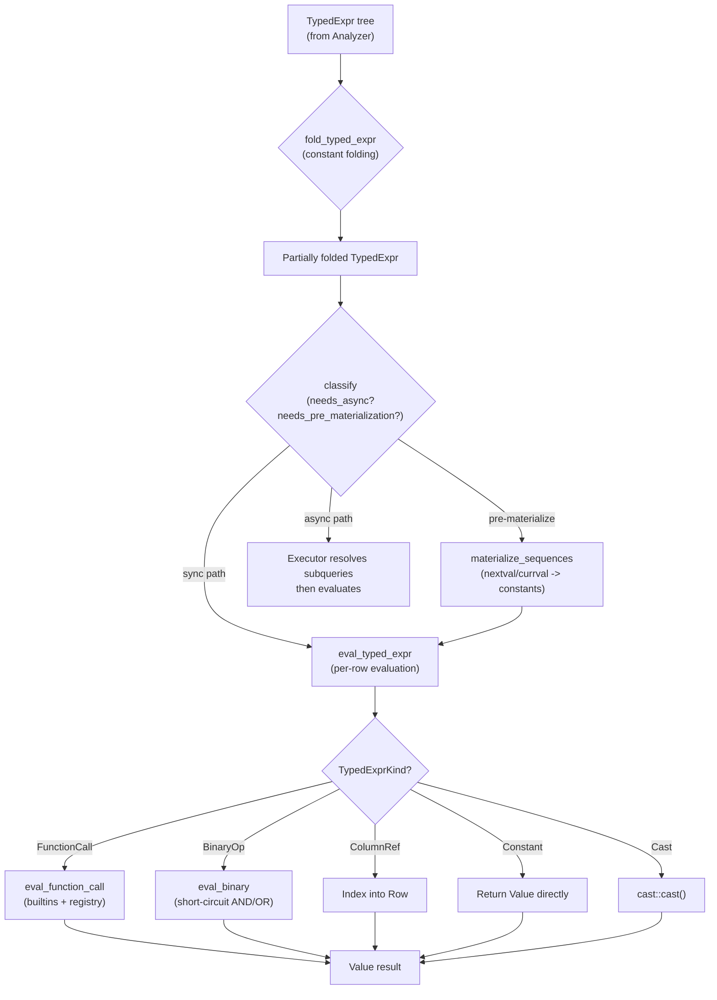

# Expression System

> **Source path:** `src/sql/expr/`
>
> **Files:** 31 | **Approximate lines:** ~16,300
>
> **Depends on:** Analyzer (`src/sql/analyzer/types/`), Type System (`src/sql/types/`), Model (`src/model/`)
>
> **Depended on by:** Executor (`src/sql/executor/`), Operators (`src/sql/operators/`), Optimizer (`src/sql/optimizer/`), DML (`src/sql/dml/`)

The expression system is the runtime evaluation engine for all SQL expressions in db9-server. It takes `TypedExpr` trees produced by the Analyzer and evaluates them against rows to produce `Value` results. The module also contains the function registry (13 categories, ~200 functions), expression traversal primitives, constant folding, expression classification, and collation-aware comparison.

---

## Architecture Position



The expression system sits at the boundary between static analysis (Analyzer) and physical execution (Operators/Executor). The Analyzer resolves names and infers types, producing `TypedExpr` nodes. The expression evaluator (`typed_eval`) consumes those nodes at runtime, requiring no further name resolution or type inference. This separation is a core design principle: all type checking happens at analysis time, and evaluation is a pure, synchronous, catalog-free operation.

---

## Key Concepts

### TypedExpr Evaluation

`TypedExpr` is the typed intermediate representation produced by the Analyzer. Each node carries a `TypedExprKind` (the expression variant) and a `DataType` (the resolved output type). The evaluator (`eval_typed_expr`) pattern-matches on `TypedExprKind` to evaluate each variant:

- **Leaf nodes**: `Constant`, `ColumnRef` (positional index into row), `Parameter` (bind parameter), `Default`
- **Operators**: `BinaryOp`, `UnaryOp`, `Cast`
- **Comparison/Logic**: `IsTest`, `IsDistinctFrom`, `Between`, `InList`, `ScalarArrayCmp`, `Like`, `SimilarTo`
- **Conditional**: `Case`, `Coalesce`, `NullIf`, `MinMax`
- **Functions**: `FunctionCall` (dispatched via registry + context-dependent builtins), `AggregateCall` (handled by aggregate operators), `WindowCall` (handled by window operators)
- **Subqueries**: `ScalarSubquery`, `Exists`, `InSubquery`, `AnyAll`, `ArraySubquery` (resolved at executor level before row evaluation)
- **Composite**: `ArrayLiteral`, `ArrayIndex`, `JsonAccess`, `Row`, `Collate`

### Expression Traversal

Two canonical traversal primitives in `traverse/mod.rs` enable all tree operations:

- **`for_each_child`**: yields references to each immediate `TypedExpr` child (read-only, left-to-right order)
- **`map_children`**: transforms each immediate child via a closure, rebuilding the node with new children

Built on these primitives:
- **`visit_any`**: stack-safe iterative predicate test over all descendants (avoids stack overflow on deeply nested ORM-generated expressions)
- **`map_children_async`**: async version for transforms that need `&mut Transaction` (e.g., sequence materialization)

### Function Registry (13 Categories)

All scalar SQL functions are registered in a global `HashMap<&'static str, SqlFn>` initialized via `OnceLock`. Each category module provides a `register()` function that inserts its functions into the map. The type signature is:

```rust
pub type SqlFn = fn(args: Vec<Value>) -> Result<Value>;
```

The 13 function categories are:

| Category | File | Functions | Description |
|----------|------|-----------|-------------|
| **array** | `functions/array.rs` (318 lines) | `ARRAY_LENGTH`, `ARRAY_UPPER`, `ARRAY_LOWER`, `CARDINALITY`, `ARRAY_POSITION`, `ARRAY_CAT`, `ARRAY_APPEND`, `ARRAY_PREPEND`, `ARRAY_REMOVE`, `ARRAY_TO_STRING`, `STRING_TO_ARRAY`, `UNNEST` | Array manipulation |
| **datetime** | `functions/datetime.rs` (291 lines) | `DATE_PART`/`EXTRACT`, `DATE_TRUNC`, `DATE`, `AGE`, `TO_CHAR` | Date/time extraction and formatting |
| **encoding** | `functions/encoding.rs` (153 lines) | `ENCODE`, `DECODE`, `MD5`, `SHA256`, `DIGEST` | Binary encoding and hashing |
| **fs9** | `functions/fs9.rs` (456 lines) | `FS9_READ`, `FS9_WRITE`, `FS9_EXISTS`, `FS9_SIZE`, `FS9_MTIME`, `FS9_REMOVE` | File system extension |
| **fts** | `functions/fts.rs` (83 lines) | `TO_TSVECTOR`, `TO_TSQUERY`, `PLAINTO_TSQUERY` | Full-text search |
| **json** | `functions/json.rs` (962 lines) | `JSONB_BUILD_OBJECT`, `JSONB_BUILD_ARRAY`, `JSONB_TYPEOF`, `JSONB_ARRAY_LENGTH`, `JSONB_EXISTS[_ANY/_ALL]`, `JSONB_OBJECT_KEYS`, `JSONB_EXTRACT_PATH[_TEXT]`, `JSONB_PRETTY`, `JSONB_SET`, `JSONB_ARRAY_ELEMENTS[_TEXT]`, `JSONB_EACH[_TEXT]`, `TO_JSON[B]`, `ROW_TO_JSON` | JSON/JSONB operations |
| **math** | `functions/math.rs` (558 lines) | `ABS`, `CEIL`, `FLOOR`, `ROUND`, `TRUNC`, `SQRT`, `CBRT`, `POWER`, `EXP`, `LN`, `LOG`, `MOD`, `SIGN`, `PI`, `DEGREES`, `RADIANS`, `SIN`, `COS`, `TAN`, `ASIN`, `ACOS`, `ATAN`, `ATAN2`, `DIV`, `HASHTEXT`, `WIDTH_BUCKET` | Mathematical functions |
| **misc** | `functions/misc.rs` (281 lines) | `COALESCE`, `NULLIF`, `GREATEST`, `LEAST`, `FORMAT`, `PG_COLUMN_SIZE`, `PG_TABLE_SIZE`, `OBJ_DESCRIPTION`, `COL_DESCRIPTION` | Miscellaneous utilities |
| **pg_compat** | `functions/pg_compat.rs` (648 lines) | `PG_GET_EXPR`, `HAS_TABLE_PRIVILEGE`, `HAS_SCHEMA_PRIVILEGE`, `HAS_DATABASE_PRIVILEGE`, `PG_TOTAL_RELATION_SIZE`, `PG_RELATION_SIZE`, `PG_ENCODING_TO_CHAR`, `ARRAY_AGG`, `JSON_AGG`, `JSONB_AGG`, `STRING_AGG`, `PG_TYPEOF`, `PG_SIZE_PRETTY`, `GENERATE_SERIES`, `REGEXP_SPLIT_TO_TABLE` | PostgreSQL compatibility functions |
| **regex** | `functions/regex.rs` (212 lines) | `REGEXP_REPLACE`, `REGEXP_MATCHES`, `REGEXP_MATCH`, `REGEXP_SPLIT_TO_ARRAY`, `REGEXP_COUNT`, `REGEXP_LIKE`, `REGEXP_SUBSTR`, `REGEXP_INSTR` | Regular expression functions |
| **string** | `functions/string.rs` (879 lines) | `UPPER`, `LOWER`, `LENGTH`, `CONCAT[_WS]`, `LEFT`, `RIGHT`, `TRIM`/`BTRIM`/`LTRIM`/`RTRIM`, `LPAD`, `RPAD`, `REPEAT`, `REPLACE`, `REVERSE`, `INITCAP`, `ASCII`, `CHR`, `STRPOS`, `SPLIT_PART`, `TRANSLATE`, `QUOTE_IDENT`/`QUOTE_LITERAL`/`QUOTE_NULLABLE`, `SUBSTRING`, `OVERLAY`, `POSITION` | String manipulation |
| **uuid** | `functions/uuid.rs` (64 lines) | `GEN_RANDOM_UUID`, `UUID_GENERATE_V4`, `UUIDV7` | UUID generation |
| **vector** | `functions/vector.rs` (226 lines) | `L2_DISTANCE`, `INNER_PRODUCT`, `COSINE_DISTANCE`, `VECTOR_DIMS`, `VECTOR_NORM` | pgvector-compatible distance functions |

### Constant Folding

The `typed_fold` module folds row-independent, sync-safe subtrees into `Constant` nodes before execution. This is a compiler optimization that reduces per-row evaluation cost. The folding is conservative: it skips `ColumnRef`, aggregates, windows, subqueries, parameters, volatile functions (`RANDOM`, `NEXTVAL`, `CLOCK_TIMESTAMP`, etc.), and user-defined functions. CASE expressions receive special dead-branch-elimination: if a WHEN condition folds to `TRUE`, all subsequent branches and the ELSE clause are pruned.

### Expression Classification

The `classify` module provides predicates used for execution routing and optimization:

- **`needs_async(expr)`**: true if the expression contains subqueries, catalog-dependent functions, or correlated references
- **`needs_pre_materialization(expr)`**: true if the expression contains subquery nodes or sequence functions
- **`is_volatile(expr)`**: true if the expression contains volatile/side-effecting functions
- **`has_correlated_ref(expr)`**: true if any `ColumnRef` has `scope_depth > 0`

---

## File Map

| File | Lines | Purpose |
|------|-------|---------|
| `mod.rs` | 597 | Module root; `like_match`, `similar_to_match`, `parse_interval_string`, `parse_timestamp_string`, `eval_json_access`, `compare_values` |
| `typed_eval/mod.rs` | 573 | **Core evaluator**: `eval_typed_expr` -- pattern-matches all `TypedExprKind` variants |
| `typed_eval/arithmetic.rs` | 341 | Binary/unary operator evaluation with short-circuit AND/OR, bitwise ops, shift ops |
| `typed_eval/helpers.rs` | 239 | Function dispatch (`eval_function_call`), timezone evaluation, array indexing, JSON op mapping |
| `typed_eval/tests.rs` | 2,394 | Unit tests for the typed evaluator |
| `operators.rs` | 1,292 | Legacy operator evaluation: `eval_binary_op`, `compare_values`, `compare_order_by_values`, regex cache |
| `traverse/mod.rs` | 680 | Canonical traversal primitives: `for_each_child`, `map_children`, `visit_any`, `AsyncExprTransform`, `map_children_async` |
| `traverse/tests.rs` | 273 | Traversal tests |
| `typed_fold.rs` | 374 | Constant folding: `fold_typed_expr`, `is_fold_candidate`, `is_volatile_or_side_effecting_builtin` |
| `numeric.rs` | 313 | `NumericValue` type promotion (Int32 < Int64 < Decimal < Float64) and arithmetic operations |
| `typed_rewrite.rs` | 228 | Async sequence materialization: `materialize_sequences_in_typed_expr` (nextval/currval/setval -> constants) |
| `classify.rs` | 208 | Expression classification: `needs_async`, `needs_pre_materialization`, `is_volatile`, `has_correlated_ref` |
| `static_eval.rs` | 119 | Row-independent evaluation: `eval_static_typed_expr`, `is_row_dependent`, `needs_async_materialization` |
| `typed_visit.rs` | 62 | Thin wrapper (`expr_any`) over `traverse::visit_any` for backward compatibility |
| `collation_aware.rs` | 58 | Collation-aware comparison: `extract_collation`, `compare_with_collation_from_expr` |
| `compile.rs` | 28 | Bridge from AST to TypedExpr: `compile_const_expr`, `compile_row_expr_for_table` |
| `bridge.rs` | 35 | Convenience bridge: `eval_const_ast_expr`, `eval_ast_expr_with_row` (AST -> Analyzer -> eval) |
| `functions/mod.rs` | 46 | Function registry (`OnceLock<HashMap>`), `get_registry()`, dispatches to 13 category modules |
| `functions/string.rs` | 879 | String functions |
| `functions/json.rs` | 962 | JSON/JSONB functions |
| `functions/pg_compat.rs` | 648 | PostgreSQL compatibility functions |
| `functions/math.rs` | 558 | Mathematical functions |
| `functions/fs9.rs` | 456 | fs9 file system functions |
| `functions/array.rs` | 318 | Array functions |
| `functions/datetime.rs` | 291 | Date/time functions |
| `functions/vector.rs` | 226 | pgvector distance functions |
| `functions/regex.rs` | 212 | Regex functions |
| `functions/encoding.rs` | 153 | Encoding and hashing functions |
| `functions/fts.rs` | 83 | Full-text search functions |
| `functions/uuid.rs` | 64 | UUID generation functions |
| `functions/misc.rs` | 281 | Miscellaneous functions |

---

## Public Interfaces

### Core Evaluation

```rust
// src/sql/expr/typed_eval/mod.rs

/// Evaluate a typed expression against a row.
/// All name resolution was done at analysis time.
/// Uses stacker::maybe_grow for stack overflow protection.
pub fn eval_typed_expr(expr: &TypedExpr, row: &Row, qctx: &QueryContext) -> Result<Value>

/// Evaluate a constant TypedExpr as non-negative usize (LIMIT/OFFSET helper).
pub(crate) fn eval_const_usize(expr: &TypedExpr, null_as_zero: bool) -> Result<usize>
```

### Static Evaluation

```rust
// src/sql/expr/static_eval.rs

/// Return true when an expression requires row values.
pub fn is_row_dependent(expr: &TypedExpr) -> bool

/// Evaluate a row-independent typed expression.
pub fn eval_static_typed_expr(expr: &TypedExpr, qctx: &QueryContext) -> Result<Value>
```

### Traversal Primitives

```rust
// src/sql/expr/traverse/mod.rs

/// Yields references to each immediate TypedExpr child (read-only, left-to-right).
pub fn for_each_child<'a>(expr: &'a TypedExpr, f: &mut impl FnMut(&'a TypedExpr))

/// Transform each immediate child via f, rebuilding the TypedExprKind.
pub fn map_children(
    expr: &TypedExpr,
    f: &mut impl FnMut(&TypedExpr) -> TypedExpr,
) -> TypedExprKind

/// Stack-safe iterative visit. Returns true if predicate matches any node.
pub fn visit_any(expr: &TypedExpr, mut predicate: impl FnMut(&TypedExpr) -> bool) -> bool

/// Trait for async expression transforms (e.g., sequence materialization).
pub(crate) trait AsyncExprTransform: Send {
    fn transform_expr<'a>(
        &'a mut self,
        expr: &'a TypedExpr,
    ) -> Pin<Box<dyn Future<Output = Result<TypedExpr>> + Send + 'a>>;
}
```

### Constant Folding

```rust
// src/sql/expr/typed_fold.rs

/// Fold row-independent constant subtrees inside a typed expression.
pub fn fold_typed_expr(expr: &TypedExpr, qctx: &QueryContext) -> TypedExpr

/// Return true if an expression is safe to fold (no columns, no volatile fns, no subqueries).
pub(crate) fn is_fold_candidate(expr: &TypedExpr) -> bool
```

### Classification

```rust
// src/sql/expr/classify.rs

/// Check if a TypedExpr needs async (per-row) materialization.
pub(crate) fn needs_async(expr: &TypedExpr) -> bool

/// Check if a TypedExpr needs pre-materialization before operator execution.
pub(crate) fn needs_pre_materialization(expr: &TypedExpr) -> bool

/// Check if a TypedExpr contains a volatile or side-effecting function.
pub(crate) fn is_volatile(expr: &TypedExpr) -> bool

/// Check if a TypedExpr contains a correlated reference (scope_depth > 0).
pub(crate) fn has_correlated_ref(expr: &TypedExpr) -> bool
```

### Function Registry

```rust
// src/sql/expr/functions/mod.rs

pub type SqlFn = fn(args: Vec<Value>) -> Result<Value>;

/// Get the global function registry (lazily initialized).
pub fn get_registry() -> &'static HashMap<&'static str, SqlFn>
```

### Bridge (AST -> TypedExpr -> Value)

```rust
// src/sql/expr/bridge.rs

/// Evaluate a constant AST expression (no row context).
pub fn eval_const_ast_expr(expr: &sqlparser::ast::Expr) -> Result<Value>

/// Evaluate an AST expression against a single-table row.
pub fn eval_ast_expr_with_row(
    expr: &sqlparser::ast::Expr,
    row: &Row,
    schema: &TableSchema,
    alias: &str,
) -> Result<Value>
```

### Value Comparison

```rust
// src/sql/expr/mod.rs

/// Compare two Values, returning -1, 0, or 1.
pub fn compare_values(left: &Value, right: &Value) -> Result<i8>

/// Compare two Values for ORDER BY with ASC/DESC and NULLS FIRST/LAST.
pub fn compare_order_by_values(
    left: &Value, right: &Value, asc: bool, nulls_first: bool,
) -> Result<std::cmp::Ordering>
```

---

## Internal Design

### Typed Evaluation Pipeline

The core evaluation function `eval_typed_expr` follows a direct pattern-match design:

1. **Stack protection**: Wraps evaluation in `stacker::maybe_grow(32KB, 1MB)` to handle deeply nested expressions without stack overflow.
2. **Leaf evaluation**: Constants return directly; `ColumnRef` indexes into the row; `Parameter` indexes into `qctx.params`.
3. **Operator evaluation**: Binary operators check for short-circuit (AND/OR), then delegate to `eval_binary` which maps analyzer `BinaryOp` to sqlparser `BinaryOperator` and calls `eval_binary_op`. Collation-aware comparison is checked for text comparisons.
4. **Function dispatch**: `eval_function_call` in `helpers.rs` checks context-dependent builtins first (NOW, CURRENT_DATE, PG_BACKEND_PID, VERSION, CURRENT_USER, etc.), then cron/bg_sql functions, then falls back to the global registry lookup.
5. **Boundary enforcement**: Aggregates, windows, and subqueries return errors -- they must be resolved by their respective operators/executor before row-level evaluation reaches them.

### Numeric Type Promotion

The `numeric.rs` module defines a type promotion hierarchy: `Int32(1) < Int64(2) < Decimal(3) < Float64(4)`. When two numeric operands have different types, `NumericValue::promote_pair` promotes both to the higher-priority type before performing the operation. This matches PostgreSQL's implicit type coercion rules.

### Sequence Materialization

The `typed_rewrite` module provides `materialize_sequences_in_typed_expr`, an async transform that walks a `TypedExpr` tree and replaces `nextval`/`currval`/`setval` function calls with their computed `Constant` values. This uses the `AsyncExprTransform` trait and `map_children_async` for recursive tree traversal with `&mut Transaction` state.

---

## Data Flow Diagram



---

## Contracts and Invariants

1. **No runtime name resolution.** All `ColumnRef` nodes use positional indices resolved at analysis time. The evaluator never touches the catalog.

2. **Sync-only evaluation.** `eval_typed_expr` is synchronous and never performs I/O. Subqueries, aggregates, and windows are opaque boundaries that must be resolved before evaluation reaches them.

3. **SQL three-valued logic.** All comparison operators correctly propagate NULL: `NULL op X -> NULL` (except IS NULL, IS DISTINCT FROM, COALESCE, NULLIF which have their own NULL semantics).

4. **Short-circuit semantics.** AND returns `false` immediately if the left operand is `false`. OR returns `true` immediately if the left operand is `true`. This is critical for both correctness (avoiding division-by-zero in guarded expressions) and performance.

5. **Traversal order.** All traversal functions follow left-to-right, depth-first order. For `BinaryOp { left, right }`, `left` is visited/transformed before `right`.

6. **Subquery boundary.** Traversal primitives (`for_each_child`, `map_children`) do NOT descend into `AnalyzedQuery` payloads inside subquery variants. Callers needing subquery descent must handle those variants explicitly.

7. **Function registry immutability.** The registry is initialized once via `OnceLock` and is thereafter immutable. All functions have the signature `fn(Vec<Value>) -> Result<Value>`.

8. **Fold safety.** Constant folding only folds subtrees that are provably row-independent, sync-safe, and non-volatile. Volatile functions (RANDOM, NEXTVAL, CLOCK_TIMESTAMP, etc.) are never folded.

---

## Error Handling

- **Type mismatches** at evaluation time produce `anyhow::Error` with descriptive messages (e.g., "AND requires boolean operands", "cannot negate value of type text").
- **Division by zero** returns `SqlError::DivisionByZero` (mapped to SQLSTATE 22012).
- **Numeric overflow** returns `SqlError::NumericValueOutOfRange` (mapped to SQLSTATE 22003).
- **Unknown function** returns `SqlError::Unsupported` with the function name.
- **Unresolved subqueries/aggregates/windows** produce clear errors indicating the expression must be resolved at executor level.
- **Regex compilation errors** are caught and returned as `anyhow::Error`. A process-wide regex cache (bounded at 256 entries) avoids repeated compilation.
- **Stack overflow protection**: `stacker::maybe_grow` ensures deeply nested expressions (common in ORM-generated SQL) do not crash the process.

---

## Testing

- **`typed_eval/tests.rs`** (2,394 lines): Comprehensive unit tests for all `TypedExprKind` variants including arithmetic, comparisons, CASE, COALESCE, NULLIF, IN lists, LIKE, BETWEEN, functions, casts, and NULL propagation.
- **`traverse/tests.rs`** (273 lines): Tests for traversal primitives including `for_each_child`, `map_children`, and `visit_any` with various expression shapes.
- **`typed_fold.rs` tests**: Tests constant folding for arithmetic, functions, volatile function exclusion, user-defined function exclusion, and CASE dead-branch elimination.
- **`static_eval.rs` tests**: Tests static evaluation, row-dependent rejection, and context-dependent function evaluation.
- **`classify.rs` tests**: Tests `needs_pre_materialization` and `needs_async` on deep expression trees (2048 levels) to verify stack safety.
- **`typed_rewrite.rs` tests**: Tests sequence function detection and `parse_setval_is_called`.
- **`numeric.rs` tests**: Tests numeric type promotion and arithmetic operations.
- **Integration tests**: SQL test files in `tests/` exercise expression evaluation end-to-end through the full query pipeline.

---

## Common Task Index

| Task | Where to Look |
|------|---------------|
| **Add a new SQL function** | Create the function as `fn(Vec<Value>) -> Result<Value>` in the appropriate `functions/<category>.rs`, then add `map.insert("FUNCTION_NAME", function_name)` in that module's `register()` function. |
| **Add a new function category** | Create `functions/<category>.rs` with a `pub fn register(map: &mut HashMap<&'static str, SqlFn>)`, add `pub mod <category>` in `functions/mod.rs`, and call `<category>::register(&mut map)` in `init_registry()`. |
| **Add a context-dependent builtin** | Add a match arm in `eval_function_call()` in `typed_eval/helpers.rs` before the registry lookup. Context-dependent functions read from `QueryContext`. |
| **Add a new TypedExprKind variant** | 1. Add the variant in `src/sql/analyzer/types/`. 2. Add evaluation logic in `typed_eval/mod.rs`. 3. Add traversal support in `traverse/mod.rs` (`for_each_child` + `map_children_match!`). 4. Update `classify.rs` if needed. |
| **Fix NULL propagation** | Check the relevant match arm in `eval_typed_expr_inner()`. SQL three-valued logic requires `NULL op X -> NULL` for most operators. |
| **Add collation-aware comparison** | Modify `collation_aware.rs` and the collation extraction in `typed_eval/arithmetic.rs`. |
| **Mark a function as volatile** | Add its name to `is_volatile_or_side_effecting_builtin()` in `typed_fold.rs`. This prevents constant folding and enables correct classification. |
| **Debug expression evaluation** | Start at `eval_typed_expr` in `typed_eval/mod.rs`, then follow the match arm for the specific `TypedExprKind`. |

---

## See Also

- [Architecture Overview](../Architecture-Overview.md) -- system-wide architecture and query pipeline
- `src/sql/analyzer/types/` -- `TypedExpr`, `TypedExprKind`, `BinaryOp`, `UnaryOp` definitions
- `src/sql/types/` -- type inference, coercion, and cast rules
- `src/sql/types/registry/` -- `FunctionRegistry` for aggregate/window function type resolution
- `src/sql/operators/` -- physical operators that consume expression evaluation results
- `src/sql/query_context.rs` -- `QueryContext` definition (timestamps, connection ID, database name, etc.)
