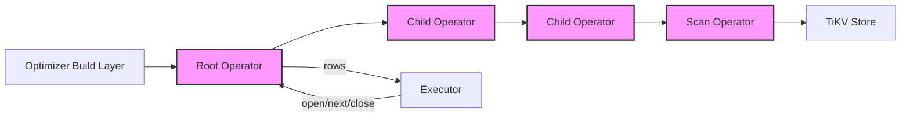
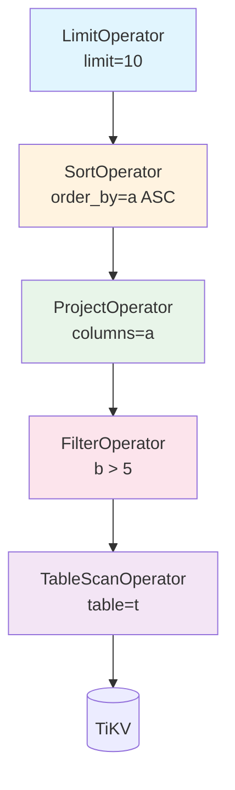
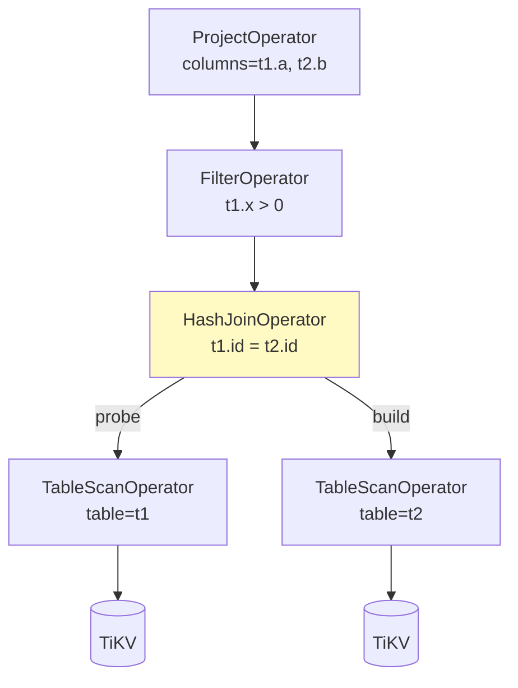

# Physical Operators

| Attribute | Value |
|-----------|-------|
| Source path | `src/sql/operators/` |
| File count | 25 `.rs` files |
| Approx lines | ~10,200 |
| Last verified | 2026-02-28 |

---

## Overview

The Physical Operators module implements the Volcano-style pull-based iterator model for query execution in db9-server. Each operator implements the `PhysicalOperator` trait with `open()` / `next()` / `close()` semantics, producing rows one at a time from leaf nodes (scans) through intermediate processing nodes (filter, project, sort, aggregate) to the root.

The operator tree is constructed by the Optimizer's build layer (`src/sql/optimizer/build/`) from a `PhysicalPlan`. The Executor drives the tree by calling `open()` on the root, repeatedly calling `next()` to pull rows, and finally calling `close()`.

### Operator categories

| Category | Operators | Description |
|----------|-----------|-------------|
| **Scan** | `TableScan`, `IndexScan`, `RangeIndexScan`, `InListScan`, `HnswScan`, `CTEScan`, `TableFunctionScan` | Leaf operators that read from TiKV, HNSW indexes, CTEs, or generated data |
| **Filter** | `Filter` | Row filtering with typed predicates |
| **Projection** | `Project` | Column selection, expression evaluation, set-returning function (SRF) expansion |
| **Sort** | `Sort` | ORDER BY with memory limit enforcement |
| **Aggregate** | `HashAggregate` | GROUP BY with hash table, supports DISTINCT and FILTER aggregates |
| **Join** | `NestedLoopJoin`, `HashJoin`, `HashSemiJoin` | Inner/Left/Right/Full/Cross joins and Semi/Anti joins |
| **Limit** | `Limit` | LIMIT/OFFSET handling with expression evaluation |
| **Distinct** | `Distinct`, `DistinctOn` | DISTINCT and DISTINCT ON deduplication |
| **Window** | `Window` | Window functions: ranking, aggregates, access functions |
| **Set** | `SetOperation` | UNION/INTERSECT/EXCEPT (ALL variants) |

---

## Architecture Position



Physical operators sit at the bottom of the SQL engine pipeline, below the Optimizer and above the Storage layer. As defined in `docs/ARCHITECTURE.md` section 3 (Execution Pipeline):

```
PhysicalPlan → BoxedOperator → open() → next() → close() → ExecuteResult
```

---

## Key Concepts

### `BoxedOperator`

All operators are trait objects behind a `Box<dyn PhysicalOperator>`:

```rust
pub type BoxedOperator = Box<dyn PhysicalOperator>;
```

This allows heterogeneous operator trees with dynamic dispatch.

### Volcano Iterator Model

Every operator follows the three-phase lifecycle:

1. **`open()`** -- initialize state, open child operators, acquire resources (e.g., scan from TiKV, build hash table)
2. **`next()`** -- return the next output row (`Ok(Some(row))`), or `Ok(None)` when exhausted
3. **`close()`** -- release resources, close child operators, free memory

This model enables **pipeline execution**: rows flow from leaf to root without full materialization, except for blocking operators (Sort, HashAggregate, Window, SetOperation) that must buffer their inputs.

### `ExecutionContext`

The runtime context threaded through all operator calls:

```rust
pub struct ExecutionContext<'a> {
    pub executor: &'a Executor,
    pub txn: &'a mut Transaction,
    pub store: Arc<TikvStore>,
    pub db_id: u64,
    pub search_path: &'a [String],
    pub sequence_values: &'a mut HashMap<String, i64>,
    pub cte_tables: &'a HashMap<String, (TableSchema, Vec<Row>)>,
    pub query_ctx: &'a QueryContext,
    pub outer_row: Option<Row>,
}
```

The `outer_row` field supports correlated subqueries (LATERAL joins) where operators need access to the current row from an outer scope.

### Memory Management

Operators track memory usage via `try_grow_statement_memory_scope()` and `try_shrink_statement_memory_scope()`. This integrates with the per-tenant memory accountant to enforce memory limits:

- Sort operator: enforces `db9.max_sort_bytes` limit during materialization
- Hash join: enforces `max_memory_bytes` for the build-side hash table (default 256 MB)
- Distinct: tracks hash set memory growth
- Collect-all helper: tracks buffered row memory

---

## File Map

| File | Operator(s) | Description |
|------|-------------|-------------|
| `mod.rs` | `PhysicalOperator` trait, `BoxedOperator`, `collect_all()` | Core trait definition and module root |
| `context.rs` | `ExecutionContext` | Runtime execution context |
| `executor.rs` | `execute_operator_tree()`, `execute_operator_tree_with_ctes()` | Top-level operator tree execution entry points |
| `scan.rs` | `TableScanOperator`, `IndexScanOperator`, `RangeIndexScanOperator`, `InListScanOperator`, `IndexScanBase` | All scan operators and shared index scan infrastructure |
| `filter.rs` | `FilterOperator` | Predicate evaluation (sync and async paths) |
| `project.rs` | `ProjectOperator`, `SrfKind`, `detect_srf()`, `eval_srf()` | Column projection, expression evaluation, SRF expansion |
| `sort.rs` | `SortOperator` | ORDER BY with collation support and memory limit enforcement |
| `aggregate.rs` | `HashAggregateOperator`, `AggregateExpr` | GROUP BY hash aggregate with DISTINCT/FILTER/ORDER BY support |
| `join.rs` | `NestedLoopJoinOperator`, `JoinType` | Streaming nested-loop join (materializes right/inner side only) |
| `hash_join/mod.rs` | `HashJoinOperator`, `HashJoinConfig`, `HashJoinType` | Hash join: build-phase + probe-phase for equi-joins |
| `hash_join/hash_table.rs` | `JoinHashTable` | In-memory hash table for join key lookup |
| `hash_join/tests.rs` | -- | Hash join unit tests |
| `hash_semi_join.rs` | `HashSemiJoinOperator` | Hash-based semi/anti join for EXISTS/NOT EXISTS decorrelation |
| `limit.rs` | `LimitOperator` | LIMIT/OFFSET with expression evaluation |
| `distinct.rs` | `DistinctOperator`, `DistinctOnOperator` | DISTINCT (full row) and DISTINCT ON (expression-based) deduplication |
| `window/mod.rs` | `WindowOperator`, `WindowFunctionExpr` | Window function framework: partition, order, compute |
| `window/ranking.rs` | -- | `row_number`, `rank`, `dense_rank`, `ntile`, `percent_rank`, `cume_dist` |
| `window/aggregates.rs` | -- | Window aggregate variants: `sum`, `count`, `avg`, `min`, `max` |
| `window/access.rs` | -- | `lag`, `lead`, `first_value`, `last_value`, `nth_value` |
| `window/tests.rs` | -- | Window function tests |
| `cte.rs` | `CTEScanOperator` | CTE materialized scan (pre-computed rows) |
| `set_operation.rs` | `SetOperationOperator`, `SetOperationType` | UNION/INTERSECT/EXCEPT (with ALL variants) |
| `table_function.rs` | `TableFunctionScanOperator` | Streaming table function results via `mpsc::Receiver<Row>` |
| `hnsw_scan.rs` | `HnswScanOperator` | HNSW approximate nearest neighbor scan (usearch FFI) |
| `key_encoding.rs` | `encode_value_key()`, `encode_values_key()` | Binary key encoding for hash tables and deduplication sets |
| `tests.rs` | -- | Cross-operator integration tests |

---

## Public Interfaces

### `PhysicalOperator` trait

```rust
// src/sql/operators/mod.rs
#[async_trait]
pub trait PhysicalOperator: Send + Sync + Debug {
    /// Return the output schema of this operator.
    fn schema(&self) -> &TableSchema;

    /// Initialize the operator and its children.
    async fn open(&mut self, ctx: &mut ExecutionContext<'_>) -> Result<()>;

    /// Get the next output row. Returns None when exhausted.
    async fn next(&mut self, ctx: &mut ExecutionContext<'_>) -> Result<Option<Row>>;

    /// Close the operator and release resources.
    async fn close(&mut self, ctx: &mut ExecutionContext<'_>) -> Result<()>;

    /// Child operators (for EXPLAIN tree traversal).
    fn children(&self) -> Vec<&dyn PhysicalOperator> { vec![] }

    /// Mutable child operators.
    fn children_mut(&mut self) -> Vec<&mut dyn PhysicalOperator> { vec![] }

    /// Estimated output row count for query planning.
    fn estimated_rows(&self) -> Option<usize> { None }

    /// Operator name for EXPLAIN output.
    fn name(&self) -> &'static str;

    /// Additional EXPLAIN info (predicates, columns, etc.).
    fn explain_info(&self) -> Option<String> { None }
}
```

### `collect_all()` helper

```rust
// src/sql/operators/mod.rs
pub async fn collect_all(
    op: &mut dyn PhysicalOperator,
    ctx: &mut ExecutionContext<'_>,
) -> Result<Vec<Row>>
```

Collects all rows from an operator into a `Vec`. Used by blocking operators (Sort, HashAggregate, SetOperation) that need to materialize their inputs. Tracks memory via `try_grow_statement_memory_scope`.

### `execute_operator_tree()`

```rust
// src/sql/operators/executor.rs
pub async fn execute_operator_tree(
    executor: &Executor,
    operator: &mut BoxedOperator,
    txn: &mut Transaction,
    store: Arc<TikvStore>,
    db_id: u64,
    search_path: &[String],
    sequence_values: &mut HashMap<String, i64>,
) -> Result<Vec<Row>>
```

Top-level entry point that builds an `ExecutionContext` and drives the full open/next/close lifecycle on the root operator.

---

## Internal Design

### TableScanOperator

Reads all rows from a TiKV table during `open()`, buffers them in memory, and yields them one at a time via `next()`. Supports CTE tables (looked up by name in `ctx.cte_tables`), preloaded rows (for materialized subqueries), and scan limits.

```rust
pub struct TableScanOperator {
    schema: TableSchema,
    scan_limit: Option<usize>,
    buffer: Vec<Row>,
    position: usize,
    opened: bool,
    preloaded: bool,
}
```

### IndexScanOperator / RangeIndexScanOperator / InListScanOperator

All index scan variants share `IndexScanBase` which handles the common pipeline:

1. Look up index metadata from the schema
2. Scan the index to collect primary key values (`pk_queue`)
3. Batch-fetch rows from TiKV in chunks of 256 (`OPERATOR_BATCH_FETCH_SIZE`)
4. Yield rows from the row buffer, refilling batches as needed

```
Index -> PKs (pk_queue) -> batch_get_rows -> row_buffer -> next()
```

- `IndexScanOperator` -- point/prefix lookup (exact or prefix match on index columns)
- `RangeIndexScanOperator` -- range scan with start/end bounds and inclusivity flags
- `InListScanOperator` -- multi-value lookup (IN list), deduplicates PKs

### FilterOperator

A streaming operator that pulls rows from its child and evaluates a `TypedExpr` predicate. Supports both synchronous (pure expression) and asynchronous (subquery-containing) predicates:

```rust
pub struct FilterOperator {
    child: BoxedOperator,
    predicate: TypedExpr,
    opened: bool,
}
```

NULL predicates are treated as `false` (no row emitted), matching PostgreSQL three-valued logic.

### ProjectOperator

Evaluates a list of `TypedExpr` expressions for each input row to produce output columns. Also handles set-returning functions (SRFs) like `UNNEST`, `regexp_split_to_table`, `jsonb_array_elements`, and `generate_subscripts`:

- If no SRFs, fast path: one output row per input row
- If SRFs present: expands one input row to N output rows, buffering extras in `srf_buffer`
- Empty SRF output (like PostgreSQL): suppresses the input row entirely

### SortOperator

A **blocking** operator that materializes all input rows during `open()`, computes sort keys, and sorts in memory:

1. Consume all child rows, enforcing `db9.max_sort_bytes` memory limit
2. Compute sort keys (evaluate ORDER BY expressions on each row)
3. Sort using `sort_by_fallible` (handles comparison errors gracefully)
4. Yield sorted rows via `next()`

Supports multi-column sort with ASC/DESC, NULLS FIRST/LAST, and collation-aware comparison.

### HashAggregateOperator

A **blocking** operator for GROUP BY:

1. Consume all input rows
2. Compute group key (binary encoding via `encode_values_key`) and evaluate aggregate arguments
3. Build a `HashMap<group_key, Vec<Aggregator>>` where each `Aggregator` tracks running state
4. Finalize aggregators and emit one row per group

Supports: COUNT, SUM, AVG, MIN, MAX, BOOL_AND, BOOL_OR, STRING_AGG, ARRAY_AGG, JSON_AGG, JSONB_AGG, JSONB_OBJECT_AGG, etc. Supports `DISTINCT` within aggregates and `FILTER (WHERE ...)` clauses.

### NestedLoopJoinOperator

A streaming nested-loop join that materializes only the right (inner) side:

1. `open()`: open left child, materialize right child rows into `right_rows`
2. `next()`: for each left row, scan all right rows applying the join condition
3. Supports INNER, LEFT, RIGHT, FULL, and CROSS join types
4. For RIGHT/FULL joins: tracks `right_matched` to emit unmatched right rows after left side is exhausted

Memory usage: O(|right|) instead of O(|left| x |right|).

For LATERAL/correlated joins (`right_depends_on_outer = true`), re-executes the right child for each left row.

### HashJoinOperator

Classic hash join for equi-joins:

1. **Build phase**: materialize the build side into a `JoinHashTable`
2. **Probe phase**: stream the probe side, hash each row's join keys, look up matching build rows

Key design decisions:
- NULL never equals anything (including NULL) -- rows with NULL join keys are stored separately and never match
- Output column order is always `left + right`, regardless of which side is build
- Configurable `max_memory_bytes` (default 256 MB) for the build-side hash table
- Supports INNER, LEFT, RIGHT, and FULL join types
- Non-equi join filter applied after hash match

### HashSemiJoinOperator

Hash-based semi/anti join for EXISTS/NOT EXISTS decorrelation:

- **Semi-join** (`anti = false`): emit left row on FIRST match in build side, skip to next
- **Anti-join** (`anti = true`): emit left row only if ZERO matches in build side

Output schema = left-side columns ONLY. Reuses `JoinHashTable` from the hash join module.

### LimitOperator

Streaming operator that tracks rows returned and rows skipped:

```rust
pub struct LimitOperator {
    child: BoxedOperator,
    limit_expr: Option<TypedExpr>,
    offset_expr: Option<TypedExpr>,
    limit: Option<usize>,
    offset: usize,
    rows_returned: usize,
    rows_skipped: usize,
    opened: bool,
}
```

Supports both constant limits and expression-based limits (evaluated at open time).

### DistinctOperator / DistinctOnOperator

- `DistinctOperator`: uses a `HashSet<Vec<u8>>` of binary-encoded row keys to track seen rows. Streaming: emits each unique row on first encounter.
- `DistinctOnOperator`: uses `TypedExpr` expressions to compute the DISTINCT ON key. Emits the first row for each distinct key value.

### WindowOperator

A **blocking** operator that:

1. Materializes all input rows
2. Partitions rows by PARTITION BY expressions (binary key encoding)
3. Sorts each partition by ORDER BY expressions
4. Computes window function values for each row

Supports three function categories:
- **Ranking**: `row_number`, `rank`, `dense_rank`, `ntile`, `percent_rank`, `cume_dist`
- **Aggregates**: `sum`, `count`, `avg`, `min`, `max` (window variants with frame support)
- **Access**: `lag`, `lead`, `first_value`, `last_value`, `nth_value`

Window frame types: ROWS, RANGE, GROUPS with UNBOUNDED/CURRENT ROW/N PRECEDING/N FOLLOWING bounds.

### SetOperationOperator

A **blocking** operator that materializes both children and computes the set operation:

- `UNION ALL`: concatenate left and right rows
- `UNION`: concatenate with hash-based deduplication
- `INTERSECT`: hash right side, emit left rows that match
- `INTERSECT ALL`: count-based intersection
- `EXCEPT`: hash right side, emit left rows that do not match
- `EXCEPT ALL`: count-based except

### CTEScanOperator

A simple scan over pre-materialized CTE rows. The CTE is materialized before the operator tree is built, and the resulting rows are stored in the operator.

### TableFunctionScanOperator

Streams rows from a `tokio::mpsc::Receiver<Row>` channel. Used for table functions (e.g., `generate_series`) where the function producer runs concurrently and pushes rows into the channel.

---

## Data Flow Diagram

Example operator tree for: `SELECT a FROM t WHERE b > 5 ORDER BY a LIMIT 10`



Example join operator tree for: `SELECT t1.a, t2.b FROM t1 JOIN t2 ON t1.id = t2.id WHERE t1.x > 0`



---

## Contracts

### Volcano Lifecycle Contract

1. `open()` must be called exactly once before any `next()` call
2. `next()` returns `Ok(None)` when exhausted; subsequent calls must also return `Ok(None)`
3. `close()` must be called exactly once after all rows have been consumed or on error
4. Calling `next()` before `open()` returns `Err("Operator not opened")`
5. Parent operators must call `open()`/`close()` on their children

### Schema Contract

- `schema()` returns the output schema of the operator (column names, types, and metadata)
- The schema is fixed after construction -- it does not change between `open()` and `close()`
- Child schema propagation: `Filter`, `Sort`, `Limit`, `Distinct` propagate their child's schema unchanged
- Schema construction: `Project`, `HashAggregate`, `Window`, `HashJoin`, `NestedLoopJoin` construct their own output schema

### NULL Handling

- `FilterOperator`: NULL predicate result treated as `false` (row not emitted)
- `HashJoinOperator` / `HashSemiJoinOperator`: NULL keys never match (SQL standard)
- `SortOperator`: supports NULLS FIRST / NULLS LAST ordering
- `DistinctOperator`: NULL values are considered equal for deduplication (via binary encoding)

### Memory Contract

- Blocking operators (Sort, HashAggregate, Window, SetOperation) must track memory via `try_grow_statement_memory_scope()` / `try_shrink_statement_memory_scope()`
- Sort enforces `db9.max_sort_bytes` and returns a clear error when exceeded
- Hash join enforces `max_memory_bytes` for the build side
- `close()` must release (shrink) all memory charged during the operator's lifetime

---

## Error Handling

- All operators return `anyhow::Result` from every method
- Predicate evaluation errors (type mismatches, invalid operations) propagate as errors
- "Operator not opened" errors are raised if `next()` is called before `open()`
- Memory limit errors include diagnostic information (bytes used, limit, remediation hint)
- Sort memory limit: `"ORDER BY sort memory limit exceeded: estimated N bytes exceeds db9.max_sort_bytes=M bytes"`
- Hash join filter: `"JOIN filter must be boolean"`
- Filter predicate: `"Filter predicate must evaluate to boolean"`

---

## Testing

### Unit tests per module

| File | Test focus |
|------|------------|
| `src/sql/operators/tests.rs` | Cross-operator integration tests |
| `src/sql/operators/scan.rs` (inline) | `TableScanOperator` creation, `fill_row_defaults_scan`, `IndexScanBase` state management, index metadata resolution |
| `src/sql/operators/filter.rs` (inline) | Predicate evaluation: boolean, comparison, IS NULL, NULL propagation |
| `src/sql/operators/project.rs` (inline) | Column projection, arithmetic expressions, NULL propagation, SRF detection, `eval_srf` for UNNEST/regexp/generate_subscripts |
| `src/sql/operators/sort.rs` (inline) | Sort creation, key comparison (ASC/DESC, NULL handling, multi-column tiebreak), memory limit enforcement |
| `src/sql/operators/hash_join/tests.rs` | Hash table operations, join key hashing, NULL key handling |
| `src/sql/operators/window/tests.rs` | Window function computation |
| `src/sql/operators/executor.rs` (inline) | `QueryContext` construction from task-locals |

### Integration tests

SQL integration tests in `tests/` cover all operator types through end-to-end query execution. EXPLAIN ANALYZE tests verify operator tree structure and row counts.

---

## Common Task Index

| Task | Where to look |
|------|---------------|
| Add a new physical operator | 1. Create a new `.rs` file in `src/sql/operators/` implementing `PhysicalOperator`. 2. Add the module and re-export in `mod.rs`. 3. Add the build step in `src/sql/optimizer/build/`. 4. Add the plan node in `src/sql/optimizer/physical_plan.rs`. |
| Add a new scan type | Add to `src/sql/operators/scan.rs` (or new file), following `IndexScanBase` pattern for index variants |
| Add a new join algorithm | Create a new module under `src/sql/operators/`, implement `PhysicalOperator`, add plan variant in `physical_plan.rs` |
| Add a new window function | Add implementation in the appropriate `window/` sub-module (`ranking.rs`, `aggregates.rs`, or `access.rs`) |
| Add a new aggregate function | Extend `Aggregator` in `src/sql/aggregate.rs` and `AggregateExpr` handling in `operators/aggregate.rs` |
| Add a new set-returning function | Add `SrfKind` variant and handler in `project.rs::eval_srf()`, update `detect_srf()` |
| Debug operator execution | Start at `executor.rs::execute_operator_tree()`, add tracing in the operator's `next()` method |
| Add memory tracking to an operator | Use `try_grow_statement_memory_scope()` when buffering data, `try_shrink_statement_memory_scope()` in `close()` |
| Add EXPLAIN support for an operator | Implement `name()` and `explain_info()` on the `PhysicalOperator` trait |

---

## See Also

- [Executor](./Executor.md) -- DDL/DML dispatch and SELECT execution orchestration
- `src/sql/optimizer/build/` -- Operator tree construction from `PhysicalPlan`
- `src/sql/optimizer/physical_plan.rs` -- Physical plan node definitions
- `src/sql/optimizer/` -- CBO optimizer pipeline
- `src/sql/expr/typed_eval/mod.rs` -- Expression evaluation engine used by operators
- `src/sql/expr/classify.rs` -- Expression classification (`needs_async`, `needs_pre_materialization`)
- `docs/ARCHITECTURE.md` -- System-wide architecture and execution pipeline
- [HNSW Vector Index](Advanced-SQL/HNSW-Vector-Index.md) -- HNSW scan operator details, cache design, DML maintenance
- `src/sql/AGENTS.md` -- SQL layer navigation guide
