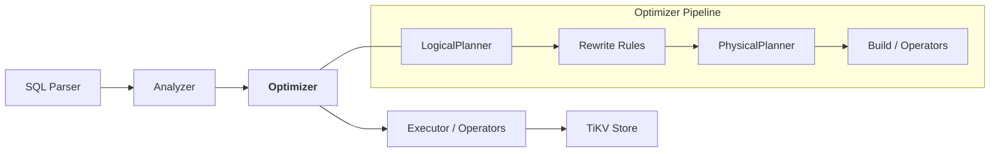
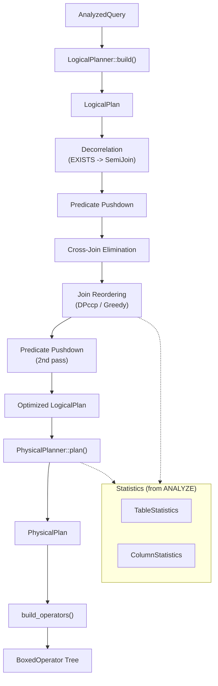

# Optimizer (Cost-Based Optimizer)

| Metadata | Value |
|----------|-------|
| **Source path** | `src/sql/optimizer/` |
| **File count** | 28 files (across 6 subdirectories) |
| **Line count** | ~19,200 lines (including tests) |
| **Depends on** | Analyzer (`src/sql/analyzer/`), Planner (`src/sql/planner/`), Operators (`src/sql/operators/`) |
| **Depended on by** | Executor (`src/sql/executor/select/analyzed/`), EXPLAIN (`src/sql/explain/`) |

---

## 1. Overview

The Cost-Based Optimizer (CBO) is the query optimization layer in db9-server. It translates the Analyzer's semantic output into an executable physical plan via a four-stage pipeline:

```
AnalyzedQuery --> LogicalPlan --> (rewrites) --> PhysicalPlan --> BoxedOperator
```

The optimizer uses table statistics collected by `ANALYZE` (when available) for selectivity estimation and cardinality estimates. When no statistics exist, it falls back to deterministic heuristic defaults (e.g., `rows/3` for filters, `rows/10` for aggregates).

The optimizer is **always-on**. The `db9.use_optimizer` GUC is accepted for compatibility but is a no-op -- `SET db9.use_optimizer = off` logs a notice and is ignored; `SHOW` always returns `on`.

---

## 2. Architecture Position



The optimizer sits between the Analyzer (which produces `AnalyzedQuery` with typed, scope-resolved expressions) and the Executor (which runs the physical operator tree). Both execution and EXPLAIN call the same `optimize()` entrypoint, ensuring zero drift between planned and executed queries.

---

## 3. Key Concepts

### LogicalPlan
An immutable tree of relational algebra nodes (`LogicalNode`) with output schemas (`PlanSchema`). Contains no cost or physical information. Nodes include: `Scan`, `Filter`, `Project`, `Aggregate`, `Sort`, `Limit`, `Distinct`, `DistinctOn`, `Window`, `Join`, `SetOperation`, `SemiJoin`, `AntiJoin`, `Subquery`, `Values`, `TableFunction`, `Empty`.

### PhysicalPlan
Maps logical operations to physical execution strategies. Each node carries a `PhysicalCost` estimate with `startup`, `total`, and `rows` fields. Physical nodes include algorithm-specific variants: `SeqScan`, `IndexScan`, `HashJoin`, `NestedLoopJoin`, `HashAggregate`, `TopNSort`, `HashSemiJoin`, etc.

### Plan Rewrites
Logical-to-logical transformations that produce semantically equivalent plans with better expected performance:
- **Subquery decorrelation**: `EXISTS`/`NOT EXISTS` with pure equi-correlation converted to `SemiJoin`/`AntiJoin`.
- **Predicate pushdown**: WHERE filter predicates pushed below Join and Sort nodes to reduce row counts early.
- **Cross-join elimination**: Cross-table equi-predicates absorbed from Filter into join ON conditions, converting Cross joins to Inner joins and enabling HashJoin.
- **Join reordering**: Cost-based join order optimization using DPccp (for up to 8 relations) or greedy algorithm (for more).

### DPccp Join Reordering
Dynamic programming algorithm for connected subgraph pairs. Flattens inner/cross join trees, classifies predicates into edges and base-local filters, and finds an optimal join order using table statistics for cardinality estimates. Falls back to greedy merging for queries with more than 8 base relations.

### Selectivity Estimation
Uses PostgreSQL-style statistics (MCV lists, histograms, n_distinct, null_fraction) to estimate predicate selectivity. Supports equality, inequality, range, BETWEEN, IN list, IS NULL/IS NOT NULL, and compound AND/OR predicates. Falls back to PostgreSQL default selectivities when column-level stats are missing.

---

## 4. File Map

### Root (`src/sql/optimizer/`)

| File | Lines | Purpose |
|------|-------|---------|
| `mod.rs` | 195 | Module root: `optimize()` entrypoint, `collect_query_table_refs()`, `schema_map_key()`, constants |
| `logical_plan.rs` | 784 | `LogicalPlan`, `LogicalNode` enum, `PlanSchema`, builder methods, `map_children()` |
| `physical_plan.rs` | 182 | `PhysicalPlan`, `PhysicalNode` enum, `PhysicalCost` struct |
| `statistics.rs` | 178 | `TableStatistics`, `ColumnStatistics` (pg_statistic-style) |
| `join_keys.rs` | 421 | Equi-join key extraction from `JoinCondition`, shared by planner and build |
| `eligibility.rs` | 421 | Optimizer eligibility checks (test-only after single-path unification) |
| `window_rewrite.rs` | 643 | Window function detection, extraction, and post-window rewrite utilities |

### `logical_planner/` -- AnalyzedQuery to LogicalPlan

| File | Lines | Purpose |
|------|-------|---------|
| `mod.rs` | 497 | `LogicalPlanner::build()`: structural translation with aggregate/window path routing |
| `nodes.rs` | 392 | FROM clause building, aggregate detection, window function extraction |
| `tests.rs` | 490 | Unit tests for logical planner |

### `rewrite/` -- Plan Rewrites

| File | Lines | Purpose |
|------|-------|---------|
| `mod.rs` | 685 | Rewrite framework, `apply_rewrites()`, `PredicatePushdown`, `CrossJoinElimination` |
| `decorrelate.rs` | 763 | `SubqueryDecorrelation`: EXISTS/NOT EXISTS to SemiJoin/AntiJoin |
| `tests.rs` | 1025 | Unit tests for rewrite rules |

### `physical_planner/` -- LogicalPlan to PhysicalPlan

| File | Lines | Purpose |
|------|-------|---------|
| `mod.rs` | 741 | `PhysicalPlanner::plan()`, `PlanningContext`, cost estimation, join algorithm selection |
| `tests.rs` | 1486 | Unit tests for physical planner |

### `build/` -- PhysicalPlan to BoxedOperator

| File | Lines | Purpose |
|------|-------|---------|
| `mod.rs` | 399 | `BuildContext`, `PhysicalPlan::build_operators()` recursive operator construction |
| `scan.rs` | 253 | Scan operator construction (SeqScan, IndexScan, limit pushdown) |
| `join.rs` | 198 | Join operator construction helpers (NLJ, HashJoin, HashSemiJoin) |
| `aggregate.rs` | 726 | Aggregate operator construction, post-aggregate expression rewriting |
| `utils.rs` | 211 | Aggregate expression collection and GROUP BY matching utilities |
| `tests.rs` | 829 | Unit tests for build phase |

### `join_reorder/` -- Cost-Based Join Reordering

| File | Lines | Purpose |
|------|-------|---------|
| `mod.rs` | 540 | `reorder_joins()` entry point, recursive traversal, safety gates |
| `algorithms.rs` | 665 | DPccp and greedy algorithms, edge graph, subset iteration |
| `cost.rs` | 245 | Row estimation, NDV lookup, join cardinality cost model |
| `predicates.rs` | 220 | Predicate classification, join-group flattening, `BaseRelation` |
| `tests.rs` | 908 | Unit tests for join reordering |

### `selectivity/` -- Selectivity Estimation

| File | Lines | Purpose |
|------|-------|---------|
| `mod.rs` | 596 | `estimate_selectivity()`, equality/range/BETWEEN/IN/IS NULL estimation, histogram-based range |
| `tests.rs` | 1671 | Unit tests for selectivity estimation |

---

## 5. Public Interfaces

### Entrypoint

```rust
// src/sql/optimizer/mod.rs

/// Single optimizer entrypoint: AnalyzedQuery -> PhysicalPlan.
pub fn optimize(
    analyzed: &AnalyzedQuery,
    planning_ctx: &PlanningContext,
) -> anyhow::Result<PhysicalPlan>;

/// Collect all leaf table references from an AnalyzedQuery.
pub fn collect_query_table_refs(
    query: &AnalyzedQuery,
) -> Vec<(&str, &TableRefSchema, Option<&str>)>;

/// Build a scope-safe key for schema/stats maps.
pub fn schema_map_key(table_name: &str, alias: Option<&str>) -> String;
```

### Logical Planner

```rust
// src/sql/optimizer/logical_planner/mod.rs

pub struct LogicalPlanner;

impl LogicalPlanner {
    /// Build a logical plan from an analyzed query.
    pub fn build(query: &AnalyzedQuery) -> Result<LogicalPlan>;
}
```

### Physical Planner

```rust
// src/sql/optimizer/physical_planner/mod.rs

pub struct PlanningContext {
    pub table_stats: HashMap<String, Arc<TableStatistics>>,
    pub table_schemas: HashMap<String, TableSchema>,
}

pub struct PhysicalPlanner;

impl PhysicalPlanner {
    /// Plan a logical plan into a physical plan.
    pub fn plan(logical: &LogicalPlan, ctx: &PlanningContext) -> PhysicalPlan;
}
```

### Build Context

```rust
// src/sql/optimizer/build/mod.rs

pub struct BuildContext {
    pub table_schemas: HashMap<String, TableSchema>,
    pub preloaded_rows: HashMap<String, Vec<Row>>,
    pub correlated_table_functions: HashSet<String>,
}

impl PhysicalPlan {
    /// Translate this physical plan tree into an executable operator tree.
    pub fn build_operators(&self, ctx: &BuildContext) -> Result<BoxedOperator>;
}
```

### Core Types

```rust
// src/sql/optimizer/logical_plan.rs
pub struct LogicalPlan { pub node: LogicalNode, pub schema: PlanSchema }
pub struct PlanSchema { pub columns: Vec<(String, DataType)> }
pub enum LogicalNode { Scan, Filter, Project, Aggregate, Sort, Limit,
    Distinct, DistinctOn, Window, Join, SetOperation, SemiJoin, AntiJoin,
    Subquery, Values, TableFunction, Empty }

// src/sql/optimizer/physical_plan.rs
pub struct PhysicalPlan { pub node: PhysicalNode, pub schema: PlanSchema, pub cost: PhysicalCost }
pub struct PhysicalCost { pub startup: f64, pub total: f64, pub rows: usize }
pub enum PhysicalNode { SeqScan, IndexScan, Empty, Values, TableFunction,
    Filter, Project, HashAggregate, StreamAggregate, Sort, TopNSort, Limit,
    Distinct, DistinctOn, Window, NestedLoopJoin, HashJoin, SetOperation,
    HashSemiJoin, Subquery }

// src/sql/optimizer/statistics.rs
pub struct TableStatistics {
    pub table_id: u64, pub row_count: usize, pub last_analyzed: i64,
    pub columns: HashMap<String, ColumnStatistics>,
}
pub struct ColumnStatistics {
    pub null_fraction: f64, pub n_distinct: f64, pub avg_width: usize,
    pub most_common_vals: Vec<Value>, pub most_common_freqs: Vec<f64>,
    pub histogram_bounds: Vec<Value>, pub correlation: f64,
}
```

---

## 6. Internal Design

### Optimization Pipeline Stages

**Stage 1: Logical Planning** (`LogicalPlanner::build`)
- Pure structural translation from `AnalyzedQuery` to `LogicalPlan`.
- No optimization decisions. Each SQL clause maps to exactly one logical node.
- Two paths: non-aggregate (Sort before Project) and aggregate (rewrite ORDER BY/HAVING for post-aggregate schema).
- Window functions handled by extracting `WindowCall` nodes into a `Window` logical node, then rewriting references to `ColumnRef` pointing at window output positions.

**Stage 2: Plan Rewrites** (`rewrite::apply_rewrites`)
- Applied in sequence: decorrelation, predicate pushdown, cross-join elimination, join reordering, then a second predicate pushdown pass.
- All rewrites are bottom-up recursive (rewrite children first, then handle current node).
- Predicate pushdown respects join type semantics: left-only predicates push into Left join's preserved side, nothing pushes through Full joins.
- Cross-join elimination uses the same equi-key extractor as the physical planner, ensuring zero semantic drift.
- Join reordering only flattens Inner/Cross joins with ON conditions (not USING), and skips subtrees containing unresolved subqueries or correlated references.

**Stage 3: Physical Planning** (`PhysicalPlanner::plan`)
- Recursive tree walk converting each `LogicalNode` to a `PhysicalNode` with cost estimates.
- Two-tier estimation: stats-based (selectivity module) when ANALYZE data exists, legacy heuristics when not.
- Join algorithm selection: HashJoin when ON has at least one cross-boundary equi key; NestedLoopJoin otherwise. Build side = smaller input.
- TopN optimization: Sort + Limit combined into TopNSort when `limit + offset < 1000`.
- Access-path selection: when a Filter sits above a SeqScan and index metadata is available, calls `choose_btree_access_path_for_typed_filter()` to potentially replace SeqScan with IndexScan.

**Stage 4: Operator Construction** (`PhysicalPlan::build_operators`)
- Pure synchronous tree walk constructing `BoxedOperator` instances.
- All table schemas pre-resolved in `BuildContext` (no async catalog lookups).
- Limit pushdown into scan operators for simple top-N queries without offset.
- Values rows evaluated at build time to produce literal Row data.

### Cost Model

| Operation | Cost Formula |
|-----------|-------------|
| SeqScan | `rows * 0.01 + 1.0` |
| Filter | `child_cost + filtered_rows * 0.01` |
| Project | `child_cost + rows * 0.001` |
| HashAggregate | `child_total + agg_rows * 0.1` (startup = child_total) |
| Sort | `child_total + rows * log2(rows)` |
| Join | `left_total + right_total + output_rows * 0.01` |
| TopNSort | `child_total + effective_limit * 0.01` |
| Limit | `child_startup + limited_rows * 0.01` |

### Join Selectivity

- **With stats on both sides**: `1/max(NDV_left, NDV_right)` per equi-key pair, multiplied together.
- **Without stats**: `DEFAULT_JOIN_SEL = 0.1`.
- **Non-equi/cross joins**: selectivity = 1.0 (Cartesian product).
- **Join-type lower bounds**: Left join output >= left_rows, Right >= right_rows, Full >= max(left, right).

---

## 7. Data Flow Diagram



---

## 8. Contracts

### Input Contract
- `optimize()` requires a valid `AnalyzedQuery` with resolved names, types, and scope depths.
- `PlanningContext` must be pre-populated with table schemas and statistics for all referenced tables.
- Table schemas in `PlanningContext.table_schemas` include index metadata for access-path selection.

### Output Contract
- Returns a `PhysicalPlan` tree that can be directly passed to `build_operators()`.
- The plan schema matches the `AnalyzedQuery.output_schema` (column names, types, order).
- Cost estimates are monotonically increasing through the tree (child total <= parent total).
- SemiJoin/AntiJoin output schema = left-side only (critical invariant).

### Invariants
- `optimize()` and EXPLAIN produce identical plans (single entrypoint, no drift).
- Rewrites produce semantically equivalent plans (same output rows, same order guarantees).
- Join reordering preserves original column order via final Project if needed.
- `DEFAULT_ESTIMATED_ROWS = 1000` for tables without ANALYZE data.
- `DEFAULT_JOIN_SEL = 0.1` for join selectivity without statistics.

---

## 9. Error Handling

- `LogicalPlanner::build()` returns `Result<LogicalPlan>` -- fails if aggregate rewrite encounters an expression that cannot be mapped to post-aggregate column positions (e.g., HAVING references a column that is neither a GROUP BY key nor an aggregate).
- `optimize()` propagates logical planner errors via `anyhow::Result<PhysicalPlan>`.
- `build_operators()` returns `Result<BoxedOperator>` -- can fail on missing schemas, unsupported correlated table functions, or HashJoin with correlated right input.
- Rewrite rules never fail -- they return the plan unchanged if a transformation is not applicable.
- Safety gates in join reordering skip subtrees with unresolved subqueries, correlated refs, or more than 63 base relations (u64 bitmask limit).

---

## 10. Testing

- **Unit tests**: Each submodule has a `tests.rs` file (~6,400 lines total of test code).
- **Selectivity tests** (`selectivity/tests.rs`, 1671 lines): Exhaustive coverage of eq/range/between/in/null estimation with varying statistics.
- **Physical planner tests** (`physical_planner/tests.rs`, 1486 lines): Algorithm selection, cost estimation, TopN optimization.
- **Rewrite tests** (`rewrite/tests.rs`, 1025 lines): Predicate pushdown through various join types, cross-join elimination.
- **Join reorder tests** (`join_reorder/tests.rs`, 908 lines): DPccp and greedy algorithms, disconnected graphs, column remapping.
- **Build tests** (`build/tests.rs`, 829 lines): Operator construction, aggregate rewriting.
- **Integration tests**: SQL test files in `tests/` exercise the full optimizer pipeline end-to-end via queries.

---

## 11. Common Task Index

| Task | Where to look |
|------|--------------|
| Add a new rewrite rule | `src/sql/optimizer/rewrite/mod.rs` -- implement `LogicalRewriteRule` trait, add to `apply_rewrites()` |
| Add a new logical node | `src/sql/optimizer/logical_plan.rs` (`LogicalNode` enum) + update `map_children()` |
| Add a new physical node | `src/sql/optimizer/physical_plan.rs` (`PhysicalNode` enum) + `physical_planner/mod.rs` + `build/mod.rs` |
| Change cost estimation | `src/sql/optimizer/physical_planner/mod.rs` for operator costs, `selectivity/mod.rs` for filter selectivity |
| Change join algorithm selection | `src/sql/optimizer/physical_planner/mod.rs` in the `LogicalNode::Join` match arm |
| Add index scan support | `src/sql/optimizer/physical_planner/mod.rs` (Filter over SeqScan path) + `src/sql/planner/index_selection.rs` |
| Change join reorder algorithm | `src/sql/optimizer/join_reorder/algorithms.rs` |
| Add a new selectivity estimator | `src/sql/optimizer/selectivity/mod.rs` -- add case to `estimate_selectivity_inner()` |
| Debug plan generation | Set `RUST_LOG=debug` and check tracing output from join reordering; use EXPLAIN to inspect plans |

---

## 12. See Also

- [Planner and Index Selection](./Planner-and-Index-Selection.md) -- index selection and scan strategy
- [Optimizer Pipeline Diagram](../Diagrams/optimizer-pipeline.md) -- detailed flowchart of the CBO pipeline
- `src/sql/operators/` -- physical operator implementations (Volcano iterator model)
- `src/sql/executor/select/analyzed/` -- SELECT executor that calls `optimize()`
- `src/sql/explain/` -- EXPLAIN output generation from PhysicalPlan
