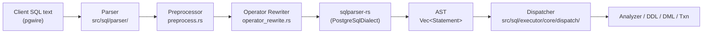
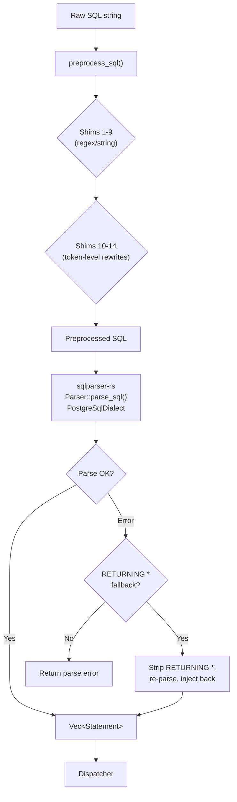

# Parser

> **Source path:** `src/sql/parser/`
>
> **Files:** 5 | **Approximate lines:** ~2,180
>
> **Depends on:** `sqlparser-rs` crate (PostgreSQL dialect)
>
> **Depended on by:** Dispatcher (`src/sql/executor/core/dispatch/`), Protocol Handler (`src/protocol/handler/`)

The parser module is the entry point for all SQL processing in db9-server. It wraps the `sqlparser-rs` crate with a preprocessing and operator rewriting layer that normalizes PostgreSQL-specific syntax into forms that `sqlparser-rs` can parse. The output is a `Vec<Statement>` (AST) that the dispatcher routes to the appropriate handler.

---

## Architecture Position



The parser is the first stage of the execution pipeline. Every query -- SELECT, DDL, DML, transaction control, settings, EXPLAIN -- passes through `parse_sql()` before any semantic analysis. The parser is purely syntactic: it does not resolve names, check types, or access the catalog.

---

## Key Concepts

### Three-Stage Parsing Pipeline

SQL text is processed in three stages:

1. **Preprocessing** (`preprocess.rs`): Regex-based and string-manipulation transforms that normalize PostgreSQL syntax forms that `sqlparser-rs` cannot handle. These are applied before tokenization.

2. **Operator Rewriting** (`operator_rewrite.rs`): Token-level rewrites using a custom lightweight tokenizer. Handles operators and syntax patterns that need positional analysis (expression boundaries, parenthesis depth).

3. **AST Parsing** (`mod.rs`): Delegates to `sqlparser-rs` with `PostgreSqlDialect`. Includes a narrow fallback for `INSERT ... RETURNING *`.

### Parse-Compatibility Shims

Every preprocessing and rewriting shim is documented with:
- **Classification**: what kind of shim it is (parse-normalization, parse-compatibility)
- **Why it exists**: which `sqlparser-rs` limitation it works around
- **Exit condition**: when it can be removed (i.e., when `sqlparser-rs` adds support)

This governance ensures shims do not accumulate indefinitely and can be systematically retired as the upstream parser evolves.

### Custom Tokenizer

The module includes its own lightweight tokenizer (`tokenizer.rs`) separate from `sqlparser-rs`. This tokenizer is needed because the operator rewrite passes must recognize PostgreSQL-specific operators (`?`, `?|`, `?&`, `<->`, `<#>`, `<=>`) that `sqlparser-rs` cannot lex. The tokenizer classifies text into `TokenKind` variants: `Word`, `Whitespace`, `StringLiteral`, `QuotedIdent`, `DollarString`, `Comment`, `Punct`, `Operator`, `Other`.

---

## File Map

| File | Lines | Purpose |
|------|-------|---------|
| `mod.rs` | 122 | Module root; `parse_sql()` entry point; `INSERT ... RETURNING *` fallback |
| `preprocess.rs` | 798 | 13 preprocessing shims: EXPLAIN, CREATE SEQUENCE, CTE MATERIALIZED, RESET ROLE, SELECT FROM, TYPE ARRAY, NOT VALID, DROP INDEX CONCURRENTLY, UPDATE FROM comma, operator rewrites |
| `operator_rewrite.rs` | 416 | Token-level operator rewrites: ANY/ALL subquery, JSONB exists ops, vector distance ops, AT TIME ZONE placeholders, RESET ROLE |
| `tokenizer.rs` | 414 | Custom lightweight tokenizer; `Token`, `TokenKind`, boundary detection helpers |
| `tests.rs` | 430 | Unit tests for parsing, preprocessing, and operator rewriting |

---

## Public Interfaces

### Entry Point

```rust
// src/sql/parser/mod.rs

/// Parse a SQL string into AST statements.
/// Applies preprocessing and operator rewrites before delegating to sqlparser-rs.
pub fn parse_sql(sql: &str) -> Result<Vec<Statement>>
```

This is the single entry point for all SQL parsing in the system. It is called by:
- The protocol handler's `DynamicPgHandler` for simple and extended query processing
- The `Db9QueryParser` (pgwire `QueryParser` trait implementation)
- DDL/DML code that needs to parse nested SQL (e.g., view definitions, function bodies)

### Internal APIs

```rust
// src/sql/parser/preprocess.rs

/// Apply all preprocessing shims to SQL text.
pub(super) fn preprocess_sql(sql: &str) -> String

// src/sql/parser/operator_rewrite.rs

/// Rewrite ANY/ALL(SELECT ...) -> ANY/ALL(ARRAY(SELECT ...)).
pub(super) fn rewrite_all_any_subquery_parse_compat(sql: &str) -> String

/// Rewrite JSONB existence operators (?, ?|, ?&) into function calls.
pub(super) fn rewrite_jsonb_exists_ops(sql: &str) -> String

/// Rewrite vector distance operators (<->, <#>, <=>) into function calls.
pub(super) fn rewrite_vector_distance_ops(sql: &str) -> String

/// Rewrite AT TIME ZONE $n placeholders to literal for parse-time validation.
pub(super) fn rewrite_at_time_zone_placeholders(sql: &str) -> String

/// Rewrite standalone RESET ROLE to SET ROLE NONE.
pub(super) fn rewrite_reset_role(sql: &str) -> String
```

```rust
// src/sql/parser/tokenizer.rs

#[derive(Debug, Clone, Copy, PartialEq, Eq)]
pub(crate) enum TokenKind {
    Word,           // Keywords, identifiers, numbers
    Whitespace,     // Spaces, tabs, newlines
    StringLiteral,  // 'single-quoted'
    QuotedIdent,    // "double-quoted"
    DollarString,   // $$...$$ or $tag$...$tag$
    Comment,        // -- line or /* block */
    Punct,          // ( ) [ ] , ;
    Operator,       // ? ?| ?& <-> <#> <=> -> ->>
    Other,          // Anything else (single char)
}

#[derive(Debug, Clone)]
pub(crate) struct Token {
    pub(crate) kind: TokenKind,
    pub(crate) start: usize,
    pub(crate) end: usize,
    pub(crate) text: String,
}

/// Tokenize SQL text for operator rewrite passes.
pub(crate) fn tokenize_sql_for_rewrite(sql: &str) -> Vec<Token>

/// Skip whitespace and comment tokens forward from idx.
pub(crate) fn skip_ws_comments_forward(tokens: &[Token], idx: usize, stop: usize) -> usize

/// Skip whitespace and comment tokens backward from idx.
pub(crate) fn skip_ws_comments_backward(tokens: &[Token], idx: usize, start: usize) -> usize

/// Find the start of the left-side expression relative to an operator.
pub(crate) fn find_left_expr_start(tokens: &[Token], op_idx: usize) -> usize

/// Find the end of the right-side expression relative to an operator.
pub(crate) fn find_right_expr_end(tokens: &[Token], op_idx: usize) -> usize
```

---

## Internal Design

### Preprocessing Pipeline

The `preprocess_sql` function applies shims in a specific order. Each shim either returns `Some(rewritten)` if it modified the input, or `None` if it did not apply:

```
Input SQL
  |
  v
1. preprocess_reset_role       -- "RESET ROLE" -> "SET ROLE NONE" (simple case)
2. preprocess_explain           -- "EXPLAIN (ANALYZE, VERBOSE)" -> keyword form
3. preprocess_create_sequence   -- Normalize CREATE SEQUENCE option order
4. preprocess_cte_materialized  -- Strip [NOT] MATERIALIZED CTE hints
5. preprocess_select_from       -- "SELECT FROM" -> "SELECT TRUE AS _exists FROM"
6. preprocess_type_array        -- "type array" -> "type[]"
7. preprocess_not_valid         -- Strip "NOT VALID" from constraints
8. preprocess_drop_index_concurrently -- Strip CONCURRENTLY from DROP INDEX
9. preprocess_update_from_comma -- Comma-separated UPDATE FROM -> CROSS JOIN
  |
  v
10. rewrite_all_any_subquery_parse_compat  -- ANY/ALL(SELECT) -> ANY/ALL(ARRAY(SELECT))
11. rewrite_jsonb_exists_ops               -- ? / ?| / ?& -> function calls
12. rewrite_vector_distance_ops            -- <-> / <#> / <=> -> function calls
13. rewrite_reset_role                     -- Multi-statement RESET ROLE (token-level)
14. rewrite_at_time_zone_placeholders      -- AT TIME ZONE $n -> AT TIME ZONE 'UTC'
  |
  v
Preprocessed SQL -> sqlparser-rs
```

### Operator Rewrite Strategy

Operator rewrites use a two-phase approach:

1. **Tokenize** the SQL using the custom tokenizer that recognizes PostgreSQL-specific operators
2. **Scan** the token stream to find operator occurrences, then compute replacement ranges

For binary operator rewrites (JSONB exists, vector distance), the rewriter must determine the left and right expression boundaries. This uses `find_left_expr_start` and `find_right_expr_end`, which scan backward/forward from the operator position, tracking parenthesis/bracket depth and stopping at SQL boundary keywords (SELECT, FROM, WHERE, AND, OR, JOIN, etc.).

Replacements are collected in a list of `(start, end, replacement)` tuples, sorted by position, and applied from right to left so earlier byte offsets remain valid.

### INSERT RETURNING * Fallback

`sqlparser-rs` cannot parse `INSERT ... SELECT ... RETURNING *` in some query-source forms. The parser includes a narrow fallback:

1. Tokenize the SQL and find `RETURNING` at parenthesis depth 0
2. Check that the next non-whitespace token is `*` and there is no further content
3. Strip `RETURNING *` from the SQL, parse without it, then inject the `RETURNING` clause back into the AST

This fallback is intentionally narrow to preserve parser strictness for all other syntax.

---

## Data Flow Diagram



---

## Contracts

1. **`parse_sql` is the only entry point.** All SQL parsing in the system goes through this function. No code should call `sqlparser-rs` directly.

2. **Parse-only, no semantics.** The parser does not resolve names, check types, verify privileges, or access the catalog. It produces a syntactic AST only.

3. **Shims are parse-compatibility only.** Preprocessing shims normalize syntax for `sqlparser-rs` limitations. They must not perform semantic query-shape rewrites (e.g., they must not change query meaning, only representation).

4. **Shim governance.** Every shim has a documented classification and exit condition. Shims should be removed when the upstream `sqlparser-rs` adds support for the corresponding syntax.

5. **Token-level rewrites preserve string literals and comments.** The tokenizer distinguishes string literals, dollar-quoted strings, and comments. Rewrites never modify content inside these tokens.

6. **Operator rewrite boundary keywords.** The following keywords are treated as expression boundaries for operator rewriting: `SELECT`, `FROM`, `WHERE`, `GROUP`, `ORDER`, `BY`, `HAVING`, `LIMIT`, `OFFSET`, `UNION`, `INTERSECT`, `EXCEPT`, `AND`, `OR`, `WHEN`, `THEN`, `ELSE`, `END`, `ASC`, `DESC`, `NULLS`, `ON`, `JOIN` (and join variants), `RETURNING`, `INTO`, `SET`, `CASE`, `NOT`, `IN`, `BETWEEN`, `LIKE`, `ILIKE`, `IS`.

7. **Fallback narrowness.** The `INSERT ... RETURNING *` fallback only activates for single-statement inputs where the only content after `RETURNING` is `*` (optionally followed by `;`). All other parse errors propagate directly.

---

## Error Handling

- **Parse errors** from `sqlparser-rs` are wrapped as `anyhow::Error` with the prefix "SQL parse error: ".
- **No partial results.** If parsing fails, the entire SQL string is rejected. There is no attempt to parse partial statements.
- **Error messages preserve the original `sqlparser-rs` diagnostics**, which include line/column information and expected-vs-found tokens.
- **Preprocessing shims are defensive.** Each shim returns `None` (no-op) if the SQL does not match the expected pattern. Malformed input passes through to `sqlparser-rs` for canonical error reporting.
- **Operator rewrite safety.** If a rewrite cannot determine expression boundaries (e.g., operator at the very start or end of the token stream), it skips the rewrite rather than producing incorrect SQL.

---

## Testing

### Unit Tests (`tests.rs`, 430 lines)

- **Basic parsing**: SELECT, INSERT, CREATE TABLE, CREATE SCHEMA
- **Preprocessing**: EXPLAIN with parentheses, CREATE SEQUENCE option reordering, RESET ROLE (single-statement and multi-statement), SELECT FROM rewrite, TYPE ARRAY rewrite, NOT VALID stripping, DROP INDEX CONCURRENTLY, UPDATE FROM comma rewrite
- **Operator rewrites**: vector distance operators (`<->`, `<#>`, `<=>`), JSONB existence operators (`?`), AT TIME ZONE placeholders, ANY/ALL subquery wrapping
- **Fallback**: INSERT ... SELECT ... RETURNING *
- **Negative tests**: ensures rewrites do not modify string literals, comments, or non-matching patterns
- **Edge cases**: double-digit placeholders ($10, $11, $12), DEFAULT in ON CONFLICT, multi-row INSERT

### Integration Coverage

SQL integration tests in `tests/` exercise parsing implicitly through the full query pipeline. Parser failures surface as test failures with "SQL parse error" messages, providing regression coverage for all supported PostgreSQL syntax.

---

## Common Task Index

| Task | Where to Look |
|------|---------------|
| **Fix a parse error for PostgreSQL syntax** | First check if `sqlparser-rs` supports the syntax. If not, add a shim in `preprocess.rs` (for regex/string-level transforms) or `operator_rewrite.rs` (for token-level transforms). Document the exit condition. |
| **Add a new operator rewrite** | Add a `rewrite_<name>()` function in `operator_rewrite.rs` using `tokenize_sql_for_rewrite` and `find_left_expr_start`/`find_right_expr_end`. Call it from `preprocess_sql()` in `preprocess.rs`. |
| **Add a new preprocessing shim** | Add a function in `preprocess.rs` that returns `Option<String>`. Call it from `preprocess_sql()`. Add a test in `tests.rs`. Document classification and exit condition in the shim inventory comment. |
| **Upgrade sqlparser-rs** | After upgrading, check each shim's exit condition. Remove shims whose underlying limitation has been fixed. Run all parser tests to verify no regressions. |
| **Debug a parse failure** | Call `preprocess_sql()` on the input SQL to see the preprocessed form. Try parsing the preprocessed SQL directly with `sqlparser-rs` to isolate whether the issue is in preprocessing or in the parser itself. |
| **Add a new token kind** | Add the variant to `TokenKind` in `tokenizer.rs` and add the recognition logic in `tokenize_sql_for_rewrite()`. Update `is_rewrite_boundary_keyword()` or `is_comparison_operator_char()` if relevant. |
| **Understand expression boundary detection** | See `find_left_expr_start()` and `find_right_expr_end()` in `tokenizer.rs`. These scan backward/forward from an operator, respecting parenthesis depth and SQL boundary keywords. |

---

## See Also

- [Architecture Overview](../Architecture-Overview.md) -- system-wide architecture and query pipeline
- [Expression System](./Expression-System.md) -- runtime expression evaluation (consumes the AST this module produces)
- `src/sql/analyzer/` -- semantic analysis layer that takes the AST and produces TypedExpr
- `src/sql/executor/core/dispatch/` -- statement dispatcher that routes AST nodes to handlers
- `src/protocol/handler/query_parser.rs` -- `Db9QueryParser` that calls `parse_sql()`
- `docs/sot/sql-engine.md` -- normative contracts for the SQL engine
