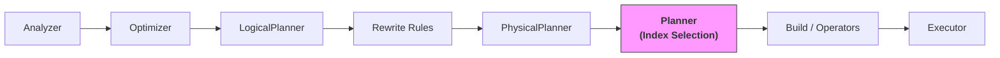
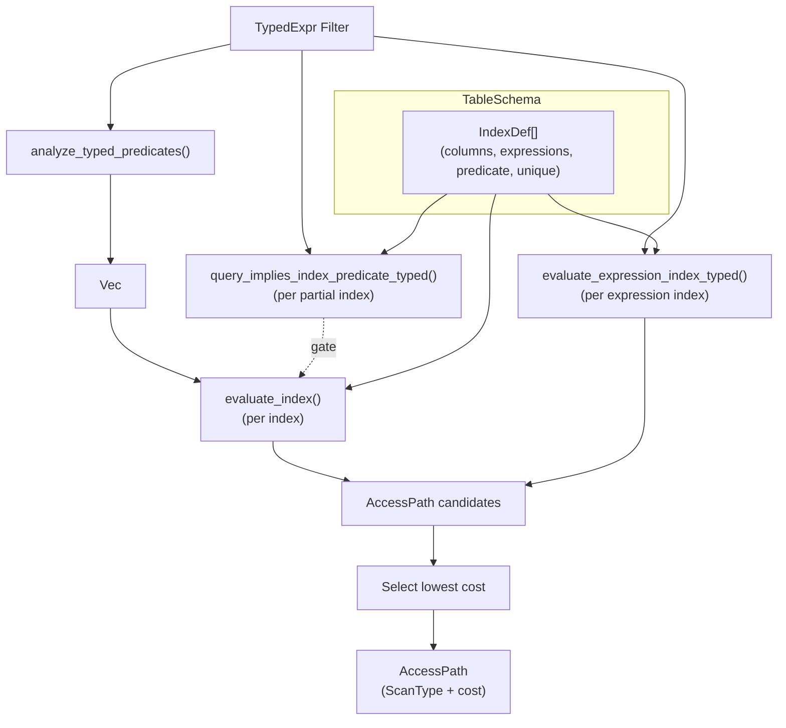

# Planner and Index Selection

| Metadata | Value |
|----------|-------|
| **Source path** | `src/sql/planner/` |
| **File count** | 6 files |
| **Line count** | ~1,340 lines (including tests) |
| **Depends on** | Analyzer types (`src/sql/analyzer/types/`), Model (`src/model/`) |
| **Depended on by** | Optimizer physical planner (`src/sql/optimizer/physical_planner/`) |

---

## 1. Overview

The Planner module handles **access path selection** -- deciding whether a query should use a full table scan or one of several B-tree index scan variants. It is called by the optimizer's physical planner during the Filter-over-SeqScan pattern to select the lowest-cost scan strategy.

The planner extracts structured predicates from typed filter expressions, evaluates each available B-tree index against those predicates, and returns the access path with the lowest estimated cost. It supports:

- **Point lookups**: Full equality match on all index columns.
- **Prefix range scans**: Equality on a leading prefix of index columns.
- **Bounded range scans**: Equality prefix + range predicates (>, >=, <, <=) on the next column.
- **IN-list scans**: Equality prefix + IN list on the next column.
- **Expression index matching**: Indexes on expressions (e.g., `lower(name)`) matched against filter conjuncts.
- **Partial index implication**: Filters that logically imply a partial index predicate.

GIN indexes are intentionally excluded -- they remain on SeqScan until runtime GIN operators are implemented.

---

## 2. Architecture Position



The planner is invoked from inside `PhysicalPlanner::plan_node()` when a `Filter` node sits directly above a `SeqScan` node and the `PlanningContext` contains a schema for that table. The planner evaluates all B-tree indexes on the table and returns the best `AccessPath`.

---

## 3. Key Concepts

### ScanType

The `ScanType` enum represents the physical scan strategy:

```rust
pub enum ScanType {
    FullTableScan,
    IndexScan {               // Point lookup: equality on all index columns
        index_id: u64,
        index_name: String,
        values: Vec<Value>,
    },
    IndexRangeScan {           // Prefix-only: equality on leading columns
        index_id: u64,
        index_name: String,
        prefix_values: Vec<Value>,
    },
    IndexBoundedRangeScan {    // Prefix + range bounds on next column
        index_id: u64,
        index_name: String,
        prefix_values: Vec<Value>,
        range_start: Option<Value>,
        start_inclusive: bool,
        range_end: Option<Value>,
        end_inclusive: bool,
    },
    InListScan {               // Prefix + IN list on next column
        index_id: u64,
        index_name: String,
        column_values: Vec<Vec<Value>>,
    },
}
```

### AccessPath

Pairs a `ScanType` with a cost estimate:

```rust
pub struct AccessPath {
    pub scan_type: ScanType,
    pub cost: f64,
}
```

### TypedPredicate

Structured predicates extracted from `TypedExpr` filter trees for index matching:

```rust
pub enum TypedPredicate {
    Comparison {
        column: String,
        op: CmpOp,         // Eq, Ne, Lt, Le, Gt, Ge
        value: Value,
    },
    InList {
        column: String,
        values: Vec<Value>,
    },
}
```

### Expression Indexes

Indexes defined on expressions (e.g., `CREATE INDEX idx ON t (lower(name))`) are matched by canonicalizing both the index expression and filter conjuncts to normalized SQL strings, then comparing them.

### Partial Indexes

Indexes with a `WHERE` predicate (e.g., `CREATE INDEX idx ON t (col) WHERE status = 'active'`) are only used when the query filter implies the index predicate. Implication is checked by verifying that every conjunct of the index predicate appears (after normalization) in the query's filter conjuncts.

---

## 4. File Map

| File | Lines | Purpose |
|------|-------|---------|
| `mod.rs` | 87 | Module root: re-exports, `ScanType` enum, `AccessPath`, `CmpOp`, `TypedPredicate` |
| `index_selection.rs` | 429 | `choose_btree_access_path_for_typed_filter()`, index evaluation, expression/partial index matching |
| `predicate.rs` | 166 | `analyze_typed_predicates()`, `collect_typed_eq_predicates()`, predicate extraction from `TypedExpr` |
| `scan_type.rs` | 187 | Expression normalization, SQL canonicalization, value coercion, selectivity estimation helpers |
| `cost_model.rs` | 30 | Cost model constants (`BASE_COST`, `ROW_COST`, selectivity defaults) |
| `tests.rs` | 441 | Unit tests for predicate extraction, index selection, expression matching |

---

## 5. Public Interfaces

### Primary Entry Point

```rust
// src/sql/planner/index_selection.rs

/// Choose the best B-tree access path for a typed filter expression.
/// Returns AccessPath with scan_type and cost estimate.
pub fn choose_btree_access_path_for_typed_filter(
    schema: &TableSchema,
    filter: &TypedExpr,
    estimated_table_rows: usize,
) -> AccessPath;
```

### Predicate Analysis

```rust
// src/sql/planner/predicate.rs

/// Extract TypedPredicate from a TypedExpr tree.
pub fn analyze_typed_predicates(expr: &TypedExpr) -> Vec<TypedPredicate>;

/// Collect col=const predicates into a map keyed by lower-cased column name.
pub(crate) fn collect_typed_eq_predicates(
    expr: &TypedExpr,
    out: &mut HashMap<String, Value>,
) -> Option<()>;
```

### Cost Model Constants

```rust
// src/sql/planner/cost_model.rs

pub struct CostModel;
impl CostModel {
    pub const BASE_COST: f64 = 1.0;
    pub const ROW_COST: f64 = 0.5;
    pub const TWO_SIDED_RANGE_SELECTIVITY: f64 = 0.1;
    pub const ONE_SIDED_RANGE_SELECTIVITY: f64 = 0.3;
    pub const UNIQUE_INDEX_SELECTIVITY: f64 = 1.0 / 1_000_000.0;
    pub const NON_UNIQUE_SELECTIVITY_BASE: f64 = 0.1;
    pub const MIN_SELECTIVITY_FLOOR: f64 = 0.0001;
}
```

---

## 6. Internal Design

### Index Selection Algorithm

The `choose_btree_access_path_for_typed_filter` function operates as follows:

1. **Extract predicates**: Parse the filter `TypedExpr` into a list of `TypedPredicate` (equality comparisons, range comparisons, IN lists).

2. **Initialize best path**: Start with `FullTableScan` at cost = `estimated_table_rows`.

3. **Evaluate each index**: For every B-tree index on the table:
   - **Skip non-usable indexes**: Not Ready state, empty columns+expressions, non-btree method.
   - **Partial index check**: If the index has a predicate, verify the query filter implies it.
   - **Expression index check**: If the index has expression definitions, try to match filter conjuncts against them.
   - **Column index matching**: Try to build the longest equality prefix, then check for IN-list or range predicates on the next column.

4. **Select lowest cost**: Keep the access path with the lowest estimated cost.

### Index Matching Priority

For a given index with columns `[c1, c2, c3]`:

1. **Full point lookup**: All columns have equality predicates. Uses `IndexScan` with `UNIQUE_INDEX_SELECTIVITY` (if unique) or `NON_UNIQUE_SELECTIVITY_BASE^n`.

2. **IN-list scan**: Leading columns have equality, next column has `IN (...)`. Uses `InListScan`. Selectivity = `list_size / table_rows`, capped at 0.5.

3. **Bounded range scan**: Leading columns have equality, next column has range bounds. Uses `IndexBoundedRangeScan`. Selectivity = 0.1 (two-sided) or 0.3 (one-sided).

4. **Prefix range scan**: Some leading columns have equality but no range or IN on the next. Uses `IndexRangeScan`. Selectivity = `NON_UNIQUE_SELECTIVITY_BASE^prefix_len`.

### Expression Index Matching

For indexes defined on expressions (e.g., `CREATE INDEX ON t (lower(name))`):

1. Parse the index expression string to an AST via `parse_predicate_expr()`.
2. Normalize the AST to a canonical string via `normalize_expr_for_match()`.
3. For each filter conjunct of the form `lhs = rhs`:
   - Canonicalize both sides via `typed_expr_to_canonical_sql()` + `normalize_expr_string()`.
   - If one side matches the index expression, extract the constant value from the other side.
4. If all index expressions are matched, use `IndexScan` with the extracted values.

### Partial Index Predicate Implication

For indexes with a `WHERE` clause:

1. Parse the index predicate to AST, split into conjuncts, normalize each.
2. Split the query filter into conjuncts, canonicalize each via `typed_expr_to_canonical_sql()`.
3. Check that every normalized index conjunct appears in the query's normalized conjuncts.

### Cost Estimation

```
index_scan_cost = BASE_COST + estimated_rows * ROW_COST
estimated_rows = max(estimated_table_rows * selectivity, 1.0)
```

---

## 7. Data Flow Diagram



---

## 8. Contracts

### Input Contract
- `TableSchema` must contain valid `IndexDef` entries with `id`, `name`, `columns`, and optional `expressions`/`predicate`.
- `filter` must be a valid `TypedExpr` from the Analyzer with resolved column names and constant values.
- `estimated_table_rows` should be > 0 (the planner uses it as the FullTableScan cost baseline).

### Output Contract
- Always returns a valid `AccessPath` -- at minimum, `FullTableScan` with cost = `estimated_table_rows`.
- The returned `ScanType` carries all information needed by `build/scan.rs` to construct the scan operator (index ID, lookup values, range bounds).
- Column names in `TypedPredicate` are lowercased for case-insensitive matching against index column definitions.

### Invariants
- Only B-tree indexes in `Ready` state are considered (GIN excluded, non-Ready skipped).
- Expression index matching requires exact canonical string match after normalization.
- Partial index usage requires logical implication (all index predicate conjuncts present in query filter).
- Cost is always `>= BASE_COST` (1.0) due to the `max(1.0)` floor on estimated rows.

---

## 9. Error Handling

- `choose_btree_access_path_for_typed_filter` never fails -- it returns `FullTableScan` as the safe default.
- `analyze_typed_predicates` never fails -- unrecognized expression patterns are silently skipped.
- `parse_predicate_expr` returns `Option<Expr>` -- `None` on parse failure causes the index to be skipped.
- Value coercion errors in `coerce_index_predicate_value` fall back to the original value.

---

## 10. Testing

- **Unit tests** (`tests.rs`, 441 lines): Cover predicate extraction, index evaluation for point/range/IN/expression/partial cases, cost comparison logic.
- **Integration tests**: SQL test files (e.g., `tests/95_limit_pushdown.sql`) exercise index selection through the full query pipeline.
- EXPLAIN output can be used to verify which scan type was selected for a given query.

---

## 11. Common Task Index

| Task | Where to look |
|------|--------------|
| Add a new scan type | `src/sql/planner/mod.rs` (add `ScanType` variant) + `index_selection.rs` (evaluation) + `src/sql/optimizer/build/scan.rs` (operator construction) |
| Change cost model constants | `src/sql/planner/cost_model.rs` |
| Add a new predicate type | `src/sql/planner/predicate.rs` (add to `collect_typed_predicates`) + `src/sql/planner/mod.rs` (`TypedPredicate` enum) |
| Support GIN index selection | `src/sql/planner/index_selection.rs` (modify `is_planner_usable_index` and add GIN evaluation) |
| Debug index selection | Use EXPLAIN on the query to see SeqScan vs IndexScan; check `is_planner_usable_index` filters |
| Add expression normalization | `src/sql/planner/scan_type.rs` (`typed_expr_to_canonical_sql`, `normalize_expr_string`) |

---

## 12. See Also

- [Optimizer](./Optimizer.md) -- the CBO that invokes index selection during physical planning
- [Optimizer Pipeline Diagram](../Diagrams/optimizer-pipeline.md) -- where index selection fits in the full pipeline
- `src/sql/optimizer/physical_planner/mod.rs` -- the Filter-over-SeqScan pattern that triggers index selection
- `src/sql/optimizer/build/scan.rs` -- scan operator construction from `ScanType`
- `src/sql/explain/transform.rs` -- EXPLAIN output showing chosen scan type
