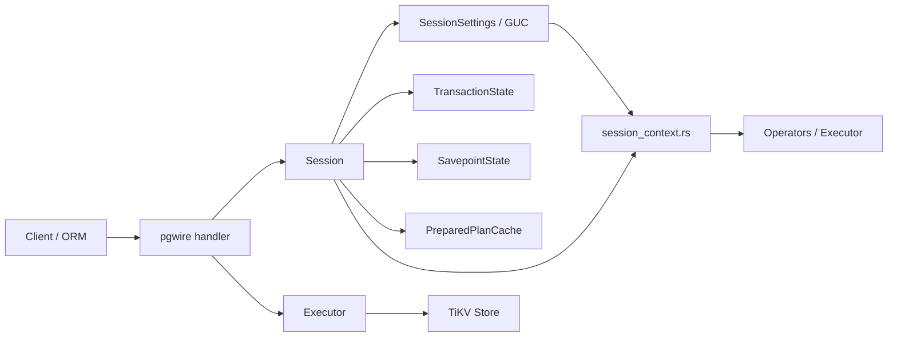
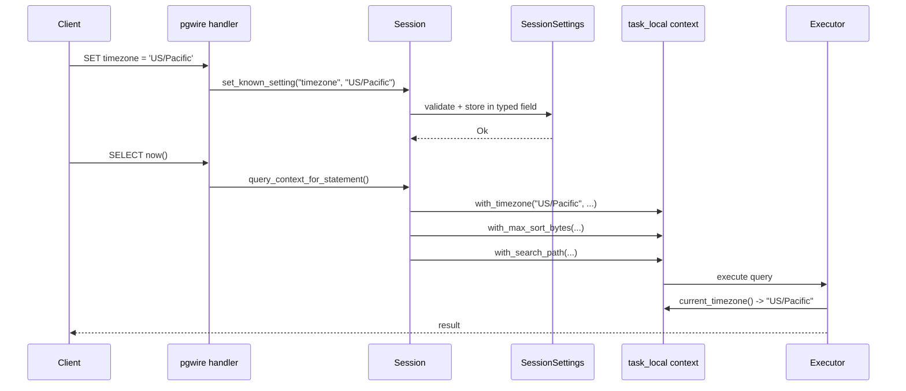

# Session and GUC

> **Module path:** `src/sql/session/` and `src/session_context.rs`
> **Stability:** Stable -- contracts validated by unit tests and integration suite.

---

## 1. Overview

The Session and GUC (Grand Unified Configuration) subsystem manages per-connection state for the db9-server. Each pgwire connection gets a dedicated `Session` instance that encapsulates transaction state, security context (session/current user, superuser flags), sequence value cache, prepared statement cache, and a full set of PostgreSQL-compatible session parameters (GUCs).

GUC parameters follow PostgreSQL semantics: `SET` changes a session-level value, `SET LOCAL` applies only within the current transaction (cleared on `COMMIT`/`ROLLBACK`), `RESET` restores the default, and `SHOW` reads the effective value. The resolution precedence is: `local_overrides > typed struct fields > extra_settings > static_default`.

Task-local context (`session_context.rs`) propagates session values (timezone, max sort bytes, search path) into operator execution via `tokio::task_local!`, enabling deep operator code to access session state without threading `Session` references through every call.

---

## 2. Architecture Position



The `Session` sits between the protocol handler and the executor layer. The protocol handler creates a `Session` per connection and delegates SQL execution through it. Session settings flow into operator execution via task-local context.

---

## 3. Key Concepts

| Concept | Description |
|---------|-------------|
| **Session** | Per-connection state container: transaction, user identity, settings, plan cache, sequence values. |
| **TransactionState** | Three-state FSM: `Idle`, `Active(Transaction)`, `Failed(Transaction)`. |
| **SessionSettings** | Typed container for all GUC parameters with SET/SHOW/RESET support. |
| **GucMeta** | Static metadata for each known GUC: name, immutability flag, description, default. |
| **KNOWN_GUCS** | Alphabetically-sorted const array of 40 GUC parameters (single source of truth). Includes `hnsw.ef_search` for HNSW vector index tuning. |
| **SET LOCAL** | Transaction-scoped override, stored in `local_overrides` HashMap, cleared on commit/rollback. |
| **Savepoint stack** | `settings_savepoint_stack` captures and restores settings state across SAVEPOINT/ROLLBACK TO. |
| **Task-local context** | `tokio::task_local!` variables (TIMEZONE, MAX_SORT_BYTES, CURRENT_SEARCH_PATH) scoped per query execution. |

---

## 4. File Map

| File | Purpose |
|------|---------|
| `src/sql/session/mod.rs` | `Session` struct, `TransactionState` enum, constructor and query-context methods. |
| `src/sql/session/settings.rs` | `SessionSettings` struct, `GucMeta`, `KNOWN_GUCS` registry, SET/SHOW/RESET logic. |
| `src/sql/session/transaction.rs` | Transaction lifecycle: `begin()`, `commit()`, `rollback()`, savepoint operations. |
| `src/sql/session/tests.rs` | Unit tests for GUC defaults, SET LOCAL precedence, savepoint rollback, SHOW ALL. |
| `src/session_context.rs` | `tokio::task_local!` definitions and scoped accessors for timezone, sort bytes, search path. |

---

## 5. Public Interfaces

### Session (mod.rs)

```rust
pub enum TransactionState {
    Idle,
    Active(Transaction),
    Failed(Transaction),
}

pub struct Session {
    pub(crate) store: Arc<TikvStore>,
    pub(crate) observability: Arc<TenantObservability>,
    pub(crate) state: TransactionState,
    pub(crate) savepoints: Arc<SavepointState>,
    settings: SessionSettings,
    session_user: Option<String>,
    current_user: Option<String>,
    is_superuser: bool,
    current_database_id: u64,
    current_database_name: Arc<str>,
    connection_id: i64,
    pub(crate) transaction_timestamp_ms: Option<i64>,
    plan_cache: PreparedPlanCache,
    sql_prepared_statements: HashMap<String, SqlPreparedStatement>,
    // ...
}

impl Session {
    pub fn new_with_database(
        store: Arc<TikvStore>,
        observability: Arc<TenantObservability>,
        connection_id: i64,
        database_id: u64,
        database_name: String,
        default_statement_timeout_ms: u64,
        default_idle_in_txn_timeout_ms: u64,
    ) -> Self;
}
```

### SessionSettings (settings.rs)

```rust
pub(crate) struct GucMeta {
    pub(crate) name: &'static str,
    immutable: bool,
    description: &'static str,
    static_default: Option<&'static str>,
}

pub(crate) const KNOWN_GUCS: &[GucMeta] = &[ /* 39 entries */ ];

pub(crate) struct SessionSettings {
    search_path: Vec<String>,
    max_sort_bytes: usize,
    statement_timeout_ms: u64,
    local_overrides: HashMap<String, String>,
    local_search_path: Option<Vec<String>>,
    settings_savepoint_stack: Vec<SettingsSavepoint>,
    // ...typed fields for specific GUCs
}

impl SessionSettings {
    pub(crate) fn set_known_setting(&mut self, name: &str, value: &str) -> Result<()>;
    pub(crate) fn set_local_override(&mut self, name: &str, value: &str) -> Result<()>;
    pub(crate) fn show_value(&self, name: &str) -> Result<String>;
    pub(crate) fn show_all(&self) -> Vec<(String, String, String)>;
    pub(crate) fn reset_setting(&mut self, name: &str);
    pub(crate) fn reset_all_settings(&mut self);
    pub(crate) fn push_settings_savepoint(&mut self, name: String);
    pub(crate) fn rollback_settings_to_savepoint(&mut self, name: &str);
    pub(crate) fn release_settings_savepoint(&mut self, name: &str);
}
```

### Task-Local Context (session_context.rs)

```rust
tokio::task_local! {
    static TIMEZONE: Arc<str>;
    static MAX_SORT_BYTES: usize;
    static CURRENT_SEARCH_PATH: Arc<Vec<String>>;
}

pub fn current_timezone() -> Arc<str>;
pub fn current_max_sort_bytes() -> usize;
pub fn current_search_path_first_schema() -> String;
pub async fn with_timezone<R, Fut>(timezone: Arc<str>, fut: Fut) -> R;
pub async fn with_max_sort_bytes<R, Fut>(max_sort_bytes: usize, fut: Fut) -> R;
pub async fn with_search_path<R, Fut>(search_path: Arc<Vec<String>>, fut: Fut) -> R;
```

---

## 6. Internal Design

### GUC Value Resolution

The `show_value()` method resolves a GUC parameter through a layered precedence chain:

1. **local_overrides** (SET LOCAL within a transaction) -- highest priority
2. **Typed struct fields** (e.g., `search_path`, `max_sort_bytes`, `statement_timeout_ms`) -- set by `SET`
3. **extra_settings** BTreeMap -- catch-all for unrecognized but accepted GUCs
4. **static_default** from `GucMeta` -- compile-time defaults

The `set_known_setting()` method validates the value via `validate_and_normalize_value()` before applying it to the typed field. Immutable GUCs (e.g., `datestyle`, `integer_datetimes`, `db9.use_optimizer`) reject `SET` with an error.

### Transaction-Scoped Settings (SET LOCAL)

`SET LOCAL` stores the value in `local_overrides: HashMap<String, String>`. On `COMMIT` or `ROLLBACK`, `clear_local_overrides()` removes all entries. The savepoint stack (`settings_savepoint_stack`) captures a snapshot of `local_overrides` at each `SAVEPOINT`. `ROLLBACK TO <savepoint>` restores the snapshot, while `RELEASE SAVEPOINT` merges the snapshot upward.

### Task-Local Propagation

Before executing a query, `Session::query_context_for_statement()` captures the current timezone, max sort bytes, and search path, then wraps the query future in nested `tokio::task_local!` scopes. This allows operators deep in the execution tree (e.g., sort, scan, expression evaluation) to call `current_timezone()` without threading the session reference.

---

## 7. Data Flow



---

## 8. Contracts

| Contract | Detail |
|----------|--------|
| **SET LOCAL requires transaction** | `SET LOCAL` outside a transaction is silently accepted (PostgreSQL compatibility) but has no effect beyond the statement. |
| **Immutable GUCs reject SET** | `datestyle`, `integer_datetimes`, `intervalstyle`, `default_transaction_isolation`, `db9.use_optimizer` return an error on `SET`. |
| **SHOW returns effective value** | Always resolves through the full precedence chain. |
| **Savepoint rollback restores settings** | `ROLLBACK TO <sp>` restores `local_overrides` and `local_search_path` to the snapshot at `SAVEPOINT`. |
| **Task-local defaults** | `TIMEZONE` defaults to `"UTC"`, `MAX_SORT_BYTES` to `256 * 1024 * 1024`, search path defaults to `"public"`. |
| **KNOWN_GUCS is sorted** | Binary search depends on alphabetical sort order. Adding a GUC in wrong position breaks lookup. |

---

## 9. Error Handling

| Error | SQLSTATE | Condition |
|-------|----------|-----------|
| `SqlError::InFailedTransaction` | `25P02` | Any setting modification attempted in a failed transaction. |
| `SqlError::NoActiveTransaction` | `25001` | SAVEPOINT/RELEASE/ROLLBACK TO outside a transaction. |
| `SqlError::Unsupported` | `0A000` | SET on an immutable GUC. |
| `anyhow::Error` | -- | Invalid value for a typed GUC (e.g., non-integer for timeout). |

---

## 10. Testing

Tests are in `src/sql/session/tests.rs` and cover:

- Default values for all 39 known GUCs
- `SET` + `SHOW` round-trip for typed fields (search_path, timezone, statement_timeout)
- `SET LOCAL` precedence over session-level values
- Savepoint push/rollback/release for settings
- `SHOW ALL` output format and completeness
- Timeout parsing (milliseconds, seconds, minutes)
- Plan cache GUC synchronization (`db9.prepared_plan_cache_size`, `db9.prepared_plan_cache_min_exec`)
- `RESET` and `RESET ALL` behavior

---

## 11. Common Task Index

| Task | Where to look |
|------|---------------|
| Add a new GUC parameter | Add entry to `KNOWN_GUCS` in `settings.rs` (maintain alphabetical order), add typed field to `SessionSettings`, handle in `set_known_setting()` and `show_value()`. |
| Change a GUC default | Update `static_default` in the `GucMeta` entry or the typed field initializer in `new_with_defaults()`. |
| Make a GUC immutable | Set `immutable: true` in the `GucMeta` entry. |
| Propagate a setting to operators | Add a `tokio::task_local!` in `session_context.rs`, add a scope wrapper in `query_context_for_statement()`. |
| Fix SET LOCAL rollback | Check `push_settings_savepoint()` / `rollback_settings_to_savepoint()` in `settings.rs`. |

---

## 12. See Also

- [docs/ARCHITECTURE.md](../../ARCHITECTURE.md) -- Overall architecture and module map
- `src/sql/executor/core/dispatch/` -- Statement dispatch that uses Session
- `src/txn/` -- Transaction state and savepoint internals
- `src/protocol/handler/dynamic/` -- pgwire handler that owns the Session
