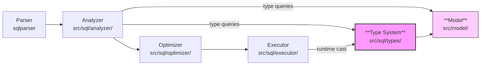
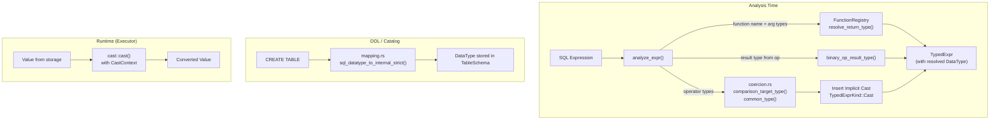

# Type System -- Type Inference, Coercion, and Function Resolution

| Attribute | Value |
|-----------|-------|
| **Source paths** | `src/sql/types/`, `src/model/mod.rs` |
| **Files** | 15 (`.rs`) |
| **Approx. lines** | ~4,130 (including tests) |
| **Depends on** | `src/model/` (DataType, Value), `sqlparser::ast`, `rust_decimal`, `serde_json` |
| **Dependents** | `src/sql/analyzer/`, `src/sql/executor/`, `src/sql/optimizer/`, `src/protocol/handler/encode/` |

---

## 1. Overview

The Type System provides the foundation for all type-related decisions in the SQL engine. It is responsible for four concerns:

1. **Type representation** -- The `DataType` enum (22 variants) and `Value` enum (19 variants) defined in `src/model/mod.rs` serve as the universal type and value representation across the entire engine.

2. **Type coercion** -- Two intentionally different coercion strategies (`common_type` and `comparison_target_type`) implement PostgreSQL's `select_common_type` and comparison coercion semantics. The split ensures that `SELECT 1 UNION SELECT 'a'` resolves to Text while `WHERE col = '42'` coerces the literal to the column's type.

3. **Type casting** -- A unified `cast()` function with three context levels (`Explicit`, `Assignment`, `Implicit`) controls which conversions are permitted and how they behave (e.g., rounding vs. rejection for `Float64 -> Int32`).

4. **Function return type resolution** -- A global `FunctionRegistry` (singleton) maps builtin function names to `FunctionSignature` entries. Each signature declares arity bounds and a `ReturnType` resolver that determines the output type from argument types at analysis time.

The Type System is entirely stateless and synchronous. It is used by the Analyzer at analysis time (coercion decisions, implicit cast insertion, function resolution) and by the Executor at runtime (value casting).

---

## 2. Architecture Position



The Type System sits below the Analyzer and Executor. At analysis time, the Analyzer calls into `coercion.rs` and `registry/` to make type decisions and insert implicit casts. At runtime, the Executor calls `cast()` in `cast/mod.rs` to perform actual value conversions. The `DataType` and `Value` enums from `src/model/` are the shared currency between all layers.

---

## 3. Key Concepts

### 3.1 DataType Enum

The canonical type representation. Defined in `src/model/mod.rs`, 22 variants:

```rust
pub enum DataType {
    Boolean,
    Int32,
    Int64,
    Float64,
    Text,
    Bytes,
    Timestamp,
    Interval,
    Uuid,
    Array(Box<DataType>),
    Vector(u32),       // dimension count; 0 = any dimension
    Json,
    Jsonb,
    Time,              // microseconds since midnight
    UserDefined(String),
    Date,              // days since 1970-01-01
    Numeric { precision: Option<u32>, scale: Option<u32> },
    TimestampTz,
    Tsvector,
    Tsquery,
    Name,
    Varchar(u64),
}
```

**Important**: Variants must not be reordered -- only appended -- to preserve bincode serialization compatibility with persisted schemas in TiKV.

### 3.2 Value Enum

The runtime value representation, 19 variants mirroring `DataType`. Every `Value` can report its own `DataType` via `value.data_type()`. `Value::Null` returns `None` (type-less).

### 3.3 Type Precedence

A numeric precedence score drives coercion decisions. Higher precedence wins when two numeric types meet:

| Type | Precedence |
|------|-----------|
| Boolean | 10 |
| Int32 | 20 |
| Int64 | 30 |
| Float64 | 45 |
| Numeric | 50 |
| Date | 60 |
| Time | 61 |
| Timestamp | 70 |
| TimestampTz | 71 |
| Interval | 80 |
| Uuid | 90 |
| Bytes | 95 |
| Text / Varchar / Name | 100 |
| Json | 110 |
| Jsonb | 111 |
| Array | 120 |
| Vector | 130 |
| Tsvector | 140 |
| Tsquery | 141 |
| UserDefined | 200 |

### 3.4 Dual Coercion Strategy

The system provides two distinct coercion functions, matching PostgreSQL's internal split:

| Function | Text behavior | Used for |
|----------|--------------|----------|
| `common_type(a, b)` | **Text wins** -- mixed Text + typed resolves to Text | UNION, CASE, COALESCE, VALUES |
| `comparison_target_type(a, b)` | **Non-Text wins** -- typed side wins, text literal is coerced | `=`, `<`, `>`, `<=`, `>=`, `!=` comparisons |

Example: `common_type(Text, Int32) = Text` but `comparison_target_type(Text, Int32) = Int32`.

This difference ensures that `'42' = 42` coerces the string literal to integer (PostgreSQL behavior), while `SELECT 1 UNION SELECT 'a'` unifies to Text.

### 3.5 CastContext

Three levels of permissiveness for type conversion, matching PostgreSQL's `CoercionContext`:

```rust
pub enum CastContext {
    Explicit,    // CAST(x AS type) -- most permissive
    Assignment,  // INSERT/UPDATE column coercion -- medium
    Implicit,    // Comparison coercion -- strictest
}
```

Context-dependent behavior examples:

| Cast | Explicit | Assignment | Implicit |
|------|----------|-----------|----------|
| Float64(2.7) -> Int32 | Rounds to 3 | Rejects (fraction) | Rejects |
| Bool(true) -> Int32 | Returns 1 | Rejects | Rejects |
| Int32(42) -> Bool | Returns true | Rejects | Rejects |
| Numeric(2.7) -> Int32 | Rounds to 3 | Truncates to 2 | Truncates to 2 |
| Text("hello") -> Varchar(3) | Truncates to "hel" | Errors if > 3 chars | Passes through |
| Unknown target | Passes through | Errors (incompatible) | Errors |

### 3.6 FunctionRegistry and ReturnType

A global singleton (`OnceLock`) maps uppercase function names to `FunctionSignature` entries. Each signature specifies arity and a `ReturnType` resolver:

```rust
pub enum ReturnType {
    Fixed(DataType),              // Always returns this type
    SameAsArg(usize),             // Returns the type of arg[idx]
    FirstNonNull,                 // Returns the type of the first non-NULL arg
    NumericPromotion,             // Promotes across numeric args
    Custom(fn(&[DataType]) -> DataType),  // Arbitrary logic
}
```

Custom resolvers handle functions with complex rules, e.g.:
- `SUM(Int32)` returns `Int64`, `SUM(Int64)` returns `Numeric`, `SUM(Float64)` returns `Float64`
- `UNNEST(Array(T))` returns `T`
- `TIMEZONE(zone, TimestampTz)` returns `Timestamp` (and vice versa)

---

## 4. File Map

| File | Lines | Purpose |
|------|-------|---------|
| `src/model/mod.rs` | 783 | `DataType` (22 variants), `Value` (19 variants), `IntervalValue`, `ColumnDef`, `TableSchema`, and all schema definition types |
| `src/sql/types/mod.rs` | 23 | Module root; re-exports `CastContext`, `sql_datatype_to_internal_strict` |
| `src/sql/types/coercion.rs` | 477 | `type_precedence`, `is_numeric`, `is_temporal`, `can_coerce`, `common_type`, `comparison_target_type`, `unify_types`, `binary_op_result_type` |
| `src/sql/types/mapping.rs` | 241 | `sql_datatype_to_internal` and `sql_datatype_to_internal_strict` -- sqlparser AST type to internal DataType |
| `src/sql/types/cast/mod.rs` | 605 | `CastContext`, `cast()`, `cast_to_bytea`, `coerce_text_to_numeric`, `normalize_regtype` |
| `src/sql/types/cast/tests.rs` | 494 | Cast context tests covering Float/Int rounding, Bool conversion, VARCHAR truncation, SQLSTATE codes |
| `src/sql/types/registry/mod.rs` | 148 | `FunctionRegistry`, `FunctionSignature`, `ReturnType`, `global_registry()` singleton |
| `src/sql/types/registry/aggregate_window.rs` | 168 | COUNT, SUM, AVG, MIN, MAX, STRING_AGG, ARRAY_AGG, BOOL_AND/OR, JSON_AGG, ROW_NUMBER, RANK, LAG/LEAD, etc. |
| `src/sql/types/registry/string.rs` | 196 | LENGTH, UPPER, LOWER, TRIM, SUBSTRING, CONCAT, REPLACE, REGEXP_REPLACE, OVERLAY, TIMEZONE, etc. |
| `src/sql/types/registry/math.rs` | 132 | ABS, CEIL, FLOOR, ROUND, MOD, POWER, SQRT, LOG, trig functions, GREATEST, LEAST, WIDTH_BUCKET |
| `src/sql/types/registry/temporal.rs` | 112 | NOW, CURRENT_TIMESTAMP, DATE_TRUNC, DATE_PART, EXTRACT, AGE, TO_CHAR, TO_TIMESTAMP, MAKE_DATE/TIME/TIMESTAMP, etc. |
| `src/sql/types/registry/json.rs` | 168 | UUID generators, TO_JSON/JSONB, JSON_BUILD_OBJECT/ARRAY, JSONB_SET, JSONB_PRETTY, JSONB_EACH, etc. |
| `src/sql/types/registry/system.rs` | 192 | CURRENT_USER, PG_TYPEOF, VERSION, FORMAT_TYPE, advisory locks, PG_TABLE_SIZE, visibility functions |
| `src/sql/types/registry/misc.rs` | 311 | Array ops (UNNEST, ARRAY_CAT, etc.), sequences (NEXTVAL, CURRVAL), COALESCE, FTS, bytea, vector, FS9, GROUPING |
| `src/sql/types/tests.rs` | 80 | Integration tests for registry return types, type unification, binary op result types |

---

## 5. Public Interfaces

### 5.1 Coercion Functions

```rust
// src/sql/types/coercion.rs

/// Numeric precedence score for coercion decisions.
pub fn type_precedence(dt: &DataType) -> i32;

/// True if dt is Int32, Int64, Float64, or Numeric.
pub fn is_numeric(dt: &DataType) -> bool;

/// True if dt is Date, Time, Timestamp, TimestampTz, or Interval.
pub fn is_temporal(dt: &DataType) -> bool;

/// True if `from` can be implicitly coerced to `to`.
pub fn can_coerce(from: &DataType, to: &DataType) -> bool;

/// "Text wins" coercion: find a common supertype for UNION/CASE/COALESCE.
pub fn common_type(a: &DataType, b: &DataType) -> Option<DataType>;

/// "Non-Text wins" coercion: find the coercion target for comparison operators.
pub fn comparison_target_type(a: &DataType, b: &DataType) -> Option<DataType>;

/// Fold common_type across a list of types.
pub fn unify_types(types: &[DataType]) -> Option<DataType>;

/// Determine the result type of a binary operator given operand types.
pub fn binary_op_result_type(op: &str, left: &DataType, right: &DataType) -> Option<DataType>;
```

### 5.2 Cast Function

```rust
// src/sql/types/cast/mod.rs

/// Controls which type conversions are allowed.
pub enum CastContext { Explicit, Assignment, Implicit }

/// Unified cast: convert val to target type under the given context.
pub(crate) fn cast(val: Value, target: &DataType, context: CastContext) -> Result<Value>;

/// Coerce a Text value to Int64 or Float64 for arithmetic operations.
pub(crate) fn coerce_text_to_numeric(v: Value) -> Result<Value>;

/// Convert a value to bytea (hex-decode or UTF-8 encode).
pub(crate) fn cast_to_bytea(v: Value) -> Result<Value>;
```

### 5.3 Type Mapping

```rust
// src/sql/types/mapping.rs

/// Strict type mapping used by DDL -- validates numeric precision/scale,
/// and treats unknown custom types as Text for backwards compatibility.
pub(crate) fn sql_datatype_to_internal_strict(sql_type: &SqlDataType) -> Result<DataType>;

/// Type mapping used by type inference -- preserves user-defined type names
/// and skips numeric validation (inference context, not DDL).
pub(crate) fn sql_datatype_to_internal(sql_type: &SqlDataType) -> Result<DataType>;
```

### 5.4 Function Registry

```rust
// src/sql/types/registry/mod.rs

pub struct FunctionRegistry { /* HashMap<String, FunctionSignature> */ }

impl FunctionRegistry {
    pub fn new() -> Self;
    pub fn register(&mut self, name: &str, sig: FunctionSignature);
    pub fn get(&self, name: &str) -> Option<&FunctionSignature>;
    pub fn resolve_return_type(&self, name: &str, arg_types: &[DataType]) -> Option<DataType>;
}

/// Global singleton. Initialized once on first access.
pub fn global_registry() -> &'static FunctionRegistry;

pub struct FunctionSignature {
    pub min_args: usize,
    pub max_args: Option<usize>,   // None = variadic
    pub return_type: ReturnType,
    pub is_aggregate: bool,
    pub is_window: bool,
}
```

---

## 6. Internal Design

### 6.1 Coercion Algorithm

`common_type(a, b)` follows this decision chain:

1. **Same type** -- return as-is.
2. **Both numeric** -- higher `type_precedence` wins. This means `Numeric > Float64 > Int64 > Int32`, matching PostgreSQL's precision-preservation rule.
3. **Temporal promotions** -- `Date + Timestamp = Timestamp`, `Timestamp + TimestampTz = TimestampTz`, `Date + TimestampTz = TimestampTz`.
4. **JSON** -- `Json + Jsonb = Jsonb`.
5. **Text-like fallback** -- any type mixed with Text/Varchar/Name yields Text.
6. **Otherwise** -- `None` (types are incompatible).

`comparison_target_type(a, b)` differs at step 5: instead of Text winning, the **non-Text typed side** wins. This ensures `'42' = 42` coerces the text literal to Int32, not the integer to Text. JSON cross-type comparisons are explicitly unsupported (returns `None`).

### 6.2 Binary Operator Result Types

`binary_op_result_type()` is a comprehensive match covering six operator categories:

| Category | Operators | Result logic |
|----------|-----------|-------------|
| **Arithmetic** | `+`, `-`, `*`, `/`, `%`, `^` | Numeric promotion; temporal special rules (Timestamp - Timestamp = Interval, Date + Int32 = Date, Jsonb - Text = Jsonb) |
| **String** | `\|\|` | Always Text |
| **Comparison** | `=`, `!=`, `<`, `<=`, `>`, `>=` | Always Boolean |
| **Logical** | `AND`, `OR` | Always Boolean |
| **JSON** | `->`, `->>`, `#>`, `#>>`, `#-`, `@>`, `<@`, `?`, `?\|`, `?&` | Jsonb or Text or Boolean depending on operator |
| **Regex/FTS** | `~`, `~*`, `!~`, `!~*`, `@@` | Always Boolean |

### 6.3 Cast Function Architecture

The `cast()` function is a single ~560-line match dispatch that handles all type pairs. Design principles:

- **NULL is always castable** to any type in all contexts (short-circuit at top).
- **Varchar(n)** has context-dependent truncation: Explicit silently truncates; Assignment errors if content exceeds length (after trimming trailing spaces, matching PostgreSQL).
- **Numeric precision** is enforced via `rescale()` using `rust_decimal`, capped at `Decimal::MAX_SCALE`.
- **Catch-all** behavior differs by context: Explicit passes through unchanged; Assignment/Implicit check `value_is_compatible_with_column_type()` and error on mismatch.
- **regtype pseudo-type**: Implements minimal `::regtype::text` canonicalization (e.g., `pg_catalog.int4` -> `integer`).

### 6.4 SQL-to-Internal Type Mapping

`mapping.rs` handles the sqlparser `DataType` -> internal `DataType` conversion with two modes:

| Mode | Function | Unknown custom types | Numeric validation |
|------|----------|---------------------|-------------------|
| **DDL (strict)** | `sql_datatype_to_internal_strict` | Mapped to Text | Yes (precision <= 1000, scale <= precision) |
| **Inference** | `sql_datatype_to_internal` | Preserved as `UserDefined(name)` | No |

Both modes share the same core logic. Custom types (sqlparser `Custom` variant) are resolved by case-insensitive name matching against a known set (JSONB, TSVECTOR, TSQUERY, VECTOR, SERIAL, BIGSERIAL, etc.). Unknown names fall through to the mode-specific default.

### 6.5 Function Registry Organization

The registry is partitioned into 7 category files, each contributing a `register()` function that populates the shared `FunctionRegistry`:

| Category | File | Function count (approx.) |
|----------|------|-------------------------|
| aggregate_window | `aggregate_window.rs` | 22 (COUNT, SUM, AVG, MIN, MAX, STRING_AGG, ARRAY_AGG, BOOL_AND/OR, EVERY, JSON_AGG/JSONB_AGG, ROW_NUMBER, RANK, DENSE_RANK, NTILE, LAG, LEAD, FIRST_VALUE, LAST_VALUE, NTH_VALUE, PERCENT_RANK, CUME_DIST) |
| string | `string.rs` | 29 (LENGTH, UPPER, LOWER, TRIM, SUBSTRING, CONCAT, REPLACE, OVERLAY, TIMEZONE, REGEXP_REPLACE, REGEXP_MATCH, etc.) |
| math | `math.rs` | 26 (ABS, CEIL, FLOOR, ROUND, MOD, POWER, SQRT, LOG, trig, GREATEST, LEAST, WIDTH_BUCKET, etc.) |
| temporal | `temporal.rs` | 21 (NOW, CURRENT_TIMESTAMP, DATE_TRUNC, EXTRACT, AGE, TO_CHAR, MAKE_DATE/TIME/TIMESTAMP, CLOCK_TIMESTAMP, etc.) |
| json | `json.rs` | 30 (GEN_RANDOM_UUID, TO_JSON/JSONB, JSON_BUILD_OBJECT, JSONB_SET, JSONB_PRETTY, JSONB_EACH, JSONB_ARRAY_ELEMENTS, etc.) |
| system | `system.rs` | 32 (CURRENT_USER, PG_TYPEOF, VERSION, FORMAT_TYPE, advisory locks, visibility functions, PG_TABLE_SIZE, etc.) |
| misc | `misc.rs` | 43 (array ops, sequences, COALESCE, NULLIF, FTS, bytea, vector, FS9, BG_SQL, GROUPING, etc.) |

Total: approximately 200+ registered builtin functions.

---

## 7. Data Flow Diagram



---

## 8. Contracts and Invariants

### Input Requirements

| Requirement | Enforced by |
|------------|-------------|
| Both operands of `common_type` / `comparison_target_type` are valid DataTypes | Caller (Analyzer) |
| `cast()` receives a non-type-mismatched value or NULL | Analyzer ensures implicit casts are valid; runtime errors on truly invalid conversions |
| `sql_datatype_to_internal_strict()` receives a syntactically valid sqlparser DataType | SQL parser (upstream) |
| Function names are resolved case-insensitively | `FunctionRegistry` uppercases on both register and lookup |

### Output Guarantees

| Guarantee | Mechanism |
|-----------|-----------|
| Numeric coercion is always upward (Int32 -> Int64 -> Float64 -> Numeric) | `type_precedence` ordering |
| `common_type` is symmetric: `common_type(a, b) == common_type(b, a)` | All match arms are bidirectional |
| `comparison_target_type` is symmetric for non-Text types | Match arms cover both orderings |
| `common_type(Text, T) = Text` for any T | Text-like fallback match arm |
| `comparison_target_type(Text, T) = T` when T is not Text/Name | Non-Text-wins match arm with guard |
| JSON cross-type comparisons are always None | Explicit match arm returns None |
| NULL casts always succeed | Short-circuit at top of `cast()` |
| DDL numeric precision is bounded at 1000 | `validate_numeric_spec()` in mapping.rs |
| DataType variant ordering is append-only | Comment in source; bincode compatibility requirement |
| FunctionRegistry is immutable after initialization | `OnceLock` singleton pattern |

### Key Coercion Rules (PostgreSQL Parity)

```
Numeric:  Int32 < Int64 < Float64 < Numeric
Temporal: Date < Timestamp < TimestampTz
JSON:     Json < Jsonb
Text:     Text = Varchar = Name (all precedence 100)
```

---

## 9. Error Handling

Cast errors use `SqlError` variants with PostgreSQL-compatible SQLSTATE codes:

| Error | SQLSTATE | When |
|-------|----------|------|
| `NumericValueOutOfRange` | 22003 | Integer overflow (Int64 -> Int32, Float -> Int, Numeric -> Int) |
| `StringDataRightTruncation` | 22001 | VARCHAR(n) Assignment context exceeds length |
| `InvalidInputSyntax { type_name }` | 22P02 | Parse failure (Text -> Int, Text -> UUID, Text -> Boolean, etc.) |
| `InvalidCast { from, to }` | 42846 | Assignment/Implicit context catch-all for incompatible types |

Coercion functions (`common_type`, `comparison_target_type`) do not produce errors -- they return `Option<DataType>`. The caller (Analyzer) translates `None` into `AnalyzerError::TypeMismatch` or `AnalyzerError::OperatorTypeMismatch`.

The `FunctionRegistry` returns `None` for unknown functions; the Analyzer translates this into `AnalyzerError::FunctionNotFound`.

---

## 10. Testing

### Unit Tests

- **`src/sql/types/coercion.rs`** (module tests, lines 291-477): 11 tests covering common_type Text-wins, numeric promotion, Numeric > Float64 precedence, comparison_target_type non-Text-wins, temporal coercion, JSON unsupported comparisons, boundary divergence between common_type and comparison_target_type.

- **`src/sql/types/cast/tests.rs`** (494 lines): 30 tests covering:
  - Float64/Int32 rounding by context (Explicit rounds, Assignment rejects fractions)
  - Bool/Int bidirectional conversion (Explicit only)
  - Numeric/Int rounding by context
  - Numeric/Float64 conversion
  - Unknown target pass-through vs. error
  - Array and Vector casting in both contexts
  - NULL passthrough
  - Text -> Boolean (true/false/on/off)
  - Text -> Tsquery syntax validation
  - VARCHAR(n) truncation (Explicit) vs. rejection (Assignment)
  - SQLSTATE roundtrip tests (22003, 22001)
  - JSONB -> Text/JSON canonicalization

- **`src/sql/types/tests.rs`** (80 lines): 5 integration tests for FunctionRegistry return type resolution (COUNT, SUM, MIN/MAX), type unification, binary_op_result_type, and is_numeric.

### Integration Tests

SQL tests in `tests/` exercise the type system indirectly through the full execution pipeline. Tests involving type coercion in WHERE clauses, UNION type unification, CAST expressions, and function return types exercise the type system end-to-end.

---

## 11. Common Task Index

| Task | Where to look |
|------|--------------|
| Add a new DataType variant | Append to `DataType` enum in `src/model/mod.rs` (never reorder), add matching `Value` variant, update `Display`, update `value_is_compatible_with_column_type` in `cast/mod.rs`, add precedence in `coercion.rs` |
| Add a new coercion rule | Add match arm in `common_type()` and/or `comparison_target_type()` in `coercion.rs`, add `can_coerce()` entry if implicit coercion is allowed |
| Add a new cast conversion | Add match arm in `cast()` in `cast/mod.rs`, consider all three CastContext behaviors |
| Add a new builtin function | Create entry in the appropriate `registry/*.rs` category file using `FunctionSignature` builder |
| Change numeric promotion rules | Adjust `type_precedence()` scores in `coercion.rs` |
| Add a new binary operator result type | Add match arm in `binary_op_result_type()` in `coercion.rs` |
| Map a new SQL syntax type | Add match arm in `sql_datatype_to_internal_impl()` in `mapping.rs` |
| Map a new custom type name | Add entry in `convert_custom_type()` in `mapping.rs` |
| Fix VARCHAR behavior | `cast/mod.rs`, the `(v, DataType::Varchar(max_len))` match arm |
| Add a test for cast behavior | `cast/tests.rs` |
| Add a test for coercion | Module tests in `coercion.rs` |
| Understand function resolution flow | Analyzer calls `global_registry().resolve_return_type(name, arg_types)` in `src/sql/analyzer/expr/functions.rs` |

---

## 12. See Also

- [Analyzer.md](Analyzer.md) -- Semantic analysis layer that consumes the Type System for coercion and function resolution
- `src/sql/analyzer/expr/coercion.rs` -- Analysis-time coercion helpers (`coerce_if_needed`, `unify_expr_types`) that bridge the Analyzer and the Type System
- `src/sql/analyzer/expr/operators.rs` -- Binary operator analysis that calls `comparison_target_type` and `binary_op_result_type`
- `src/sql/expr/functions/` -- Runtime function implementations (13 categories) that correspond to the registry signatures
- `src/protocol/handler/encode/types.rs` -- Wire protocol type mapping (DataType to PostgreSQL OIDs)
