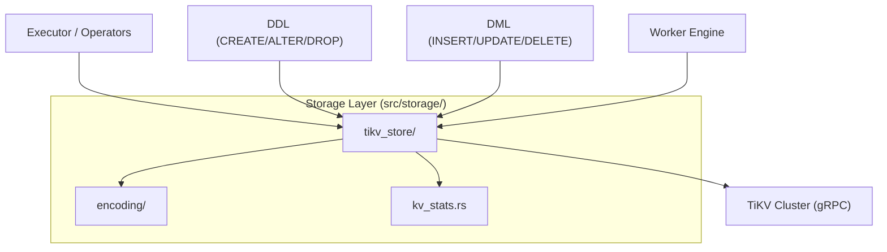
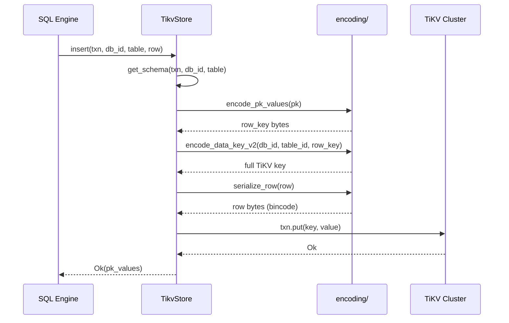

# Storage Layer

| | |
|---|---|
| **Source** | `src/storage/` |
| **Lines** | ~7,000 across 24 files |
| **Depends on** | `tikv_client`, `memcomparable`, `bincode`, `rmp_serde` |
| **Depended on by** | Executor, Operators, DDL, DML, Worker, Cron, Catalog |

---

## Overview

The storage layer translates SQL-level operations (row reads, writes, index lookups, schema management) into TiKV key-value operations. It owns all persistent key encoding, serialization formats, and keyspace isolation boundaries.

Key responsibilities:

- **Key encoding**: Deterministic, sort-preserving encoding of row data keys, index keys, and metadata keys using a database-scoped v2 key format (`d_{db_id}_*`).
- **Serialization**: Row data via bincode, schema metadata via versioned magic-header formats (V1 bincode, V2 MessagePack).
- **TiKV interaction**: Pessimistic and optimistic transactions, paginated scans, batch gets, autocommit retry loops.
- **Keyspace isolation**: All persistent data is partitioned per database ID. Global system metadata uses `_sys_*` prefixes. Worker keys use `_worker_*` prefixes.

---

## Architecture Position



The storage layer sits between the SQL engine (executor, operators, DDL, DML) and the TiKV cluster. All persistent data access flows through `TikvStore`, which delegates key construction to the `encoding/` submodule and communicates with TiKV via the `tikv_client` crate.

---

## Key Concepts

### TikvStore

The central struct (`src/storage/tikv_store/mod.rs`) that wraps a `tikv_client::TransactionClient`. All storage operations are methods on `TikvStore`, taking a `&mut Transaction` parameter for transactional reads and writes.

```rust
pub struct TikvStore {
    client: Option<Arc<TransactionClient>>,
}
```

### Database-Scoped v2 Key Format

Storage format v2 partitions all database-local data under a fixed binary prefix:

```
d_{db_id:8bytes}_
```

Where `db_id` is a `u64` in big-endian encoding. This enables efficient range deletion of entire databases and enforces per-database keyspace isolation.

### Keyspace-Level System Keys

Global metadata that is not scoped to a single database uses `_sys_*` prefixes:

- `_sys_next_table_id` -- global table ID allocator (legacy)
- `_sys_next_database_id` -- database ID allocator
- `_sys_format_version` -- storage format version marker
- `_sys_dbname_{name}` -- database name to ID mapping
- `_sys_dbid_{id}` -- database ID to definition mapping
- `_sys_migration_*` -- migration tracking records

### Memcomparable Value Encoding

Index keys and primary keys use memcomparable encoding (`src/storage/encoding/value_encoding.rs`) that preserves lexicographic sort order across all supported types. This ensures TiKV range scans return rows in the correct SQL `ORDER BY` sequence.

Tag bytes: `NULL_TAG = 0x00`, `NOT_NULL_TAG = 0x01`. NULL always sorts before any non-NULL value.

### Schema Serialization

Schema metadata uses a versioned wire format with magic headers:

- **V2**: `DB9_SCHEMA_V2\0` + MessagePack (named map, forward-compatible via `#[serde(default)]`)
- **V1**: `DB9_SCHEMA_V1\0` + bincode (frozen, 4 eras for backward compatibility)

Read supports both V2 and V1 transparently. Write defaults to V1; V2 is opt-in.

---

## File Map

| File | Purpose |
|------|---------|
| `mod.rs` | Module root, re-exports, `UniqueIndexDuplicateError` |
| `kv_stats.rs` | Tokio task-local KV read statistics tracking |
| `encoding/mod.rs` | Re-exports, keyspace-level constants and key construction |
| `encoding/data_keys.rs` | Row data keys, btree/GIN index keys, range scan boundaries |
| `encoding/metadata_keys.rs` | Schema, view, function, trigger, cron, worker, comment key construction |
| `encoding/value_encoding.rs` | Memcomparable encode/decode for all value types |
| `encoding/serialization.rs` | Schema/function/row serialization with versioning (V1 bincode, V2 msgpack) |
| `encoding/tests.rs` | Encoding unit tests (key ordering, roundtrip, worker keys) |
| `tikv_store/mod.rs` | `TikvStore` struct, core transaction helpers, OID allocators, comment management |
| `tikv_store/database.rs` | Database CRUD (create, drop, rename, list, owner management) |
| `tikv_store/schemas.rs` | Schema/namespace operations (create, drop restrict/cascade, list) |
| `tikv_store/tables.rs` | Table DDL, row CRUD (insert, upsert, scan, delete), row locking, rename |
| `tikv_store/indexes.rs` | B-tree and GIN index operations (create, delete, scan, range scan, batch get) |
| `tikv_store/sequences.rs` | Sequence operations (nextval, setval, create, drop, migration) |
| `tikv_store/triggers.rs` | Trigger management and rename helpers |
| `tikv_store/functions.rs` | Function CRUD with caching |
| `tikv_store/views.rs` | Views and materialized views |
| `tikv_store/types.rs` | User-defined types (CREATE/DROP/ALTER TYPE) |
| `tikv_store/procedures.rs` | Stored procedures (PL/pgSQL) |
| `tikv_store/extensions.rs` | Extension management |
| `tikv_store/collations.rs` | Collation management |
| `tikv_store/cron.rs` | Cron job management (CronJob, CronRun, claims, guards) |
| `tikv_store/statistics.rs` | Table statistics persistence for the optimizer |
| `tikv_store/worker.rs` | Background worker task management (registry, queue, claims, results) |
| `tikv_store/migrations.rs` | Migration record tracking and view relation bindings backfill |

---

## Public Interfaces

### TikvStore -- Core

```rust
// Connection
pub async fn new_with_keyspace(pd_endpoints: Vec<String>, keyspace: Option<String>) -> Result<Self>
pub async fn new_system(pd_endpoints: Vec<String>, keyspace: &str) -> Result<Self>
pub fn transaction_client(&self) -> Option<Arc<TransactionClient>>

// Transactions
pub async fn begin(&self) -> Result<Transaction>              // pessimistic
pub async fn begin_optimistic(&self) -> Result<Transaction>   // optimistic

// Storage format
pub async fn check_format_version(&self) -> Result<()>
pub async fn bootstrap_default_database(&self, owner: &str) -> Result<()>
```

### TikvStore -- Tables (`tikv_store/tables.rs`)

```rust
pub async fn create_table(&self, txn: &mut Transaction, db_id: u64, schema: TableSchema) -> Result<()>
pub async fn get_schema(&self, txn: &mut Transaction, db_id: u64, table_name: &str) -> Result<Option<TableSchema>>
pub async fn drop_table(&self, txn: &mut Transaction, db_id: u64, table_name: &str) -> Result<bool>
pub async fn insert(&self, txn: &mut Transaction, db_id: u64, table_name: &str, row: Row) -> Result<Vec<Value>>
pub async fn upsert(&self, txn: &mut Transaction, db_id: u64, table_name: &str, row: Row) -> Result<()>
pub async fn scan(&self, txn: &mut Transaction, db_id: u64, table_name: &str, limit: Option<usize>) -> Result<Vec<Row>>
pub async fn delete_by_pk(&self, txn: &mut Transaction, db_id: u64, table_name: &str, pk_values: &[Value]) -> Result<u64>
pub async fn truncate_table(&self, txn: &mut Transaction, db_id: u64, table_name: &str) -> Result<bool>
pub async fn list_tables(&self, txn: &mut Transaction, db_id: u64) -> Result<Vec<String>>
pub async fn lock_rows(&self, txn: &mut Transaction, db_id: u64, table_name: &str, rows: &[Row], lock_timeout: Option<Duration>) -> Result<()>
pub async fn lock_rows_nowait(&self, txn: &mut Transaction, db_id: u64, table_name: &str, rows: &[Row]) -> Result<()>
pub async fn lock_rows_skip_locked(&self, txn: &mut Transaction, db_id: u64, table_name: &str, rows: &[Row], max_locks: Option<usize>) -> Result<Vec<usize>>
```

### TikvStore -- Indexes (`tikv_store/indexes.rs`)

```rust
pub async fn create_index_entry(&self, txn: &mut Transaction, db_id: u64, table_id: u64, index_id: u64, values: &[Value], pk_values: &[Value], unique: bool) -> Result<()>
pub async fn delete_index_entry(&self, txn: &mut Transaction, db_id: u64, table_id: u64, index_id: u64, values: &[Value], pk_values: &[Value], unique: bool) -> Result<()>
pub async fn scan_index(&self, txn: &mut Transaction, db_id: u64, table_id: u64, index_id: u64, values: &[Value], unique: bool, pk_types: &[DataType], limit: Option<usize>) -> Result<Vec<Vec<Value>>>
pub async fn scan_index_range(&self, txn: &mut Transaction, ...) -> Result<Vec<Vec<Value>>>
pub async fn scan_index_prefix(&self, txn: &mut Transaction, ...) -> Result<Vec<Vec<Value>>>
pub async fn create_gin_index_entries(&self, txn: &mut Transaction, db_id: u64, table_id: u64, index_id: u64, token_hashes: &[u64], pk_values: &[Value]) -> Result<()>
pub async fn batch_get_rows(&self, txn: &mut Transaction, db_id: u64, table_id: u64, pks: Vec<Vec<Value>>, schema: &TableSchema) -> Result<Vec<Row>>
```

### Key Encoding Functions (`encoding/data_keys.rs`)

```rust
pub fn encode_data_key_v2(db_id: u64, table_id: u64, row_key: &[u8]) -> Vec<u8>
pub fn encode_index_key_v2(db_id: u64, table_id: u64, index_id: u64, values: &[Value], pk: Option<&[Value]>) -> Vec<u8>
pub fn encode_gin_index_key_v2(db_id: u64, table_id: u64, index_id: u64, token_hash: u64, pk_key: &[u8]) -> Vec<u8>
pub fn encode_table_data_range_v2(db_id: u64, table_id: u64) -> (Vec<u8>, Vec<u8>)
pub fn encode_table_index_range_v2(db_id: u64, table_id: u64) -> (Vec<u8>, Vec<u8>)
pub fn encode_pk_values(values: &[Value]) -> Vec<u8>
```

### Serialization (`encoding/serialization.rs`)

```rust
pub fn serialize_schema(schema: &TableSchema) -> Result<Vec<u8>>
pub fn deserialize_schema(data: &[u8]) -> Result<TableSchema>
pub fn serialize_row(row: &Row) -> Result<Vec<u8>>
pub fn deserialize_row(data: &[u8]) -> Result<Row>
pub fn serialize_function_def(def: &FunctionDef) -> Result<Vec<u8>>
pub fn deserialize_function_def(data: &[u8]) -> Result<FunctionDef>
```

---

## Internal Design

### SQL Operations to KV Operations Mapping

| SQL Operation | KV Operation | Key Pattern |
|---|---|---|
| `INSERT INTO t` | `put(data_key, row_bytes)` | `d_{db}_t_{tid}_{pk}` |
| `SELECT * FROM t` | `scan(data_range)` | `[d_{db}_t_{tid}_, d_{db}_t_{tid+1})` |
| `DELETE FROM t WHERE pk = v` | `delete(data_key)` | `d_{db}_t_{tid}_{pk}` |
| Index lookup (unique) | `get(index_key)` | `d_{db}_i_{tid}_{iid}_{vals}` |
| Index lookup (non-unique) | `scan(index_range)` | `d_{db}_i_{tid}_{iid}_{vals}[0x01..0x02)` |
| GIN token lookup | `scan(gin_prefix)` | `d_{db}_i_{tid}_{iid}_gin_{hash}[0x00..]` |
| `CREATE TABLE` | `put(schema_key, schema_bytes)` | `d_{db}_sys_schema_{name}` |
| `DROP TABLE` | `delete(schema_key)` + range delete | data + index ranges |
| `TRUNCATE` | range delete | data + index ranges |

### Index Key Encoding

For **unique indexes** (non-NULL values): the key contains the index values, and the value contains the encoded PK.

```
key:   d_{db}_i_{tid}_{iid}_{memcomparable_values}
value: {memcomparable_pk}
```

For **non-unique indexes** (or unique indexes with NULL values): the PK is appended to the key after a separator byte (`0x01`), and the value is empty.

```
key:   d_{db}_i_{tid}_{iid}_{memcomparable_values}_0x01_{memcomparable_pk}
value: (empty)
```

For **GIN inverted indexes**: each token hash gets its own key with the PK in the key suffix.

```
key:   d_{db}_i_{tid}_{iid}_gin_{token_hash:8bytes}_0x00_{pk_key}
value: (empty)
```

### Autocommit Retry Pattern

Sequence operations and other non-transactional updates use `autocommit_update_key()`, which runs an optimistic transaction with up to 10 retry attempts on conflict:

```rust
async fn autocommit_update_key<R>(
    &self,
    key: Vec<u8>,
    compute: impl FnMut(Option<Vec<u8>>) -> Result<(Option<Vec<u8>>, R)>,
) -> Result<R>
```

This emulates PostgreSQL's non-transactional sequence semantics, where updates survive caller transaction rollbacks.

### Paginated Scans

Large table scans use `scan_one_page()` with `TABLE_SCAN_BATCH_SIZE = 1024` to avoid exceeding gRPC message size limits. Each page returns pairs and a `next_start` key for continuation.

---

## Data Flow Diagram



---

## Contracts

### Keyspace Isolation Invariant

> All persistent keys MUST be routed through `TikvStore`. No module may construct raw TiKV keys independently.

Database-scoped data always uses the `d_{db_id}_` prefix. System-wide metadata uses `_sys_*` prefixes. Worker keys use `_worker_*` prefixes.

### Storage Format Version

The `_sys_format_version` key stores a `u32` version marker. Current version is **2**. On startup, `check_format_version()`:

1. If the key exists and matches v2, proceed.
2. If the key exists but does not match, refuse to start.
3. If the key does not exist, check for legacy v1 keys. If found, refuse to start. If not found, initialize v2.

### Serialization Backward Compatibility

Schema deserialization supports 4 eras of V1 bincode plus V2 MessagePack, all handled transparently in `deserialize_schema()`. Legacy formats will be sunset on 2026-12-31.

### Savepoint Integration

All `put` and `delete` operations use `txn_put()` / `txn_delete()` wrappers from `src/txn/`, which record undo information when savepoints are active. The one exception is `autocommit_update_key()`, which intentionally bypasses savepoint tracking to match PostgreSQL's non-transactional sequence semantics.

---

## Error Handling

| Error | Source | SQLSTATE |
|---|---|---|
| `UniqueIndexDuplicateError` | `create_index_entry()` when unique constraint violated | (caught and mapped to `23505` upstream) |
| `SqlError::UniqueViolation` | `insert()` when PK already exists | `23505` |
| `SqlError::LockTimeout` | `lock_rows()` when timeout expires | `55P03` |
| `SqlError::LockNotAvailable` | `lock_rows_nowait()` when row locked | `55P03` |
| `SqlError::DuplicateRelation` | `reserve_relation_name()` when name taken | `42P07` |
| `anyhow` errors | TiKV client errors, serialization failures | varies |

---

## Testing

- **Unit tests**: `encoding/tests.rs` -- key ordering, roundtrip encoding, worker key structure (37 tests).
- **Serialization tests**: `encoding/serialization.rs` -- V1/V2 roundtrip, backward compatibility across 4 eras, unknown fields tolerance (12 tests).
- **Index tests**: `tikv_store/indexes.rs` -- non-unique PK decode roundtrip, composite PK decode, unique key shape rejection.
- **Sequence tests**: `tikv_store/mod.rs` -- nextval/setval standalone logic, boundary conditions, cycle wrapping.
- **Migration tests**: `tikv_store/migrations.rs` -- view relation bindings backfill planning, marker lifecycle.
- **Integration tests**: `tests/*.sql` -- end-to-end SQL tests that exercise storage through the full execution pipeline.

Run with:

```bash
cargo test --lib storage
```

---

## Common Task Index

| Task | Where to look |
|------|---------------|
| Change row key encoding | `encoding/data_keys.rs` -- `encode_data_key_v2()` |
| Change index key encoding | `encoding/data_keys.rs` -- `encode_index_key_v2()` |
| Add new metadata type | `encoding/metadata_keys.rs` -- add prefix constant and encode function |
| Change row serialization format | `encoding/serialization.rs` -- `serialize_row()` / `deserialize_row()` |
| Change schema serialization format | `encoding/serialization.rs` -- add V3 format |
| Add memcomparable type support | `encoding/value_encoding.rs` -- add match arms in encode/decode |
| Add new TikvStore method | `tikv_store/` -- add to appropriate submodule |
| Change scan batch size | `tikv_store/mod.rs` -- `TABLE_SCAN_BATCH_SIZE` constant |
| Add worker task type | `tikv_store/worker.rs` + `encoding/metadata_keys.rs` |
| Fix KV read statistics | `kv_stats.rs` -- `record_*` functions |
| Debug key encoding issues | `encoding/tests.rs` -- add roundtrip test |

---

## See Also

- [Transactions](Transactions.md) -- Transaction state management and savepoint semantics
- [Storage Key Layout](Diagrams/storage-key-layout.md) -- Visual diagram of the key encoding structure
- [Architecture Overview](Architecture-Overview.md) -- System-wide architecture
- Source navigation: `src/storage/AGENTS.md`
- Normative contract: `docs/sot/storage-format.md`
- Architecture deep-dive: `docs/architecture/storage.md`
