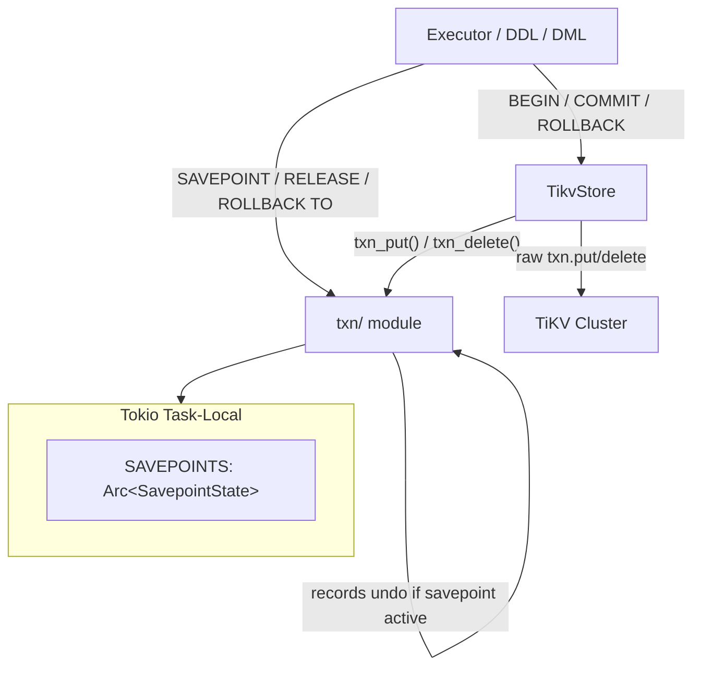
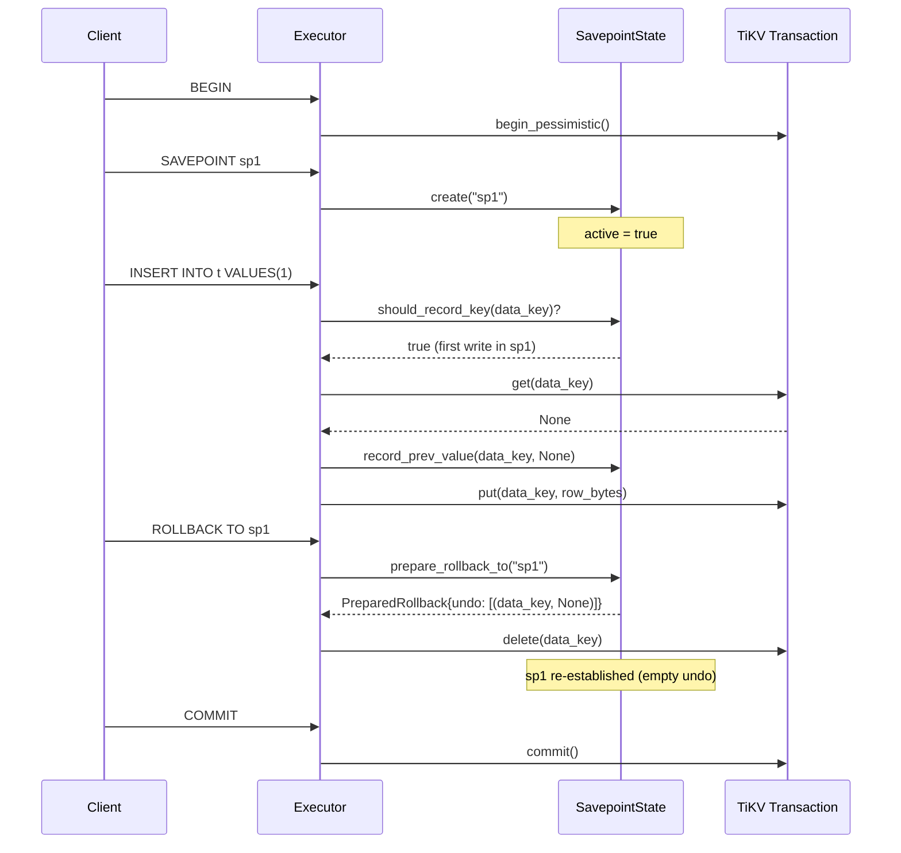

# Transactions

| | |
|---|---|
| **Source** | `src/txn/` |
| **Lines** | ~350 across 3 files |
| **Depends on** | `tikv_client::Transaction`, `tokio` (task-local) |
| **Depended on by** | Storage Layer (`TikvStore`), Executor, DDL, DML |

---

## Overview

The transaction module implements PostgreSQL-like `SAVEPOINT` semantics on top of TiKV's transactional API. TiKV natively provides ACID transactions (pessimistic or optimistic), but does not support savepoints. This module bridges the gap by recording "before images" (undo information) for every mutated key when a savepoint is active, enabling partial rollback within a transaction.

The module provides:

- **Savepoint state management** (`SavepointState`): a session-scoped wrapper with an atomic fast-path flag for the hot write path.
- **Savepoint stack** (`SavepointManager`): a stack-based implementation of PostgreSQL's SAVEPOINT, RELEASE SAVEPOINT, and ROLLBACK TO SAVEPOINT semantics.
- **Transparent undo wrappers** (`txn_put`, `txn_delete`): drop-in replacements for raw TiKV `put`/`delete` that automatically record undo information when savepoints are present.

---

## Architecture Position



The `txn/` module sits between the executor/storage layer and TiKV. Every `put` and `delete` operation in the storage layer calls `txn_put()` / `txn_delete()` instead of raw TiKV methods. These wrappers check the task-local `SavepointState` and record undo information when needed.

---

## Key Concepts

### Transaction Lifecycle

db9-server uses TiKV's transaction API for all persistent operations:

1. **BEGIN**: `TikvStore::begin()` starts a pessimistic transaction (default) or `begin_optimistic()` starts an optimistic one.
2. **Execute**: All reads and writes happen within the transaction via `txn.get()`, `txn_put()`, `txn_delete()`, `txn.scan()`, etc.
3. **COMMIT**: `txn.commit()` persists all changes atomically.
4. **ROLLBACK**: `txn.rollback()` discards all changes.

### Autocommit

Single statements outside an explicit transaction block run in implicit autocommit mode. The executor begins a transaction, executes the statement, and commits (or rolls back on error).

### Savepoint Semantics

Savepoints provide partial rollback within a transaction:

- **SAVEPOINT name**: Creates a restore point. The system starts recording undo information for all subsequent writes.
- **RELEASE SAVEPOINT name**: Destroys the savepoint and all later savepoints. Undo records merge into the parent savepoint.
- **ROLLBACK TO SAVEPOINT name**: Restores the transaction state to when the savepoint was created. The savepoint is re-established (can be rolled back to again).

PostgreSQL allows duplicate savepoint names. Only the most recent identically-named savepoint is accessible until it is released.

### Undo Mechanism

When a savepoint is active and a key is modified for the first time within that savepoint:

1. `txn_put()` / `txn_delete()` reads the current value of the key from TiKV.
2. The previous value (or `None` if the key did not exist) is stored in the savepoint's `undo` map.
3. The actual TiKV `put`/`delete` proceeds.

On `ROLLBACK TO SAVEPOINT`, the undo records are replayed: keys are restored to their previous values (or deleted if they did not exist before).

### Fast-Path Optimization

`SavepointState` uses an `AtomicBool` (`active`) as a fast-path check. When no savepoints exist, `txn_put()` and `txn_delete()` skip the mutex lock entirely, adding zero overhead to the hot write path.

---

## File Map

| File | Purpose |
|------|---------|
| `mod.rs` | Module root, task-local `SAVEPOINTS`, `txn_put()` / `txn_delete()` wrappers, `with_savepoints()` scope function |
| `state.rs` | `SavepointState` -- mutex-guarded wrapper around `SavepointManager` with atomic fast-path flag |
| `savepoints.rs` | `SavepointManager` -- stack-based savepoint implementation with undo maps, `PreparedRollback` |

---

## Public Interfaces

### Task-Local Scope (`mod.rs`)

```rust
/// Run `future` with the given savepoint manager set as task-local context.
pub(crate) async fn with_savepoints<R>(
    savepoints: Arc<SavepointState>,
    future: impl Future<Output = R>,
) -> R
```

### TiKV Write Wrappers (`mod.rs`)

```rust
/// TiKV `put` wrapper that records undo information when SAVEPOINT is active.
pub(crate) async fn txn_put(
    txn: &mut Transaction,
    key: Vec<u8>,
    value: Vec<u8>,
) -> Result<()>

/// TiKV `delete` wrapper that records undo information when SAVEPOINT is active.
pub(crate) async fn txn_delete(
    txn: &mut Transaction,
    key: Vec<u8>,
) -> Result<()>
```

### SavepointState (`state.rs`)

```rust
pub(crate) struct SavepointState {
    active: AtomicBool,
    manager: Mutex<SavepointManager>,
}

impl SavepointState {
    pub(crate) fn new() -> Self
    pub(crate) fn is_active(&self) -> bool
    pub(crate) async fn reset(&self) -> Result<()>
    pub(crate) async fn create(&self, name: String) -> Result<()>
    pub(crate) async fn release(&self, name: &str) -> Result<()>
    pub(crate) async fn prepare_rollback_to(&self, name: &str) -> Result<PreparedRollback>
    pub(crate) async fn should_record_key(&self, key: &[u8]) -> Result<bool>
    pub(crate) async fn record_prev_value(&self, key: Vec<u8>, prev: Option<Vec<u8>>) -> Result<()>
}
```

### SavepointManager (`savepoints.rs`)

```rust
pub(crate) struct SavepointManager {
    stack: Vec<Savepoint>,
}

pub(crate) struct Savepoint {
    pub(crate) name: String,
    pub(crate) undo: HashMap<Vec<u8>, Option<Vec<u8>>>,
}

pub(crate) struct PreparedRollback {
    pub(crate) popped: Vec<Savepoint>,
    pub(crate) target_undo: Vec<UndoRecord>,
}

pub(crate) struct UndoRecord {
    pub(crate) key: Vec<u8>,
    pub(crate) prev: Option<Vec<u8>>,
}

impl SavepointManager {
    pub(crate) fn new() -> Self
    pub(crate) fn reset(&mut self)
    pub(crate) fn has_savepoints(&self) -> bool
    pub(crate) fn create(&mut self, name: String)
    pub(crate) fn release(&mut self, name: &str) -> Result<()>
    pub(crate) fn should_record_key(&self, key: &[u8]) -> bool
    pub(crate) fn record_prev_value(&mut self, key: Vec<u8>, prev: Option<Vec<u8>>)
    pub(crate) fn prepare_rollback_to(&mut self, name: &str) -> Result<PreparedRollback>
}
```

---

## Internal Design

### State Machine

```
                    BEGIN
                      |
                      v
              +---------------+
              |  Transaction  |
              |  (no savepoints)|
              +-------+-------+
                      |
               SAVEPOINT sp1
                      |
                      v
              +---------------+
              |  sp1 active   |<----+
              |  (recording)  |     |
              +-------+-------+     |
                      |             |
          +-----------+-----------+ |
          |                       | |
   SAVEPOINT sp2           RELEASE sp1
          |                       |
          v                       v
   +---------------+     +---------------+
   |  sp2 active   |     |  Transaction  |
   |  (recording)  |     |  (sp1 undo    |
   +-------+-------+     |  merged to    |
          |               |  parent/gone) |
   ROLLBACK TO sp1        +---------------+
          |
          v
   +---------------+
   |  sp1 re-est.  |
   |  (sp2 popped, |
   |  sp1 undo     |
   |  replayed)    |
   +---------------+
          |
      COMMIT / ROLLBACK
          |
          v
       (done)
```

### Savepoint Stack Behavior

The `SavepointManager` maintains a stack of `Savepoint` entries. Each entry has:

- **name**: The savepoint name (duplicates allowed, matching PostgreSQL).
- **undo**: A `HashMap<Vec<u8>, Option<Vec<u8>>>` mapping keys to their previous values. Each key is recorded at most once per savepoint (first-write wins).

#### SAVEPOINT

Pushes a new `Savepoint` onto the stack. Subsequent writes record undo in this savepoint.

#### RELEASE SAVEPOINT

Finds the most recent savepoint with the given name. Destroys it and all later savepoints. Undo records from destroyed savepoints merge into the parent, with outer (earlier) previous values winning on conflict. If the released savepoint is the outermost, the stack is cleared entirely.

#### ROLLBACK TO SAVEPOINT

Finds the most recent savepoint with the given name. Returns a `PreparedRollback` containing:

1. **popped**: All savepoints above the target (destroyed).
2. **target_undo**: The target savepoint's undo records (drained so it is re-established empty).

The caller applies the undo by restoring each key to its previous value in the TiKV transaction.

### Sequence Non-Transactional Semantics

`TikvStore::autocommit_update_key()` intentionally uses raw `txn.put()` / `txn.delete()` (bypassing `txn_put()` / `txn_delete()`). This means sequence advances are NOT recorded in savepoint undo maps, matching PostgreSQL's behavior where sequence advances survive transaction rollbacks.

---

## Data Flow Diagram



---

## Contracts

### Savepoint Undo Guarantee

Every `txn_put()` and `txn_delete()` call MUST check the savepoint state and record the previous value before modifying the key. This ensures `ROLLBACK TO SAVEPOINT` can restore the transaction to its exact state at savepoint creation time.

### First-Write-Wins

Within a single savepoint, only the first write to a key records the previous value. Subsequent writes to the same key within the same savepoint do not overwrite the undo record, because the original previous value is what needs to be restored.

### Task-Local Scope

`SavepointState` is set as a tokio task-local variable via `with_savepoints()`. It MUST be set before any `txn_put()` / `txn_delete()` calls that need savepoint support. If the task-local is not set, the wrappers proceed without undo recording (no savepoints active).

### PostgreSQL Compatibility

- Duplicate savepoint names are allowed. `RELEASE` and `ROLLBACK TO` target the most recent identically-named savepoint.
- `RELEASE` destroys the named savepoint and all later savepoints, merging undo into the parent.
- `ROLLBACK TO` destroys savepoints above the target and re-establishes the target (it can be rolled back to again).
- Sequence operations bypass savepoint undo tracking (non-transactional semantics).

### Transaction Mode

- Default transaction mode is **pessimistic** (`TransactionOptions::new_pessimistic()`).
- Optimistic mode (`TransactionOptions::new_optimistic()`) is used only for autocommit retry loops (sequences, OID allocation).

---

## Error Handling

| Error | Condition |
|---|---|
| `anyhow!("savepoint \"{}\" does not exist", name)` | `RELEASE` or `ROLLBACK TO` with a name that does not match any savepoint on the stack. |
| TiKV transaction errors | Propagated from `txn.get()`, `txn.put()`, `txn.delete()` calls within the undo recording path. |

---

## Testing

### Unit Tests in `savepoints.rs`

- `rollback_to_removes_nested_and_reestablishes_target` -- verifies nested savepoint removal and target re-establishment.
- `rollback_to_uses_most_recent_name` -- verifies duplicate name targeting.
- `release_destroys_named_and_nested_savepoints` -- verifies release semantics.
- `release_merges_undo_outer_first` -- verifies that the earliest previous value wins during merge.
- `release_outermost_clears_stack` -- verifies full stack clear on outermost release.

### Unit Tests in `state.rs`

- `active_flag_tracks_create_release_and_reset` -- verifies the atomic fast-path flag.
- `should_record_key_changes_after_first_record_in_savepoint` -- verifies first-write-wins behavior.
- `rollback_to_keeps_target_savepoint_active_and_clears_target_undo` -- verifies `PreparedRollback` contents.
- `record_and_should_record_noop_when_inactive` -- verifies no-op when savepoints are not active.

Run with:

```bash
cargo test --lib txn
```

---

## Common Task Index

| Task | Where to look |
|------|---------------|
| Add new savepoint-aware write operation | `mod.rs` -- follow the pattern of `txn_put()` / `txn_delete()` |
| Debug savepoint undo behavior | `savepoints.rs` -- `record_prev_value()`, `prepare_rollback_to()` |
| Change transaction mode (pessimistic/optimistic) | `src/storage/tikv_store/mod.rs` -- `begin()` / `begin_optimistic()` |
| Bypass savepoint tracking intentionally | Use raw `txn.put()` / `txn.delete()` directly (see `autocommit_update_key()`) |
| Fix fast-path flag inconsistency | `state.rs` -- check `active` flag updates in `create()`, `release()`, `prepare_rollback_to()`, `reset()` |
| Understand savepoint integration in storage | `src/storage/tikv_store/mod.rs` -- uses of `txn_put` / `txn_delete` |

---

## See Also

- [Storage Layer](Storage-Layer.md) -- TiKV storage operations that use `txn_put()` / `txn_delete()`
- [Architecture Overview](Architecture-Overview.md) -- System-wide architecture
- Normative contract: `docs/sot/sql-engine.md`
- Architecture deep-dive: `docs/architecture/transactions.md`
