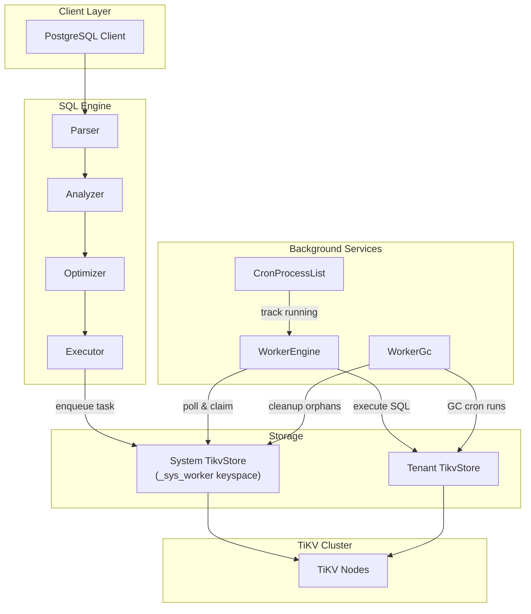
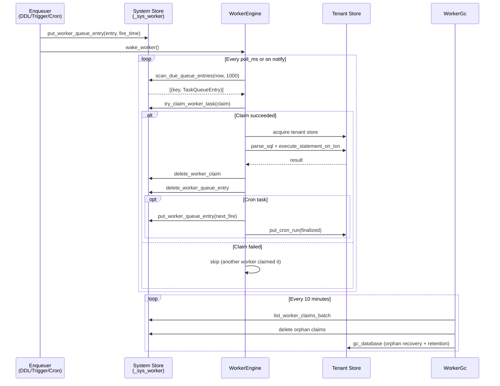

# Worker Engine and Cron Scheduler

| | |
|---|---|
| **Source paths** | `src/worker/`, `src/cron/` |
| **Architecture tier** | Background Services |
| **Depends on** | Storage (`TikvStore`), Pool (`TikvClientPool`), SQL Executor, Extensions Context |
| **Depended on by** | DDL (CREATE INDEX CONCURRENTLY), Triggers, AutoAnalyze, Cron SQL functions |

---

## Overview

The Worker Engine is a unified asynchronous task execution system that processes five types of background tasks: **Cron**, **AsyncTrigger**, **AutoAnalyze**, **BgDdl** (background DDL such as `CREATE INDEX CONCURRENTLY`), and **BgSql** (background SQL execution). It uses a global task queue persisted in TiKV with pessimistic locking for distributed claim semantics, requiring no leader election.

The **Cron Scheduler** is pg\_cron-compatible and provides standard 5-field cron expression parsing, job management, run history tracking, and process list visibility. Cron jobs are managed per-tenant and per-database, with their queue entries stored in the system keyspace and job definitions stored in the tenant keyspace.

---

## Architecture Position



---

## Key Concepts

### Task Types

Each task type is identified by a bitmask constant (defined in `src/worker/types.rs`):

| Task Type | Bitmask | Purpose |
|-----------|---------|---------|
| `Cron` | `0x01` | pg\_cron-compatible scheduled SQL execution |
| `AsyncTrigger` | `0x02` | Deferred trigger execution |
| `AutoAnalyze` | `0x04` | Automatic statistics collection after DML thresholds |
| `BgDdl` | `0x08` | Background DDL operations (e.g., `CREATE INDEX CONCURRENTLY` backfill) |
| `BgSql` | `0x10` | One-shot background SQL execution with result storage |

### Global TiKV Queue

All background tasks are stored in a global queue within the `_sys_worker` keyspace, which is isolated from tenant data. Queue entries include the target keyspace, database ID, task ID, task type, SQL command, username, priority, and (for cron tasks) the schedule expression. Tasks are keyed by their fire time, enabling efficient time-ordered scanning.

### Pessimistic Locking (No Leader Election)

Multiple worker instances can run concurrently without leader election. The claim mechanism uses TiKV's pessimistic transaction protocol: each worker attempts to claim a task by writing a `WorkerClaim` record keyed by `(keyspace, db_id, task_id, fire_time_minute)`. If the claim key already exists, the transaction fails and the worker moves on. This provides distributed mutual exclusion without coordination overhead.

### Cron Expression Parsing

The cron parser (`src/cron/parser.rs`) accepts standard 5-field cron syntax (`minute hour day month weekday`). It explicitly rejects:
- 6-field expressions (with seconds)
- Special strings (`@daily`, `@hourly`, `@reboot`, etc.)
- Interval syntax (`5 minutes`, `30 seconds`)

Internally, it prepends `0 ` (zero seconds) and delegates to the `cron` crate's `Schedule` type.

### Job Management and Process List

Running cron jobs are tracked in a global `CronProcessList` singleton (`src/cron/process_list.rs`), which enables:
- Listing all currently running cron jobs (`cron.cron_running_jobs` virtual table)
- Cancelling a running job by `job_id` via `Notify` signal

---

## File Map

### `src/worker/`

| File | Purpose |
|------|---------|
| `mod.rs` | Module root; system store initialization (`init_gc_registry_store`, the single canonical init used by both production and tests; runs the V1→V2 queue migration), keyspace provisioning (`ensure_system_keyspace`), global `SYSTEM_STORE` and `WORKER_NOTIFY` statics |
| `engine.rs` | `WorkerEngine` struct: main poll loop (`run`/`tick`), task claiming (`claim_and_execute`), SQL execution (`execute_task`), CIC backfill (`execute_bg_ddl_backfill`), cron reconciliation |
| `types.rs` | Core type definitions: `TaskType` enum, `IndexState` enum, `TaskRegistryEntry`, `TaskQueueEntry`, `WorkerClaim` |
| `config.rs` | `WorkerConfig` with environment variable parsing (`DB9_WORKER_*`) and defaults |
| `gc.rs` | `WorkerGc` struct: orphan claim cleanup, cron run history GC, batched scanning |
| `metrics.rs` | `WorkerMetrics`: atomic counters for task success/failure by type, claim attempts, queue depth gauges |

### `src/cron/`

| File | Purpose |
|------|---------|
| `mod.rs` | Module root; re-exports submodules |
| `parser.rs` | `parse_cron_expression` and `next_occurrence`: 5-field cron parsing via the `cron` crate |
| `types.rs` | `CronJob`, `CronJobLegacy`, `CronRun`, `CronRunStatus` type definitions |
| `config.rs` | `CronConfig` with environment variable parsing (`DB9_CRON_*`) and defaults |
| `worker.rs` | `gc_database`: per-database cron run GC (orphan recovery, retention-based deletion) |
| `process_list.rs` | `CronProcessList`: in-memory registry of running cron jobs with cancellation support |

---

## Public Interfaces

### WorkerEngine

```rust
// src/worker/engine.rs
pub struct WorkerEngine {
    config: WorkerConfig,
    system_store: Arc<TikvStore>,
    pool: Arc<TikvClientPool>,
    active_jobs: Arc<AtomicU32>,
    semaphore: Arc<Semaphore>,
    metrics: Arc<WorkerMetrics>,
    notify: Arc<Notify>,
}

impl WorkerEngine {
    pub fn new(
        config: WorkerConfig,
        system_store: Arc<TikvStore>,
        pool: Arc<TikvClientPool>,
    ) -> Self;

    pub async fn run(&self);  // Main event loop (never returns)
}
```

### WorkerGc

```rust
// src/worker/gc.rs
pub struct WorkerGc {
    system_store: Arc<TikvStore>,
    pool: Arc<TikvClientPool>,
    config: WorkerConfig,
}

impl WorkerGc {
    pub fn new(
        system_store: Arc<TikvStore>,
        pool: Arc<TikvClientPool>,
        config: WorkerConfig,
    ) -> Self;

    pub async fn run(&self);  // GC loop on 10-minute interval (never returns)
}
```

### WorkerConfig

```rust
// src/worker/config.rs
pub struct WorkerConfig {
    pub enabled: bool,                // DB9_WORKER_ENABLED (default: true)
    pub poll_ms: u64,                 // DB9_WORKER_POLL_MS (default: 60,000ms, min: 100ms)
    pub max_concurrent_jobs: usize,   // DB9_WORKER_MAX_CONCURRENT_JOBS (default: 32)
    pub worker_id: String,            // DB9_WORKER_ID (default: hostname:pid)
    pub statement_timeout_ms: u64,    // DB9_WORKER_STATEMENT_TIMEOUT_MS (default: 300,000ms)
    pub cron_job_timeout_ms: u64,     // DB9_CRON_JOB_TIMEOUT_MS (default: 1,800,000ms)
    pub orphan_timeout_sec: u64,      // DB9_WORKER_ORPHAN_TIMEOUT_SEC (default: 300s)
    pub gc_batch_size: usize,         // DB9_WORKER_GC_BATCH_SIZE (default: 100)
    pub auto_analyze_enabled: bool,   // DB9_AUTO_ANALYZE_ENABLED (default: true)
    pub auto_analyze_threshold: u64,  // DB9_AUTO_ANALYZE_THRESHOLD (default: 50)
    pub system_keyspace: String,      // DB9_WORKER_SYSTEM_KEYSPACE (default: "_sys_worker")
}

impl WorkerConfig {
    pub fn from_env() -> Self;
}
```

### Core Types

```rust
// src/worker/types.rs
#[derive(Debug, Clone, Copy, Serialize, Deserialize, PartialEq, Eq)]
pub enum TaskType { Cron, AsyncTrigger, AutoAnalyze, BgDdl, BgSql }

#[derive(Debug, Clone, Copy, Serialize, Deserialize, PartialEq, Eq, Default)]
pub enum IndexState { #[default] Ready, Building, Invalid, WriteOnly }

#[derive(Debug, Clone, Serialize, Deserialize)]
pub struct TaskRegistryEntry {
    pub keyspace: String,
    pub db_id: u64,
    pub task_types: u8,    // bitmask of registered task types
    pub job_count: u32,
    pub registered_at: i64,
}

#[derive(Debug, Clone, Serialize, Deserialize)]
pub struct TaskQueueEntry {
    pub keyspace: String,
    pub db_id: u64,
    pub task_id: i64,
    pub task_type: TaskType,
    pub command: String,
    pub username: String,
    pub schedule: Option<String>,
    pub priority: u8,
}

#[derive(Debug, Clone, Serialize, Deserialize)]
pub struct WorkerClaim {
    pub worker_id: String,
    pub claimed_at: i64,
    pub task_type: TaskType,
}
```

### Cron Types

```rust
// src/cron/types.rs
#[derive(Debug, Clone, Serialize, Deserialize, PartialEq)]
pub struct CronJob {
    pub job_id: i64,
    pub schedule: String,
    pub command: String,
    pub nodename: String,
    pub nodeport: i32,
    pub database: String,
    pub username: String,
    pub active: bool,
    pub jobname: Option<String>,
    pub max_runtime_ms: Option<u64>,
}

#[derive(Debug, Clone, Serialize, Deserialize, PartialEq)]
pub struct CronRun {
    pub run_id: i64,
    pub job_id: i64,
    pub job_pid: Option<i32>,
    pub database: String,
    pub username: String,
    pub command: String,
    pub status: CronRunStatus,
    pub return_message: Option<String>,
    pub start_time: Option<i64>,
    pub end_time: Option<i64>,
}

#[derive(Debug, Clone, Serialize, Deserialize, PartialEq)]
pub enum CronRunStatus { Starting, Running, Succeeded, Failed, Cancelled }
```

### Cron Parser

```rust
// src/cron/parser.rs
pub fn parse_cron_expression(expr: &str) -> Result<CronSchedule>;
pub fn next_occurrence(schedule: &CronSchedule, after: DateTime<Utc>) -> Option<DateTime<Utc>>;
```

### CronProcessList

```rust
// src/cron/process_list.rs
pub fn get_process_list() -> &'static Arc<CronProcessList>;

impl CronProcessList {
    pub fn register(&self, info: RunningCronJob) -> Arc<Notify>;
    pub fn deregister(&self, run_id: i64);
    pub fn list(&self) -> Vec<RunningCronJob>;
    pub fn cancel_by_job_id(&self, job_id: i64) -> bool;
}
```

---

## Internal Design

### Task Lifecycle

1. **Enqueue**: A component (cron reconciliation, trigger dispatcher, DDL handler) writes a `TaskQueueEntry` to the system store with a fire time.
2. **Poll**: `WorkerEngine::tick()` scans due queue entries (`fire_time <= now`) in batches of up to 1000.
3. **Claim**: For each due entry, a semaphore permit is acquired (bounded by `max_concurrent_jobs`). The worker writes a `WorkerClaim` to TiKV; if the claim key already exists, the task is skipped.
4. **Execute**: The worker acquires a tenant store handle, creates an `Executor`, parses the SQL command, and runs each statement within a transaction. Statement timeout and cancellation signals are applied via `run_with_guards`.
5. **Finalize**: The claim is deleted. For cron tasks, the `CronRun` record is updated with the final status and the next fire time is computed and enqueued. For `BgSql` tasks, the result is written to the system store.

### CIC (CREATE INDEX CONCURRENTLY) Backfill

BgDdl tasks with the command prefix `__backfill_index` follow a three-phase pipeline:

- **Phase 1 (Building)**: Backfill index entries from a snapshot, then atomically flip to `WriteOnly`.
- **Phase 2 (WriteOnly)**: Catch-up scan on a fresh snapshot to capture writes during Phase 1.
- **Phase 3 (Ready)**: Reconcile stale entries and atomically expose the index to the planner.

If any phase fails, the index is marked `Invalid`. On worker restart, `reconcile_incomplete_cic_indexes` marks any indexes left in `Building` or `WriteOnly` state as `Invalid`.

### Cron Reconciliation

At startup, `reconcile_cron_jobs` ensures consistency between the worker registry and the actual cron job definitions in each tenant store:
- Active jobs missing from the queue are enqueued with their next fire time.
- Queue entries referencing inactive or deleted jobs are cleaned up.

### GC (Garbage Collection)

`WorkerGc` runs on a separate 10-minute interval (with random 0-60s jitter to avoid thundering herd):

1. **Orphan claim cleanup**: Scans all claims and deletes those older than `orphan_timeout_sec`. Orphaned claims are not re-enqueued.
2. **Cron run GC**: For each keyspace with cron jobs, runs `gc_database` which:
   - Marks `Running` runs older than the effective orphan timeout as `Failed` with an "orphan recovery" message.
   - Deletes runs older than `run_retention_days`.
   - Respects per-job `max_runtime_ms` to avoid falsely orphaning legitimately long-running jobs.

### Queue Management

The worker uses `tokio::select!` to wake on either the poll interval or a `Notify` signal (triggered by `wake_worker()`). This enables immediate task pickup when a new task is enqueued without waiting for the next poll cycle.

Concurrency is bounded by a `Semaphore` with `max_concurrent_jobs` permits. An `ActiveJobGuard` (RAII) tracks the count of in-flight jobs for metrics.

---

## Data Flow Diagram



---

## Contracts

### Task Isolation

- The system store (`_sys_worker` keyspace) is strictly isolated from tenant data. All worker metadata (registry, queue, claims) lives in this keyspace.
- Task execution uses the tenant's store handle, running SQL as the task's configured `username` within the tenant's keyspace.
- Each statement executes within its own extension context to reset HTTP request counters and isolate memory lifecycle.

### Locking Guarantees

- **At-most-once execution** for one-shot tasks: the claim mechanism ensures only one worker processes a given task.
- **Running guard for cron**: `set_cron_running_guard` prevents overlapping runs of the same job. If a previous run is still active (guard exists), the new fire is blocked with `BlockedByRunningGuard` and the queue entry is kept for retry.
- **Deduplication by minute**: `try_claim_cron_run` prevents the same job from firing twice in the same calendar minute.

### Timeout Semantics

- Non-cron tasks use `statement_timeout_ms` (default 5 minutes).
- Cron tasks use per-job `max_runtime_ms` or the global `cron_job_timeout_ms` (default 30 minutes).
- BgDdl backfill tasks are exempt from statement timeout (they legitimately run for extended periods).
- Timeout produces the error `"canceling statement due to statement timeout"`.
- Admin cancellation produces `"cancelled by administrator"`.

---

## Error Handling

- **Task execution errors**: Logged as warnings. For cron tasks, the error message is stored in `CronRun.return_message` with status `Failed`. For BgSql tasks, the error is written as `"ERROR: ..."` to the bg\_result key. The task is not retried for one-shot types.
- **Claim errors**: If the claim transaction fails (e.g., conflict), the worker silently skips the task. No error is surfaced.
- **System store initialization failures**: If the system keyspace cannot be created or connected to, the worker refuses to start with a clear error message containing `"refusing fallback"`.
- **CIC backfill failures**: Any failure in the three-phase pipeline marks the index as `Invalid` and logs a warning.
- **GC errors**: Logged as warnings per-keyspace; the GC continues processing other keyspaces.

---

## Testing

### Unit Tests

| File | Coverage |
|------|----------|
| `src/worker/types.rs` | Bitmask conversions, bincode roundtrips for all types, `IndexState` backward compat |
| `src/worker/config.rs` | Environment variable parsing, defaults, minimum clamping, boolean parsing |
| `src/worker/engine.rs` | CIC state repair logic, `ActiveJobGuard` RAII semantics, `run_with_guards` timeout/cancel behavior, backfill command parsing |
| `src/worker/gc.rs` | Orphan timeout calculation, jitter bounds, batch pagination, effective orphan timeout with per-job overrides |
| `src/worker/metrics.rs` | Counter increments for task results, claims, and tick sampling |
| `src/cron/parser.rs` | Valid/invalid expression parsing, `next_occurrence` ordering |
| `src/cron/types.rs` | Bincode roundtrips for `CronJob`, `CronRun`, legacy conversion, status display |
| `src/cron/config.rs` | Environment variable parsing and defaults |
| `src/cron/worker.rs` | Orphan cutoff computation with per-job overrides, overflow clamping |
| `src/cron/process_list.rs` | Register/deregister, list, cancel-by-job-id |
| `src/worker/mod.rs` | System store init (disabled short-circuits, enabled failure refuses fallback) |

### Integration Tests

Cron functionality is covered by SQL integration tests in `tests/` that exercise `cron.schedule`, `cron.unschedule`, `cron.alter_job`, and the virtual tables (`cron.cron_job`, `cron.cron_job_run_details`, `cron.cron_running_jobs`).

---

## Common Task Index

| Task | Where to look |
|------|---------------|
| Add a new background task type | Add variant to `TaskType` in `src/worker/types.rs`, add bitmask constant, update `WorkerMetrics` counters in `src/worker/metrics.rs`, add execution logic in `WorkerEngine::execute_task` in `src/worker/engine.rs` |
| Change the poll interval | Modify `DEFAULT_POLL_MS` in `src/worker/config.rs` or set `DB9_WORKER_POLL_MS` |
| Add a new cron SQL function | See `src/sql/catalog/` for virtual table implementations (cron\_job, cron\_job\_run\_details, cron\_running\_jobs) |
| Adjust cron run retention | Set `DB9_CRON_RUN_RETENTION_DAYS` or modify default in `src/cron/config.rs` |
| Debug a stuck cron job | Check `CronProcessList::list()` via `cron.cron_running_jobs`, use `cancel_by_job_id` |
| Understand CIC backfill phases | Read `WorkerEngine::execute_bg_ddl_backfill` in `src/worker/engine.rs` |
| Modify orphan detection logic | See `orphan_cutoff_for_run` in `src/cron/worker.rs` and `cleanup_orphan_claims` in `src/worker/gc.rs` |

---

## See Also

- [Architecture Overview](Architecture-Overview.md) -- system-level context for background services
- `docs/architecture/worker.md` -- detailed architecture deep-dive
- `docs/sot/worker-cron.md` -- normative contracts (MUST/SHOULD/MAY)
- `docs/worker.md` -- user-facing guide
